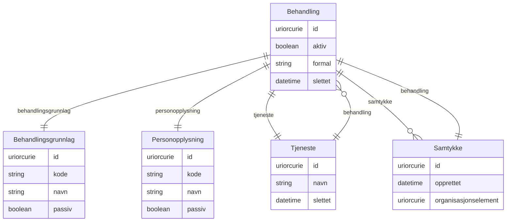

# fint-personvern

FINT-domenemodell for personvern. Dekkjer behandling av personopplysningar, samtykke, tenester og kodeverk for behandlingsgrunnlag og personopplysningstypar.

URI: https://data.norge.no/linkml/fint-personvern

Name: fint-personvern

## Classes

### Obligatorisk

| Class | Description |
| --- | --- |
| [Behandling](klasser/behandling.md) | All bruk av personopplysningar (behandlingsaktivitet) |
| [Behandlingsgrunnlag](klasser/behandlingsgrunnlag.md) | Rettsleg grunnlag for behandling av personopplysningar |
| [Personopplysning](klasser/personopplysning.md) | Opplysningar og vurderingar som kan knytast til enkeltpersonar |
| [Samtykke](klasser/samtykke.md) | Tillating til behandling av personopplysning |
| [Tjeneste](klasser/tjeneste.md) | Teneste eller system som behandlar personopplysningar |

### Andre

| Class | Description |
| --- | --- |

## Slots

| Slot | Description |
| --- | --- |
| [aktiv](klasser/aktiv.md) | Status på behandling |
| [behandling](klasser/behandling.md) | Behandlingsaktivitet |
| [behandlingar](klasser/behandlingar.md) |  |
| [behandlingsgrunnlag](klasser/behandlingsgrunnlag.md) | Rettsleg grunnlag for behandling av personopplysning |
| [formal](klasser/formal.md) | Grunngjeving for behandling av personopplysning |
| [opprettet](klasser/opprettet.md) | Dato då samtykket vart oppretta |
| [organisasjonselement](klasser/organisasjonselement.md) | Referanse til Organisasjonselement (Administrasjon) |
| [personalressurs](klasser/personalressurs.md) | Referanse til Personalressurs (Administrasjon) |
| [personopplysning](klasser/personopplysning.md) | Opplysning eller vurdering som kan knytast til ein enkeltperson |
| [personopplysningar](klasser/personopplysningar.md) |  |
| [samtykke](klasser/samtykke.md) | Samtykker tilknytt ei behandling |
| [samtykker](klasser/samtykker.md) |  |
| [slettet](klasser/slettet.md) | Tidspunkt ressursen er sletta |
| [tenester](klasser/tenester.md) |  |
| [tjeneste](klasser/tjeneste.md) | Tenesta som behandlinga tilhøyrer |

## Enumerations

| Enumeration | Description |
| --- | --- |

## Types

| Type | Description |
| --- | --- |

## Subsets

| Subset | Description |
| --- | --- |
| [Anbefalt](klasser/anbefalt.md) | Anbefalt eigensskap |
| [Obligatorisk](klasser/obligatorisk.md) | Obligatorisk eigensskap |
| [Valgfri](klasser/valgfri.md) | Valfri eigensskap |

## Generated artifacts

| Artefakt | Fil |
|----------|-----|
| SHACL shapes | [fint-personvern-shapes.ttl](fint-personvern-shapes.ttl) |
| JSON-LD kontekst | [fint-personvern-context.jsonld](fint-personvern-context.jsonld) |
| JSON Schema | [fint-personvern-schema.json](fint-personvern-schema.json) |
| OWL ontologi | [fint-personvern-ontology.ttl](fint-personvern-ontology.ttl) |
| RDF/Turtle skjema | [fint-personvern-schema.ttl](fint-personvern-schema.ttl) |
| Python-klasser | [fint-personvern-model.py](fint-personvern-model.py) |
| ER-diagram (Mermaid) | [fint-personvern-erdiagram.md](fint-personvern-erdiagram.md) |
| Eksempeldata (Turtle) | [fint-personvern-eksempel.ttl](fint-personvern-eksempel.ttl) |
