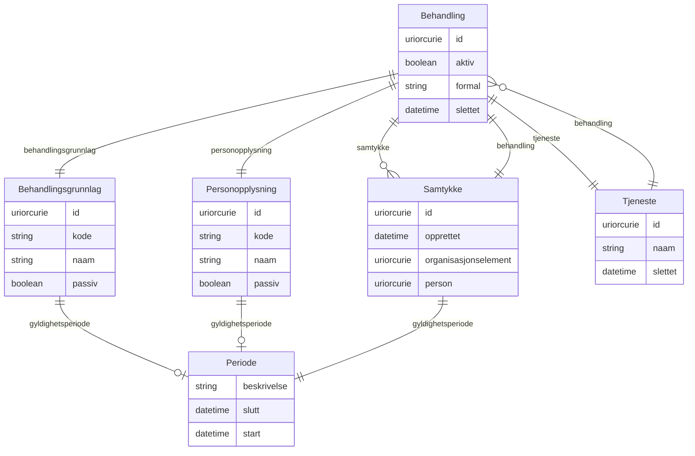

# fint-personvern

FINT-domenemodell for personvern. Dekkjer behandling av personopplysningar, samtykke, tenester og kodeverk for behandlingsgrunnlag og personopplysningstypar.

URI: https://data.norge.no/linkml/fint-personvern

Name: fint-personvern

## Classes

| Class | Description |
| --- | --- |
| [Adresse](klasser/adresse.md) | Fysisk adresse eller postadresse |
| [Aktoer](klasser/aktoer.md) | Abstrakt base for person eller eining vi samhandlar med |
| &nbsp;&nbsp;&nbsp;&nbsp;&nbsp;&nbsp;&nbsp;&nbsp;[Enhet](klasser/enhet.md) | Abstrakt base for alle hovudeiningar, undereiningar og organisasjonsledd iden... |
| &nbsp;&nbsp;&nbsp;&nbsp;&nbsp;&nbsp;&nbsp;&nbsp;&nbsp;&nbsp;&nbsp;&nbsp;&nbsp;&nbsp;&nbsp;&nbsp;[Virksomhet](klasser/virksomhet.md) | Ein juridisk organisasjon som produserer varer eller tenester |
| &nbsp;&nbsp;&nbsp;&nbsp;&nbsp;&nbsp;&nbsp;&nbsp;[Person](klasser/person.md) | Fysiske private personar |
| [Begrep](klasser/begrep.md) | Abstrakt fellesbase for alle FINT-kodeverk |
| &nbsp;&nbsp;&nbsp;&nbsp;&nbsp;&nbsp;&nbsp;&nbsp;[Fylke](klasser/fylke.md) | Liste over Norges fylker |
| &nbsp;&nbsp;&nbsp;&nbsp;&nbsp;&nbsp;&nbsp;&nbsp;[Kjonn](klasser/kjonn.md) | Verdiar for kjønn basert på ISO/IEC 5218 |
| &nbsp;&nbsp;&nbsp;&nbsp;&nbsp;&nbsp;&nbsp;&nbsp;[Kommune](klasser/kommune.md) | Liste over Norges kommunar |
| &nbsp;&nbsp;&nbsp;&nbsp;&nbsp;&nbsp;&nbsp;&nbsp;[Landkode](klasser/landkode.md) | Landskode i ISO 3166-1 alpha-2 format |
| &nbsp;&nbsp;&nbsp;&nbsp;&nbsp;&nbsp;&nbsp;&nbsp;[Spraak](klasser/spraak.md) | Verdiar for språk (2 bokstavar) |
| [Behandling](klasser/behandling.md) | All bruk av personopplysningar (behandlingsaktivitet) |
| [Behandlingsgrunnlag](klasser/behandlingsgrunnlag.md) | Rettsleg grunnlag for behandling av personopplysningar |
| [Identifikator](klasser/identifikator.md) | Unik identifikasjon til eit objekt |
| [Kontaktinformasjon](klasser/kontaktinformasjon.md) | Informasjon som kan brukast for å oppnå kontakt |
| [Kontaktperson](klasser/kontaktperson.md) | Kontaktperson (pårørande) til ein person |
| [Matrikkelnummer](klasser/matrikkelnummer.md) | Eintydleg identifisering av matrikkeleining innanfor kommune |
| [Periode](klasser/periode.md) | Tidsperiode med obligatorisk start og valfri slutt |
| [Personnavn](klasser/personnavn.md) | Namn på ein person |
| [Personopplysning](klasser/personopplysning.md) | Opplysningar og vurderingar som kan knytast til enkeltpersonar |
| [PersonvernContainer](klasser/personverncontainer.md) | Rotcontainer for FINT Personvern-instansar |
| [Samtykke](klasser/samtykke.md) | Tillating til behandling av personopplysning |
| [Tjeneste](klasser/tjeneste.md) | Teneste eller system som behandlar personopplysningar |
| [Valuta](klasser/valuta.md) | Valutakodar for offisielle valutaer |

## Slots

| Slot | Description |
| --- | --- |
| [adresse](klasser/adresse.md) | Adresse til matrikkeleining |
| [adresselinje](klasser/adresselinje.md) | Adresseinformasjon |
| [aktiv](klasser/aktiv.md) | Status på behandling |
| [behandling](klasser/behandling.md) | Behandlingsaktivitet |
| [behandlingar](klasser/behandlingar.md) |  |
| [behandlingsgrunnlag](klasser/behandlingsgrunnlag.md) | Rettsleg grunnlag for behandling av personopplysning |
| [beskrivelse](klasser/beskrivelse.md) | Beskriven namn eller omtale |
| [bilde](klasser/bilde.md) | HTTP(S)-lenkje til eit bilete av personen |
| [bokstavkode](klasser/bokstavkode.md) | Bokstavkode for aktuell valuta |
| [bostedsadresse](klasser/bostedsadresse.md) | Folkeregistrert adresse til personen |
| [bruksnummer](klasser/bruksnummer.md) | Fortløpande nummerering av bruk under gårdsnummer |
| [elev](klasser/elev.md) | Referanse til Elev (Utdanning) |
| [epostadresse](klasser/epostadresse.md) | Namngitt elektronisk adresse for mottak av e-post |
| [etternavn](klasser/etternavn.md) | Etternamn til personen |
| [festenummer](klasser/festenummer.md) | Fortløpande nummerering av festar under gårdsnummer/bruksnummer |
| [fodselsdato](klasser/fodselsdato.md) | Dato for fødsel |
| [fodselsnummer](klasser/fodselsnummer.md) | Fødselsnummer eller ein av dei fiktive variantane |
| [foreldre](klasser/foreldre.md) | Den/dei som har foreldreansvar til personen |
| [foreldreansvar](klasser/foreldreansvar.md) | Personar denne personen har foreldreansvar for |
| [formal](klasser/formal.md) | Grunngjeving for behandling av personopplysning |
| [fornavn](klasser/fornavn.md) | Fornamn til personen |
| [forretningsadresse](klasser/forretningsadresse.md) | Besøksadresse til ein organisasjonseining |
| [fylke](klasser/fylke.md) | Fylke |
| [gaardsnummer](klasser/gaardsnummer.md) | Nummerering av gårdseiging i matrikkelen, unik innanfor kommune |
| [gyldighetsperiode](klasser/gyldighetsperiode.md) | Periode ressursen er gyldig for |
| [id](klasser/id.md) | URI-identifikator for ressursen |
| [identifikatorverdi](klasser/identifikatorverdi.md) | Ein konkret kombinasjon av teikn og/eller bokstavar som utgjer ein bestemt id... |
| [kjonn](klasser/kjonn.md) | Kjønn |
| [kode](klasser/kode.md) | Verdi som identifiserer omgrepet |
| [kommune](klasser/kommune.md) | Kommune |
| [kommunenummer](klasser/kommunenummer.md) | Nummerering av kommunen i høve til SSB si offisielle liste |
| [kontaktinformasjon](klasser/kontaktinformasjon.md) | Den føretrekte måten å kome i kontakt med ein aktør |
| [kontaktperson](klasser/kontaktperson.md) | Personar kontaktpersonen er pårørande for |
| [kontaktperson_naam](klasser/kontaktperson_naam.md) | Namn på kontaktpersonen |
| [laerling](klasser/laerling.md) | Referanse til Laerling (Utdanning) |
| [land](klasser/land.md) | Land der adressa befinn seg |
| [maalform](klasser/maalform.md) | Målform personen føretrekkjer |
| [mellomnavn](klasser/mellomnavn.md) | Mellomnamn |
| [mobiltelefonnummer](klasser/mobiltelefonnummer.md) | Mobiltelefonnummer |
| [morsmaal](klasser/morsmaal.md) | Morsmål til personen |
| [naam](klasser/naam.md) | Namn på ressursen |
| [nettsted](klasser/nettsted.md) | Adresse til eit nettstad |
| [nummerkode](klasser/nummerkode.md) | Nummerkode for aktuell valuta |
| [opprettet](klasser/opprettet.md) | Dato då samtykket vart oppretta |
| [organisasjonselement](klasser/organisasjonselement.md) | Referanse til Organisasjonselement (Administrasjon) |
| [organisasjonsnavn](klasser/organisasjonsnavn.md) | Namn på eining registrert i Einingsregisteret |
| [organisasjonsnummer](klasser/organisasjonsnummer.md) | Niisifra nummer som eintydleg identifiserer einingar i Einingsregisteret |
| [otungdom](klasser/otungdom.md) | Referanse til OtUngdom (Utdanning) |
| [parorende](klasser/parorende.md) | Pårørande kontaktperson til personen |
| [passiv](klasser/passiv.md) | Angir at koden er passiv og ikkje kan veljast |
| [person](klasser/person.md) | Referanse til Person (Administrasjon) |
| [person_naam](klasser/person_naam.md) | Namn på personen |
| [personalressurs](klasser/personalressurs.md) | Referanse til Personalressurs (Administrasjon) |
| [personopplysning](klasser/personopplysning.md) | Opplysning eller vurdering som kan knytast til ein enkeltperson |
| [personopplysningar](klasser/personopplysningar.md) |  |
| [postadresse](klasser/postadresse.md) | Informasjon om postadresse til ein aktør |
| [postnummer](klasser/postnummer.md) | Postnummer |
| [poststed](klasser/poststed.md) | Poststad |
| [samtykke](klasser/samtykke.md) | Samtykker tilknytt ei behandling |
| [samtykker](klasser/samtykker.md) |  |
| [seksjonsnummer](klasser/seksjonsnummer.md) | Fortløpande nummerering av seksjonar under gårdsnummer/bruksnummer |
| [sip](klasser/sip.md) | SIP-protokoll for VoIP (IP-telefoni) |
| [slettet](klasser/slettet.md) | Tidspunkt ressursen er sletta |
| [slutt](klasser/slutt.md) | Til tidspunkt |
| [start](klasser/start.md) | Frå tidspunkt |
| [statsborgerskap](klasser/statsborgerskap.md) | Alle statsborgarskap personen har |
| [telefonnummer](klasser/telefonnummer.md) | Telefonnummer |
| [tenester](klasser/tenester.md) |  |
| [tjeneste](klasser/tjeneste.md) | Tenesta som behandlinga tilhøyrer |
| [type](klasser/type.md) | Beskriv kva slags type |
| [valuta_naam](klasser/valuta_naam.md) | Namn på valuta |
| [virksomhetsId](klasser/virksomhetsid.md) | Intern unik identifikator i økonomisystemet |

## Enumerations

| Enumeration | Description |
| --- | --- |

## Types

| Type | Description |
| --- | --- |
| [Boolean](klasser/boolean.md) | A binary (true or false) value |
| [Curie](klasser/curie.md) | a compact URI |
| [Date](klasser/date.md) | a date (year, month and day) in an idealized calendar |
| [DateOrDatetime](klasser/dateordatetime.md) | Either a date or a datetime |
| [Datetime](klasser/datetime.md) | The combination of a date and time |
| [Decimal](klasser/decimal.md) | A real number with arbitrary precision that conforms to the xsd:decimal speci... |
| [Double](klasser/double.md) | A real number that conforms to the xsd:double specification |
| [Float](klasser/float.md) | A real number that conforms to the xsd:float specification |
| [Integer](klasser/integer.md) | An integer |
| [Jsonpath](klasser/jsonpath.md) | A string encoding a JSON Path |
| [Jsonpointer](klasser/jsonpointer.md) | A string encoding a JSON Pointer |
| [Ncname](klasser/ncname.md) | Prefix part of CURIE |
| [Nodeidentifier](klasser/nodeidentifier.md) | A URI, CURIE or BNODE that represents a node in a model |
| [Objectidentifier](klasser/objectidentifier.md) | A URI or CURIE that represents an object in the model |
| [Sparqlpath](klasser/sparqlpath.md) | A string encoding a SPARQL Property Path |
| [String](klasser/string.md) | A character string |
| [Time](klasser/time.md) | A time object represents a (local) time of day, independent of any particular... |
| [Uri](klasser/uri.md) | a complete URI |
| [Uriorcurie](klasser/uriorcurie.md) | a URI or a CURIE |

## Subsets

| Subset | Description |
| --- | --- |
| [Anbefalt](klasser/anbefalt.md) | Anbefalt eigensskap |
| [Obligatorisk](klasser/obligatorisk.md) | Obligatorisk eigensskap |
| [Valgfri](klasser/valgfri.md) | Valfri eigensskap |

## Artifacts

| Artefakt | Fil |
|----------|-----|
| SHACL shapes | [fint-personvern-shapes.ttl](fint-personvern-shapes.ttl) |
| JSON-LD kontekst | [fint-personvern-context.jsonld](fint-personvern-context.jsonld) |
| JSON Schema | [fint-personvern-schema.json](fint-personvern-schema.json) |
| OWL ontologi | [fint-personvern-ontology.ttl](fint-personvern-ontology.ttl) |
| Python-klasser | [fint-personvern-model.py](fint-personvern-model.py) |
| ER-diagram (Mermaid) | [fint-personvern-erdiagram.md](fint-personvern-erdiagram.md) |
| Eksempeldata (Turtle) | [fint-personvern-eksempel.ttl](fint-personvern-eksempel.ttl) |
