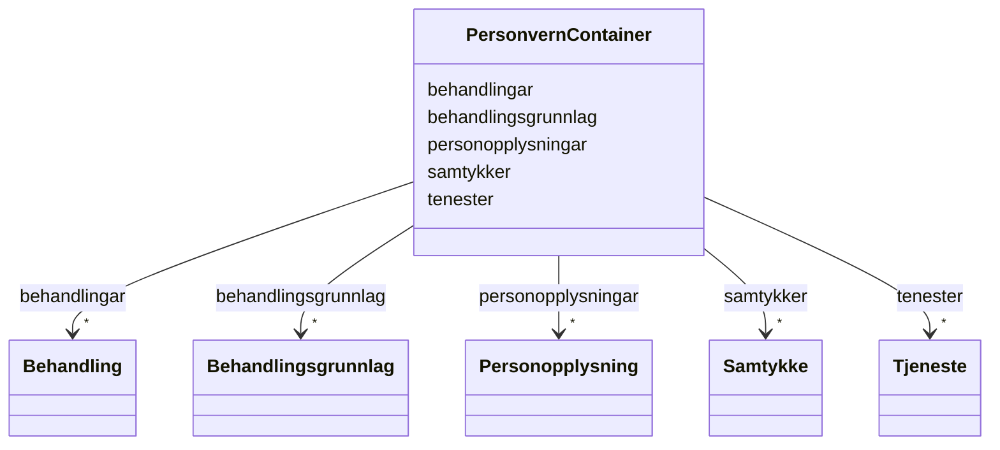

# Class: PersonvernContainer 


_Rotcontainer for FINT Personvern-instansar._


URI: [https://schema.fintlabs.no/personvern/:PersonvernContainer](https://schema.fintlabs.no/personvern/:PersonvernContainer)





<!-- no inheritance hierarchy -->

## Class Properties

| Property | Value |
| --- | --- |
| Tree Root | Yes |


## Eigenskapar


  
  

  
  

  
  

  
  

  
  


  
  

  
  

  
  

  
  

  
  


  
  

  
  

  
  

  
  

  
  


  
  
  
  
    
  

  
  
  
  
    
  

  
  
  
  
    
  

  
  
  
    
      
    
      
    
      
    
  
  
    
  

  
  
  
  
    
  


### Andre

| Namn | Kardinalitet og domene | Beskriving |
| --- | --- | --- |
| [behandlingar](behandlingar.md) | * <br/> [Behandling](behandling.md) |  |
| [samtykker](samtykker.md) | * <br/> [Samtykke](samtykke.md) |  |
| [tenester](tenester.md) | * <br/> [Tjeneste](tjeneste.md) |  |
| [behandlingsgrunnlag](behandlingsgrunnlag.md) | * <br/> [Behandlingsgrunnlag](behandlingsgrunnlag.md) |  |
| [personopplysningar](personopplysningar.md) | * <br/> [Personopplysning](personopplysning.md) |  |


## Identifier and Mapping Information


### Schema Source


* from schema: https://data.norge.no/fint/fint-personvern


## Mappings

| Mapping Type | Mapped Value |
| ---  | ---  |
| self | https://schema.fintlabs.no/personvern/:PersonvernContainer |
| native | https://schema.fintlabs.no/personvern/:PersonvernContainer |


## LinkML Source

<!-- TODO: investigate https://stackoverflow.com/questions/37606292/how-to-create-tabbed-code-blocks-in-mkdocs-or-sphinx -->

### Direct

<details>
```yaml
name: PersonvernContainer
description: Rotcontainer for FINT Personvern-instansar.
from_schema: https://data.norge.no/fint/fint-personvern
rank: 1000
slot_usage:
  behandlingsgrunnlag:
    name: behandlingsgrunnlag
    multivalued: true
    inlined_as_list: true
attributes:
  behandlingar:
    name: behandlingar
    from_schema: https://data.norge.no/fint/fint-personvern
    rank: 1000
    domain_of:
    - PersonvernContainer
    range: Behandling
    multivalued: true
    inlined_as_list: true
  samtykker:
    name: samtykker
    from_schema: https://data.norge.no/fint/fint-personvern
    rank: 1000
    domain_of:
    - PersonvernContainer
    range: Samtykke
    multivalued: true
    inlined_as_list: true
  tenester:
    name: tenester
    from_schema: https://data.norge.no/fint/fint-personvern
    rank: 1000
    domain_of:
    - PersonvernContainer
    range: Tjeneste
    multivalued: true
    inlined_as_list: true
  behandlingsgrunnlag:
    name: behandlingsgrunnlag
    from_schema: https://data.norge.no/fint/fint-personvern
    domain_of:
    - PersonvernContainer
    - Behandling
    range: Behandlingsgrunnlag
  personopplysningar:
    name: personopplysningar
    from_schema: https://data.norge.no/fint/fint-personvern
    rank: 1000
    domain_of:
    - PersonvernContainer
    range: Personopplysning
    multivalued: true
    inlined_as_list: true
tree_root: true

```
</details>

### Induced

<details>
```yaml
name: PersonvernContainer
description: Rotcontainer for FINT Personvern-instansar.
from_schema: https://data.norge.no/fint/fint-personvern
rank: 1000
slot_usage:
  behandlingsgrunnlag:
    name: behandlingsgrunnlag
    multivalued: true
    inlined_as_list: true
attributes:
  behandlingar:
    name: behandlingar
    from_schema: https://data.norge.no/fint/fint-personvern
    rank: 1000
    owner: PersonvernContainer
    domain_of:
    - PersonvernContainer
    range: Behandling
    multivalued: true
    inlined: true
    inlined_as_list: true
  samtykker:
    name: samtykker
    from_schema: https://data.norge.no/fint/fint-personvern
    rank: 1000
    owner: PersonvernContainer
    domain_of:
    - PersonvernContainer
    range: Samtykke
    multivalued: true
    inlined: true
    inlined_as_list: true
  tenester:
    name: tenester
    from_schema: https://data.norge.no/fint/fint-personvern
    rank: 1000
    owner: PersonvernContainer
    domain_of:
    - PersonvernContainer
    range: Tjeneste
    multivalued: true
    inlined: true
    inlined_as_list: true
  behandlingsgrunnlag:
    name: behandlingsgrunnlag
    from_schema: https://data.norge.no/fint/fint-personvern
    owner: PersonvernContainer
    domain_of:
    - PersonvernContainer
    - Behandling
    range: Behandlingsgrunnlag
    multivalued: true
    inlined: true
    inlined_as_list: true
  personopplysningar:
    name: personopplysningar
    from_schema: https://data.norge.no/fint/fint-personvern
    rank: 1000
    owner: PersonvernContainer
    domain_of:
    - PersonvernContainer
    range: Personopplysning
    multivalued: true
    inlined: true
    inlined_as_list: true
tree_root: true

```
</details>