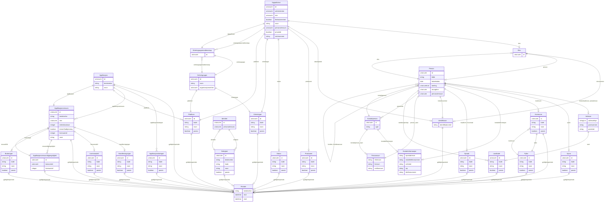

```mermaid
erDiagram
Adresse {
    stringList adresselinje  
    string postnummer  
    string poststed  
}
Applikasjon {
    uriorcurie id  
    string beskrivelse  
    string navn  
}
Applikasjonskategori {
    uriorcurie id  
    string kode  
    string navn  
    boolean passiv  
}
Applikasjonsressurs {
    uriorcurie id  
    string beskrivelse  
    uriorcurie eier  
    integer enhetskostnad  
    boolean kreverGodkjenning  
    integer lisensantall  
    string navn  
}
Applikasjonsressurstilgjengelighet {
    uriorcurie id  
    uriorcurie konsument  
    integer lisensantall  
}
Brukertype {
    uriorcurie id  
    string kode  
    string navn  
    boolean passiv  
}
DigitalEnhet {
    uriorcurie id  
    uriorcurie administrator  
    uriorcurie eier  
    boolean flerbrukerenhet  
    string navn  
    uriorcurie personalressurs  
    boolean privateid  
    string serienummer  
}
Elev {
    uriorcurie id  
}
Enhetsgruppe {
    uriorcurie id  
    string navn  
    uriorcurie organisasjonsenhet  
}
Enhetsgruppemedlemskap {
    uriorcurie id  
}
Enhetstype {
    uriorcurie id  
    string kode  
    string navn  
    boolean passiv  
}
Fylke {
    uriorcurie id  
    string kode  
    string navn  
    boolean passiv  
}
Handhevingstype {
    uriorcurie id  
    string kode  
    string navn  
    boolean passiv  
}
Identifikator {
    string identifikatorverdi  
}
Identitet {
    uriorcurie id  
    uriorcurie personalressurs  
}
Kjonn {
    uriorcurie id  
    string kode  
    string navn  
    boolean passiv  
}
Kommune {
    uriorcurie id  
    string kode  
    string navn  
    boolean passiv  
}
Kontaktinformasjon {
    string epostadresse  
    string mobiltelefonnummer  
    string nettsted  
    string sip  
    string telefonnummer  
}
Kontaktperson {
    uriorcurie id  
    string type  
}
Landkode {
    uriorcurie id  
    string kode  
    string navn  
    boolean passiv  
}
Lisensmodell {
    uriorcurie id  
    string kode  
    string navn  
    boolean passiv  
}
Periode {
    string beskrivelse  
    datetime slutt  
    datetime start  
}
Person {
    uriorcurie id  
    string bilde  
    date fodselsdato  
    uriorcurieList laerling  
    uriorcurie otungdom  
    uriorcurie personalressurs  
}
Personnavn {
    string etternavn  
    string fornavn  
    string mellomnavn  
}
Plattform {
    uriorcurie id  
    string kode  
    string navn  
    boolean passiv  
}
Produsent {
    uriorcurie id  
    string kode  
    string navn  
    boolean passiv  
}
Rettighet {
    uriorcurie id  
    string beskrivelse  
    string kode  
    string navn  
    boolean passiv  
}
Spraak {
    uriorcurie id  
    string kode  
    string navn  
    boolean passiv  
}
Status {
    uriorcurie id  
    string kode  
    string navn  
    boolean passiv  
}

Adresse ||--|o Landkode : "land"
Applikasjon ||--|| Periode : "gyldighetsperiode"
Applikasjon ||--}o Applikasjonskategori : "applikasjonskategori"
Applikasjon ||--}o Applikasjonsressurs : "applikasjonsressurs"
Applikasjon ||--}o Plattform : "plattform"
Applikasjonskategori ||--|o Periode : "gyldighetsperiode"
Applikasjonsressurs ||--|o Handhevingstype : "handhevingstype"
Applikasjonsressurs ||--|o Lisensmodell : "lisensmodell"
Applikasjonsressurs ||--|| Applikasjon : "applikasjon"
Applikasjonsressurs ||--|| Periode : "gyldighetsperiode"
Applikasjonsressurs ||--}o Applikasjonsressurstilgjengelighet : "ressurstilgjengelighet"
Applikasjonsressurs ||--}| Brukertype : "brukertype"
Applikasjonsressurstilgjengelighet ||--|| Applikasjonsressurs : "ressursRef"
Applikasjonsressurstilgjengelighet ||--|| Periode : "gyldighetsperiode"
Brukertype ||--|o Periode : "gyldighetsperiode"
DigitalEnhet ||--|o Elev : "elev"
DigitalEnhet ||--|o Identifikator : "dataobjektId"
DigitalEnhet ||--|o Produsent : "produsent"
DigitalEnhet ||--|o Status : "status"
DigitalEnhet ||--|| Enhetstype : "enhetstype"
DigitalEnhet ||--|| Plattform : "plattform"
DigitalEnhet ||--}o Enhetsgruppemedlemskap : "enhetsgruppemedlemskap"
Elev ||--|o Identifikator : "elevnummer"
Elev ||--|o Person : "person"
Enhetsgruppe ||--|| Enhetstype : "enhetstype"
Enhetsgruppe ||--|| Plattform : "plattform"
Enhetsgruppe ||--}o Enhetsgruppemedlemskap : "enhetsgruppemedlemskap"
Enhetsgruppemedlemskap ||--|| DigitalEnhet : "digitalEnhet"
Enhetsgruppemedlemskap ||--|| Enhetsgruppe : "enhetsgruppe"
Enhetstype ||--|o Periode : "gyldighetsperiode"
Fylke ||--|o Periode : "gyldighetsperiode"
Fylke ||--}o Kommune : "kommune"
Handhevingstype ||--|o Periode : "gyldighetsperiode"
Identifikator ||--|o Periode : "gyldighetsperiode"
Identitet ||--}o Rettighet : "rettighet"
Kjonn ||--|o Periode : "gyldighetsperiode"
Kommune ||--|o Periode : "gyldighetsperiode"
Kommune ||--|| Fylke : "fylke"
Kontaktperson ||--|o Kontaktinformasjon : "kontaktinformasjon"
Kontaktperson ||--|o Personnavn : "kontaktperson_navn"
Kontaktperson ||--}o Person : "kontaktperson"
Landkode ||--|o Periode : "gyldighetsperiode"
Lisensmodell ||--|o Periode : "gyldighetsperiode"
Person ||--|o Adresse : "bostedsadresse, postadresse"
Person ||--|o Elev : "elev"
Person ||--|o Kjonn : "kjonn"
Person ||--|o Kommune : "kommune"
Person ||--|o Kontaktinformasjon : "kontaktinformasjon"
Person ||--|o Spraak : "maalform, morsmaal"
Person ||--|| Identifikator : "fodselsnummer"
Person ||--|| Personnavn : "person_navn"
Person ||--}o Kontaktperson : "parorende"
Person ||--}o Landkode : "statsborgerskap"
Person ||--}o Person : "foreldre, foreldreansvar"
Plattform ||--|o Periode : "gyldighetsperiode"
Produsent ||--|o Periode : "gyldighetsperiode"
Rettighet ||--|o Periode : "gyldighetsperiode"
Rettighet ||--}o Identitet : "identitet"
Spraak ||--|o Periode : "gyldighetsperiode"
Status ||--|o Periode : "gyldighetsperiode"

```

