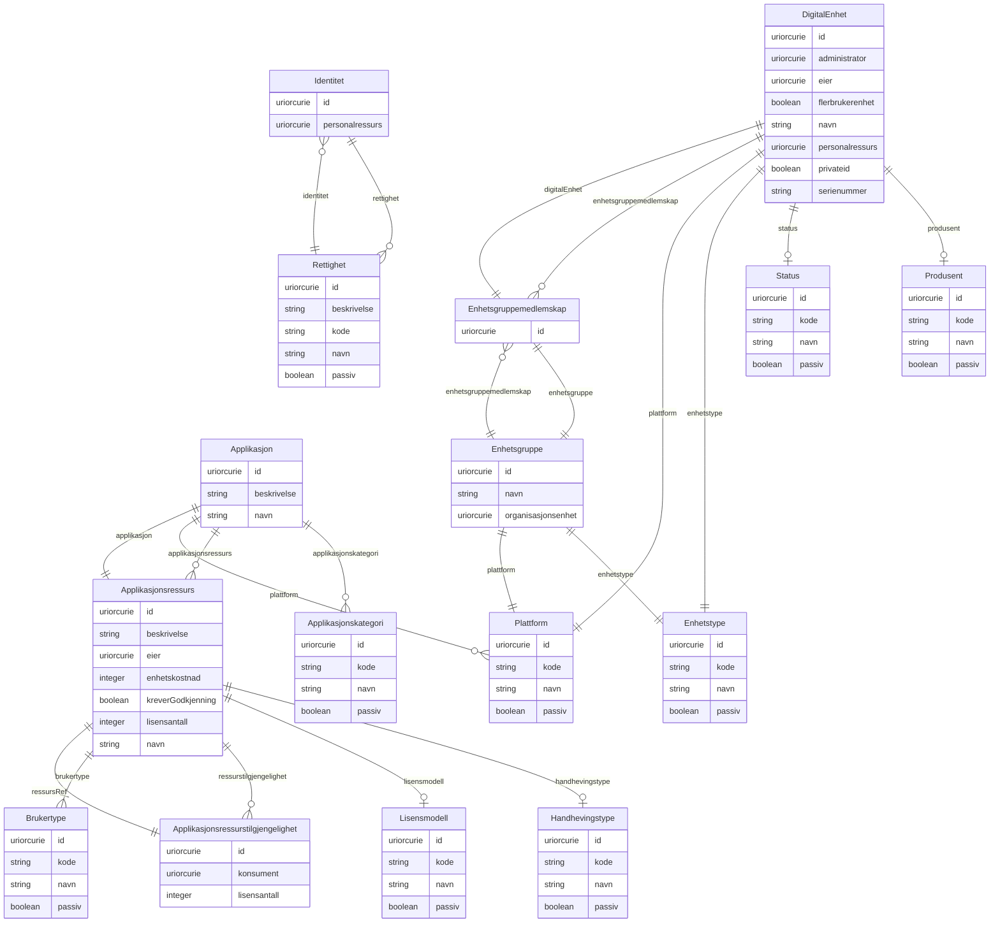

```mermaid
erDiagram
Applikasjon {
    uriorcurie id  
    string beskrivelse  
    string navn  
}
Applikasjonskategori {
    uriorcurie id  
    string kode  
    string navn  
    boolean passiv  
}
Applikasjonsressurs {
    uriorcurie id  
    string beskrivelse  
    uriorcurie eier  
    integer enhetskostnad  
    boolean kreverGodkjenning  
    integer lisensantall  
    string navn  
}
Applikasjonsressurstilgjengelighet {
    uriorcurie id  
    uriorcurie konsument  
    integer lisensantall  
}
Brukertype {
    uriorcurie id  
    string kode  
    string navn  
    boolean passiv  
}
DigitalEnhet {
    uriorcurie id  
    uriorcurie administrator  
    uriorcurie eier  
    boolean flerbrukerenhet  
    string navn  
    uriorcurie personalressurs  
    boolean privateid  
    string serienummer  
}
Enhetsgruppe {
    uriorcurie id  
    string navn  
    uriorcurie organisasjonsenhet  
}
Enhetsgruppemedlemskap {
    uriorcurie id  
}
Enhetstype {
    uriorcurie id  
    string kode  
    string navn  
    boolean passiv  
}
Handhevingstype {
    uriorcurie id  
    string kode  
    string navn  
    boolean passiv  
}
Identitet {
    uriorcurie id  
    uriorcurie personalressurs  
}
Lisensmodell {
    uriorcurie id  
    string kode  
    string navn  
    boolean passiv  
}
Plattform {
    uriorcurie id  
    string kode  
    string navn  
    boolean passiv  
}
Produsent {
    uriorcurie id  
    string kode  
    string navn  
    boolean passiv  
}
Rettighet {
    uriorcurie id  
    string beskrivelse  
    string kode  
    string navn  
    boolean passiv  
}
Status {
    uriorcurie id  
    string kode  
    string navn  
    boolean passiv  
}

Applikasjon ||--}o Applikasjonskategori : "applikasjonskategori"
Applikasjon ||--}o Applikasjonsressurs : "applikasjonsressurs"
Applikasjon ||--}o Plattform : "plattform"
Applikasjonsressurs ||--|o Handhevingstype : "handhevingstype"
Applikasjonsressurs ||--|o Lisensmodell : "lisensmodell"
Applikasjonsressurs ||--|| Applikasjon : "applikasjon"
Applikasjonsressurs ||--}o Applikasjonsressurstilgjengelighet : "ressurstilgjengelighet"
Applikasjonsressurs ||--}| Brukertype : "brukertype"
Applikasjonsressurstilgjengelighet ||--|| Applikasjonsressurs : "ressursRef"
DigitalEnhet ||--|o Produsent : "produsent"
DigitalEnhet ||--|o Status : "status"
DigitalEnhet ||--|| Enhetstype : "enhetstype"
DigitalEnhet ||--|| Plattform : "plattform"
DigitalEnhet ||--}o Enhetsgruppemedlemskap : "enhetsgruppemedlemskap"
Enhetsgruppe ||--|| Enhetstype : "enhetstype"
Enhetsgruppe ||--|| Plattform : "plattform"
Enhetsgruppe ||--}o Enhetsgruppemedlemskap : "enhetsgruppemedlemskap"
Enhetsgruppemedlemskap ||--|| DigitalEnhet : "digitalEnhet"
Enhetsgruppemedlemskap ||--|| Enhetsgruppe : "enhetsgruppe"
Identitet ||--}o Rettighet : "rettighet"
Rettighet ||--}o Identitet : "identitet"


```
