# fint-ressurs

```mermaid
erDiagram
Adresse {
    stringList adresselinje  
    string postnummer  
    string poststed  
}
Applikasjon {
    uriorcurie id  
    string beskrivelse  
    string navn  
}
Applikasjonskategori {
    uriorcurie id  
    string kode  
    string navn  
    boolean passiv  
}
Applikasjonsressurs {
    uriorcurie id  
    string beskrivelse  
    uriorcurie eier  
    integer enhetskostnad  
    boolean kreverGodkjenning  
    integer lisensantall  
    string navn  
}
Applikasjonsressurstilgjengelighet {
    uriorcurie id  
    uriorcurie konsument  
    integer lisensantall  
}
Brukertype {
    uriorcurie id  
    string kode  
    string navn  
    boolean passiv  
}
DigitalEnhet {
    uriorcurie id  
    uriorcurie administrator  
    uriorcurie eier  
    boolean flerbrukerenhet  
    string navn  
    uriorcurie personalressurs  
    boolean privateid  
    string serienummer  
}
Elev {
    uriorcurie id  
}
Enhetsgruppe {
    uriorcurie id  
    string navn  
    uriorcurie organisasjonsenhet  
}
Enhetsgruppemedlemskap {
    uriorcurie id  
}
Enhetstype {
    uriorcurie id  
    string kode  
    string navn  
    boolean passiv  
}
Fylke {
    uriorcurie id  
    string kode  
    string navn  
    boolean passiv  
}
Handhevingstype {
    uriorcurie id  
    string kode  
    string navn  
    boolean passiv  
}
Identifikator {
    string identifikatorverdi  
}
Identitet {
    uriorcurie id  
    uriorcurie personalressurs  
}
Kjonn {
    uriorcurie id  
    string kode  
    string navn  
    boolean passiv  
}
Kommune {
    uriorcurie id  
    string kode  
    string navn  
    boolean passiv  
}
Kontaktinformasjon {
    string epostadresse  
    string mobiltelefonnummer  
    string nettsted  
    string sip  
    string telefonnummer  
}
Kontaktperson {
    uriorcurie id  
    string type  
}
Landkode {
    uriorcurie id  
    string kode  
    string navn  
    boolean passiv  
}
Lisensmodell {
    uriorcurie id  
    string kode  
    string navn  
    boolean passiv  
}
Periode {
    string beskrivelse  
    datetime slutt  
    datetime start  
}
Person {
    uriorcurie id  
    string bilde  
    date fodselsdato  
    uriorcurieList laerling  
    uriorcurie otungdom  
    uriorcurie personalressurs  
}
Personnavn {
    string etternavn  
    string fornavn  
    string mellomnavn  
}
Plattform {
    uriorcurie id  
    string kode  
    string navn  
    boolean passiv  
}
Produsent {
    uriorcurie id  
    string kode  
    string navn  
    boolean passiv  
}
Rettighet {
    uriorcurie id  
    string beskrivelse  
    string kode  
    string navn  
    boolean passiv  
}
Spraak {
    uriorcurie id  
    string kode  
    string navn  
    boolean passiv  
}
Status {
    uriorcurie id  
    string kode  
    string navn  
    boolean passiv  
}

Adresse ||--|o Landkode : "land"
Applikasjon ||--|| Periode : "gyldighetsperiode"
Applikasjon ||--}o Applikasjonskategori : "applikasjonskategori"
Applikasjon ||--}o Applikasjonsressurs : "applikasjonsressurs"
Applikasjon ||--}o Plattform : "plattform"
Applikasjonskategori ||--|o Periode : "gyldighetsperiode"
Applikasjonsressurs ||--|o Handhevingstype : "handhevingstype"
Applikasjonsressurs ||--|o Lisensmodell : "lisensmodell"
Applikasjonsressurs ||--|| Applikasjon : "applikasjon"
Applikasjonsressurs ||--|| Periode : "gyldighetsperiode"
Applikasjonsressurs ||--}o Applikasjonsressurstilgjengelighet : "ressurstilgjengelighet"
Applikasjonsressurs ||--}| Brukertype : "brukertype"
Applikasjonsressurstilgjengelighet ||--|| Applikasjonsressurs : "ressursRef"
Applikasjonsressurstilgjengelighet ||--|| Periode : "gyldighetsperiode"
Brukertype ||--|o Periode : "gyldighetsperiode"
DigitalEnhet ||--|o Elev : "elev"
DigitalEnhet ||--|o Identifikator : "dataobjektId"
DigitalEnhet ||--|o Produsent : "produsent"
DigitalEnhet ||--|o Status : "status"
DigitalEnhet ||--|| Enhetstype : "enhetstype"
DigitalEnhet ||--|| Plattform : "plattform"
DigitalEnhet ||--}o Enhetsgruppemedlemskap : "enhetsgruppemedlemskap"
Elev ||--|o Identifikator : "elevnummer"
Elev ||--|o Person : "person"
Enhetsgruppe ||--|| Enhetstype : "enhetstype"
Enhetsgruppe ||--|| Plattform : "plattform"
Enhetsgruppe ||--}o Enhetsgruppemedlemskap : "enhetsgruppemedlemskap"
Enhetsgruppemedlemskap ||--|| DigitalEnhet : "digitalEnhet"
Enhetsgruppemedlemskap ||--|| Enhetsgruppe : "enhetsgruppe"
Enhetstype ||--|o Periode : "gyldighetsperiode"
Fylke ||--|o Periode : "gyldighetsperiode"
Fylke ||--}o Kommune : "kommune"
Handhevingstype ||--|o Periode : "gyldighetsperiode"
Identifikator ||--|o Periode : "gyldighetsperiode"
Identitet ||--}o Rettighet : "rettighet"
Kjonn ||--|o Periode : "gyldighetsperiode"
Kommune ||--|o Periode : "gyldighetsperiode"
Kommune ||--|| Fylke : "fylke"
Kontaktperson ||--|o Kontaktinformasjon : "kontaktinformasjon"
Kontaktperson ||--|o Personnavn : "kontaktperson_navn"
Kontaktperson ||--}o Person : "kontaktperson"
Landkode ||--|o Periode : "gyldighetsperiode"
Lisensmodell ||--|o Periode : "gyldighetsperiode"
Person ||--|o Adresse : "bostedsadresse, postadresse"
Person ||--|o Elev : "elev"
Person ||--|o Kjonn : "kjonn"
Person ||--|o Kommune : "kommune"
Person ||--|o Kontaktinformasjon : "kontaktinformasjon"
Person ||--|o Spraak : "maalform, morsmaal"
Person ||--|| Identifikator : "fodselsnummer"
Person ||--|| Personnavn : "person_navn"
Person ||--}o Kontaktperson : "parorende"
Person ||--}o Landkode : "statsborgerskap"
Person ||--}o Person : "foreldre, foreldreansvar"
Plattform ||--|o Periode : "gyldighetsperiode"
Produsent ||--|o Periode : "gyldighetsperiode"
Rettighet ||--|o Periode : "gyldighetsperiode"
Rettighet ||--}o Identitet : "identitet"
Spraak ||--|o Periode : "gyldighetsperiode"
Status ||--|o Periode : "gyldighetsperiode"

```

FINT-domenemodell for ressursstyring. Dekkjer tre sub-pakkar: ressurs.eiendel (applikasjonar og lisensressursar), ressurs.datautstyr (digitale einingar og einingsgrupper) og ressurs.tilgang (identitetar og rettigheiter).

URI: https://data.norge.no/linkml/fint-ressurs

Name: fint-ressurs

## Classes

| Class | Description |
| --- | --- |
| [Adresse](klasser/adresse.md) | Fysisk adresse eller postadresse |
| [Aktoer](klasser/aktoer.md) | Abstrakt base for person eller eining vi samhandlar med |
| &nbsp;&nbsp;&nbsp;&nbsp;&nbsp;&nbsp;&nbsp;&nbsp;[Enhet](klasser/enhet.md) | Abstrakt base for alle hovudeiningar, undereiningar og organisasjonsledd iden... |
| &nbsp;&nbsp;&nbsp;&nbsp;&nbsp;&nbsp;&nbsp;&nbsp;&nbsp;&nbsp;&nbsp;&nbsp;&nbsp;&nbsp;&nbsp;&nbsp;[Virksomhet](klasser/virksomhet.md) | Ein juridisk organisasjon som produserer varer eller tenester |
| &nbsp;&nbsp;&nbsp;&nbsp;&nbsp;&nbsp;&nbsp;&nbsp;[Person](klasser/person.md) | Fysiske private personar |
| [Applikasjon](klasser/applikasjon.md) | Ein applikasjon med tilhøyrande ressursar |
| [Applikasjonskategori](klasser/applikasjonskategori.md) | Kategori av applikasjonar |
| [Applikasjonsressurs](klasser/applikasjonsressurs.md) | Informasjon om kor ein applikasjon kan nyttast (lisensressurs) |
| [Applikasjonsressurstilgjengelighet](klasser/applikasjonsressurstilgjengelighet.md) | Kva organisasjonselements brukarar som har tilgang til ein ressurs |
| [Begrep](klasser/begrep.md) | Abstrakt fellesbase for alle FINT-kodeverk |
| &nbsp;&nbsp;&nbsp;&nbsp;&nbsp;&nbsp;&nbsp;&nbsp;[Fylke](klasser/fylke.md) | Liste over Norges fylker |
| &nbsp;&nbsp;&nbsp;&nbsp;&nbsp;&nbsp;&nbsp;&nbsp;[Kjonn](klasser/kjonn.md) | Verdiar for kjønn basert på ISO/IEC 5218 |
| &nbsp;&nbsp;&nbsp;&nbsp;&nbsp;&nbsp;&nbsp;&nbsp;[Kommune](klasser/kommune.md) | Liste over Norges kommunar |
| &nbsp;&nbsp;&nbsp;&nbsp;&nbsp;&nbsp;&nbsp;&nbsp;[Landkode](klasser/landkode.md) | Landskode i ISO 3166-1 alpha-2 format |
| &nbsp;&nbsp;&nbsp;&nbsp;&nbsp;&nbsp;&nbsp;&nbsp;[Spraak](klasser/spraak.md) | Verdiar for språk (2 bokstavar) |
| [Brukertype](klasser/brukertype.md) | Dei ulike brukartypane som kan nytte lisensen |
| [DigitalEnhet](klasser/digitalenhet.md) | Ei digital eining som t |
| [Elev](klasser/elev.md) | Ein elev registrert i skulesystemet |
| [Enhetsgruppe](klasser/enhetsgruppe.md) | Ei gruppering av einsarta digitale einingar |
| [Enhetsgruppemedlemskap](klasser/enhetsgruppemedlemskap.md) | Medlemskap mellom ei digital eining og ei einingsgruppe |
| [Enhetstype](klasser/enhetstype.md) | Type digital eining |
| [Handhevingstype](klasser/handhevingstype.md) | Korleis ulike lisensmodellar kan handhevast |
| [Identifikator](klasser/identifikator.md) | Unik identifikasjon til eit objekt |
| [Identitet](klasser/identitet.md) | Identitet som identifiserer innehavaren av rettigheiter i organisasjonen |
| [Kontaktinformasjon](klasser/kontaktinformasjon.md) | Informasjon som kan brukast for å oppnå kontakt |
| [Kontaktperson](klasser/kontaktperson.md) | Kontaktperson (pårørande) til ein person |
| [Lisensmodell](klasser/lisensmodell.md) | Lisensmodellar som kan knytast til ein lisens |
| [Matrikkelnummer](klasser/matrikkelnummer.md) | Eintydleg identifisering av matrikkeleining innanfor kommune |
| [Periode](klasser/periode.md) | Tidsperiode med obligatorisk start og valfri slutt |
| [Personnavn](klasser/personnavn.md) | Namn på ein person |
| [Plattform](klasser/plattform.md) | Plattforma tenesta kan leverast på |
| [Produsent](klasser/produsent.md) | Produsent av ei digital eining |
| [RessursContainer](klasser/ressurscontainer.md) | Rotcontainer for FINT Ressurs-instansar |
| [Rettighet](klasser/rettighet.md) | Ei namngitt rettighet |
| [Status](klasser/status.md) | Status på ei digital eining i fagsystemet |
| [Valuta](klasser/valuta.md) | Valutakodar for offisielle valutaer |

## Slots

| Slot | Description |
| --- | --- |
| [administrator](klasser/administrator.md) | Referanse til Organisasjonselement som administrerer eininga |
| [adresse](klasser/adresse.md) | Adresse til matrikkeleining |
| [adresselinje](klasser/adresselinje.md) | Adresseinformasjon |
| [applikasjon](klasser/applikasjon.md) | Applikasjonen ressursen (lisensen) er knytt til |
| [applikasjonar](klasser/applikasjonar.md) |  |
| [applikasjonskategori](klasser/applikasjonskategori.md) | Kategoriar av applikasjonar |
| [applikasjonskategoriar](klasser/applikasjonskategoriar.md) |  |
| [applikasjonsressurs](klasser/applikasjonsressurs.md) | Ulike ressursar (lisensar) knytt til ein applikasjon |
| [applikasjonsressursar](klasser/applikasjonsressursar.md) |  |
| [applikasjonsressurstilgjengelegheit](klasser/applikasjonsressurstilgjengelegheit.md) |  |
| [beskrivelse](klasser/beskrivelse.md) | Beskriven namn eller omtale |
| [bilde](klasser/bilde.md) | HTTP(S)-lenkje til eit bilete av personen |
| [bokstavkode](klasser/bokstavkode.md) | Bokstavkode for aktuell valuta |
| [bostedsadresse](klasser/bostedsadresse.md) | Folkeregistrert adresse til personen |
| [brukertypar](klasser/brukertypar.md) |  |
| [brukertype](klasser/brukertype.md) | For kva brukertypar lisensen er gyldig |
| [bruksnummer](klasser/bruksnummer.md) | Fortløpande nummerering av bruk under gårdsnummer |
| [dataobjektId](klasser/dataobjektid.md) | Einingsens ID i datakatalogen |
| [digitaleEiningar](klasser/digitaleeiningar.md) |  |
| [digitalEnhet](klasser/digitalenhet.md) | Den digitale eininga dette medlemskapet tilhøyrer |
| [eier](klasser/eier.md) | Referanse til Organisasjonselement som har eigarskap |
| [einingsgruppedmedlemskap](klasser/einingsgruppedmedlemskap.md) |  |
| [einingsgrupper](klasser/einingsgrupper.md) |  |
| [einingstypar](klasser/einingstypar.md) |  |
| [elev](klasser/elev.md) | Referanse til Elev (Utdanning) |
| [elevnummer](klasser/elevnummer.md) | Skulens interne elevnummer |
| [enhetsgruppe](klasser/enhetsgruppe.md) | Einingsgruppen dette medlemskapet tilhøyrer |
| [enhetsgruppemedlemskap](klasser/enhetsgruppemedlemskap.md) | Einingsgruppemelemskap |
| [enhetskostnad](klasser/enhetskostnad.md) | Kostnad per ressurs |
| [enhetstype](klasser/enhetstype.md) | Type digital eining |
| [epostadresse](klasser/epostadresse.md) | Namngitt elektronisk adresse for mottak av e-post |
| [etternavn](klasser/etternavn.md) | Etternamn til personen |
| [festenummer](klasser/festenummer.md) | Fortløpande nummerering av festar under gårdsnummer/bruksnummer |
| [flerbrukerenhet](klasser/flerbrukerenhet.md) | Kvifor eininga er ein- eller flerbrukarenheit |
| [fodselsdato](klasser/fodselsdato.md) | Dato for fødsel |
| [fodselsnummer](klasser/fodselsnummer.md) | Fødselsnummer eller ein av dei fiktive variantane |
| [foreldre](klasser/foreldre.md) | Den/dei som har foreldreansvar til personen |
| [foreldreansvar](klasser/foreldreansvar.md) | Personar denne personen har foreldreansvar for |
| [fornavn](klasser/fornavn.md) | Fornamn til personen |
| [forretningsadresse](klasser/forretningsadresse.md) | Besøksadresse til ein organisasjonseining |
| [fylke](klasser/fylke.md) | Fylke |
| [gaardsnummer](klasser/gaardsnummer.md) | Nummerering av gårdseiging i matrikkelen, unik innanfor kommune |
| [gyldighetsperiode](klasser/gyldighetsperiode.md) | Periode ressursen er gyldig for |
| [handhaevingstypar](klasser/handhaevingstypar.md) |  |
| [handhevingstype](klasser/handhevingstype.md) | Korleis lisensmodellen skal handhevast |
| [id](klasser/id.md) | URI-identifikator for ressursen |
| [identifikatorverdi](klasser/identifikatorverdi.md) | Ein konkret kombinasjon av teikn og/eller bokstavar som utgjer ein bestemt id... |
| [identitet](klasser/identitet.md) | Identitetar knytt til rettigheta |
| [identitetar](klasser/identitetar.md) |  |
| [kjonn](klasser/kjonn.md) | Kjønn |
| [kode](klasser/kode.md) | Verdi som identifiserer omgrepet |
| [kommune](klasser/kommune.md) | Kommune |
| [kommunenummer](klasser/kommunenummer.md) | Nummerering av kommunen i høve til SSB si offisielle liste |
| [konsument](klasser/konsument.md) | Referanse til Organisasjonselement som har tilgang til ressursen |
| [kontaktinformasjon](klasser/kontaktinformasjon.md) | Den føretrekte måten å kome i kontakt med ein aktør |
| [kontaktperson](klasser/kontaktperson.md) | Personar kontaktpersonen er pårørande for |
| [kontaktperson_navn](klasser/kontaktperson_navn.md) | Namn på kontaktpersonen |
| [kreverGodkjenning](klasser/krevergodkjenning.md) | True dersom tildeling av ressursen krev godkjenning |
| [laerling](klasser/laerling.md) | Referanse til Laerling (Utdanning) |
| [land](klasser/land.md) | Land der adressa befinn seg |
| [lisensantall](klasser/lisensantall.md) | Totalt tal på lisensar |
| [lisensmodell](klasser/lisensmodell.md) | Lisensmodellen applikasjonsressursen har |
| [lisensmodellar](klasser/lisensmodellar.md) |  |
| [maalform](klasser/maalform.md) | Målform personen føretrekkjer |
| [mellomnavn](klasser/mellomnavn.md) | Mellomnamn |
| [mobiltelefonnummer](klasser/mobiltelefonnummer.md) | Mobiltelefonnummer |
| [morsmaal](klasser/morsmaal.md) | Morsmål til personen |
| [navn](klasser/navn.md) | Hovudnamn for ressursen |
| [nettsted](klasser/nettsted.md) | Adresse til eit nettstad |
| [nummerkode](klasser/nummerkode.md) | Nummerkode for aktuell valuta |
| [organisasjonsenhet](klasser/organisasjonsenhet.md) | Referanse til Organisasjonselement grupperinga er tilknytt |
| [organisasjonsnavn](klasser/organisasjonsnavn.md) | Namn på eining registrert i Einingsregisteret |
| [organisasjonsnummer](klasser/organisasjonsnummer.md) | Niisifra nummer som eintydleg identifiserer einingar i Einingsregisteret |
| [otungdom](klasser/otungdom.md) | Referanse til OtUngdom (Utdanning) |
| [parorende](klasser/parorende.md) | Pårørande kontaktperson til personen |
| [passiv](klasser/passiv.md) | Angir at koden er passiv og ikkje kan veljast |
| [person](klasser/person.md) | Referanse til Person i Administrasjon-domenet |
| [person_navn](klasser/person_navn.md) | Namn på personen |
| [personalressurs](klasser/personalressurs.md) | Referanse til Personalressurs (Administrasjon) |
| [plattform](klasser/plattform.md) | Plattforma ressursen er knytt til |
| [plattformar](klasser/plattformar.md) |  |
| [postadresse](klasser/postadresse.md) | Informasjon om postadresse til ein aktør |
| [postnummer](klasser/postnummer.md) | Postnummer |
| [poststed](klasser/poststed.md) | Poststad |
| [privateid](klasser/privateid.md) | Angir om eininga er eigd av organisasjonen eller privatperson |
| [produsent](klasser/produsent.md) | Namn på produsenten av eininga |
| [produsentar](klasser/produsentar.md) |  |
| [ressursRef](klasser/ressursref.md) | Ressursen organisasjonselementet har tilgang til |
| [ressurstilgjengelighet](klasser/ressurstilgjengelighet.md) | Angir kva organisasjonseining og kor mange ressursar som skal tilordnast |
| [rettigheiter](klasser/rettigheiter.md) |  |
| [rettighet](klasser/rettighet.md) | Rettigheiter knytt til identiteten |
| [seksjonsnummer](klasser/seksjonsnummer.md) | Fortløpande nummerering av seksjonar under gårdsnummer/bruksnummer |
| [serienummer](klasser/serienummer.md) | Unikt serienummer frå einingsprodusentens |
| [sip](klasser/sip.md) | SIP-protokoll for VoIP (IP-telefoni) |
| [slutt](klasser/slutt.md) | Til tidspunkt |
| [start](klasser/start.md) | Frå tidspunkt |
| [statsborgerskap](klasser/statsborgerskap.md) | Alle statsborgarskap personen har |
| [status](klasser/status.md) | Status på eininga i fagsystemet |
| [statusar](klasser/statusar.md) |  |
| [telefonnummer](klasser/telefonnummer.md) | Telefonnummer |
| [type](klasser/type.md) | Beskriv kva slags type |
| [valuta_navn](klasser/valuta_navn.md) | Namn på valuta |
| [virksomhetsId](klasser/virksomhetsid.md) | Intern unik identifikator i økonomisystemet |

## Enumerations

| Enumeration | Description |
| --- | --- |

## Types

| Type | Description |
| --- | --- |
| [Boolean](klasser/boolean.md) | A binary (true or false) value |
| [Curie](klasser/curie.md) | a compact URI |
| [Date](klasser/date.md) | a date (year, month and day) in an idealized calendar |
| [DateOrDatetime](klasser/dateordatetime.md) | Either a date or a datetime |
| [Datetime](klasser/datetime.md) | The combination of a date and time |
| [Decimal](klasser/decimal.md) | A real number with arbitrary precision that conforms to the xsd:decimal speci... |
| [Double](klasser/double.md) | A real number that conforms to the xsd:double specification |
| [Float](klasser/float.md) | A real number that conforms to the xsd:float specification |
| [Integer](klasser/integer.md) | An integer |
| [Jsonpath](klasser/jsonpath.md) | A string encoding a JSON Path |
| [Jsonpointer](klasser/jsonpointer.md) | A string encoding a JSON Pointer |
| [Ncname](klasser/ncname.md) | Prefix part of CURIE |
| [Nodeidentifier](klasser/nodeidentifier.md) | A URI, CURIE or BNODE that represents a node in a model |
| [Objectidentifier](klasser/objectidentifier.md) | A URI or CURIE that represents an object in the model |
| [Sparqlpath](klasser/sparqlpath.md) | A string encoding a SPARQL Property Path |
| [String](klasser/string.md) | A character string |
| [Time](klasser/time.md) | A time object represents a (local) time of day, independent of any particular... |
| [Uri](klasser/uri.md) | a complete URI |
| [Uriorcurie](klasser/uriorcurie.md) | a URI or a CURIE |

## Subsets

| Subset | Description |
| --- | --- |
| [Anbefalt](klasser/anbefalt.md) | Anbefalt eigensskap |
| [Obligatorisk](klasser/obligatorisk.md) | Obligatorisk eigensskap |
| [Valgfri](klasser/valgfri.md) | Valfri eigensskap |

## Generated artifacts

| Artefakt | Fil |
|----------|-----|
| SHACL shapes | [fint-ressurs-shapes.ttl](fint-ressurs-shapes.ttl) |
| JSON-LD kontekst | [fint-ressurs-context.jsonld](fint-ressurs-context.jsonld) |
| JSON Schema | [fint-ressurs-schema.json](fint-ressurs-schema.json) |
| OWL ontologi | [fint-ressurs-ontology.ttl](fint-ressurs-ontology.ttl) |
| RDF/Turtle skjema | [fint-ressurs-schema.ttl](fint-ressurs-schema.ttl) |
| Python-klasser | [fint-ressurs-model.py](fint-ressurs-model.py) |
| ER-diagram (Mermaid) | [fint-ressurs-erdiagram.md](fint-ressurs-erdiagram.md) |
| Eksempeldata (Turtle) | [fint-ressurs-eksempel.ttl](fint-ressurs-eksempel.ttl) |
