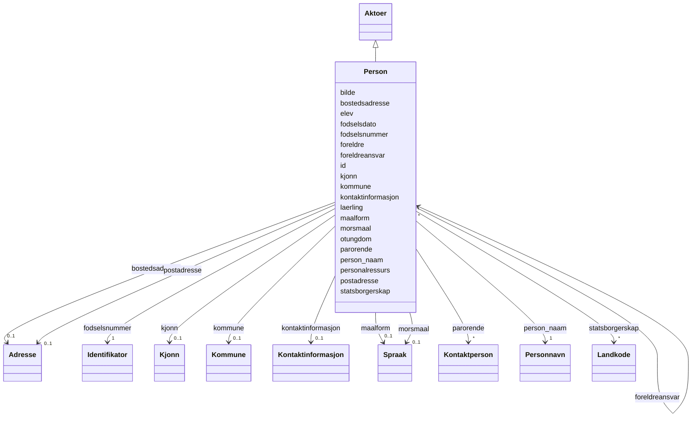

# Class: Person 


_Fysiske private personar._


URI: [fint:Person](https://schema.fintlabs.no/Person)





## Inheritance
* [Aktoer](aktoer.md)
    * **Person**


## Class Properties

| Property | Value |
| --- | --- |
| Class URI | [fint:Person](https://schema.fintlabs.no/Person) |


## Eigenskapar


  
  

  
  

  
  

  
  

  
  
    
  

  
  
    
  

  
  

  
  

  
  

  
  

  
  

  
  

  
  

  
  

  
  

  
  

  
  

  
  


### Obligatorisk

| Namn | Kardinalitet og domene | Beskriving |
| --- | --- | --- |
| [fodselsnummer](fodselsnummer.md) | 1 <br/> [Identifikator](identifikator.md) | Fødselsnummer eller ein av dei fiktive variantane |
| [person_naam](person_naam.md) | 1 <br/> [Personnavn](personnavn.md) | Namn på personen |


  
  

  
  

  
  

  
  

  
  

  
  

  
  

  
  

  
  

  
  

  
  

  
  

  
  

  
  

  
  

  
  

  
  

  
  


  
  

  
  
    
  

  
  
    
  

  
  
    
  

  
  

  
  

  
  
    
  

  
  
    
  

  
  
    
  

  
  
    
  

  
  
    
  

  
  
    
  

  
  
    
  

  
  
    
  

  
  
    
  

  
  
    
  

  
  
    
  

  
  


### Valgfri

| Namn | Kardinalitet og domene | Beskriving |
| --- | --- | --- |
| [bilde](bilde.md) | 0..1 <br/> [String](string.md) | HTTP(S)-lenkje til eit bilete av personen |
| [bostedsadresse](bostedsadresse.md) | 0..1 <br/> [Adresse](adresse.md) | Folkeregistrert adresse til personen |
| [fodselsdato](fodselsdato.md) | 0..1 <br/> [Date](date.md) | Dato for fødsel |
| [parorende](parorende.md) | * <br/> [Kontaktperson](kontaktperson.md) | Pårørande kontaktperson til personen |
| [statsborgerskap](statsborgerskap.md) | * <br/> [Landkode](landkode.md) | Alle statsborgarskap personen har |
| [kommune](kommune.md) | 0..1 <br/> [Kommune](kommune.md) | Kommune |
| [kjonn](kjonn.md) | 0..1 <br/> [Kjonn](kjonn.md) | Kjønn |
| [foreldreansvar](foreldreansvar.md) | * <br/> [Person](person.md) | Personar denne personen har foreldreansvar for |
| [foreldre](foreldre.md) | * <br/> [Person](person.md) | Den/dei som har foreldreansvar til personen |
| [maalform](maalform.md) | 0..1 <br/> [Spraak](spraak.md) | Målform personen føretrekkjer |
| [morsmaal](morsmaal.md) | 0..1 <br/> [Spraak](spraak.md) | Morsmål til personen |
| [laerling](laerling.md) | * <br/> [Uriorcurie](uriorcurie.md) | Referanse til Laerling (Utdanning) |
| [elev](elev.md) | 0..1 <br/> [Uriorcurie](uriorcurie.md) | Referanse til Elev (Utdanning) |
| [otungdom](otungdom.md) | 0..1 <br/> [Uriorcurie](uriorcurie.md) | Referanse til OtUngdom (Utdanning) |


  
  
  
  
    
  

  
  
  
    
      
    
      
    
      
    
  
  

  
  
  
    
      
    
      
    
      
    
  
  

  
  
  
    
      
    
      
    
      
    
  
  

  
  
  
    
      
    
      
    
      
    
  
  

  
  
  
    
      
    
      
    
      
    
  
  

  
  
  
    
      
    
      
    
      
    
  
  

  
  
  
    
      
    
      
    
      
    
  
  

  
  
  
    
      
    
      
    
      
    
  
  

  
  
  
    
      
    
      
    
      
    
  
  

  
  
  
    
      
    
      
    
      
    
  
  

  
  
  
    
      
    
      
    
      
    
  
  

  
  
  
    
      
    
      
    
      
    
  
  

  
  
  
    
      
    
      
    
      
    
  
  

  
  
  
    
      
    
      
    
      
    
  
  

  
  
  
    
      
    
      
    
      
    
  
  

  
  
  
    
      
    
      
    
      
    
  
  

  
  
  
  
    
  


### Andre

| Namn | Kardinalitet og domene | Beskriving |
| --- | --- | --- |
| [id](id.md) | 1 <br/> [Uriorcurie](uriorcurie.md) | URI-identifikator for ressursen |
| [personalressurs](personalressurs.md) | 0..1 <br/> [Uriorcurie](uriorcurie.md) | Referanse til Personalressurs (Administrasjon) |


### Arva

| Namn | Kardinalitet og domene | Beskriving | Frå |
| --- | --- | --- | --- || [kontaktinformasjon](kontaktinformasjon.md) | 0..1 <br/> [Kontaktinformasjon](kontaktinformasjon.md) | Den føretrekte måten å kome i kontakt med ein aktør | [Aktoer](aktoer.md) |
| [postadresse](postadresse.md) | 0..1 <br/> [Adresse](adresse.md) | Informasjon om postadresse til ein aktør | [Aktoer](aktoer.md) |


## Usages

| used by | used in | type | used |
| ---  | --- | --- | --- |
| [Person](person.md) | [foreldreansvar](foreldreansvar.md) | range | [Person](person.md) |
| [Person](person.md) | [foreldre](foreldre.md) | range | [Person](person.md) |
| [Kontaktperson](kontaktperson.md) | [kontaktperson](kontaktperson.md) | range | [Person](person.md) |


## Identifier and Mapping Information


### Schema Source


* from schema: https://data.norge.no/linkml/fint-ressurs


## Mappings

| Mapping Type | Mapped Value |
| ---  | ---  |
| self | fint:Person |
| native | https://schema.fintlabs.no/ressurs/:Person |


## LinkML Source

<!-- TODO: investigate https://stackoverflow.com/questions/37606292/how-to-create-tabbed-code-blocks-in-mkdocs-or-sphinx -->

### Direct

<details>
```yaml
name: Person
description: Fysiske private personar.
from_schema: https://data.norge.no/linkml/fint-ressurs
is_a: Aktoer
slots:
- id
- bilde
- bostedsadresse
- fodselsdato
- fodselsnummer
- person_naam
- parorende
- statsborgerskap
- kommune
- kjonn
- foreldreansvar
- foreldre
- maalform
- morsmaal
- laerling
- elev
- otungdom
slot_usage:
  fodselsnummer:
    name: fodselsnummer
    in_subset:
    - Obligatorisk
    required: true
  person_naam:
    name: person_naam
    in_subset:
    - Obligatorisk
    required: true
  bilde:
    name: bilde
    in_subset:
    - Valgfri
  bostedsadresse:
    name: bostedsadresse
    in_subset:
    - Valgfri
  fodselsdato:
    name: fodselsdato
    in_subset:
    - Valgfri
  parorende:
    name: parorende
    in_subset:
    - Valgfri
  statsborgerskap:
    name: statsborgerskap
    in_subset:
    - Valgfri
  kommune:
    name: kommune
    in_subset:
    - Valgfri
  kjonn:
    name: kjonn
    in_subset:
    - Valgfri
  foreldreansvar:
    name: foreldreansvar
    in_subset:
    - Valgfri
  foreldre:
    name: foreldre
    in_subset:
    - Valgfri
  maalform:
    name: maalform
    in_subset:
    - Valgfri
  morsmaal:
    name: morsmaal
    in_subset:
    - Valgfri
  laerling:
    name: laerling
    in_subset:
    - Valgfri
  elev:
    name: elev
    in_subset:
    - Valgfri
  otungdom:
    name: otungdom
    in_subset:
    - Valgfri
attributes:
  personalressurs:
    name: personalressurs
    description: Referanse til Personalressurs (Administrasjon).
    in_subset:
    - Valgfri
    from_schema: https://data.norge.no/linkml/fint-common
    slot_uri: fint:personalressurs
    domain_of:
    - DigitalEnhet
    - Identitet
    - Person
    range: uriorcurie
class_uri: fint:Person

```
</details>

### Induced

<details>
```yaml
name: Person
description: Fysiske private personar.
from_schema: https://data.norge.no/linkml/fint-ressurs
is_a: Aktoer
slot_usage:
  fodselsnummer:
    name: fodselsnummer
    in_subset:
    - Obligatorisk
    required: true
  person_naam:
    name: person_naam
    in_subset:
    - Obligatorisk
    required: true
  bilde:
    name: bilde
    in_subset:
    - Valgfri
  bostedsadresse:
    name: bostedsadresse
    in_subset:
    - Valgfri
  fodselsdato:
    name: fodselsdato
    in_subset:
    - Valgfri
  parorende:
    name: parorende
    in_subset:
    - Valgfri
  statsborgerskap:
    name: statsborgerskap
    in_subset:
    - Valgfri
  kommune:
    name: kommune
    in_subset:
    - Valgfri
  kjonn:
    name: kjonn
    in_subset:
    - Valgfri
  foreldreansvar:
    name: foreldreansvar
    in_subset:
    - Valgfri
  foreldre:
    name: foreldre
    in_subset:
    - Valgfri
  maalform:
    name: maalform
    in_subset:
    - Valgfri
  morsmaal:
    name: morsmaal
    in_subset:
    - Valgfri
  laerling:
    name: laerling
    in_subset:
    - Valgfri
  elev:
    name: elev
    in_subset:
    - Valgfri
  otungdom:
    name: otungdom
    in_subset:
    - Valgfri
attributes:
  personalressurs:
    name: personalressurs
    description: Referanse til Personalressurs (Administrasjon).
    in_subset:
    - Valgfri
    from_schema: https://data.norge.no/linkml/fint-common
    slot_uri: fint:personalressurs
    alias: personalressurs
    owner: Person
    domain_of:
    - DigitalEnhet
    - Identitet
    - Person
    range: uriorcurie
  id:
    name: id
    description: URI-identifikator for ressursen.
    from_schema: https://data.norge.no/linkml/fint-ressurs
    rank: 1000
    identifier: true
    alias: id
    owner: Person
    domain_of:
    - Applikasjon
    - Applikasjonsressurs
    - Applikasjonsressurstilgjengelighet
    - DigitalEnhet
    - Enhetsgruppe
    - Enhetsgruppemedlemskap
    - Identitet
    - Rettighet
    - Applikasjonskategori
    - Brukertype
    - Enhetstype
    - Handhevingstype
    - Lisensmodell
    - Plattform
    - Produsent
    - Status
    - Begrep
    - Valuta
    - Person
    - Kontaktperson
    - Virksomhet
    range: uriorcurie
    required: true
  bilde:
    name: bilde
    description: HTTP(S)-lenkje til eit bilete av personen.
    in_subset:
    - Valgfri
    from_schema: https://data.norge.no/linkml/fint-ressurs
    rank: 1000
    slot_uri: fint:bilde
    alias: bilde
    owner: Person
    domain_of:
    - Person
    range: string
  bostedsadresse:
    name: bostedsadresse
    description: Folkeregistrert adresse til personen.
    in_subset:
    - Valgfri
    from_schema: https://data.norge.no/linkml/fint-ressurs
    rank: 1000
    slot_uri: fint:bostedsadresse
    alias: bostedsadresse
    owner: Person
    domain_of:
    - Person
    range: Adresse
    inlined: true
  fodselsdato:
    name: fodselsdato
    description: Dato for fødsel.
    in_subset:
    - Valgfri
    from_schema: https://data.norge.no/linkml/fint-ressurs
    rank: 1000
    slot_uri: fint:fodselsdato
    alias: fodselsdato
    owner: Person
    domain_of:
    - Person
    range: date
  fodselsnummer:
    name: fodselsnummer
    description: Fødselsnummer eller ein av dei fiktive variantane.
    in_subset:
    - Obligatorisk
    from_schema: https://data.norge.no/linkml/fint-ressurs
    rank: 1000
    slot_uri: fint:fodselsnummer
    alias: fodselsnummer
    owner: Person
    domain_of:
    - Person
    range: Identifikator
    required: true
    inlined: true
  person_naam:
    name: person_naam
    description: Namn på personen.
    in_subset:
    - Obligatorisk
    from_schema: https://data.norge.no/linkml/fint-ressurs
    rank: 1000
    slot_uri: fint:personNavn
    alias: person_naam
    owner: Person
    domain_of:
    - Person
    range: Personnavn
    required: true
    inlined: true
  parorende:
    name: parorende
    description: Pårørande kontaktperson til personen.
    in_subset:
    - Valgfri
    from_schema: https://data.norge.no/linkml/fint-ressurs
    rank: 1000
    slot_uri: fint:parorende
    alias: parorende
    owner: Person
    domain_of:
    - Person
    range: Kontaktperson
    multivalued: true
  statsborgerskap:
    name: statsborgerskap
    description: Alle statsborgarskap personen har.
    in_subset:
    - Valgfri
    from_schema: https://data.norge.no/linkml/fint-ressurs
    rank: 1000
    slot_uri: fint:statsborgerskap
    alias: statsborgerskap
    owner: Person
    domain_of:
    - Person
    range: Landkode
    multivalued: true
  kommune:
    name: kommune
    description: Kommune.
    in_subset:
    - Valgfri
    from_schema: https://data.norge.no/linkml/fint-ressurs
    rank: 1000
    slot_uri: fint:kommune
    alias: kommune
    owner: Person
    domain_of:
    - Fylke
    - Person
    range: Kommune
  kjonn:
    name: kjonn
    description: Kjønn.
    in_subset:
    - Valgfri
    from_schema: https://data.norge.no/linkml/fint-ressurs
    rank: 1000
    slot_uri: fint:kjonn
    alias: kjonn
    owner: Person
    domain_of:
    - Person
    range: Kjonn
  foreldreansvar:
    name: foreldreansvar
    description: Personar denne personen har foreldreansvar for.
    in_subset:
    - Valgfri
    from_schema: https://data.norge.no/linkml/fint-ressurs
    rank: 1000
    slot_uri: fint:foreldreansvar
    alias: foreldreansvar
    owner: Person
    domain_of:
    - Person
    range: Person
    multivalued: true
  foreldre:
    name: foreldre
    description: Den/dei som har foreldreansvar til personen.
    in_subset:
    - Valgfri
    from_schema: https://data.norge.no/linkml/fint-ressurs
    rank: 1000
    slot_uri: fint:foreldre
    alias: foreldre
    owner: Person
    domain_of:
    - Person
    range: Person
    multivalued: true
  maalform:
    name: maalform
    description: Målform personen føretrekkjer.
    in_subset:
    - Valgfri
    from_schema: https://data.norge.no/linkml/fint-ressurs
    rank: 1000
    slot_uri: fint:maalform
    alias: maalform
    owner: Person
    domain_of:
    - Person
    range: Spraak
  morsmaal:
    name: morsmaal
    description: Morsmål til personen.
    in_subset:
    - Valgfri
    from_schema: https://data.norge.no/linkml/fint-ressurs
    rank: 1000
    slot_uri: fint:morsmaal
    alias: morsmaal
    owner: Person
    domain_of:
    - Person
    range: Spraak
  laerling:
    name: laerling
    description: Referanse til Laerling (Utdanning).
    in_subset:
    - Valgfri
    from_schema: https://data.norge.no/linkml/fint-ressurs
    rank: 1000
    slot_uri: fint:laerling
    alias: laerling
    owner: Person
    domain_of:
    - Person
    - Virksomhet
    range: uriorcurie
    multivalued: true
  elev:
    name: elev
    description: Referanse til Elev (Utdanning).
    in_subset:
    - Valgfri
    from_schema: https://data.norge.no/linkml/fint-ressurs
    rank: 1000
    slot_uri: fint:elev
    alias: elev
    owner: Person
    domain_of:
    - DigitalEnhet
    - Person
    range: uriorcurie
  otungdom:
    name: otungdom
    description: Referanse til OtUngdom (Utdanning).
    in_subset:
    - Valgfri
    from_schema: https://data.norge.no/linkml/fint-ressurs
    rank: 1000
    slot_uri: fint:otungdom
    alias: otungdom
    owner: Person
    domain_of:
    - Person
    range: uriorcurie
  kontaktinformasjon:
    name: kontaktinformasjon
    description: Den føretrekte måten å kome i kontakt med ein aktør.
    in_subset:
    - Valgfri
    from_schema: https://data.norge.no/linkml/fint-ressurs
    rank: 1000
    slot_uri: fint:kontaktinformasjon
    alias: kontaktinformasjon
    owner: Person
    domain_of:
    - Aktoer
    - Kontaktperson
    range: Kontaktinformasjon
    inlined: true
  postadresse:
    name: postadresse
    description: Informasjon om postadresse til ein aktør.
    in_subset:
    - Valgfri
    from_schema: https://data.norge.no/linkml/fint-ressurs
    rank: 1000
    slot_uri: fint:postadresse
    alias: postadresse
    owner: Person
    domain_of:
    - Aktoer
    range: Adresse
    inlined: true
class_uri: fint:Person

```
</details>