# Class: RessursContainer 


_Rotcontainer for FINT Ressurs-instansar._


URI: [https://schema.fintlabs.no/ressurs/:RessursContainer](https://schema.fintlabs.no/ressurs/:RessursContainer)

```mermaid
 classDiagram
    class RessursContainer
    click RessursContainer href "../RessursContainer/"
      RessursContainer : applikasjonar
        
          
    
        
        
        RessursContainer --> "*" Applikasjon : applikasjonar
        click Applikasjon href "../Applikasjon/"
    

        
      RessursContainer : applikasjonskategoriar
        
          
    
        
        
        RessursContainer --> "*" Applikasjonskategori : applikasjonskategoriar
        click Applikasjonskategori href "../Applikasjonskategori/"
    

        
      RessursContainer : applikasjonsressursar
        
          
    
        
        
        RessursContainer --> "*" Applikasjonsressurs : applikasjonsressursar
        click Applikasjonsressurs href "../Applikasjonsressurs/"
    

        
      RessursContainer : applikasjonsressurstilgjengelegheit
        
          
    
        
        
        RessursContainer --> "*" Applikasjonsressurstilgjengelighet : applikasjonsressurstilgjengelegheit
        click Applikasjonsressurstilgjengelighet href "../Applikasjonsressurstilgjengelighet/"
    

        
      RessursContainer : brukertypar
        
          
    
        
        
        RessursContainer --> "*" Brukertype : brukertypar
        click Brukertype href "../Brukertype/"
    

        
      RessursContainer : digitaleEiningar
        
          
    
        
        
        RessursContainer --> "*" DigitalEnhet : digitaleEiningar
        click DigitalEnhet href "../DigitalEnhet/"
    

        
      RessursContainer : einingsgruppedmedlemskap
        
          
    
        
        
        RessursContainer --> "*" Enhetsgruppemedlemskap : einingsgruppedmedlemskap
        click Enhetsgruppemedlemskap href "../Enhetsgruppemedlemskap/"
    

        
      RessursContainer : einingsgrupper
        
          
    
        
        
        RessursContainer --> "*" Enhetsgruppe : einingsgrupper
        click Enhetsgruppe href "../Enhetsgruppe/"
    

        
      RessursContainer : einingstypar
        
          
    
        
        
        RessursContainer --> "*" Enhetstype : einingstypar
        click Enhetstype href "../Enhetstype/"
    

        
      RessursContainer : handhaevingstypar
        
          
    
        
        
        RessursContainer --> "*" Handhevingstype : handhaevingstypar
        click Handhevingstype href "../Handhevingstype/"
    

        
      RessursContainer : identitetar
        
          
    
        
        
        RessursContainer --> "*" Identitet : identitetar
        click Identitet href "../Identitet/"
    

        
      RessursContainer : lisensmodellar
        
          
    
        
        
        RessursContainer --> "*" Lisensmodell : lisensmodellar
        click Lisensmodell href "../Lisensmodell/"
    

        
      RessursContainer : plattformar
        
          
    
        
        
        RessursContainer --> "*" Plattform : plattformar
        click Plattform href "../Plattform/"
    

        
      RessursContainer : produsentar
        
          
    
        
        
        RessursContainer --> "*" Produsent : produsentar
        click Produsent href "../Produsent/"
    

        
      RessursContainer : rettigheiter
        
          
    
        
        
        RessursContainer --> "*" Rettighet : rettigheiter
        click Rettighet href "../Rettighet/"
    

        
      RessursContainer : statusar
        
          
    
        
        
        RessursContainer --> "*" Status : statusar
        click Status href "../Status/"
    

        
      
```





<!-- no inheritance hierarchy -->

## Class Properties

| Property | Value |
| --- | --- |
| Tree Root | Yes |


## Eigenskapar


  
  

  
  

  
  

  
  

  
  

  
  

  
  

  
  

  
  

  
  

  
  

  
  

  
  

  
  

  
  

  
  


  
  

  
  

  
  

  
  

  
  

  
  

  
  

  
  

  
  

  
  

  
  

  
  

  
  

  
  

  
  

  
  


  
  

  
  

  
  

  
  

  
  

  
  

  
  

  
  

  
  

  
  

  
  

  
  

  
  

  
  

  
  

  
  


  
  
  
  
    
  

  
  
  
  
    
  

  
  
  
  
    
  

  
  
  
  
    
  

  
  
  
  
    
  

  
  
  
  
    
  

  
  
  
  
    
  

  
  
  
  
    
  

  
  
  
  
    
  

  
  
  
  
    
  

  
  
  
  
    
  

  
  
  
  
    
  

  
  
  
  
    
  

  
  
  
  
    
  

  
  
  
  
    
  

  
  
  
  
    
  


### Andre

| Namn | Kardinalitet og domene | Beskriving |
| --- | --- | --- |
| [applikasjonar](applikasjonar.md) | * <br/> [Applikasjon](applikasjon.md) |  |
| [applikasjonsressursar](applikasjonsressursar.md) | * <br/> [Applikasjonsressurs](applikasjonsressurs.md) |  |
| [applikasjonsressurstilgjengelegheit](applikasjonsressurstilgjengelegheit.md) | * <br/> [Applikasjonsressurstilgjengelighet](applikasjonsressurstilgjengelighet.md) |  |
| [digitaleEiningar](digitaleeiningar.md) | * <br/> [DigitalEnhet](digitalenhet.md) |  |
| [einingsgrupper](einingsgrupper.md) | * <br/> [Enhetsgruppe](enhetsgruppe.md) |  |
| [einingsgruppedmedlemskap](einingsgruppedmedlemskap.md) | * <br/> [Enhetsgruppemedlemskap](enhetsgruppemedlemskap.md) |  |
| [identitetar](identitetar.md) | * <br/> [Identitet](identitet.md) |  |
| [rettigheiter](rettigheiter.md) | * <br/> [Rettighet](rettighet.md) |  |
| [applikasjonskategoriar](applikasjonskategoriar.md) | * <br/> [Applikasjonskategori](applikasjonskategori.md) |  |
| [brukertypar](brukertypar.md) | * <br/> [Brukertype](brukertype.md) |  |
| [einingstypar](einingstypar.md) | * <br/> [Enhetstype](enhetstype.md) |  |
| [handhaevingstypar](handhaevingstypar.md) | * <br/> [Handhevingstype](handhevingstype.md) |  |
| [lisensmodellar](lisensmodellar.md) | * <br/> [Lisensmodell](lisensmodell.md) |  |
| [plattformar](plattformar.md) | * <br/> [Plattform](plattform.md) |  |
| [produsentar](produsentar.md) | * <br/> [Produsent](produsent.md) |  |
| [statusar](statusar.md) | * <br/> [Status](status.md) |  |


## Identifier and Mapping Information


### Schema Source


* from schema: https://data.norge.no/fint/fint-ressurs


## Mappings

| Mapping Type | Mapped Value |
| ---  | ---  |
| self | https://schema.fintlabs.no/ressurs/:RessursContainer |
| native | https://schema.fintlabs.no/ressurs/:RessursContainer |


## LinkML Source

<!-- TODO: investigate https://stackoverflow.com/questions/37606292/how-to-create-tabbed-code-blocks-in-mkdocs-or-sphinx -->

### Direct

<details>
```yaml
name: RessursContainer
description: Rotcontainer for FINT Ressurs-instansar.
from_schema: https://data.norge.no/fint/fint-ressurs
rank: 1000
attributes:
  applikasjonar:
    name: applikasjonar
    from_schema: https://data.norge.no/fint/fint-ressurs
    rank: 1000
    domain_of:
    - RessursContainer
    range: Applikasjon
    multivalued: true
    inlined_as_list: true
  applikasjonsressursar:
    name: applikasjonsressursar
    from_schema: https://data.norge.no/fint/fint-ressurs
    rank: 1000
    domain_of:
    - RessursContainer
    range: Applikasjonsressurs
    multivalued: true
    inlined_as_list: true
  applikasjonsressurstilgjengelegheit:
    name: applikasjonsressurstilgjengelegheit
    from_schema: https://data.norge.no/fint/fint-ressurs
    rank: 1000
    domain_of:
    - RessursContainer
    range: Applikasjonsressurstilgjengelighet
    multivalued: true
    inlined_as_list: true
  digitaleEiningar:
    name: digitaleEiningar
    from_schema: https://data.norge.no/fint/fint-ressurs
    rank: 1000
    domain_of:
    - RessursContainer
    range: DigitalEnhet
    multivalued: true
    inlined_as_list: true
  einingsgrupper:
    name: einingsgrupper
    from_schema: https://data.norge.no/fint/fint-ressurs
    rank: 1000
    domain_of:
    - RessursContainer
    range: Enhetsgruppe
    multivalued: true
    inlined_as_list: true
  einingsgruppedmedlemskap:
    name: einingsgruppedmedlemskap
    from_schema: https://data.norge.no/fint/fint-ressurs
    rank: 1000
    domain_of:
    - RessursContainer
    range: Enhetsgruppemedlemskap
    multivalued: true
    inlined_as_list: true
  identitetar:
    name: identitetar
    from_schema: https://data.norge.no/fint/fint-ressurs
    rank: 1000
    domain_of:
    - RessursContainer
    range: Identitet
    multivalued: true
    inlined_as_list: true
  rettigheiter:
    name: rettigheiter
    from_schema: https://data.norge.no/fint/fint-ressurs
    rank: 1000
    domain_of:
    - RessursContainer
    range: Rettighet
    multivalued: true
    inlined_as_list: true
  applikasjonskategoriar:
    name: applikasjonskategoriar
    from_schema: https://data.norge.no/fint/fint-ressurs
    rank: 1000
    domain_of:
    - RessursContainer
    range: Applikasjonskategori
    multivalued: true
    inlined_as_list: true
  brukertypar:
    name: brukertypar
    from_schema: https://data.norge.no/fint/fint-ressurs
    rank: 1000
    domain_of:
    - RessursContainer
    range: Brukertype
    multivalued: true
    inlined_as_list: true
  einingstypar:
    name: einingstypar
    from_schema: https://data.norge.no/fint/fint-ressurs
    rank: 1000
    domain_of:
    - RessursContainer
    range: Enhetstype
    multivalued: true
    inlined_as_list: true
  handhaevingstypar:
    name: handhaevingstypar
    from_schema: https://data.norge.no/fint/fint-ressurs
    rank: 1000
    domain_of:
    - RessursContainer
    range: Handhevingstype
    multivalued: true
    inlined_as_list: true
  lisensmodellar:
    name: lisensmodellar
    from_schema: https://data.norge.no/fint/fint-ressurs
    rank: 1000
    domain_of:
    - RessursContainer
    range: Lisensmodell
    multivalued: true
    inlined_as_list: true
  plattformar:
    name: plattformar
    from_schema: https://data.norge.no/fint/fint-ressurs
    rank: 1000
    domain_of:
    - RessursContainer
    range: Plattform
    multivalued: true
    inlined_as_list: true
  produsentar:
    name: produsentar
    from_schema: https://data.norge.no/fint/fint-ressurs
    rank: 1000
    domain_of:
    - RessursContainer
    range: Produsent
    multivalued: true
    inlined_as_list: true
  statusar:
    name: statusar
    from_schema: https://data.norge.no/fint/fint-ressurs
    rank: 1000
    domain_of:
    - RessursContainer
    range: Status
    multivalued: true
    inlined_as_list: true
tree_root: true

```
</details>

### Induced

<details>
```yaml
name: RessursContainer
description: Rotcontainer for FINT Ressurs-instansar.
from_schema: https://data.norge.no/fint/fint-ressurs
rank: 1000
attributes:
  applikasjonar:
    name: applikasjonar
    from_schema: https://data.norge.no/fint/fint-ressurs
    rank: 1000
    owner: RessursContainer
    domain_of:
    - RessursContainer
    range: Applikasjon
    multivalued: true
    inlined: true
    inlined_as_list: true
  applikasjonsressursar:
    name: applikasjonsressursar
    from_schema: https://data.norge.no/fint/fint-ressurs
    rank: 1000
    owner: RessursContainer
    domain_of:
    - RessursContainer
    range: Applikasjonsressurs
    multivalued: true
    inlined: true
    inlined_as_list: true
  applikasjonsressurstilgjengelegheit:
    name: applikasjonsressurstilgjengelegheit
    from_schema: https://data.norge.no/fint/fint-ressurs
    rank: 1000
    owner: RessursContainer
    domain_of:
    - RessursContainer
    range: Applikasjonsressurstilgjengelighet
    multivalued: true
    inlined: true
    inlined_as_list: true
  digitaleEiningar:
    name: digitaleEiningar
    from_schema: https://data.norge.no/fint/fint-ressurs
    rank: 1000
    owner: RessursContainer
    domain_of:
    - RessursContainer
    range: DigitalEnhet
    multivalued: true
    inlined: true
    inlined_as_list: true
  einingsgrupper:
    name: einingsgrupper
    from_schema: https://data.norge.no/fint/fint-ressurs
    rank: 1000
    owner: RessursContainer
    domain_of:
    - RessursContainer
    range: Enhetsgruppe
    multivalued: true
    inlined: true
    inlined_as_list: true
  einingsgruppedmedlemskap:
    name: einingsgruppedmedlemskap
    from_schema: https://data.norge.no/fint/fint-ressurs
    rank: 1000
    owner: RessursContainer
    domain_of:
    - RessursContainer
    range: Enhetsgruppemedlemskap
    multivalued: true
    inlined: true
    inlined_as_list: true
  identitetar:
    name: identitetar
    from_schema: https://data.norge.no/fint/fint-ressurs
    rank: 1000
    owner: RessursContainer
    domain_of:
    - RessursContainer
    range: Identitet
    multivalued: true
    inlined: true
    inlined_as_list: true
  rettigheiter:
    name: rettigheiter
    from_schema: https://data.norge.no/fint/fint-ressurs
    rank: 1000
    owner: RessursContainer
    domain_of:
    - RessursContainer
    range: Rettighet
    multivalued: true
    inlined: true
    inlined_as_list: true
  applikasjonskategoriar:
    name: applikasjonskategoriar
    from_schema: https://data.norge.no/fint/fint-ressurs
    rank: 1000
    owner: RessursContainer
    domain_of:
    - RessursContainer
    range: Applikasjonskategori
    multivalued: true
    inlined: true
    inlined_as_list: true
  brukertypar:
    name: brukertypar
    from_schema: https://data.norge.no/fint/fint-ressurs
    rank: 1000
    owner: RessursContainer
    domain_of:
    - RessursContainer
    range: Brukertype
    multivalued: true
    inlined: true
    inlined_as_list: true
  einingstypar:
    name: einingstypar
    from_schema: https://data.norge.no/fint/fint-ressurs
    rank: 1000
    owner: RessursContainer
    domain_of:
    - RessursContainer
    range: Enhetstype
    multivalued: true
    inlined: true
    inlined_as_list: true
  handhaevingstypar:
    name: handhaevingstypar
    from_schema: https://data.norge.no/fint/fint-ressurs
    rank: 1000
    owner: RessursContainer
    domain_of:
    - RessursContainer
    range: Handhevingstype
    multivalued: true
    inlined: true
    inlined_as_list: true
  lisensmodellar:
    name: lisensmodellar
    from_schema: https://data.norge.no/fint/fint-ressurs
    rank: 1000
    owner: RessursContainer
    domain_of:
    - RessursContainer
    range: Lisensmodell
    multivalued: true
    inlined: true
    inlined_as_list: true
  plattformar:
    name: plattformar
    from_schema: https://data.norge.no/fint/fint-ressurs
    rank: 1000
    owner: RessursContainer
    domain_of:
    - RessursContainer
    range: Plattform
    multivalued: true
    inlined: true
    inlined_as_list: true
  produsentar:
    name: produsentar
    from_schema: https://data.norge.no/fint/fint-ressurs
    rank: 1000
    owner: RessursContainer
    domain_of:
    - RessursContainer
    range: Produsent
    multivalued: true
    inlined: true
    inlined_as_list: true
  statusar:
    name: statusar
    from_schema: https://data.norge.no/fint/fint-ressurs
    rank: 1000
    owner: RessursContainer
    domain_of:
    - RessursContainer
    range: Status
    multivalued: true
    inlined: true
    inlined_as_list: true
tree_root: true

```
</details>