# fint-utdanning

```mermaid
erDiagram
Anmerkninger {
    uriorcurie id  
    integer atferd  
    integer orden  
}
Arstrinn {
    uriorcurie grepreferanse  
    uriorcurie vigoreferanse  
    uriorcurie id  
    string beskrivelse  
    string navn  
}
Avbruddsaarsak {
    uriorcurie id  
    string kode  
    string navn  
    boolean passiv  
}
AvlagtProve {
    uriorcurie id  
    uriorcurieList laerling  
    date provedato  
}
Betalingsstatus {
    uriorcurie id  
    string kode  
    string navn  
    boolean passiv  
}
Bevistype {
    uriorcurie id  
    string kode  
    string navn  
    boolean passiv  
}
Brevtype {
    uriorcurie id  
    string kode  
    string navn  
    boolean passiv  
}
Eksamen {
    uriorcurie id  
    string beskrivelse  
    string navn  
    datetime oppmoetetidspunkt  
}
Eksamensform {
    uriorcurie id  
    string kode  
    string navn  
    boolean passiv  
}
Eksamensgruppe {
    datetime eksamensdato  
    uriorcurie id  
    string beskrivelse  
    string navn  
}
Eksamensgruppemedlemskap {
    boolean delegert  
    uriorcurie delegertTil  
    boolean foretrukketSensor  
    boolean foretrukketSkole  
    string kandidatnummer  
    uriorcurie id  
}
Eksamensvurdering {
    uriorcurie id  
    string kommentar  
    datetime vurderingsdato  
}
Elevforhold {
    uriorcurie id  
    date avbruddsdato  
    string beskrivelse  
    boolean tosprakligFagopplaering  
}
Elevfravar {
    uriorcurie id  
}
Elevkategori {
    uriorcurie id  
    string kode  
    string navn  
    boolean passiv  
}
Elevtilrettelegging {
    uriorcurie id  
}
Elevvurdering {
    uriorcurie id  
}
Fag {
    uriorcurie grepreferanse  
    uriorcurie vigoreferanse  
    uriorcurie id  
    string beskrivelse  
    string navn  
}
Faggruppe {
    uriorcurie id  
    string beskrivelse  
    string navn  
}
Faggruppemedlemskap {
    uriorcurie id  
}
Fagmerknad {
    uriorcurie id  
    string kode  
    string navn  
    boolean passiv  
}
Fagstatus {
    uriorcurie id  
    string kode  
    string navn  
    boolean passiv  
}
Fravarsoversikt {
    uriorcurie id  
}
Fravarsprosent {
    integer fravaerstimer  
    integer prosent  
    integer undervisningstimer  
}
Fravartype {
    uriorcurie id  
    string kode  
    string navn  
    boolean passiv  
}
Fraversregistrering {
    uriorcurie id  
    boolean forersPaaVitnemaal  
    string kommentar  
}
Fullfortkode {
    uriorcurie id  
    string kode  
    string navn  
    boolean passiv  
}
Halvaarsfagvurdering {
    uriorcurie id  
    string kommentar  
    datetime vurderingsdato  
}
Halvaarsordensvurdering {
    uriorcurie id  
    string kommentar  
    datetime vurderingsdato  
}
Karakterhistorie {
    uriorcurie id  
    datetime endretDato  
}
Karakterskala {
    uriorcurie id  
    string kode  
    string navn  
    boolean passiv  
    uriorcurie vigoreferanse  
}
Karakterstatus {
    uriorcurie id  
    string kode  
    string navn  
    boolean passiv  
}
Karakterverdi {
    uriorcurie id  
    string kode  
    string navn  
    boolean passiv  
}
Klasse {
    uriorcurie id  
    string beskrivelse  
    string navn  
}
Klassemedlemskap {
    uriorcurie id  
}
Kontaktlaerergruppe {
    uriorcurie id  
    string beskrivelse  
    string navn  
}
Kontaktlaerergruppemedlemskap {
    uriorcurie id  
}
Laerling {
    uriorcurie id  
    uriorcurie bedrift  
    string kontraktstype  
}
OtEnhet {
    uriorcurie id  
    string kode  
    string navn  
    boolean passiv  
}
OtStatus {
    uriorcurie id  
    string beskrivelse  
    string kode  
    string navn  
    boolean passiv  
    string type  
}
OtUngdom {
    uriorcurie id  
}
Persongruppe {
    uriorcurie id  
    string beskrivelse  
    string navn  
}
Persongruppemedlemskap {
    uriorcurie id  
}
Programomrade {
    uriorcurie grepreferanse  
    uriorcurie vigoreferanse  
    uriorcurie id  
    string beskrivelse  
    string navn  
}
Programomrademedlemskap {
    uriorcurie id  
}
Provestatus {
    uriorcurie id  
    string kode  
    string navn  
    boolean passiv  
}
Rom {
    uriorcurie id  
    string navn  
}
Sensor {
    uriorcurie id  
    boolean aktiv  
    integer sensornummer  
}
Skole {
    uriorcurie id  
    string domenenavn  
    string juridiskNavn  
    string navn  
    uriorcurie organisasjon  
    string organisasjonsnavn  
    uriorcurie vigoreferanse  
}
Skoleaar {
    uriorcurie id  
    string kode  
    string navn  
    boolean passiv  
}
Skoleeiertype {
    uriorcurie id  
    string kode  
    string navn  
    boolean passiv  
}
Skoleressurs {
    uriorcurie id  
    uriorcurie personalressurs  
}
Sluttfagvurdering {
    uriorcurie id  
    string kommentar  
    datetime vurderingsdato  
}
Sluttordensvurdering {
    uriorcurie id  
    string kommentar  
    datetime vurderingsdato  
}
Termin {
    uriorcurie id  
    string kode  
    string navn  
    boolean passiv  
}
Tilrettelegging {
    uriorcurie id  
    string kode  
    string navn  
    boolean passiv  
}
Time {
    uriorcurie id  
    string beskrivelse  
    string navn  
}
Underveisfagvurdering {
    uriorcurie id  
    string kommentar  
    datetime vurderingsdato  
}
Underveisordensvurdering {
    uriorcurie id  
    string kommentar  
    datetime vurderingsdato  
}
Undervisningsforhold {
    uriorcurie arbeidsforhold  
    uriorcurie id  
    string beskrivelse  
}
Undervisningsgruppe {
    uriorcurie id  
    string beskrivelse  
    string navn  
}
Undervisningsgruppemedlemskap {
    uriorcurie id  
}
Utdanningsprogram {
    uriorcurie grepreferanse  
    uriorcurie vigoreferanse  
    uriorcurie id  
    string beskrivelse  
    string navn  
}
Varsel {
    uriorcurie id  
    integer fravarsprosent  
    date sendt  
    string tekst  
}
Varseltype {
    uriorcurie id  
    string kode  
    string navn  
    boolean passiv  
}
Vitnemalsmerknad {
    uriorcurie id  
    string kode  
    string navn  
    boolean passiv  
}

Anmerkninger ||--|o Skoleaar : "skoleaar"
Arstrinn ||--}o Klasse : "klasse"
Arstrinn ||--}o Programomrade : "programomrade"
AvlagtProve ||--|o Bevistype : "bevistype"
AvlagtProve ||--|o Brevtype : "brevtype"
AvlagtProve ||--|o Fullfortkode : "fullfortkode"
AvlagtProve ||--|o Provestatus : "provestatus"
Eksamen ||--|o Eksamensgruppe : "eksamensgruppe"
Eksamen ||--}o Rom : "rom"
Eksamensgruppe ||--|o Eksamen : "eksamen"
Eksamensgruppe ||--|o Eksamensform : "eksamensform"
Eksamensgruppe ||--|o Skoleaar : "skoleaar"
Eksamensgruppe ||--|| Fag : "fag"
Eksamensgruppe ||--|| Skole : "skole"
Eksamensgruppe ||--|| Termin : "termin"
Eksamensgruppe ||--}o Eksamensgruppemedlemskap : "gruppemedlemskap"
Eksamensgruppe ||--}o Sensor : "sensor"
Eksamensgruppe ||--}o Undervisningsforhold : "undervisningsforhold"
Eksamensgruppemedlemskap ||--|o Betalingsstatus : "betalingsstatus"
Eksamensgruppemedlemskap ||--|o Karakterstatus : "nus"
Eksamensgruppemedlemskap ||--|| Eksamensgruppe : "eksamensgruppe"
Eksamensgruppemedlemskap ||--|| Elevforhold : "elevforhold"
Eksamensvurdering ||--|o Fag : "fag"
Eksamensvurdering ||--|o Karakterverdi : "karakter"
Eksamensvurdering ||--|o Skoleaar : "skoleaar"
Eksamensvurdering ||--|| Eksamensgruppe : "eksamensgruppe"
Eksamensvurdering ||--|| Elevvurdering : "elevvurdering"
Eksamensvurdering ||--}o Karakterhistorie : "karakterhistorie"
Elevforhold ||--|o Avbruddsaarsak : "avbruddsarsak"
Elevforhold ||--|o Elevkategori : "kategori"
Elevforhold ||--|o Elevvurdering : "elevvurdering"
Elevforhold ||--|o Fravarsoversikt : "elevfravar"
Elevforhold ||--|o Skoleaar : "skoleaar"
Elevforhold ||--|| Skole : "skole"
Elevforhold ||--}o Eksamensgruppemedlemskap : "eksamensgruppemedlemskap"
Elevforhold ||--}o Elevfravar : "fraversregistreringer"
Elevforhold ||--}o Elevtilrettelegging : "tilrettelegging"
Elevforhold ||--}o Faggruppemedlemskap : "faggruppemedlemskap"
Elevforhold ||--}o Klassemedlemskap : "klassemedlemskap"
Elevforhold ||--}o Kontaktlaerergruppemedlemskap : "kontaktlaerergruppemedlemskap"
Elevforhold ||--}o Persongruppemedlemskap : "persongruppemedlemskap"
Elevforhold ||--}o Programomrademedlemskap : "programomrademedlemskap"
Elevforhold ||--}o Undervisningsgruppemedlemskap : "undervisningsgruppemedlemskap"
Elevfravar ||--|| Elevforhold : "elevforhold"
Elevfravar ||--}o Fraversregistrering : "fraversregistrering"
Elevtilrettelegging ||--|o Eksamensform : "eksamensform"
Elevtilrettelegging ||--|o Elevforhold : "elev"
Elevtilrettelegging ||--|o Tilrettelegging : "tilrettelegging"
Elevvurdering ||--|o Vitnemalsmerknad : "vitnemalsmerknad"
Elevvurdering ||--|| Elevforhold : "elevforhold"
Elevvurdering ||--}o Eksamensvurdering : "eksamensvurdering"
Elevvurdering ||--}o Halvaarsfagvurdering : "halvaarsfagvurdering"
Elevvurdering ||--}o Halvaarsordensvurdering : "halvaarsordensvurdering"
Elevvurdering ||--}o Sluttfagvurdering : "sluttfagvurdering"
Elevvurdering ||--}o Sluttordensvurdering : "sluttordensvurdering"
Elevvurdering ||--}o Underveisfagvurdering : "underveisfagvurdering"
Elevvurdering ||--}o Underveisordensvurdering : "underveisordensvurdering"
Fag ||--}o Eksamensgruppe : "eksamensgruppe"
Fag ||--}o Faggruppe : "faggruppe"
Fag ||--}o Programomrade : "programomrade"
Fag ||--}o Skole : "skole"
Fag ||--}o Tilrettelegging : "tilrettelegging"
Fag ||--}o Undervisningsgruppe : "undervisningsgruppe"
Faggruppe ||--|o Skole : "skole"
Faggruppe ||--|o Skoleaar : "skoleaar"
Faggruppe ||--|| Fag : "fag"
Faggruppe ||--}o Faggruppemedlemskap : "faggruppemedlemskap"
Faggruppemedlemskap ||--|o Elevforhold : "elevforhold"
Faggruppemedlemskap ||--|o Faggruppe : "faggruppe"
Faggruppemedlemskap ||--|o Fagmerknad : "fagmerknad"
Faggruppemedlemskap ||--|o Fagstatus : "fagstatus"
Faggruppemedlemskap ||--}o Varsel : "varsel"
Fravarsoversikt ||--|| Elevforhold : "elevforhold"
Fravarsoversikt ||--|| Fag : "fag"
Fravarsoversikt ||--|| Fravarsprosent : "halvaar, skoleaarFravar"
Fraversregistrering ||--|o Elevfravar : "elevfravar"
Fraversregistrering ||--|o Faggruppe : "faggruppe"
Fraversregistrering ||--|o Skoleressurs : "registrertAv"
Fraversregistrering ||--|| Fravartype : "fravartype"
Fraversregistrering ||--|| Undervisningsgruppe : "undervisningsgruppe"
Halvaarsfagvurdering ||--|o Fag : "fag"
Halvaarsfagvurdering ||--|o Karakterverdi : "karakter"
Halvaarsfagvurdering ||--|o Skoleaar : "skoleaar"
Halvaarsfagvurdering ||--|| Elevvurdering : "elevvurdering"
Halvaarsordensvurdering ||--|o Karakterverdi : "atferd, orden"
Halvaarsordensvurdering ||--|o Skoleaar : "skoleaar"
Halvaarsordensvurdering ||--|| Elevvurdering : "elevvurdering"
Karakterhistorie ||--|o Karakterstatus : "karakterstatus, opprinneligKarakterstatus"
Karakterhistorie ||--|o Karakterverdi : "karakterverdi, opprinneligKarakterverdi"
Karakterhistorie ||--|o Skoleressurs : "oppdatertAv"
Karakterskala ||--}o Karakterverdi : "verdi"
Karakterverdi ||--|| Karakterskala : "skala"
Klasse ||--|o Skole : "skole"
Klasse ||--|o Skoleaar : "skoleaar"
Klasse ||--}o Arstrinn : "trinn"
Klasse ||--}o Klassemedlemskap : "klassemedlemskap"
Klasse ||--}o Kontaktlaerergruppe : "kontaktlaerergruppe"
Klasse ||--}o Termin : "termin"
Klasse ||--}o Undervisningsforhold : "undervisningsforhold"
Klassemedlemskap ||--|o Elevforhold : "elevforhold"
Klassemedlemskap ||--|o Klasse : "klasse"
Kontaktlaerergruppe ||--|o Skole : "skole"
Kontaktlaerergruppe ||--|o Skoleaar : "skoleaar"
Kontaktlaerergruppe ||--}o Kontaktlaerergruppemedlemskap : "gruppemedlemskap"
Kontaktlaerergruppe ||--}o Termin : "termin"
Kontaktlaerergruppe ||--}o Undervisningsforhold : "undervisningsforhold"
Kontaktlaerergruppe ||--}| Klasse : "klasse"
Kontaktlaerergruppemedlemskap ||--|o Elevforhold : "elevforhold"
Kontaktlaerergruppemedlemskap ||--|o Kontaktlaerergruppe : "kontaktlaerergruppe"
Laerling ||--|o Programomrade : "programomrade"
Laerling ||--}o AvlagtProve : "avlagtprove"
OtUngdom ||--|o OtEnhet : "enhet"
OtUngdom ||--|o OtStatus : "status"
OtUngdom ||--|o Programomrade : "programomrade"
Persongruppe ||--|o Skole : "skole"
Persongruppe ||--|o Skoleaar : "skoleaar"
Persongruppe ||--}o Elevforhold : "elev"
Persongruppe ||--}o Persongruppemedlemskap : "persongruppemedlemskap"
Persongruppe ||--}o Skoleressurs : "skoleressurs"
Persongruppe ||--}o Termin : "termin"
Persongruppe ||--}o Undervisningsforhold : "undervisningsforhold"
Persongruppemedlemskap ||--|o Elevforhold : "elevforhold"
Persongruppemedlemskap ||--|o Persongruppe : "persongruppe"
Programomrade ||--}o Arstrinn : "trinn"
Programomrade ||--}o Programomrademedlemskap : "gruppemedlemskap"
Programomrademedlemskap ||--|o Elevforhold : "elevforhold"
Programomrademedlemskap ||--|o Programomrade : "programomrade"
Rom ||--}o Eksamen : "eksamen"
Rom ||--}o Time : "skuletime"
Sensor ||--|| Eksamensgruppe : "eksamensgruppe"
Sensor ||--|| Skoleressurs : "skoleressurs"
Skole ||--|o Skoleeiertype : "skoleeierType"
Skole ||--}o Eksamensgruppe : "eksamensgruppe"
Skole ||--}o Fag : "fag"
Skole ||--}o Faggruppe : "faggruppe"
Skole ||--}o Klasse : "klasse"
Skole ||--}o Kontaktlaerergruppe : "kontaktlaerergruppe"
Skole ||--}o Skoleressurs : "skoleressurs"
Skole ||--}o Utdanningsprogram : "utdanningsprogram"
Skoleressurs ||--}o Sensor : "sensor"
Skoleressurs ||--}o Skole : "skole"
Sluttfagvurdering ||--|o Eksamensgruppe : "eksamensgruppe"
Sluttfagvurdering ||--|o Fag : "fag"
Sluttfagvurdering ||--|o Karakterverdi : "karakter"
Sluttfagvurdering ||--|o Skoleaar : "skoleaar"
Sluttfagvurdering ||--|| Elevvurdering : "elevvurdering"
Sluttfagvurdering ||--}o Karakterhistorie : "karakterhistorie"
Sluttordensvurdering ||--|o Karakterverdi : "atferd, orden"
Sluttordensvurdering ||--|o Skoleaar : "skoleaar"
Sluttordensvurdering ||--|| Elevvurdering : "elevvurdering"
Time ||--}o Rom : "rom"
Time ||--}| Undervisningsforhold : "undervisningsforhold"
Time ||--}| Undervisningsgruppe : "undervisningsgruppe"
Underveisfagvurdering ||--|o Fag : "fag"
Underveisfagvurdering ||--|o Karakterverdi : "karakter"
Underveisfagvurdering ||--|o Skoleaar : "skoleaar"
Underveisfagvurdering ||--|| Elevvurdering : "elevvurdering"
Underveisordensvurdering ||--|o Karakterverdi : "atferd, orden"
Underveisordensvurdering ||--|o Skoleaar : "skoleaar"
Underveisordensvurdering ||--|| Elevvurdering : "elevvurdering"
Undervisningsforhold ||--|o Skoleressurs : "skoleressurs"
Undervisningsforhold ||--}o Eksamensgruppe : "eksamensgruppe"
Undervisningsforhold ||--}o Klasse : "klasse"
Undervisningsforhold ||--}o Kontaktlaerergruppe : "kontaktlaerergruppe"
Undervisningsforhold ||--}o Time : "skuletime"
Undervisningsgruppe ||--|o Skole : "skole"
Undervisningsgruppe ||--|o Skoleaar : "skoleaar"
Undervisningsgruppe ||--}o Termin : "termin"
Undervisningsgruppe ||--}o Time : "skuletime"
Undervisningsgruppe ||--}o Undervisningsforhold : "undervisningsforhold"
Undervisningsgruppe ||--}o Undervisningsgruppemedlemskap : "gruppemedlemskap"
Undervisningsgruppe ||--}| Fag : "fag"
Undervisningsgruppemedlemskap ||--|o Elevforhold : "elevforhold"
Undervisningsgruppemedlemskap ||--|o Undervisningsgruppe : "undervisningsgruppe"
Utdanningsprogram ||--}o Programomrade : "programomrade"
Utdanningsprogram ||--}o Skole : "skole"
Varsel ||--|o Skoleressurs : "karakteransvarlig, utsteder"
Varsel ||--|o Varseltype : "type"
Varsel ||--}o Faggruppemedlemskap : "faggruppemedlemskap"


```

FINT-domenemodell for utdanning. Dekkjer elevar, skular, skoleressursar, elevforhold, undervisningsforhold, klasser, undervisningsgrupper, faggrupper, kontaktlærergrupper, utdanningsprogram, programområde, vurdering, lærling og OT.

URI: https://data.norge.no/linkml/fint-utdanning

Name: fint-utdanning

## Classes

### Obligatorisk

| Class | Description |
| --- | --- |
| [Anmerkninger](klasser/anmerkninger.md) | Åtferds- og ordensanmerkningar for ein elev i eit skoleår |
| [Avbruddsaarsak](klasser/avbruddsaarsak.md) | Årsak til avbrot frå opplæring |
| [AvlagtProve](klasser/avlagtprove.md) | Ei avlagt prøve for ein lærling |
| [Betalingsstatus](klasser/betalingsstatus.md) | Betalingsstatus for eksamensavgift |
| [Bevistype](klasser/bevistype.md) | Type kompetansebevis for lærling |
| [Brevtype](klasser/brevtype.md) | Type brev knytt til lærlingprøve |
| [Eksamen](klasser/eksamen.md) | Ein eksamen knytt til ei eksamensgruppe |
| [Eksamensform](klasser/eksamensform.md) | Form for gjennomføring av eksamen |
| [Eksamensgruppe](klasser/eksamensgruppe.md) | Ei gruppe elevar som avlegg same eksamen |
| [Eksamensgruppemedlemskap](klasser/eksamensgruppemedlemskap.md) | Eit elevs deltaking i ei eksamensgruppe |
| [Eksamensvurdering](klasser/eksamensvurdering.md) | Vurdering gjeven i samband med ein eksamen |
| [Elevforhold](klasser/elevforhold.md) | Eit elevs tilknyting til ein skule og eit skoleår |
| [Elevfravar](klasser/elevfravar.md) | Fråværsregistreringar for ein elev knytt til eit elevforhold |
| [Elevkategori](klasser/elevkategori.md) | Kategori for eit elevforhold (t |
| [Elevvurdering](klasser/elevvurdering.md) | Samling av alle vurderingar for ein elev i eit elevforhold |
| [Faggruppe](klasser/faggruppe.md) | Ei gruppe elevar knytt til eit fag på ein skule |
| [Fagmerknad](klasser/fagmerknad.md) | Merknad knytt til eit fag i ei faggruppe |
| [Fagstatus](klasser/fagstatus.md) | Status for eit fag i eit faggruppemedlemskap |
| [FagvurderingAbstrakt](klasser/fagvurderingabstrakt.md) | Abstrakt basisklasse for fagvurderingar |
| [Fravarsoversikt](klasser/fravarsoversikt.md) | Oversikt over fråvær for ein elev i eit fag |
| [Fravarsprosent](klasser/fravarsprosent.md) | Kompleks type som representerer fråværsprosent for ein periode |
| [Fravartype](klasser/fravartype.md) | Type fråvær (t |
| [Fraversregistrering](klasser/fraversregistrering.md) | Ei enkelt fråversregistrering for ein elev |
| [Fullfortkode](klasser/fullfortkode.md) | Kode for fullførtresultat av lærling |
| [Gruppe](klasser/gruppe.md) | Abstrakt basisklasse for alle gruppetypar i utdanning |
| [Halvaarsfagvurdering](klasser/halvaarsfagvurdering.md) | Halvårsvurdering i eit fag |
| [Halvaarsordensvurdering](klasser/halvaarsordensvurdering.md) | Halvårsordensvurdering for ein elev |
| [Karakterhistorie](klasser/karakterhistorie.md) | Historikk over endringar i ein karakter |
| [Karakterskala](klasser/karakterskala.md) | Skala for karaktersetjing (t |
| [Karakterstatus](klasser/karakterstatus.md) | Status for ein karakter (t |
| [Karakterverdi](klasser/karakterverdi.md) | Ein konkret karakterverdi i ei karakterskala |
| [Kontaktlaerergruppe](klasser/kontaktlaerergruppe.md) | Gruppe av elevar med felles kontaktlærar |
| [Laerling](klasser/laerling.md) | Ein lærling i yrkesopplæring |
| [OrdensvurderingAbstrakt](klasser/ordensvurderingabstrakt.md) | Abstrakt basisklasse for ordensvurderingar |
| [OtEnhet](klasser/otenhet.md) | Eining i oppfølgingstenesta (OT) |
| [OtStatus](klasser/otstatus.md) | Status for ein ungdom i oppfølgingstenesta |
| [OtUngdom](klasser/otungdom.md) | Eit ungdomsobjekt i oppfølgingstenesta (OT) |
| [Provestatus](klasser/provestatus.md) | Status for ei lærlingprøve |
| [Sensor](klasser/sensor.md) | Ein sensor for ein eksamen |
| [Skole](klasser/skole.md) | Ein skule eller opplæringsinstitusjon |
| [Skoleaar](klasser/skoleaar.md) | Eit skoleår (t |
| [Skoleeiertype](klasser/skoleeiertype.md) | Type skuleeigartilknyting |
| [Skoleressurs](klasser/skoleressurs.md) | Ein lærar eller anna tilsett ved ein skule |
| [Sluttfagvurdering](klasser/sluttfagvurdering.md) | Sluttkarakter i eit fag |
| [Sluttordensvurdering](klasser/sluttordensvurdering.md) | Sluttordensvurdering for ein elev |
| [Termin](klasser/termin.md) | Ein skuleterm (t |
| [Tilrettelegging](klasser/tilrettelegging.md) | Type tilrettelegging for elevar (t |
| [Time](klasser/time.md) | Ein time i timeplanen |
| [Underveisfagvurdering](klasser/underveisfagvurdering.md) | Underveisfagvurdering for ein elev |
| [Underveisordensvurdering](klasser/underveisordensvurdering.md) | Underveisordensvurdering for ein elev |
| [Undervisningsforhold](klasser/undervisningsforhold.md) | Eit tilhøve mellom ein skoleressurs og undervisningsaktivitetar |
| [Undervisningsgruppe](klasser/undervisningsgruppe.md) | Ei gruppe elevar som følgjer same undervisning i eit eller fleire fag |
| [Varseltype](klasser/varseltype.md) | Type varsel knytt til ein elev |
| [Vitnemalsmerknad](klasser/vitnemalsmerknad.md) | Merknad på vitnemål |

### Valgfri

| Class | Description |
| --- | --- |
| [Arstrinn](klasser/arstrinn.md) | Eit årstrinn i skulen (t |
| [Elevtilrettelegging](klasser/elevtilrettelegging.md) | Tilrettelegging for ein elev i eit elevforhold |
| [Fag](klasser/fag.md) | Eit skulefag |
| [Faggruppemedlemskap](klasser/faggruppemedlemskap.md) | Eit elevs medlemskap i ei faggruppe |
| [Gruppemedlemskap](klasser/gruppemedlemskap.md) | Abstrakt basisklasse for gruppemedlemskapar i utdanning |
| [Klasse](klasser/klasse.md) | Ei fast klasse av elevar ved ein skule (tidlegare kalla Basisgruppe) |
| [Klassemedlemskap](klasser/klassemedlemskap.md) | Eit elevs medlemskap i ei klasse |
| [Kontaktlaerergruppemedlemskap](klasser/kontaktlaerergruppemedlemskap.md) | Eit elevs medlemskap i ei kontaktlærargruppe |
| [Persongruppe](klasser/persongruppe.md) | Ei gruppe elevar definert for personlege føremål |
| [Persongruppemedlemskap](klasser/persongruppemedlemskap.md) | Eit elevs medlemskap i ei persongruppe |
| [Programomrade](klasser/programomrade.md) | Eit programområde innanfor eit utdanningsprogram (t |
| [Programomrademedlemskap](klasser/programomrademedlemskap.md) | Eit elevs tilknyting til eit programområde |
| [Rom](klasser/rom.md) | Eit rom eller lokale ved ein skule |
| [Undervisningsgruppemedlemskap](klasser/undervisningsgruppemedlemskap.md) | Eit elevs medlemskap i ei undervisningsgruppe |
| [Utdanningsforhold](klasser/utdanningsforhold.md) | Abstrakt basisklasse for undervisningsforhold i utdanning |
| [Utdanningsprogram](klasser/utdanningsprogram.md) | Eit utdanningsprogram (t |
| [Varsel](klasser/varsel.md) | Eit varsel knytt til ein elev i ei faggruppe |

### Andre

| Class | Description |
| --- | --- |

## Slots

| Slot | Description |
| --- | --- |
| [aktiv](klasser/aktiv.md) | Angir om sensoren er aktiv |
| [anmerkningar](klasser/anmerkningar.md) | Alle anmerkningar i containeren |
| [arbeidsforhold](klasser/arbeidsforhold.md) | Referanse til Arbeidsforhold i Administrasjon-domenet |
| [arstrinn](klasser/arstrinn.md) | Alle årstrinns-objekt i containeren |
| [atferd](klasser/atferd.md) | Åtferdskarakter |
| [avbruddsaarsaker](klasser/avbruddsaarsaker.md) | Alle avbruddsårsakar i containeren |
| [avbruddsarsak](klasser/avbruddsarsak.md) | Årsak til avbrot frå opplæring |
| [avbruddsdato](klasser/avbruddsdato.md) | Dato for avbrot frå opplæring |
| [avlagteprover](klasser/avlagteprover.md) | Alle avlagde prøver i containeren |
| [avlagtprove](klasser/avlagtprove.md) | Avlagde prøver |
| [bedrift](klasser/bedrift.md) | Referanse til bedrifta lærlingen er i |
| [betalingsstatus](klasser/betalingsstatus.md) | Betalingsstatus |
| [bevistypar](klasser/bevistypar.md) | Alle bevistypar i containeren |
| [bevistype](klasser/bevistype.md) | Type kompetansebevis |
| [brevtypar](klasser/brevtypar.md) | Alle brevtypar i containeren |
| [brevtype](klasser/brevtype.md) | Type brev |
| [delegert](klasser/delegert.md) | Angir om deltakinga er delegert |
| [delegertTil](klasser/delegerttil.md) | Referanse til den deltakinga er delegert til |
| [domenenavn](klasser/domenenavn.md) | Domenenamn for skulen |
| [eksamen](klasser/eksamen.md) | Eksamen |
| [eksamensdato](klasser/eksamensdato.md) | Dato for eksamenen |
| [eksamensform](klasser/eksamensform.md) | Eksamensform |
| [eksamensformer](klasser/eksamensformer.md) | Alle eksamensformer i containeren |
| [eksamensgruppe](klasser/eksamensgruppe.md) | Eksamensgruppe |
| [eksamensgruppemedlemskap](klasser/eksamensgruppemedlemskap.md) | Eksamensgruppemedlemskap |
| [eksamensgrupper](klasser/eksamensgrupper.md) | Alle eksamensgrupper i containeren |
| [eksamensvurdering](klasser/eksamensvurdering.md) | Eksamensvurderingar |
| [elevar](klasser/elevar.md) | Alle elevar i containeren |
| [elevforhold](klasser/elevforhold.md) | Elevforholdet dette gjeld |
| [elevfravar](klasser/elevfravar.md) | Fråværsobjekt for elev |
| [elevkategoriar](klasser/elevkategoriar.md) | Alle elevkategoriar i containeren |
| [elevtilrettelegging](klasser/elevtilrettelegging.md) | Alle elevtilretteleggingar i containeren |
| [elevvurdering](klasser/elevvurdering.md) | Elevvurderingsobjekt |
| [endretDato](klasser/endretdato.md) | Dato og tidspunkt for endringa |
| [enhet](klasser/enhet.md) | OT-eining |
| [fag](klasser/fag.md) | Fag |
| [faggruppe](klasser/faggruppe.md) | Faggruppe |
| [faggruppemedlemskap](klasser/faggruppemedlemskap.md) | Faggruppemedlemskap |
| [faggrupper](klasser/faggrupper.md) | Alle faggrupper i containeren |
| [fagmerknad](klasser/fagmerknad.md) | Merknad til faget |
| [fagmerknader](klasser/fagmerknader.md) | Alle fagmerknadar i containeren |
| [fagstatus](klasser/fagstatus.md) | Fagstatus |
| [feidenavn](klasser/feidenavn.md) | Feide-identifikator |
| [forersPaaVitnemaal](klasser/forerspaavitnemaal.md) | Angir om fråværet vert ført på vitnemålet |
| [foretrukketSensor](klasser/foretrukketsensor.md) | Angir om sensor er føretrekt |
| [foretrukketSkole](klasser/foretrukketskole.md) | Angir om skulen er føretrekt for eksamenen |
| [fravaerstimer](klasser/fravaerstimer.md) | Antal fråværstimar |
| [fravarsoversikt](klasser/fravarsoversikt.md) | Alle fråværsoversikter i containeren |
| [fravarsprosent](klasser/fravarsprosent.md) | Fråværsprosent |
| [fravartypar](klasser/fravartypar.md) | Alle fråværstypar i containeren |
| [fravartype](klasser/fravartype.md) | Type fråvær |
| [fraversregistrering](klasser/fraversregistrering.md) | Fråversregistreringar |
| [fraversregistreringer](klasser/fraversregistreringer.md) | Fråværsregistreringar knytt til elevforholdet |
| [fullfortkode](klasser/fullfortkode.md) | Kode for fullførtresultatet |
| [fullfortkoder](klasser/fullfortkoder.md) | Alle fullfortkoder i containeren |
| [grepreferanse](klasser/grepreferanse.md) | Referanse til GREP-registeret |
| [gruppemedlemskap](klasser/gruppemedlemskap.md) | Gruppemedlemskap |
| [halvaar](klasser/halvaar.md) | Fråværsprosent for halvåret |
| [halvaarsfagvurdering](klasser/halvaarsfagvurdering.md) | Halvårsfagvurderingar |
| [halvaarsordensvurdering](klasser/halvaarsordensvurdering.md) | Halvårsordensvurderingar |
| [juridiskNavn](klasser/juridisknavn.md) | Juridisk namn på skulen |
| [kandidatnummer](klasser/kandidatnummer.md) | Kandidatnummer |
| [karakter](klasser/karakter.md) | Karakterverdi |
| [karakteransvarlig](klasser/karakteransvarlig.md) | Skoleressurs som er ansvarleg for karakteren |
| [karakterhistorie](klasser/karakterhistorie.md) | Karakterhistorikk |
| [karakterskalaer](klasser/karakterskalaer.md) | Alle karakterskalaer i containeren |
| [karakterstatus](klasser/karakterstatus.md) | Karakterstatus |
| [karakterverdi](klasser/karakterverdi.md) | Karakterverdi |
| [karakterverdiar](klasser/karakterverdiar.md) | Alle karakterverdiar i containeren |
| [kategori](klasser/kategori.md) | Kategori for elevforholdet |
| [klasse](klasser/klasse.md) | Klasse |
| [klassemedlemskap](klasser/klassemedlemskap.md) | Klassemedlemskap |
| [klasser](klasser/klasser.md) | Alle klassar i containeren |
| [kommentar](klasser/kommentar.md) | Kommentar |
| [kontaktlaerergruppe](klasser/kontaktlaerergruppe.md) | Kontaktlærargruppe |
| [kontaktlaerergruppemedlemskap](klasser/kontaktlaerergruppemedlemskap.md) | Kontaktlærergruppemedlemskap |
| [kontaktlaerergrupper](klasser/kontaktlaerergrupper.md) | Alle kontaktlærargrupper i containeren |
| [kontraktstype](klasser/kontraktstype.md) | Type kontrakt for lærlingen |
| [laerlingar](klasser/laerlingar.md) | Alle lærlingar i containeren |
| [laretid](klasser/laretid.md) | Læringstidsperiode for lærlingen |
| [nus](klasser/nus.md) | NUS-kode |
| [oppdatertAv](klasser/oppdatertav.md) | Skoleressurs som oppdaterte karakteren |
| [oppmoetetidspunkt](klasser/oppmoetetidspunkt.md) | Tidspunkt for oppmøte |
| [opprinneligKarakterstatus](klasser/opprinneligkarakterstatus.md) | Opphavleg karakterstatus |
| [opprinneligKarakterverdi](klasser/opprinneligkarakterverdi.md) | Opphavleg karakterverdi |
| [orden](klasser/orden.md) | Ordenskarakter |
| [organisasjon](klasser/organisasjon.md) | Referanse til Organisasjonselement i Administrasjon-domenet |
| [otEnheter](klasser/otenheter.md) | Alle OT-einingar i containeren |
| [otStatus](klasser/otstatus.md) | Alle OT-statuser i containeren |
| [otUngdom](klasser/otungdom.md) | Alle OT-ungdom i containeren |
| [periode](klasser/periode.md) | Periode |
| [personalressurs](klasser/personalressurs.md) | Referanse til Personalressurs i Administrasjon-domenet |
| [persongruppe](klasser/persongruppe.md) | Persongruppe |
| [persongruppemedlemskap](klasser/persongruppemedlemskap.md) | Persongruppemedlemskap |
| [persongrupper](klasser/persongrupper.md) | Alle persongrupper i containeren |
| [programomrade](klasser/programomrade.md) | Programområde |
| [programomrademedlemskap](klasser/programomrademedlemskap.md) | Programområdemedlemskap |
| [programomrader](klasser/programomrader.md) | Alle programområde i containeren |
| [prosent](klasser/prosent.md) | Fråværsprosent (heiltal) |
| [provedato](klasser/provedato.md) | Dato prøva vart avlagt |
| [provestatus](klasser/provestatus.md) | Status for prøva |
| [provestatuser](klasser/provestatuser.md) | Alle prøvestatuser i containeren |
| [registrertAv](klasser/registrertav.md) | Skoleressurs som registrerte fråværet |
| [rom](klasser/rom.md) | Rom |
| [sendt](klasser/sendt.md) | Dato varselet vart sendt |
| [sensor](klasser/sensor.md) | Sensor |
| [sensornummer](klasser/sensornummer.md) | Sensornummer |
| [skala](klasser/skala.md) | Karakterskalaen denne verdien tilhøyrer |
| [skolar](klasser/skolar.md) | Alle skular i containeren |
| [skole](klasser/skole.md) | Skulen dette gjeld |
| [skoleaar](klasser/skoleaar.md) | Skoleåret |
| [skoleaarFravar](klasser/skoleaarfravar.md) | Fråværsprosent for heile skoleåret |
| [skoleeierType](klasser/skoleeiertype.md) | Kategori for skuleeigartilknyting |
| [skoleeijartypar](klasser/skoleeijartypar.md) | Alle skuleeigarstypar i containeren |
| [skolenummer](klasser/skolenummer.md) | Nasjonal skulenummer-identifikator |
| [skoleressurs](klasser/skoleressurs.md) | Skoleressurs |
| [skoleressursar](klasser/skoleressursar.md) | Alle skoleressursar i containeren |
| [skuletime](klasser/skuletime.md) | Ein skuletime i timeplanen |
| [sluttfagvurdering](klasser/sluttfagvurdering.md) | Sluttfagvurderingar |
| [sluttordensvurdering](klasser/sluttordensvurdering.md) | Sluttordensvurderingar |
| [status](klasser/status.md) | OT-status for ungdommen |
| [tekst](klasser/tekst.md) | Innhald i varselet |
| [termin](klasser/termin.md) | Termin |
| [terminar](klasser/terminar.md) | Alle terminar i containeren |
| [tidsrom](klasser/tidsrom.md) | Tidsrom |
| [tilrettelegging](klasser/tilrettelegging.md) | Tilretteleggingstype |
| [timar](klasser/timar.md) | Alle timar i containeren |
| [tosprakligFagopplaering](klasser/tosprakligfagopplaering.md) | Indikerer om eleven har tospråkleg fagopplæring |
| [trinn](klasser/trinn.md) | Årstrinnet |
| [underveisfagvurdering](klasser/underveisfagvurdering.md) | Underveisfagvurderingar |
| [underveisordensvurdering](klasser/underveisordensvurdering.md) | Underveisordensvurderingar |
| [undervisningsforhold](klasser/undervisningsforhold.md) | Undervisningsforhold |
| [undervisningsgruppe](klasser/undervisningsgruppe.md) | Undervisningsgruppe |
| [undervisningsgruppemedlemskap](klasser/undervisningsgruppemedlemskap.md) | Undervisningsgruppemedlemskap |
| [undervisningsgrupper](klasser/undervisningsgrupper.md) | Alle undervisningsgrupper i containeren |
| [undervisningstimer](klasser/undervisningstimer.md) | Totalt antal undervisningstimar |
| [utdanningsprogram](klasser/utdanningsprogram.md) | Utdanningsprogram |
| [utsteder](klasser/utsteder.md) | Skoleressurs som sende varselet |
| [varsel](klasser/varsel.md) | Varsel |
| [varseltypar](klasser/varseltypar.md) | Alle varseltypar i containeren |
| [verdi](klasser/verdi.md) | Karakterverdiar i skalaen |
| [vigoreferanse](klasser/vigoreferanse.md) | Referanse til Vigo-systemet |
| [vitnemalsmerknad](klasser/vitnemalsmerknad.md) | Vitnemålsmerknad |
| [vurderingsdato](klasser/vurderingsdato.md) | Dato og tidspunkt for vurderinga |

## Enumerations

| Enumeration | Description |
| --- | --- |

## Types

| Type | Description |
| --- | --- |

## Subsets

| Subset | Description |
| --- | --- |
| [Anbefalt](klasser/anbefalt.md) | Anbefalt eigensskap |
| [Obligatorisk](klasser/obligatorisk.md) | Obligatorisk eigensskap |
| [Valgfri](klasser/valgfri.md) | Valfri eigensskap |

## Generated artifacts

| Artefakt | Fil |
|----------|-----|
| SHACL shapes | [fint-utdanning-shapes.ttl](fint-utdanning-shapes.ttl) |
| JSON-LD kontekst | [fint-utdanning-context.jsonld](fint-utdanning-context.jsonld) |
| JSON Schema | [fint-utdanning-schema.json](fint-utdanning-schema.json) |
| OWL ontologi | [fint-utdanning-ontology.ttl](fint-utdanning-ontology.ttl) |
| RDF/Turtle skjema | [fint-utdanning-schema.ttl](fint-utdanning-schema.ttl) |
| Python-klasser | [fint-utdanning-model.py](fint-utdanning-model.py) |
| ER-diagram (Mermaid) | [fint-utdanning-erdiagram.md](fint-utdanning-erdiagram.md) |
| Eksempeldata (Turtle) | [fint-utdanning-eksempel.ttl](fint-utdanning-eksempel.ttl) |
