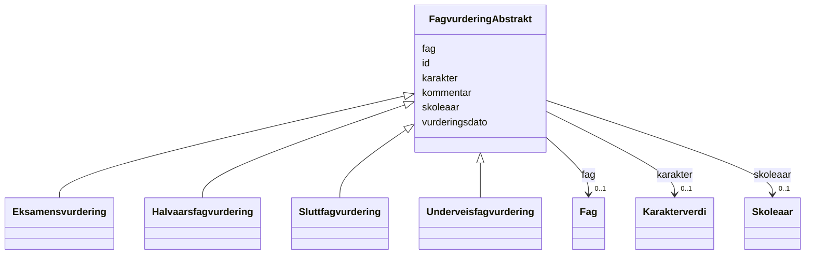

# Class: FagvurderingAbstrakt 


_Abstrakt basisklasse for fagvurderingar._


* __NOTE__: this is an abstract class and should not be instantiated directly


URI: [utd:FagvurderingAbstrakt](https://schema.fintlabs.no/utdanning/FagvurderingAbstrakt)





## Inheritance
* **FagvurderingAbstrakt**
    * [Eksamensvurdering](eksamensvurdering.md)
    * [Halvaarsfagvurdering](halvaarsfagvurdering.md)
    * [Sluttfagvurdering](sluttfagvurdering.md)
    * [Underveisfagvurdering](underveisfagvurdering.md)


## Class Properties

| Property | Value |
| --- | --- |
| Class URI | [utd:FagvurderingAbstrakt](https://schema.fintlabs.no/utdanning/FagvurderingAbstrakt) |


## Eigenskapar


  
  

  
  
    
  

  
  
    
  

  
  

  
  

  
  


### Obligatorisk

| Namn | Kardinalitet og domene | Beskriving |
| --- | --- | --- |
| [kommentar](kommentar.md) | 1 <br/> [String](string.md) | Kommentar |
| [vurderingsdato](vurderingsdato.md) | 1 <br/> [Datetime](datetime.md) | Dato og tidspunkt for vurderinga |


  
  

  
  

  
  

  
  

  
  

  
  


  
  

  
  

  
  

  
  
    
  

  
  
    
  

  
  
    
  


### Valgfri

| Namn | Kardinalitet og domene | Beskriving |
| --- | --- | --- |
| [fag](fag.md) | 0..1 <br/> [Fag](fag.md) | Fag |
| [skoleaar](skoleaar.md) | 0..1 <br/> [Skoleaar](skoleaar.md) | Skoleåret |
| [karakter](karakter.md) | 0..1 <br/> [Karakterverdi](karakterverdi.md) | Karakterverdi |


  
  
  
  
    
  

  
  
  
    
      
    
      
    
      
    
  
  

  
  
  
    
      
    
      
    
      
    
  
  

  
  
  
    
      
    
      
    
      
    
  
  

  
  
  
    
      
    
      
    
      
    
  
  

  
  
  
    
      
    
      
    
      
    
  
  


### Andre

| Namn | Kardinalitet og domene | Beskriving |
| --- | --- | --- |
| [id](id.md) | 1 <br/> [Uriorcurie](uriorcurie.md) | URI-identifikator for ressursen |


## Identifier and Mapping Information


### Schema Source


* from schema: https://data.norge.no/linkml/fint-utdanning


## Mappings

| Mapping Type | Mapped Value |
| ---  | ---  |
| self | utd:FagvurderingAbstrakt |
| native | https://schema.fintlabs.no/utdanning/:FagvurderingAbstrakt |


## LinkML Source

<!-- TODO: investigate https://stackoverflow.com/questions/37606292/how-to-create-tabbed-code-blocks-in-mkdocs-or-sphinx -->

### Direct

<details>
```yaml
name: FagvurderingAbstrakt
description: Abstrakt basisklasse for fagvurderingar.
from_schema: https://data.norge.no/linkml/fint-utdanning
abstract: true
slots:
- id
- kommentar
- vurderingsdato
- fag
- skoleaar
- karakter
slot_usage:
  kommentar:
    name: kommentar
    in_subset:
    - Obligatorisk
    required: true
  vurderingsdato:
    name: vurderingsdato
    in_subset:
    - Obligatorisk
    required: true
  fag:
    name: fag
    in_subset:
    - Valgfri
  skoleaar:
    name: skoleaar
    in_subset:
    - Valgfri
  karakter:
    name: karakter
    in_subset:
    - Valgfri
class_uri: utd:FagvurderingAbstrakt

```
</details>

### Induced

<details>
```yaml
name: FagvurderingAbstrakt
description: Abstrakt basisklasse for fagvurderingar.
from_schema: https://data.norge.no/linkml/fint-utdanning
abstract: true
slot_usage:
  kommentar:
    name: kommentar
    in_subset:
    - Obligatorisk
    required: true
  vurderingsdato:
    name: vurderingsdato
    in_subset:
    - Obligatorisk
    required: true
  fag:
    name: fag
    in_subset:
    - Valgfri
  skoleaar:
    name: skoleaar
    in_subset:
    - Valgfri
  karakter:
    name: karakter
    in_subset:
    - Valgfri
attributes:
  id:
    name: id
    description: URI-identifikator for ressursen.
    from_schema: https://data.norge.no/linkml/fint-utdanning
    rank: 1000
    identifier: true
    alias: id
    owner: FagvurderingAbstrakt
    domain_of:
    - Gruppe
    - Gruppemedlemskap
    - Utdanningsforhold
    - Elev
    - Elevforhold
    - Elevtilrettelegging
    - Skole
    - Skoleressurs
    - Varsel
    - Eksamen
    - Rom
    - Time
    - FagvurderingAbstrakt
    - OrdensvurderingAbstrakt
    - Anmerkninger
    - Elevfravar
    - Elevvurdering
    - Fravarsoversikt
    - Fraversregistrering
    - Karakterhistorie
    - Sensor
    - AvlagtProve
    - Laerling
    - OtUngdom
    - Avbruddsaarsak
    - Betalingsstatus
    - Bevistype
    - Brevtype
    - Eksamensform
    - Elevkategori
    - Fagmerknad
    - Fagstatus
    - Fravartype
    - Fullfortkode
    - Karakterskala
    - Karakterstatus
    - Karakterverdi
    - OtEnhet
    - OtStatus
    - Provestatus
    - Skoleaar
    - Skoleeiertype
    - Termin
    - Tilrettelegging
    - Varseltype
    - Vitnemalsmerknad
    - Begrep
    - Valuta
    - Person
    - Kontaktperson
    - Virksomhet
    range: uriorcurie
    required: true
  kommentar:
    name: kommentar
    description: Kommentar.
    in_subset:
    - Obligatorisk
    from_schema: https://data.norge.no/linkml/fint-utdanning
    rank: 1000
    slot_uri: utd:kommentar
    alias: kommentar
    owner: FagvurderingAbstrakt
    domain_of:
    - FagvurderingAbstrakt
    - OrdensvurderingAbstrakt
    - Fraversregistrering
    range: string
    required: true
  vurderingsdato:
    name: vurderingsdato
    description: Dato og tidspunkt for vurderinga.
    in_subset:
    - Obligatorisk
    from_schema: https://data.norge.no/linkml/fint-utdanning
    rank: 1000
    slot_uri: utd:vurderingsdato
    alias: vurderingsdato
    owner: FagvurderingAbstrakt
    domain_of:
    - FagvurderingAbstrakt
    - OrdensvurderingAbstrakt
    range: datetime
    required: true
  fag:
    name: fag
    description: Fag.
    in_subset:
    - Valgfri
    from_schema: https://data.norge.no/linkml/fint-utdanning
    rank: 1000
    slot_uri: utd:fag
    alias: fag
    owner: FagvurderingAbstrakt
    domain_of:
    - UtdanningContainer
    - Skole
    - Faggruppe
    - Undervisningsgruppe
    - FagvurderingAbstrakt
    - Eksamensgruppe
    - Fravarsoversikt
    range: Fag
  skoleaar:
    name: skoleaar
    description: Skoleåret.
    in_subset:
    - Valgfri
    from_schema: https://data.norge.no/linkml/fint-utdanning
    rank: 1000
    slot_uri: utd:skoleaar
    alias: skoleaar
    owner: FagvurderingAbstrakt
    domain_of:
    - UtdanningContainer
    - Elevforhold
    - Klasse
    - Kontaktlaerergruppe
    - Persongruppe
    - Faggruppe
    - Undervisningsgruppe
    - FagvurderingAbstrakt
    - OrdensvurderingAbstrakt
    - Anmerkninger
    - Eksamensgruppe
    range: Skoleaar
  karakter:
    name: karakter
    description: Karakterverdi.
    in_subset:
    - Valgfri
    from_schema: https://data.norge.no/linkml/fint-utdanning
    rank: 1000
    slot_uri: utd:karakter
    alias: karakter
    owner: FagvurderingAbstrakt
    domain_of:
    - FagvurderingAbstrakt
    range: Karakterverdi
class_uri: utd:FagvurderingAbstrakt

```
</details>