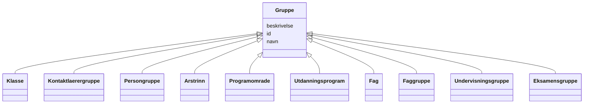

# Class: Gruppe 


_Abstrakt basisklasse for alle gruppetypar i utdanning._


* __NOTE__: this is an abstract class and should not be instantiated directly


URI: [utd:Gruppe](https://schema.fintlabs.no/utdanning/Gruppe)





## Inheritance
* **Gruppe**
    * [Klasse](klasse.md)
    * [Kontaktlaerergruppe](kontaktlaerergruppe.md)
    * [Persongruppe](persongruppe.md)
    * [Arstrinn](arstrinn.md)
    * [Programomrade](programomrade.md)
    * [Utdanningsprogram](utdanningsprogram.md)
    * [Fag](fag.md)
    * [Faggruppe](faggruppe.md)
    * [Undervisningsgruppe](undervisningsgruppe.md)
    * [Eksamensgruppe](eksamensgruppe.md)


## Class Properties

| Property | Value |
| --- | --- |
| Class URI | [utd:Gruppe](https://schema.fintlabs.no/utdanning/Gruppe) |


## Eigenskapar


  
  

  
  
    
  

  
  


### Obligatorisk

| Namn | Kardinalitet og domene | Beskriving |
| --- | --- | --- |
| [navn](navn.md) | 1 <br/> [String](string.md) | Namn |


  
  

  
  

  
  


  
  

  
  

  
  
    
  


### Valgfri

| Namn | Kardinalitet og domene | Beskriving |
| --- | --- | --- |
| [beskrivelse](beskrivelse.md) | 0..1 <br/> [String](string.md) | Skildring |


  
  
  
  
    
  

  
  
  
    
      
    
      
    
      
    
  
  

  
  
  
    
      
    
      
    
      
    
  
  


### Andre

| Namn | Kardinalitet og domene | Beskriving |
| --- | --- | --- |
| [id](id.md) | 1 <br/> [Uriorcurie](uriorcurie.md) | URI-identifikator for ressursen |


## Identifier and Mapping Information


### Schema Source


* from schema: https://data.norge.no/linkml/fint-utdanning


## Mappings

| Mapping Type | Mapped Value |
| ---  | ---  |
| self | utd:Gruppe |
| native | https://schema.fintlabs.no/utdanning/:Gruppe |


## LinkML Source

<!-- TODO: investigate https://stackoverflow.com/questions/37606292/how-to-create-tabbed-code-blocks-in-mkdocs-or-sphinx -->

### Direct

<details>
```yaml
name: Gruppe
description: Abstrakt basisklasse for alle gruppetypar i utdanning.
from_schema: https://data.norge.no/linkml/fint-utdanning
abstract: true
slots:
- id
- navn
- beskrivelse
slot_usage:
  navn:
    name: navn
    in_subset:
    - Obligatorisk
    required: true
  beskrivelse:
    name: beskrivelse
    in_subset:
    - Valgfri
class_uri: utd:Gruppe

```
</details>

### Induced

<details>
```yaml
name: Gruppe
description: Abstrakt basisklasse for alle gruppetypar i utdanning.
from_schema: https://data.norge.no/linkml/fint-utdanning
abstract: true
slot_usage:
  navn:
    name: navn
    in_subset:
    - Obligatorisk
    required: true
  beskrivelse:
    name: beskrivelse
    in_subset:
    - Valgfri
attributes:
  id:
    name: id
    description: URI-identifikator for ressursen.
    from_schema: https://data.norge.no/linkml/fint-utdanning
    rank: 1000
    identifier: true
    alias: id
    owner: Gruppe
    domain_of:
    - Gruppe
    - Gruppemedlemskap
    - Utdanningsforhold
    - Elev
    - Elevforhold
    - Elevtilrettelegging
    - Skole
    - Skoleressurs
    - Varsel
    - Eksamen
    - Rom
    - Time
    - FagvurderingAbstrakt
    - OrdensvurderingAbstrakt
    - Anmerkninger
    - Elevfravar
    - Elevvurdering
    - Fravarsoversikt
    - Fraversregistrering
    - Karakterhistorie
    - Sensor
    - AvlagtProve
    - Laerling
    - OtUngdom
    - Avbruddsaarsak
    - Betalingsstatus
    - Bevistype
    - Brevtype
    - Eksamensform
    - Elevkategori
    - Fagmerknad
    - Fagstatus
    - Fravartype
    - Fullfortkode
    - Karakterskala
    - Karakterstatus
    - Karakterverdi
    - OtEnhet
    - OtStatus
    - Provestatus
    - Skoleaar
    - Skoleeiertype
    - Termin
    - Tilrettelegging
    - Varseltype
    - Vitnemalsmerknad
    - Begrep
    - Valuta
    - Person
    - Kontaktperson
    - Virksomhet
    range: uriorcurie
    required: true
  navn:
    name: navn
    description: Namn.
    in_subset:
    - Obligatorisk
    from_schema: https://data.norge.no/linkml/fint-utdanning
    rank: 1000
    slot_uri: utd:navn
    alias: navn
    owner: Gruppe
    domain_of:
    - Gruppe
    - Skole
    - Eksamen
    - Rom
    - Time
    - Avbruddsaarsak
    - Betalingsstatus
    - Bevistype
    - Brevtype
    - Eksamensform
    - Elevkategori
    - Fagmerknad
    - Fagstatus
    - Fravartype
    - Fullfortkode
    - Karakterskala
    - Karakterstatus
    - Karakterverdi
    - OtEnhet
    - OtStatus
    - Provestatus
    - Skoleaar
    - Skoleeiertype
    - Termin
    - Tilrettelegging
    - Varseltype
    - Vitnemalsmerknad
    range: string
    required: true
  beskrivelse:
    name: beskrivelse
    description: Skildring.
    in_subset:
    - Valgfri
    from_schema: https://data.norge.no/linkml/fint-utdanning
    rank: 1000
    slot_uri: utd:beskrivelse
    alias: beskrivelse
    owner: Gruppe
    domain_of:
    - Gruppe
    - Utdanningsforhold
    - Elevforhold
    - Eksamen
    - Time
    - OtStatus
    - Periode
    range: string
class_uri: utd:Gruppe

```
</details>