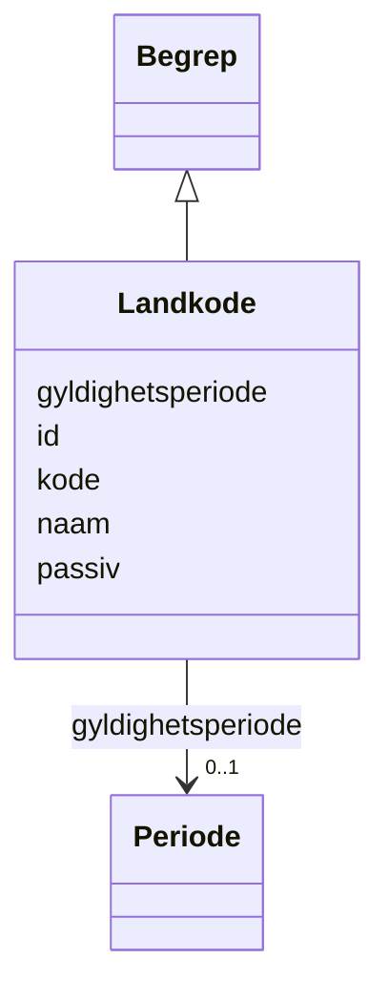

# Class: Landkode 


_Landskode i ISO 3166-1 alpha-2 format._


URI: [fint:Landkode](https://schema.fintlabs.no/Landkode)





## Inheritance
* [Begrep](begrep.md)
    * **Landkode**


## Class Properties

| Property | Value |
| --- | --- |
| Class URI | [fint:Landkode](https://schema.fintlabs.no/Landkode) |


## Eigenskapar


### Arva

| Namn | Kardinalitet og domene | Beskriving | Frå |
| --- | --- | --- | --- || [id](id.md) | 1 <br/> [Uriorcurie](uriorcurie.md) | URI-identifikator for ressursen | [Begrep](begrep.md) |
| [kode](kode.md) | 1 <br/> [String](string.md) | Kode | [Begrep](begrep.md) |
| [naam](naam.md) | 1 <br/> [String](string.md) | Hovudnamn for ressursen | [Begrep](begrep.md) |
| [gyldighetsperiode](gyldighetsperiode.md) | 0..1 <br/> [Periode](periode.md) | Gyldigheitsperiode | [Begrep](begrep.md) |
| [passiv](passiv.md) | 0..1 <br/> [Boolean](boolean.md) | Angir om oppføringen er passiv/inaktiv | [Begrep](begrep.md) |


## Usages

| used by | used in | type | used |
| ---  | --- | --- | --- |
| [Adresse](adresse.md) | [land](land.md) | range | [Landkode](landkode.md) |
| [Person](person.md) | [statsborgerskap](statsborgerskap.md) | range | [Landkode](landkode.md) |


## Identifier and Mapping Information


### Schema Source


* from schema: https://data.norge.no/linkml/fint-utdanning


## Mappings

| Mapping Type | Mapped Value |
| ---  | ---  |
| self | fint:Landkode |
| native | https://schema.fintlabs.no/utdanning/:Landkode |


## LinkML Source

<!-- TODO: investigate https://stackoverflow.com/questions/37606292/how-to-create-tabbed-code-blocks-in-mkdocs-or-sphinx -->

### Direct

<details>
```yaml
name: Landkode
description: Landskode i ISO 3166-1 alpha-2 format.
from_schema: https://data.norge.no/linkml/fint-utdanning
is_a: Begrep
class_uri: fint:Landkode

```
</details>

### Induced

<details>
```yaml
name: Landkode
description: Landskode i ISO 3166-1 alpha-2 format.
from_schema: https://data.norge.no/linkml/fint-utdanning
is_a: Begrep
attributes:
  id:
    name: id
    description: URI-identifikator for ressursen.
    from_schema: https://data.norge.no/linkml/fint-utdanning
    rank: 1000
    identifier: true
    alias: id
    owner: Landkode
    domain_of:
    - Gruppe
    - Gruppemedlemskap
    - Utdanningsforhold
    - Elev
    - Elevforhold
    - Elevtilrettelegging
    - Skole
    - Skoleressurs
    - Varsel
    - Eksamen
    - Rom
    - Time
    - FagvurderingAbstrakt
    - OrdensvurderingAbstrakt
    - Anmerkninger
    - Elevfravar
    - Elevvurdering
    - Fravarsoversikt
    - Fraversregistrering
    - Karakterhistorie
    - Sensor
    - AvlagtProve
    - Laerling
    - OtUngdom
    - Avbruddsaarsak
    - Betalingsstatus
    - Bevistype
    - Brevtype
    - Eksamensform
    - Elevkategori
    - Fagmerknad
    - Fagstatus
    - Fravartype
    - Fullfortkode
    - Karakterskala
    - Karakterstatus
    - Karakterverdi
    - OtEnhet
    - OtStatus
    - Provestatus
    - Skoleaar
    - Skoleeiertype
    - Termin
    - Tilrettelegging
    - Varseltype
    - Vitnemalsmerknad
    - Begrep
    - Valuta
    - Person
    - Kontaktperson
    - Virksomhet
    range: uriorcurie
    required: true
  kode:
    name: kode
    description: Kode.
    in_subset:
    - Obligatorisk
    from_schema: https://data.norge.no/linkml/fint-utdanning
    rank: 1000
    slot_uri: utd:kode
    alias: kode
    owner: Landkode
    domain_of:
    - Avbruddsaarsak
    - Betalingsstatus
    - Bevistype
    - Brevtype
    - Eksamensform
    - Elevkategori
    - Fagmerknad
    - Fagstatus
    - Fravartype
    - Fullfortkode
    - Karakterskala
    - Karakterstatus
    - Karakterverdi
    - OtEnhet
    - OtStatus
    - Provestatus
    - Skoleaar
    - Skoleeiertype
    - Termin
    - Tilrettelegging
    - Varseltype
    - Vitnemalsmerknad
    - Begrep
    range: string
    required: true
  naam:
    name: naam
    description: Hovudnamn for ressursen.
    in_subset:
    - Obligatorisk
    from_schema: https://data.norge.no/linkml/fint-utdanning
    rank: 1000
    slot_uri: fint:naam
    alias: naam
    owner: Landkode
    domain_of:
    - Begrep
    range: string
    required: true
  gyldighetsperiode:
    name: gyldighetsperiode
    description: Gyldigheitsperiode.
    in_subset:
    - Valgfri
    from_schema: https://data.norge.no/linkml/fint-utdanning
    rank: 1000
    slot_uri: utd:gyldighetsperiode
    alias: gyldighetsperiode
    owner: Landkode
    domain_of:
    - Gruppemedlemskap
    - Avbruddsaarsak
    - Betalingsstatus
    - Bevistype
    - Brevtype
    - Eksamensform
    - Elevkategori
    - Fagmerknad
    - Fagstatus
    - Fravartype
    - Fullfortkode
    - Karakterskala
    - Karakterstatus
    - Karakterverdi
    - OtEnhet
    - OtStatus
    - Provestatus
    - Skoleaar
    - Skoleeiertype
    - Termin
    - Tilrettelegging
    - Varseltype
    - Vitnemalsmerknad
    - Begrep
    - Identifikator
    range: Periode
    inlined: true
  passiv:
    name: passiv
    description: Angir om oppføringen er passiv/inaktiv.
    in_subset:
    - Valgfri
    from_schema: https://data.norge.no/linkml/fint-utdanning
    rank: 1000
    slot_uri: utd:passiv
    alias: passiv
    owner: Landkode
    domain_of:
    - Avbruddsaarsak
    - Betalingsstatus
    - Bevistype
    - Brevtype
    - Eksamensform
    - Elevkategori
    - Fagmerknad
    - Fagstatus
    - Fravartype
    - Fullfortkode
    - Karakterskala
    - Karakterstatus
    - Karakterverdi
    - OtEnhet
    - OtStatus
    - Provestatus
    - Skoleaar
    - Skoleeiertype
    - Termin
    - Tilrettelegging
    - Varseltype
    - Vitnemalsmerknad
    - Begrep
    range: boolean
class_uri: fint:Landkode

```
</details>