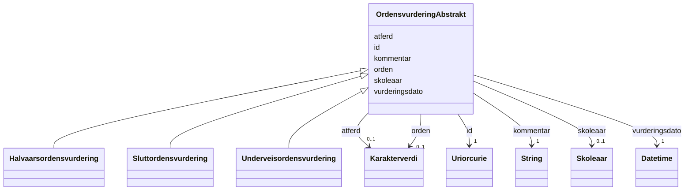

# Class: OrdensvurderingAbstrakt 


_Abstrakt basisklasse for ordensvurderingar._


* __NOTE__: this is an abstract class and should not be instantiated directly


URI: [utd:OrdensvurderingAbstrakt](https://schema.fintlabs.no/utdanning/OrdensvurderingAbstrakt)





## Inheritance
* **OrdensvurderingAbstrakt**
    * [Halvaarsordensvurdering](halvaarsordensvurdering.md)
    * [Sluttordensvurdering](sluttordensvurdering.md)
    * [Underveisordensvurdering](underveisordensvurdering.md)


## Class Properties

| Property | Value |
| --- | --- |
| Class URI | [utd:OrdensvurderingAbstrakt](https://schema.fintlabs.no/utdanning/OrdensvurderingAbstrakt) |


## Eigenskapar


  
  

  
  
    
  

  
  
    
  

  
  

  
  

  
  


### Obligatorisk

| Namn | Kardinalitet og domene | Beskriving |
| --- | --- | --- |
| [kommentar](kommentar.md) | 1 <br/> [xsd:string](http://www.w3.org/2001/XMLSchema#string) | Kommentar |
| [vurderingsdato](vurderingsdato.md) | 1 <br/> [xsd:dateTime](http://www.w3.org/2001/XMLSchema#dateTime) | Dato og tidspunkt for vurderinga |


  
  

  
  

  
  

  
  

  
  

  
  


  
  

  
  

  
  

  
  
    
  

  
  
    
  

  
  
    
  


### Valgfri

| Namn | Kardinalitet og domene | Beskriving |
| --- | --- | --- |
| [atferd](atferd.md) | 0..1 <br/> [Karakterverdi](karakterverdi.md) | Åtferdskarakter |
| [orden](orden.md) | 0..1 <br/> [Karakterverdi](karakterverdi.md) | Ordenskarakter |
| [skoleaar](skoleaar.md) | 0..1 <br/> [Skoleaar](skoleaar.md) | Skoleåret |


  
  
  
  
    
  

  
  
  
    
      
    
      
    
      
    
  
  

  
  
  
    
      
    
      
    
      
    
  
  

  
  
  
    
      
    
      
    
      
    
  
  

  
  
  
    
      
    
      
    
      
    
  
  

  
  
  
    
      
    
      
    
      
    
  
  


### Andre

| Namn | Kardinalitet og domene | Beskriving |
| --- | --- | --- |
| [id](id.md) | 1 <br/> [xsd:anyURI](http://www.w3.org/2001/XMLSchema#anyURI) | URI-identifikator for ressursen |


## Identifier and Mapping Information


### Schema Source


* from schema: https://data.norge.no/linkml/fint-utdanning


## Mappings

| Mapping Type | Mapped Value |
| ---  | ---  |
| self | utd:OrdensvurderingAbstrakt |
| native | https://schema.fintlabs.no/utdanning/:OrdensvurderingAbstrakt |


## LinkML Source

<!-- TODO: investigate https://stackoverflow.com/questions/37606292/how-to-create-tabbed-code-blocks-in-mkdocs-or-sphinx -->

### Direct

<details>
```yaml
name: OrdensvurderingAbstrakt
description: Abstrakt basisklasse for ordensvurderingar.
from_schema: https://data.norge.no/linkml/fint-utdanning
rank: 1000
abstract: true
slots:
- id
- kommentar
- vurderingsdato
- atferd
- orden
- skoleaar
slot_usage:
  kommentar:
    name: kommentar
    in_subset:
    - Obligatorisk
    required: true
  vurderingsdato:
    name: vurderingsdato
    in_subset:
    - Obligatorisk
    required: true
  atferd:
    name: atferd
    in_subset:
    - Valgfri
  orden:
    name: orden
    in_subset:
    - Valgfri
  skoleaar:
    name: skoleaar
    in_subset:
    - Valgfri
class_uri: utd:OrdensvurderingAbstrakt

```
</details>

### Induced

<details>
```yaml
name: OrdensvurderingAbstrakt
description: Abstrakt basisklasse for ordensvurderingar.
from_schema: https://data.norge.no/linkml/fint-utdanning
rank: 1000
abstract: true
slot_usage:
  kommentar:
    name: kommentar
    in_subset:
    - Obligatorisk
    required: true
  vurderingsdato:
    name: vurderingsdato
    in_subset:
    - Obligatorisk
    required: true
  atferd:
    name: atferd
    in_subset:
    - Valgfri
  orden:
    name: orden
    in_subset:
    - Valgfri
  skoleaar:
    name: skoleaar
    in_subset:
    - Valgfri
attributes:
  id:
    name: id
    description: URI-identifikator for ressursen.
    from_schema: https://data.norge.no/linkml/fint-common
    identifier: true
    alias: id
    owner: OrdensvurderingAbstrakt
    domain_of:
    - Begrep
    - Elev
    - Valuta
    - Person
    - Kontaktperson
    - Virksomhet
    - Gruppe
    - Gruppemedlemskap
    - Utdanningsforhold
    - Elevforhold
    - Elevtilrettelegging
    - Skole
    - Skoleressurs
    - Varsel
    - Eksamen
    - Rom
    - Time
    - FagvurderingAbstrakt
    - OrdensvurderingAbstrakt
    - Anmerkninger
    - Elevfravar
    - Elevvurdering
    - Fravarsoversikt
    - Fraversregistrering
    - Karakterhistorie
    - Sensor
    - AvlagtProve
    - Laerling
    - OtUngdom
    - Avbruddsaarsak
    - Betalingsstatus
    - Bevistype
    - Brevtype
    - Eksamensform
    - Elevkategori
    - Fagmerknad
    - Fagstatus
    - Fravartype
    - Fullfortkode
    - Karakterskala
    - Karakterstatus
    - Karakterverdi
    - OtEnhet
    - OtStatus
    - Provestatus
    - Skoleaar
    - Skoleeiertype
    - Termin
    - Tilrettelegging
    - Varseltype
    - Vitnemalsmerknad
    range: uriorcurie
    required: true
  kommentar:
    name: kommentar
    description: Kommentar.
    in_subset:
    - Obligatorisk
    from_schema: https://data.norge.no/linkml/fint-utdanning
    rank: 1000
    slot_uri: utd:kommentar
    alias: kommentar
    owner: OrdensvurderingAbstrakt
    domain_of:
    - FagvurderingAbstrakt
    - OrdensvurderingAbstrakt
    - Fraversregistrering
    range: string
    required: true
  vurderingsdato:
    name: vurderingsdato
    description: Dato og tidspunkt for vurderinga.
    in_subset:
    - Obligatorisk
    from_schema: https://data.norge.no/linkml/fint-utdanning
    rank: 1000
    slot_uri: utd:vurderingsdato
    alias: vurderingsdato
    owner: OrdensvurderingAbstrakt
    domain_of:
    - FagvurderingAbstrakt
    - OrdensvurderingAbstrakt
    range: datetime
    required: true
  atferd:
    name: atferd
    description: Åtferdskarakter.
    in_subset:
    - Valgfri
    from_schema: https://data.norge.no/linkml/fint-utdanning
    rank: 1000
    slot_uri: utd:atferd
    alias: atferd
    owner: OrdensvurderingAbstrakt
    domain_of:
    - OrdensvurderingAbstrakt
    - Anmerkninger
    range: Karakterverdi
  orden:
    name: orden
    description: Ordenskarakter.
    in_subset:
    - Valgfri
    from_schema: https://data.norge.no/linkml/fint-utdanning
    rank: 1000
    slot_uri: utd:orden
    alias: orden
    owner: OrdensvurderingAbstrakt
    domain_of:
    - OrdensvurderingAbstrakt
    - Anmerkninger
    range: Karakterverdi
  skoleaar:
    name: skoleaar
    description: Skoleåret.
    in_subset:
    - Valgfri
    from_schema: https://data.norge.no/linkml/fint-utdanning
    rank: 1000
    slot_uri: utd:skoleaar
    alias: skoleaar
    owner: OrdensvurderingAbstrakt
    domain_of:
    - UtdanningContainer
    - Elevforhold
    - Klasse
    - Kontaktlaerergruppe
    - Persongruppe
    - Faggruppe
    - Undervisningsgruppe
    - FagvurderingAbstrakt
    - OrdensvurderingAbstrakt
    - Anmerkninger
    - Eksamensgruppe
    range: Skoleaar
class_uri: utd:OrdensvurderingAbstrakt

```
</details>