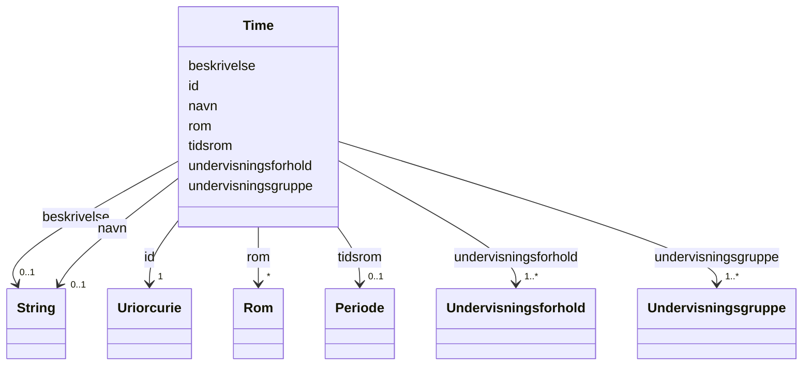

# Class: Time 


_Ein time i timeplanen._


URI: [utd:Time](https://schema.fintlabs.no/utdanning/Time)





<!-- no inheritance hierarchy -->

## Class Properties

| Property | Value |
| --- | --- |
| Class URI | [utd:Time](https://schema.fintlabs.no/utdanning/Time) |


## Eigenskapar


  
  

  
  

  
  

  
  

  
  
    
  

  
  

  
  
    
  


### Obligatorisk

| Namn | Kardinalitet og domene | Beskriving |
| --- | --- | --- |
| [undervisningsforhold](undervisningsforhold.md) | 1..* <br/> [Undervisningsforhold](undervisningsforhold.md) | Undervisningsforhold |
| [undervisningsgruppe](undervisningsgruppe.md) | 1..* <br/> [Undervisningsgruppe](undervisningsgruppe.md) | Undervisningsgruppe |


  
  

  
  

  
  

  
  

  
  

  
  

  
  


  
  

  
  
    
  

  
  
    
  

  
  
    
  

  
  

  
  
    
  

  
  


### Valgfri

| Namn | Kardinalitet og domene | Beskriving |
| --- | --- | --- |
| [navn](navn.md) | 0..1 <br/> [xsd:string](http://www.w3.org/2001/XMLSchema#string) | Hovudnamn for ressursen |
| [beskrivelse](beskrivelse.md) | 0..1 <br/> [xsd:string](http://www.w3.org/2001/XMLSchema#string) | Beskriven namn eller omtale |
| [tidsrom](tidsrom.md) | 0..1 <br/> [Periode](periode.md) | Tidsrom |
| [rom](rom.md) | * <br/> [Rom](rom.md) | Rom |


  
  
  
  
    
  

  
  
  
    
      
    
      
    
      
    
  
  

  
  
  
    
      
    
      
    
      
    
  
  

  
  
  
    
      
    
      
    
      
    
  
  

  
  
  
    
      
    
      
    
      
    
  
  

  
  
  
    
      
    
      
    
      
    
  
  

  
  
  
    
      
    
      
    
      
    
  
  


### Andre

| Namn | Kardinalitet og domene | Beskriving |
| --- | --- | --- |
| [id](id.md) | 1 <br/> [xsd:anyURI](http://www.w3.org/2001/XMLSchema#anyURI) | URI-identifikator for ressursen |


## Usages

| used by | used in | type | used |
| ---  | --- | --- | --- |
| [UtdanningContainer](utdanningcontainer.md) | [timar](timar.md) | range | [Time](time.md) |
| [Rom](rom.md) | [skuletime](skuletime.md) | range | [Time](time.md) |
| [Undervisningsforhold](undervisningsforhold.md) | [skuletime](skuletime.md) | range | [Time](time.md) |
| [Undervisningsgruppe](undervisningsgruppe.md) | [skuletime](skuletime.md) | range | [Time](time.md) |


## Identifier and Mapping Information


### Schema Source


* from schema: https://data.norge.no/linkml/fint-utdanning


## Mappings

| Mapping Type | Mapped Value |
| ---  | ---  |
| self | utd:Time |
| native | https://schema.fintlabs.no/utdanning/:Time |


## LinkML Source

<!-- TODO: investigate https://stackoverflow.com/questions/37606292/how-to-create-tabbed-code-blocks-in-mkdocs-or-sphinx -->

### Direct

<details>
```yaml
name: Time
description: Ein time i timeplanen.
from_schema: https://data.norge.no/linkml/fint-utdanning
rank: 1000
slots:
- id
- navn
- beskrivelse
- tidsrom
- undervisningsforhold
- rom
- undervisningsgruppe
slot_usage:
  navn:
    name: navn
    in_subset:
    - Valgfri
  beskrivelse:
    name: beskrivelse
    in_subset:
    - Valgfri
  tidsrom:
    name: tidsrom
    in_subset:
    - Valgfri
  undervisningsforhold:
    name: undervisningsforhold
    in_subset:
    - Obligatorisk
    required: true
  rom:
    name: rom
    in_subset:
    - Valgfri
    multivalued: true
  undervisningsgruppe:
    name: undervisningsgruppe
    in_subset:
    - Obligatorisk
    required: true
    multivalued: true
class_uri: utd:Time

```
</details>

### Induced

<details>
```yaml
name: Time
description: Ein time i timeplanen.
from_schema: https://data.norge.no/linkml/fint-utdanning
rank: 1000
slot_usage:
  navn:
    name: navn
    in_subset:
    - Valgfri
  beskrivelse:
    name: beskrivelse
    in_subset:
    - Valgfri
  tidsrom:
    name: tidsrom
    in_subset:
    - Valgfri
  undervisningsforhold:
    name: undervisningsforhold
    in_subset:
    - Obligatorisk
    required: true
  rom:
    name: rom
    in_subset:
    - Valgfri
    multivalued: true
  undervisningsgruppe:
    name: undervisningsgruppe
    in_subset:
    - Obligatorisk
    required: true
    multivalued: true
attributes:
  id:
    name: id
    description: URI-identifikator for ressursen.
    from_schema: https://data.norge.no/linkml/fint-common
    identifier: true
    alias: id
    owner: Time
    domain_of:
    - Begrep
    - Elev
    - Valuta
    - Person
    - Kontaktperson
    - Virksomhet
    - Gruppe
    - Gruppemedlemskap
    - Utdanningsforhold
    - Elevforhold
    - Elevtilrettelegging
    - Skole
    - Skoleressurs
    - Varsel
    - Eksamen
    - Rom
    - Time
    - FagvurderingAbstrakt
    - OrdensvurderingAbstrakt
    - Anmerkninger
    - Elevfravar
    - Elevvurdering
    - Fravarsoversikt
    - Fraversregistrering
    - Karakterhistorie
    - Sensor
    - AvlagtProve
    - Laerling
    - OtUngdom
    - Avbruddsaarsak
    - Betalingsstatus
    - Bevistype
    - Brevtype
    - Eksamensform
    - Elevkategori
    - Fagmerknad
    - Fagstatus
    - Fravartype
    - Fullfortkode
    - Karakterskala
    - Karakterstatus
    - Karakterverdi
    - OtEnhet
    - OtStatus
    - Provestatus
    - Skoleaar
    - Skoleeiertype
    - Termin
    - Tilrettelegging
    - Varseltype
    - Vitnemalsmerknad
    range: uriorcurie
    required: true
  navn:
    name: navn
    description: Hovudnamn for ressursen.
    in_subset:
    - Valgfri
    from_schema: https://data.norge.no/linkml/fint-common
    slot_uri: fint:navn
    alias: navn
    owner: Time
    domain_of:
    - Begrep
    - Gruppe
    - Skole
    - Eksamen
    - Rom
    - Time
    - Avbruddsaarsak
    - Betalingsstatus
    - Bevistype
    - Brevtype
    - Eksamensform
    - Elevkategori
    - Fagmerknad
    - Fagstatus
    - Fravartype
    - Fullfortkode
    - Karakterskala
    - Karakterstatus
    - Karakterverdi
    - OtEnhet
    - OtStatus
    - Provestatus
    - Skoleaar
    - Skoleeiertype
    - Termin
    - Tilrettelegging
    - Varseltype
    - Vitnemalsmerknad
    range: string
  beskrivelse:
    name: beskrivelse
    description: Beskriven namn eller omtale.
    in_subset:
    - Valgfri
    from_schema: https://data.norge.no/linkml/fint-common
    slot_uri: fint:beskrivelse
    alias: beskrivelse
    owner: Time
    domain_of:
    - Periode
    - Gruppe
    - Utdanningsforhold
    - Elevforhold
    - Eksamen
    - Time
    - OtStatus
    range: string
  tidsrom:
    name: tidsrom
    description: Tidsrom.
    in_subset:
    - Valgfri
    from_schema: https://data.norge.no/linkml/fint-utdanning
    rank: 1000
    slot_uri: utd:tidsrom
    alias: tidsrom
    owner: Time
    domain_of:
    - Eksamen
    - Time
    range: Periode
    inlined: true
  undervisningsforhold:
    name: undervisningsforhold
    description: Undervisningsforhold.
    in_subset:
    - Obligatorisk
    from_schema: https://data.norge.no/linkml/fint-utdanning
    rank: 1000
    slot_uri: utd:undervisningsforhold
    alias: undervisningsforhold
    owner: Time
    domain_of:
    - UtdanningContainer
    - Klasse
    - Kontaktlaerergruppe
    - Persongruppe
    - Time
    - Undervisningsgruppe
    - Eksamensgruppe
    range: Undervisningsforhold
    required: true
    multivalued: true
  rom:
    name: rom
    description: Rom.
    in_subset:
    - Valgfri
    from_schema: https://data.norge.no/linkml/fint-utdanning
    rank: 1000
    slot_uri: utd:rom
    alias: rom
    owner: Time
    domain_of:
    - UtdanningContainer
    - Eksamen
    - Time
    range: Rom
    multivalued: true
  undervisningsgruppe:
    name: undervisningsgruppe
    description: Undervisningsgruppe.
    in_subset:
    - Obligatorisk
    from_schema: https://data.norge.no/linkml/fint-utdanning
    rank: 1000
    slot_uri: utd:undervisningsgruppe
    alias: undervisningsgruppe
    owner: Time
    domain_of:
    - Fag
    - Time
    - Undervisningsgruppemedlemskap
    - Fraversregistrering
    range: Undervisningsgruppe
    required: true
    multivalued: true
class_uri: utd:Time

```
</details>