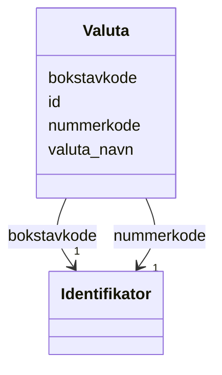

# Class: Valuta 


_Valutakodar for offisielle valutaer._


URI: [fint:Valuta](https://schema.fintlabs.no/Valuta)





<!-- no inheritance hierarchy -->

## Class Properties

| Property | Value |
| --- | --- |
| Class URI | [fint:Valuta](https://schema.fintlabs.no/Valuta) |


## Eigenskapar


  
  

  
  
    
  

  
  
    
  

  
  
    
  


### Obligatorisk

| Namn | Kardinalitet og domene | Beskriving |
| --- | --- | --- |
| [bokstavkode](bokstavkode.md) | 1 <br/> [Identifikator](identifikator.md) | Bokstavkode for aktuell valuta |
| [valuta_navn](valuta_navn.md) | 1 <br/> [String](string.md) | Namn på valuta |
| [nummerkode](nummerkode.md) | 1 <br/> [Identifikator](identifikator.md) | Nummerkode for aktuell valuta |


  
  

  
  

  
  

  
  


  
  

  
  

  
  

  
  


  
  
  
  
    
  

  
  
  
    
      
    
      
    
      
    
  
  

  
  
  
    
      
    
      
    
      
    
  
  

  
  
  
    
      
    
      
    
      
    
  
  


### Andre

| Namn | Kardinalitet og domene | Beskriving |
| --- | --- | --- |
| [id](id.md) | 1 <br/> [Uriorcurie](uriorcurie.md) | URI-identifikator for ressursen |


## Identifier and Mapping Information


### Schema Source


* from schema: https://data.norge.no/linkml/fint-utdanning


## Mappings

| Mapping Type | Mapped Value |
| ---  | ---  |
| self | fint:Valuta |
| native | https://schema.fintlabs.no/utdanning/:Valuta |


## LinkML Source

<!-- TODO: investigate https://stackoverflow.com/questions/37606292/how-to-create-tabbed-code-blocks-in-mkdocs-or-sphinx -->

### Direct

<details>
```yaml
name: Valuta
description: Valutakodar for offisielle valutaer.
from_schema: https://data.norge.no/linkml/fint-utdanning
slots:
- id
- bokstavkode
- valuta_navn
- nummerkode
slot_usage:
  bokstavkode:
    name: bokstavkode
    in_subset:
    - Obligatorisk
    required: true
  valuta_navn:
    name: valuta_navn
    in_subset:
    - Obligatorisk
    required: true
  nummerkode:
    name: nummerkode
    in_subset:
    - Obligatorisk
    required: true
class_uri: fint:Valuta

```
</details>

### Induced

<details>
```yaml
name: Valuta
description: Valutakodar for offisielle valutaer.
from_schema: https://data.norge.no/linkml/fint-utdanning
slot_usage:
  bokstavkode:
    name: bokstavkode
    in_subset:
    - Obligatorisk
    required: true
  valuta_navn:
    name: valuta_navn
    in_subset:
    - Obligatorisk
    required: true
  nummerkode:
    name: nummerkode
    in_subset:
    - Obligatorisk
    required: true
attributes:
  id:
    name: id
    description: URI-identifikator for ressursen.
    from_schema: https://data.norge.no/linkml/fint-utdanning
    rank: 1000
    identifier: true
    alias: id
    owner: Valuta
    domain_of:
    - Gruppe
    - Gruppemedlemskap
    - Utdanningsforhold
    - Elevforhold
    - Elevtilrettelegging
    - Skole
    - Skoleressurs
    - Varsel
    - Eksamen
    - Rom
    - Time
    - FagvurderingAbstrakt
    - OrdensvurderingAbstrakt
    - Anmerkninger
    - Elevfravar
    - Elevvurdering
    - Fravarsoversikt
    - Fraversregistrering
    - Karakterhistorie
    - Sensor
    - AvlagtProve
    - Laerling
    - OtUngdom
    - Avbruddsaarsak
    - Betalingsstatus
    - Bevistype
    - Brevtype
    - Eksamensform
    - Elevkategori
    - Fagmerknad
    - Fagstatus
    - Fravartype
    - Fullfortkode
    - Karakterskala
    - Karakterstatus
    - Karakterverdi
    - OtEnhet
    - OtStatus
    - Provestatus
    - Skoleaar
    - Skoleeiertype
    - Termin
    - Tilrettelegging
    - Varseltype
    - Vitnemalsmerknad
    - Begrep
    - Elev
    - Valuta
    - Person
    - Kontaktperson
    - Virksomhet
    range: uriorcurie
    required: true
  bokstavkode:
    name: bokstavkode
    description: Bokstavkode for aktuell valuta.
    in_subset:
    - Obligatorisk
    from_schema: https://data.norge.no/linkml/fint-utdanning
    rank: 1000
    slot_uri: fint:bokstavkode
    alias: bokstavkode
    owner: Valuta
    domain_of:
    - Valuta
    range: Identifikator
    required: true
    inlined: true
  valuta_navn:
    name: valuta_navn
    description: Namn på valuta.
    in_subset:
    - Obligatorisk
    from_schema: https://data.norge.no/linkml/fint-utdanning
    rank: 1000
    slot_uri: fint:valutaNavn
    alias: valuta_navn
    owner: Valuta
    domain_of:
    - Valuta
    range: string
    required: true
  nummerkode:
    name: nummerkode
    description: Nummerkode for aktuell valuta.
    in_subset:
    - Obligatorisk
    from_schema: https://data.norge.no/linkml/fint-utdanning
    rank: 1000
    slot_uri: fint:nummerkode
    alias: nummerkode
    owner: Valuta
    domain_of:
    - Valuta
    range: Identifikator
    required: true
    inlined: true
class_uri: fint:Valuta

```
</details>