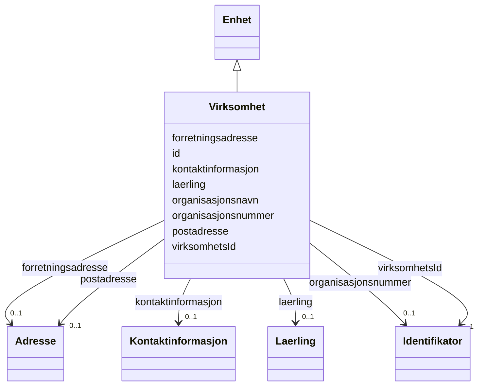

# Class: Virksomhet 


_Ein juridisk organisasjon som produserer varer eller tenester._


URI: [fint:Virksomhet](https://schema.fintlabs.no/Virksomhet)





## Inheritance
* [Aktoer](aktoer.md)
    * [Enhet](enhet.md)
        * **Virksomhet**


## Class Properties

| Property | Value |
| --- | --- |
| Class URI | [fint:Virksomhet](https://schema.fintlabs.no/Virksomhet) |


## Eigenskapar


  
  

  
  
    
  

  
  


### Obligatorisk

| Namn | Kardinalitet og domene | Beskriving |
| --- | --- | --- |
| [virksomhetsId](virksomhetsid.md) | 1 <br/> [Identifikator](identifikator.md) | Intern unik identifikator i økonomisystemet |


  
  

  
  

  
  


  
  

  
  

  
  
    
  


### Valgfri

| Namn | Kardinalitet og domene | Beskriving |
| --- | --- | --- |
| [laerling](laerling.md) | 0..1 <br/> [Laerling](laerling.md) | Lærling |


  
  
  
  
    
  

  
  
  
    
      
    
      
    
      
    
  
  

  
  
  
    
      
    
      
    
      
    
  
  


### Andre

| Namn | Kardinalitet og domene | Beskriving |
| --- | --- | --- |
| [id](id.md) | 1 <br/> [Uriorcurie](uriorcurie.md) | URI-identifikator for ressursen |


### Arva

| Namn | Kardinalitet og domene | Beskriving | Frå |
| --- | --- | --- | --- || [forretningsadresse](forretningsadresse.md) | 0..1 <br/> [Adresse](adresse.md) | Forretningsadresse | [Enhet](enhet.md) |
| [organisasjonsnavn](organisasjonsnavn.md) | 0..1 <br/> [String](string.md) | Organisasjonsnamn | [Enhet](enhet.md) |
| [organisasjonsnummer](organisasjonsnummer.md) | 0..1 <br/> [Identifikator](identifikator.md) | Organisasjonsnummer-identifikator | [Enhet](enhet.md) |
| [kontaktinformasjon](kontaktinformasjon.md) | 0..1 <br/> [Kontaktinformasjon](kontaktinformasjon.md) | Den føretrekte måten å kome i kontakt med ein aktør | [Aktoer](aktoer.md) |
| [postadresse](postadresse.md) | 0..1 <br/> [Adresse](adresse.md) | Postadresse | [Aktoer](aktoer.md) |


## Identifier and Mapping Information


### Schema Source


* from schema: https://data.norge.no/linkml/fint-utdanning


## Mappings

| Mapping Type | Mapped Value |
| ---  | ---  |
| self | fint:Virksomhet |
| native | https://schema.fintlabs.no/utdanning/:Virksomhet |


## LinkML Source

<!-- TODO: investigate https://stackoverflow.com/questions/37606292/how-to-create-tabbed-code-blocks-in-mkdocs-or-sphinx -->

### Direct

<details>
```yaml
name: Virksomhet
description: Ein juridisk organisasjon som produserer varer eller tenester.
from_schema: https://data.norge.no/linkml/fint-utdanning
is_a: Enhet
slots:
- id
- virksomhetsId
- laerling
slot_usage:
  virksomhetsId:
    name: virksomhetsId
    in_subset:
    - Obligatorisk
    required: true
  laerling:
    name: laerling
    in_subset:
    - Valgfri
class_uri: fint:Virksomhet

```
</details>

### Induced

<details>
```yaml
name: Virksomhet
description: Ein juridisk organisasjon som produserer varer eller tenester.
from_schema: https://data.norge.no/linkml/fint-utdanning
is_a: Enhet
slot_usage:
  virksomhetsId:
    name: virksomhetsId
    in_subset:
    - Obligatorisk
    required: true
  laerling:
    name: laerling
    in_subset:
    - Valgfri
attributes:
  id:
    name: id
    description: URI-identifikator for ressursen.
    from_schema: https://data.norge.no/linkml/fint-utdanning
    rank: 1000
    identifier: true
    alias: id
    owner: Virksomhet
    domain_of:
    - Gruppe
    - Gruppemedlemskap
    - Utdanningsforhold
    - Elev
    - Elevforhold
    - Elevtilrettelegging
    - Skole
    - Skoleressurs
    - Varsel
    - Eksamen
    - Rom
    - Time
    - FagvurderingAbstrakt
    - OrdensvurderingAbstrakt
    - Anmerkninger
    - Elevfravar
    - Elevvurdering
    - Fravarsoversikt
    - Fraversregistrering
    - Karakterhistorie
    - Sensor
    - AvlagtProve
    - Laerling
    - OtUngdom
    - Avbruddsaarsak
    - Betalingsstatus
    - Bevistype
    - Brevtype
    - Eksamensform
    - Elevkategori
    - Fagmerknad
    - Fagstatus
    - Fravartype
    - Fullfortkode
    - Karakterskala
    - Karakterstatus
    - Karakterverdi
    - OtEnhet
    - OtStatus
    - Provestatus
    - Skoleaar
    - Skoleeiertype
    - Termin
    - Tilrettelegging
    - Varseltype
    - Vitnemalsmerknad
    - Begrep
    - Valuta
    - Person
    - Kontaktperson
    - Virksomhet
    range: uriorcurie
    required: true
  virksomhetsId:
    name: virksomhetsId
    description: Intern unik identifikator i økonomisystemet.
    in_subset:
    - Obligatorisk
    from_schema: https://data.norge.no/linkml/fint-utdanning
    rank: 1000
    slot_uri: fint:virksomhetsId
    alias: virksomhetsId
    owner: Virksomhet
    domain_of:
    - Virksomhet
    range: Identifikator
    required: true
    inlined: true
  laerling:
    name: laerling
    description: Lærling.
    in_subset:
    - Valgfri
    from_schema: https://data.norge.no/linkml/fint-utdanning
    rank: 1000
    slot_uri: utd:laerling
    alias: laerling
    owner: Virksomhet
    domain_of:
    - AvlagtProve
    - Person
    - Virksomhet
    range: Laerling
  forretningsadresse:
    name: forretningsadresse
    description: Forretningsadresse.
    in_subset:
    - Valgfri
    from_schema: https://data.norge.no/linkml/fint-utdanning
    rank: 1000
    slot_uri: utd:forretningsadresse
    alias: forretningsadresse
    owner: Virksomhet
    domain_of:
    - Skole
    - Enhet
    range: Adresse
    inlined: true
  organisasjonsnavn:
    name: organisasjonsnavn
    description: Organisasjonsnamn.
    in_subset:
    - Valgfri
    from_schema: https://data.norge.no/linkml/fint-utdanning
    rank: 1000
    slot_uri: utd:organisasjonsnavn
    alias: organisasjonsnavn
    owner: Virksomhet
    domain_of:
    - Skole
    - Enhet
    range: string
  organisasjonsnummer:
    name: organisasjonsnummer
    description: Organisasjonsnummer-identifikator.
    in_subset:
    - Valgfri
    from_schema: https://data.norge.no/linkml/fint-utdanning
    rank: 1000
    slot_uri: utd:organisasjonsnummer
    alias: organisasjonsnummer
    owner: Virksomhet
    domain_of:
    - Skole
    - Enhet
    range: Identifikator
    inlined: true
  kontaktinformasjon:
    name: kontaktinformasjon
    description: Den føretrekte måten å kome i kontakt med ein aktør.
    in_subset:
    - Valgfri
    from_schema: https://data.norge.no/linkml/fint-utdanning
    rank: 1000
    slot_uri: fint:kontaktinformasjon
    alias: kontaktinformasjon
    owner: Virksomhet
    domain_of:
    - Aktoer
    - Kontaktperson
    range: Kontaktinformasjon
    inlined: true
  postadresse:
    name: postadresse
    description: Postadresse.
    in_subset:
    - Valgfri
    from_schema: https://data.norge.no/linkml/fint-utdanning
    rank: 1000
    slot_uri: utd:postadresse
    alias: postadresse
    owner: Virksomhet
    domain_of:
    - Skole
    - Aktoer
    range: Adresse
    inlined: true
class_uri: fint:Virksomhet

```
</details>