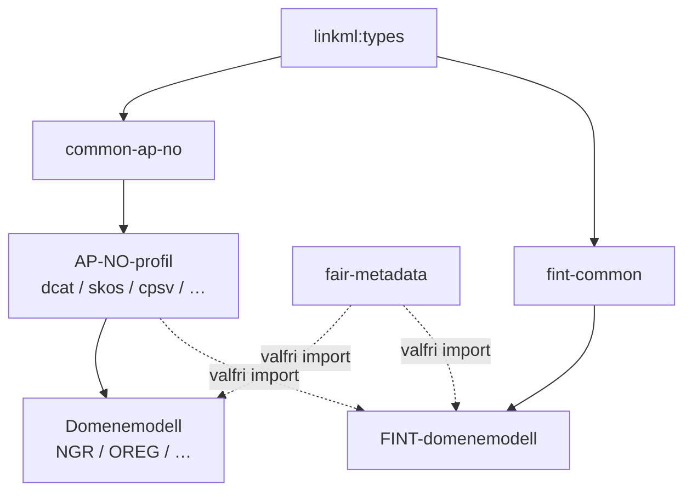

# LinkML W3C-profiler

Dette repoet inneheld norske W3C-applikasjonsprofiler og domenemodeller
modellert i [LinkML](https://linkml.io/).

## AP-NO Profiler for RDF baserte ressurser

| Profil | Beskriving | Status |
|---|---|---|
| **DCAT-AP-NO** | Datakatalogar | ✅ |
| **SKOS-AP-NO** | Begrepssamlingar | ✅ |
| **CPSV-AP-NO** | Offentlege tenester | ✅ |
| **DQV-AP-NO** | Datakvalitet | ✅ |
| **ModelldCAT-AP-NO** | Informasjonsmodellar | ✅ |
| **XKOS-AP-NO** | Utvida klassifikasjon | ✅ |

## Domenemodeller

### NGR – Nasjonale Grunndata

| Modell | Beskriving |
|---|---|
| **NGR-adresse** | Adressemodell frå Noreg digitalt |
| **NGR-eiendom** | Eigedomsmodell |
| **NGR-person** | Personmodell frå folkeregisteret |
| **NGR-virksomhet** | Verksemdsmodell |

### FINT – Felles Fylkeskommunale INTegrasjoner

| Modell | Beskriving |
|---|---|
| **FINT-administrasjon** | Personalressursar og organisasjon |
| **FINT-arkiv** | Saksarkiv og journalføring |
| **FINT-økonomi** | Faktura og rekneskap |
| **FINT-personvern** | Behandlingsprotokoll |
| **FINT-ressurs** | Brukarar og tilgangsrettar |
| **FINT-utdanning** | Skule, elevar og klasser |

### OREG – Offentlege registre

| Modell | Beskriving |
|---|---|
| **Register over aksjeeiere** | Aksjonærar, aksjepostar og selskap |

## Importhierarki



## Hurtigstart

```bash
# Valider alle skjema
make validate

# Generer SHACL shapes
make gen-shacl

# Valider eit enkelt skjema med MCP-validator
make mcp-validate SCHEMA=src/linkml/ap-no/dcat-ap-no/dcat-ap-no-schema.yaml

# FAIR-validering
make mcp-validate SCHEMA=src/linkml/ngr/ngr-adresse/ngr-adresse-schema.yaml POLICY=fair
```
