# ngr-adresse

```mermaid
erDiagram
Adressekode {
    uriorcurie id  
    integer kode  
}
Adressenavn {
    uriorcurie id  
    string adressenavn_tekst  
}
Adresseomrade {
    uriorcurie id  
    string namn  
}
Bruksenhet {
    uriorcurie id  
}
Bruksenhetsnummer {
    uriorcurie id  
    integer etasjenummer  
    Etasjeplan etasjeplan  
    integer nummerering_i_etasjen  
}
Bygning {
    uriorcurie id  
}
Fylke {
    string fylkesnummer  
    uriorcurie id  
    string namn  
}
GeografiskOmrade {
    uriorcurie id  
    string namn  
}
Grunnkrets {
    string grunnkretsnummer  
    uriorcurie id  
    string namn  
}
Husnummer {
    uriorcurie id  
    string bokstav  
    integer nummer  
}
Kirkesokn {
    string kirkesoknnummer  
    uriorcurie id  
    string namn  
}
KommunalKrets {
    string kretsnummer  
    uriorcurie id  
    string namn  
}
Kommune {
    string kommunenummer_kode  
    uriorcurie id  
    string namn  
}
OffisiellAdresse {
    uriorcurie adresserer_annet_objekt  
    string adressetilleggsnavn  
    string matrikkelnummer  
    uriorcurie id  
}
Postboks {
    uriorcurie id  
    integer postboksnummer  
}
Postboksadresse {
    string postboksanleggsnavn  
    uriorcurie id  
}
Poststed {
    string postnummer  
    uriorcurie id  
    string namn  
}
Representasjonspunkt {
    uriorcurie id  
    float koordinat_nord  
    float koordinat_ost  
    string koordinatsystem  
}
Stemmekrets {
    string stemmekretsnummer  
    uriorcurie id  
    string namn  
}
Svalbard {
    uriorcurie id  
    string namn  
}
Tettsted {
    string tettstedsnummer  
    uriorcurie id  
    string namn  
}

Adressekode ||--|o Adresseomrade : "adresseomrade_ref"
Adressenavn ||--|| Adressekode : "har_adressekode"
Adressenavn ||--|| Adresseomrade : "adresseomrade_ref"
OffisiellAdresse ||--|o Bruksenhet : "adresserer_bruksenhet"
OffisiellAdresse ||--|o Bruksenhetsnummer : "bruksenhetsnummer_ref"
OffisiellAdresse ||--|o Bygning : "adresserer_bygning"
OffisiellAdresse ||--|o Husnummer : "husnummer_ref"
OffisiellAdresse ||--|o Representasjonspunkt : "representasjonspunkt_ref"
OffisiellAdresse ||--|| Adressekode : "adressekode_ref"
OffisiellAdresse ||--|| Adressenavn : "adressenavn_ref"
OffisiellAdresse ||--|| Kommune : "kommunenummer_ref"
OffisiellAdresse ||--}| GeografiskOmrade : "geografisk_omrade"
Postboksadresse ||--|| Postboks : "postboks_ref"
Postboksadresse ||--|| Poststed : "poststed_ref"


```

Domenemodell for norske adressar basert på Nasjonale grunndata (utkast). Modellerer Offisiell adresse og Postboksadresse med tilhøyrande geografiske inndelingar og adressekomponentar. Basert på https://informasjonsforvaltning.github.io/nasjonale-grunndata/#Adresse

URI: https://data.norge.no/linkml/ngr-adresse

Name: ngr-adresse

## Classes

### Obligatorisk

| Class | Description |
| --- | --- |
| [Adressekode](klasser/adressekode.md) | Firesifra kommunal kode som identifiserer eit adressenavn |
| [Adressenavn](klasser/adressenavn.md) | Offisielt namn på ei veglenke eller eit adresseobjekt i ein kommune, tildelt ... |
| [Bruksenhetsnummer](klasser/bruksenhetsnummer.md) | Identifikator for ei brukseining (leilegheit o |
| [Fylke](klasser/fylke.md) | Eit norsk fylke |
| [Husnummer](klasser/husnummer.md) | Husnummer beståande av eit obligatorisk nummer og ein valfri bokstav (t |
| [Kommune](klasser/kommune.md) | Ein norsk kommune |
| [OffisiellAdresse](klasser/offisielladresse.md) | Ei offisiell adresse tildelt av kommunen, beståande av vegadresse (adressenav... |
| [Postboks](klasser/postboks.md) | Ei postboks registrert i Postboksregisteret |
| [Postboksadresse](klasser/postboksadresse.md) | Ei postboksadresse registrert i Postboksregisteret (Posten Norge) |
| [Poststed](klasser/poststed.md) | Eit poststed identifisert med postnummer, forvalta av Postnummerregisteret |
| [Representasjonspunkt](klasser/representasjonspunkt.md) | Eit geografisk punkt (koordinatpar) som representerer posisjonen til adressa |

### Andre

| Class | Description |
| --- | --- |
| [Adresseomrade](klasser/adresseomrade.md) | Geografisk område eit adressenavn høyrer til, t |
| [Bruksenhet](klasser/bruksenhet.md) | Referanse til ei brukseining (leilegheit/lokale) i Matrikkelen |
| [Bygning](klasser/bygning.md) | Referanse til ein bygning i Matrikkelen |
| [GeografiskAdresse](klasser/geografiskadresse.md) | Abstrakt basisklasse for norske adressar |
| [GeografiskOmrade](klasser/geografiskomrade.md) | Abstrakt klasse for geografiske inndelingar som offisielle adressar refererer... |
| [Grunnkrets](klasser/grunnkrets.md) | Ei grunnkrets – minste geografiske eining i statistisk inndeling |
| [Kirkesokn](klasser/kirkesokn.md) | Eit kyrkjesokn |
| [KommunalKrets](klasser/kommunalkrets.md) | Ein kommunal krets (administrativ inndeling definert av kommunen) |
| [Stemmekrets](klasser/stemmekrets.md) | Ei stemmekrets brukt ved val |
| [Svalbard](klasser/svalbard.md) | Svalbard som særskild geografisk område |
| [Tettsted](klasser/tettsted.md) | Eit tettbygd område definert av SSB |

## Slots

| Slot | Description |
| --- | --- |
| [adressekode_ref](klasser/adressekode_ref.md) | Kommunal adressekode for adressa |
| [adressekoder](klasser/adressekoder.md) |  |
| [adressenavn](klasser/adressenavn.md) |  |
| [adressenavn_ref](klasser/adressenavn_ref.md) | Adressenavn (vegnamn o |
| [adressenavn_tekst](klasser/adressenavn_tekst.md) | Tekstleg namn på vegen eller stadnamnet (locn:thoroughfare) |
| [adresseomrade_ref](klasser/adresseomrade_ref.md) | Adresseområdet dette adressenamnet eller adressekoden høyrer til |
| [adresseomrader](klasser/adresseomrader.md) |  |
| [adresserer_annet_objekt](klasser/adresserer_annet_objekt.md) | Anna objekt (t |
| [adresserer_bruksenhet](klasser/adresserer_bruksenhet.md) | Brukseining denne adressa er tildelt (forvaltar: Matrikkelen) |
| [adresserer_bygning](klasser/adresserer_bygning.md) | Bygning denne adressa er tildelt (forvaltar: Matrikkelen) |
| [adressetilleggsnavn](klasser/adressetilleggsnavn.md) | Offisielt tilleggsnamn til vegadressa (t |
| [bokstav](klasser/bokstav.md) | Husbokstav (A–Å) som skil einingar med same husnummer |
| [bruksenheter](klasser/bruksenheter.md) |  |
| [bruksenhetsnummer](klasser/bruksenhetsnummer.md) |  |
| [bruksenhetsnummer_ref](klasser/bruksenhetsnummer_ref.md) | Bruksenhetsnummer for leilegheit eller lokale |
| [bygningar](klasser/bygningar.md) |  |
| [etasjenummer](klasser/etasjenummer.md) | Etasjenummer (t |
| [etasjeplan](klasser/etasjeplan.md) | Kode for kva del av bygningen brukseininga ligg i (H/U/K/L/M) |
| [fylke](klasser/fylke.md) |  |
| [fylkesnummer](klasser/fylkesnummer.md) | Tosifra fylkesnummer (t |
| [geografisk_omrade](klasser/geografisk_omrade.md) | Geografiske inndelingar (kommune, poststed, grunnkrets osv |
| [grunnkretsar](klasser/grunnkretsar.md) |  |
| [grunnkretsnummer](klasser/grunnkretsnummer.md) | Åttesifra grunnkretsnummer (kommunenummer + firesifra kretsnummer) |
| [har_adressekode](klasser/har_adressekode.md) | Adressekode tilknytt dette adressenamnet |
| [husnummer](klasser/husnummer.md) |  |
| [husnummer_ref](klasser/husnummer_ref.md) | Husnummer (nummer + bokstav) for adressa |
| [id](klasser/id.md) | URI-identifikator for ressursen |
| [kirkesokn](klasser/kirkesokn.md) |  |
| [kirkesoknnummer](klasser/kirkesoknnummer.md) | Kysokn-nummer frå Kyrkja |
| [kode](klasser/kode.md) | Numerisk kode for adressekoden (kommunal firesifra kode) |
| [kommunaleKretsar](klasser/kommunalekretsar.md) |  |
| [kommunar](klasser/kommunar.md) |  |
| [kommunenummer_kode](klasser/kommunenummer_kode.md) | Firesifra kommunenummer (t |
| [kommunenummer_ref](klasser/kommunenummer_ref.md) | Kommunen denne adressa ligg i |
| [koordinat_nord](klasser/koordinat_nord.md) | Nordleg koordinat (Y) i det angitte koordinatsystemet |
| [koordinat_ost](klasser/koordinat_ost.md) | Austleg koordinat (X) i det angitte koordinatsystemet |
| [koordinatsystem](klasser/koordinatsystem.md) | Koordinatsystem/projeksjon (t |
| [kretsnummer](klasser/kretsnummer.md) | Kommunalt kretsnummer |
| [matrikkelnummer](klasser/matrikkelnummer.md) | Matrikkelnummer for adresser utan vegadresse (t |
| [namn](klasser/namn.md) | Namn på det geografiske området eller adressekomponenten |
| [nummer](klasser/nummer.md) | Husnummeret (heltalsverdi) |
| [nummerering_i_etasjen](klasser/nummerering_i_etasjen.md) | Løpenummer for brukseininga innanfor etasjen |
| [offisielleAdresser](klasser/offisielleadresser.md) |  |
| [postboks_ref](klasser/postboks_ref.md) | Postboksen denne postboksadressa tilhøyrer |
| [postboksadresser](klasser/postboksadresser.md) |  |
| [postboksanleggsnavn](klasser/postboksanleggsnavn.md) | Namn på postboksanlegget (t |
| [postboksar](klasser/postboksar.md) |  |
| [postboksnummer](klasser/postboksnummer.md) | Postboksnummer (heiltal) |
| [postnummer](klasser/postnummer.md) | Firesifra postnummer (locn:postCode) |
| [poststed_ref](klasser/poststed_ref.md) | Poststedet (postnummer) denne adressa høyrer til |
| [poststeder](klasser/poststeder.md) |  |
| [representasjonspunkt](klasser/representasjonspunkt.md) |  |
| [representasjonspunkt_ref](klasser/representasjonspunkt_ref.md) | Geografisk punkt som representerer adressas posisjon |
| [stemmekretsar](klasser/stemmekretsar.md) |  |
| [stemmekretsnummer](klasser/stemmekretsnummer.md) | Stemmekretsnummer |
| [svalbardOmrader](klasser/svalbardomrader.md) |  |
| [tettstadar](klasser/tettstadar.md) |  |
| [tettstedsnummer](klasser/tettstedsnummer.md) | SSB-tettstedsnummer |

## Enumerations

| Enumeration | Description |
| --- | --- |
| [Etasjeplan](klasser/etasjeplan.md) | Kode for kva del av bygningen eit bruksenhetsnummer refererer til |

## Types

| Type | Description |
| --- | --- |

## Subsets

| Subset | Description |
| --- | --- |
| [Anbefalt](klasser/anbefalt.md) | Anbefalte eigenskapar i domenemodellen |
| [Obligatorisk](klasser/obligatorisk.md) | Obligatoriske eigenskapar i domenemodellen |
| [Valgfri](klasser/valgfri.md) | Valfrie eigenskapar i domenemodellen |

## Generated artifacts

| Artefakt | Fil |
|----------|-----|
| SHACL shapes | [ngr-adresse-shapes.ttl](ngr-adresse-shapes.ttl) |
| JSON-LD kontekst | [ngr-adresse-context.jsonld](ngr-adresse-context.jsonld) |
| JSON Schema | [ngr-adresse-schema.json](ngr-adresse-schema.json) |
| OWL ontologi | [ngr-adresse-ontology.ttl](ngr-adresse-ontology.ttl) |
| RDF/Turtle skjema | [ngr-adresse-schema.ttl](ngr-adresse-schema.ttl) |
| Python-klasser | [ngr-adresse-model.py](ngr-adresse-model.py) |
| ER-diagram (Mermaid) | [ngr-adresse-erdiagram.md](ngr-adresse-erdiagram.md) |
| Eksempeldata (Turtle) | [ngr-adresse-eksempel.ttl](ngr-adresse-eksempel.ttl) |
