# Class: AdresseContainer 


_Rotklasse for NGR-adresse-datafiler. Held flate lister av alle instansierbare klassar; referansar mellom objekt brukar URI-lenking._


URI: [https://data.norge.no/linkml/ngr-adresse/AdresseContainer](https://data.norge.no/linkml/ngr-adresse/AdresseContainer)

```mermaid
 classDiagram
    class AdresseContainer
    click AdresseContainer href "../AdresseContainer/"
      AdresseContainer : adressekoder
        
          
    
        
        
        AdresseContainer --> "*" Adressekode : adressekoder
        click Adressekode href "../Adressekode/"
    

        
      AdresseContainer : adressenavn
        
          
    
        
        
        AdresseContainer --> "*" Adressenavn : adressenavn
        click Adressenavn href "../Adressenavn/"
    

        
      AdresseContainer : adresseomrader
        
          
    
        
        
        AdresseContainer --> "*" Adresseomrade : adresseomrader
        click Adresseomrade href "../Adresseomrade/"
    

        
      AdresseContainer : bruksenheter
        
          
    
        
        
        AdresseContainer --> "*" Bruksenhet : bruksenheter
        click Bruksenhet href "../Bruksenhet/"
    

        
      AdresseContainer : bruksenhetsnummer
        
          
    
        
        
        AdresseContainer --> "*" Bruksenhetsnummer : bruksenhetsnummer
        click Bruksenhetsnummer href "../Bruksenhetsnummer/"
    

        
      AdresseContainer : bygningar
        
          
    
        
        
        AdresseContainer --> "*" Bygning : bygningar
        click Bygning href "../Bygning/"
    

        
      AdresseContainer : fylke
        
          
    
        
        
        AdresseContainer --> "*" Fylke : fylke
        click Fylke href "../Fylke/"
    

        
      AdresseContainer : grunnkretsar
        
          
    
        
        
        AdresseContainer --> "*" Grunnkrets : grunnkretsar
        click Grunnkrets href "../Grunnkrets/"
    

        
      AdresseContainer : husnummer
        
          
    
        
        
        AdresseContainer --> "*" Husnummer : husnummer
        click Husnummer href "../Husnummer/"
    

        
      AdresseContainer : kirkesokn
        
          
    
        
        
        AdresseContainer --> "*" Kirkesokn : kirkesokn
        click Kirkesokn href "../Kirkesokn/"
    

        
      AdresseContainer : kommunaleKretsar
        
          
    
        
        
        AdresseContainer --> "*" KommunalKrets : kommunaleKretsar
        click KommunalKrets href "../KommunalKrets/"
    

        
      AdresseContainer : kommunar
        
          
    
        
        
        AdresseContainer --> "*" Kommune : kommunar
        click Kommune href "../Kommune/"
    

        
      AdresseContainer : offisielleAdresser
        
          
    
        
        
        AdresseContainer --> "*" OffisiellAdresse : offisielleAdresser
        click OffisiellAdresse href "../OffisiellAdresse/"
    

        
      AdresseContainer : postboksadresser
        
          
    
        
        
        AdresseContainer --> "*" Postboksadresse : postboksadresser
        click Postboksadresse href "../Postboksadresse/"
    

        
      AdresseContainer : postboksar
        
          
    
        
        
        AdresseContainer --> "*" Postboks : postboksar
        click Postboks href "../Postboks/"
    

        
      AdresseContainer : poststeder
        
          
    
        
        
        AdresseContainer --> "*" Poststed : poststeder
        click Poststed href "../Poststed/"
    

        
      AdresseContainer : representasjonspunkt
        
          
    
        
        
        AdresseContainer --> "*" Representasjonspunkt : representasjonspunkt
        click Representasjonspunkt href "../Representasjonspunkt/"
    

        
      AdresseContainer : stemmekretsar
        
          
    
        
        
        AdresseContainer --> "*" Stemmekrets : stemmekretsar
        click Stemmekrets href "../Stemmekrets/"
    

        
      AdresseContainer : svalbardOmrader
        
          
    
        
        
        AdresseContainer --> "*" Svalbard : svalbardOmrader
        click Svalbard href "../Svalbard/"
    

        
      AdresseContainer : tettstadar
        
          
    
        
        
        AdresseContainer --> "*" Tettsted : tettstadar
        click Tettsted href "../Tettsted/"
    

        
      
```





<!-- no inheritance hierarchy -->

## Class Properties

| Property | Value |
| --- | --- |
| Tree Root | Yes |


## Eigenskapar


  
  

  
  

  
  

  
  

  
  

  
  

  
  

  
  

  
  

  
  

  
  

  
  

  
  

  
  

  
  

  
  

  
  

  
  

  
  

  
  


  
  

  
  

  
  

  
  

  
  

  
  

  
  

  
  

  
  

  
  

  
  

  
  

  
  

  
  

  
  

  
  

  
  

  
  

  
  

  
  


  
  

  
  

  
  

  
  

  
  

  
  

  
  

  
  

  
  

  
  

  
  

  
  

  
  

  
  

  
  

  
  

  
  

  
  

  
  

  
  


  
  
  
  
    
  

  
  
  
  
    
  

  
  
  
  
    
  

  
  
  
  
    
  

  
  
  
  
    
  

  
  
  
  
    
  

  
  
  
  
    
  

  
  
  
  
    
  

  
  
  
  
    
  

  
  
  
  
    
  

  
  
  
  
    
  

  
  
  
  
    
  

  
  
  
  
    
  

  
  
  
  
    
  

  
  
  
  
    
  

  
  
  
  
    
  

  
  
  
  
    
  

  
  
  
  
    
  

  
  
  
  
    
  

  
  
  
  
    
  


### Andre

| Namn | Kardinalitet og domene | Beskriving |
| --- | --- | --- |
| [offisielleAdresser](offisielleadresser.md) | * <br/> [OffisiellAdresse](offisielladresse.md) |  |
| [postboksadresser](postboksadresser.md) | * <br/> [Postboksadresse](postboksadresse.md) |  |
| [adressenavn](adressenavn.md) | * <br/> [Adressenavn](adressenavn.md) |  |
| [adresseomrader](adresseomrader.md) | * <br/> [Adresseomrade](adresseomrade.md) |  |
| [adressekoder](adressekoder.md) | * <br/> [Adressekode](adressekode.md) |  |
| [husnummer](husnummer.md) | * <br/> [Husnummer](husnummer.md) |  |
| [bruksenhetsnummer](bruksenhetsnummer.md) | * <br/> [Bruksenhetsnummer](bruksenhetsnummer.md) |  |
| [kommunar](kommunar.md) | * <br/> [Kommune](kommune.md) |  |
| [fylke](fylke.md) | * <br/> [Fylke](fylke.md) |  |
| [poststeder](poststeder.md) | * <br/> [Poststed](poststed.md) |  |
| [grunnkretsar](grunnkretsar.md) | * <br/> [Grunnkrets](grunnkrets.md) |  |
| [tettstadar](tettstadar.md) | * <br/> [Tettsted](tettsted.md) |  |
| [kirkesokn](kirkesokn.md) | * <br/> [Kirkesokn](kirkesokn.md) |  |
| [stemmekretsar](stemmekretsar.md) | * <br/> [Stemmekrets](stemmekrets.md) |  |
| [kommunaleKretsar](kommunalekretsar.md) | * <br/> [KommunalKrets](kommunalkrets.md) |  |
| [svalbardOmrader](svalbardomrader.md) | * <br/> [Svalbard](svalbard.md) |  |
| [postboksar](postboksar.md) | * <br/> [Postboks](postboks.md) |  |
| [representasjonspunkt](representasjonspunkt.md) | * <br/> [Representasjonspunkt](representasjonspunkt.md) |  |
| [bygningar](bygningar.md) | * <br/> [Bygning](bygning.md) |  |
| [bruksenheter](bruksenheter.md) | * <br/> [Bruksenhet](bruksenhet.md) |  |


## Identifier and Mapping Information


### Schema Source


* from schema: https://data.norge.no/linkml/ngr-adresse


## Mappings

| Mapping Type | Mapped Value |
| ---  | ---  |
| self | https://data.norge.no/linkml/ngr-adresse/AdresseContainer |
| native | https://data.norge.no/linkml/ngr-adresse/AdresseContainer |


## LinkML Source

<!-- TODO: investigate https://stackoverflow.com/questions/37606292/how-to-create-tabbed-code-blocks-in-mkdocs-or-sphinx -->

### Direct

<details>
```yaml
name: AdresseContainer
description: Rotklasse for NGR-adresse-datafiler. Held flate lister av alle instansierbare
  klassar; referansar mellom objekt brukar URI-lenking.
from_schema: https://data.norge.no/linkml/ngr-adresse
rank: 1000
attributes:
  offisielleAdresser:
    name: offisielleAdresser
    from_schema: https://data.norge.no/linkml/ngr-adresse
    rank: 1000
    domain_of:
    - AdresseContainer
    range: OffisiellAdresse
    multivalued: true
    inlined: true
    inlined_as_list: true
  postboksadresser:
    name: postboksadresser
    from_schema: https://data.norge.no/linkml/ngr-adresse
    rank: 1000
    domain_of:
    - AdresseContainer
    range: Postboksadresse
    multivalued: true
    inlined: true
    inlined_as_list: true
  adressenavn:
    name: adressenavn
    from_schema: https://data.norge.no/linkml/ngr-adresse
    rank: 1000
    domain_of:
    - AdresseContainer
    range: Adressenavn
    multivalued: true
    inlined: true
    inlined_as_list: true
  adresseomrader:
    name: adresseomrader
    from_schema: https://data.norge.no/linkml/ngr-adresse
    rank: 1000
    domain_of:
    - AdresseContainer
    range: Adresseomrade
    multivalued: true
    inlined: true
    inlined_as_list: true
  adressekoder:
    name: adressekoder
    from_schema: https://data.norge.no/linkml/ngr-adresse
    rank: 1000
    domain_of:
    - AdresseContainer
    range: Adressekode
    multivalued: true
    inlined: true
    inlined_as_list: true
  husnummer:
    name: husnummer
    from_schema: https://data.norge.no/linkml/ngr-adresse
    rank: 1000
    domain_of:
    - AdresseContainer
    range: Husnummer
    multivalued: true
    inlined: true
    inlined_as_list: true
  bruksenhetsnummer:
    name: bruksenhetsnummer
    from_schema: https://data.norge.no/linkml/ngr-adresse
    rank: 1000
    domain_of:
    - AdresseContainer
    range: Bruksenhetsnummer
    multivalued: true
    inlined: true
    inlined_as_list: true
  kommunar:
    name: kommunar
    from_schema: https://data.norge.no/linkml/ngr-adresse
    rank: 1000
    domain_of:
    - AdresseContainer
    range: Kommune
    multivalued: true
    inlined: true
    inlined_as_list: true
  fylke:
    name: fylke
    from_schema: https://data.norge.no/linkml/ngr-adresse
    rank: 1000
    domain_of:
    - AdresseContainer
    range: Fylke
    multivalued: true
    inlined: true
    inlined_as_list: true
  poststeder:
    name: poststeder
    from_schema: https://data.norge.no/linkml/ngr-adresse
    rank: 1000
    domain_of:
    - AdresseContainer
    range: Poststed
    multivalued: true
    inlined: true
    inlined_as_list: true
  grunnkretsar:
    name: grunnkretsar
    from_schema: https://data.norge.no/linkml/ngr-adresse
    rank: 1000
    domain_of:
    - AdresseContainer
    range: Grunnkrets
    multivalued: true
    inlined: true
    inlined_as_list: true
  tettstadar:
    name: tettstadar
    from_schema: https://data.norge.no/linkml/ngr-adresse
    rank: 1000
    domain_of:
    - AdresseContainer
    range: Tettsted
    multivalued: true
    inlined: true
    inlined_as_list: true
  kirkesokn:
    name: kirkesokn
    from_schema: https://data.norge.no/linkml/ngr-adresse
    rank: 1000
    domain_of:
    - AdresseContainer
    range: Kirkesokn
    multivalued: true
    inlined: true
    inlined_as_list: true
  stemmekretsar:
    name: stemmekretsar
    from_schema: https://data.norge.no/linkml/ngr-adresse
    rank: 1000
    domain_of:
    - AdresseContainer
    range: Stemmekrets
    multivalued: true
    inlined: true
    inlined_as_list: true
  kommunaleKretsar:
    name: kommunaleKretsar
    from_schema: https://data.norge.no/linkml/ngr-adresse
    rank: 1000
    domain_of:
    - AdresseContainer
    range: KommunalKrets
    multivalued: true
    inlined: true
    inlined_as_list: true
  svalbardOmrader:
    name: svalbardOmrader
    from_schema: https://data.norge.no/linkml/ngr-adresse
    rank: 1000
    domain_of:
    - AdresseContainer
    range: Svalbard
    multivalued: true
    inlined: true
    inlined_as_list: true
  postboksar:
    name: postboksar
    from_schema: https://data.norge.no/linkml/ngr-adresse
    rank: 1000
    domain_of:
    - AdresseContainer
    range: Postboks
    multivalued: true
    inlined: true
    inlined_as_list: true
  representasjonspunkt:
    name: representasjonspunkt
    from_schema: https://data.norge.no/linkml/ngr-adresse
    rank: 1000
    domain_of:
    - AdresseContainer
    range: Representasjonspunkt
    multivalued: true
    inlined: true
    inlined_as_list: true
  bygningar:
    name: bygningar
    from_schema: https://data.norge.no/linkml/ngr-adresse
    rank: 1000
    domain_of:
    - AdresseContainer
    range: Bygning
    multivalued: true
    inlined: true
    inlined_as_list: true
  bruksenheter:
    name: bruksenheter
    from_schema: https://data.norge.no/linkml/ngr-adresse
    rank: 1000
    domain_of:
    - AdresseContainer
    range: Bruksenhet
    multivalued: true
    inlined: true
    inlined_as_list: true
tree_root: true

```
</details>

### Induced

<details>
```yaml
name: AdresseContainer
description: Rotklasse for NGR-adresse-datafiler. Held flate lister av alle instansierbare
  klassar; referansar mellom objekt brukar URI-lenking.
from_schema: https://data.norge.no/linkml/ngr-adresse
rank: 1000
attributes:
  offisielleAdresser:
    name: offisielleAdresser
    from_schema: https://data.norge.no/linkml/ngr-adresse
    rank: 1000
    alias: offisielleAdresser
    owner: AdresseContainer
    domain_of:
    - AdresseContainer
    range: OffisiellAdresse
    multivalued: true
    inlined_as_list: true
  postboksadresser:
    name: postboksadresser
    from_schema: https://data.norge.no/linkml/ngr-adresse
    rank: 1000
    alias: postboksadresser
    owner: AdresseContainer
    domain_of:
    - AdresseContainer
    range: Postboksadresse
    multivalued: true
    inlined_as_list: true
  adressenavn:
    name: adressenavn
    from_schema: https://data.norge.no/linkml/ngr-adresse
    rank: 1000
    alias: adressenavn
    owner: AdresseContainer
    domain_of:
    - AdresseContainer
    range: Adressenavn
    multivalued: true
    inlined_as_list: true
  adresseomrader:
    name: adresseomrader
    from_schema: https://data.norge.no/linkml/ngr-adresse
    rank: 1000
    alias: adresseomrader
    owner: AdresseContainer
    domain_of:
    - AdresseContainer
    range: Adresseomrade
    multivalued: true
    inlined_as_list: true
  adressekoder:
    name: adressekoder
    from_schema: https://data.norge.no/linkml/ngr-adresse
    rank: 1000
    alias: adressekoder
    owner: AdresseContainer
    domain_of:
    - AdresseContainer
    range: Adressekode
    multivalued: true
    inlined_as_list: true
  husnummer:
    name: husnummer
    from_schema: https://data.norge.no/linkml/ngr-adresse
    rank: 1000
    alias: husnummer
    owner: AdresseContainer
    domain_of:
    - AdresseContainer
    range: Husnummer
    multivalued: true
    inlined_as_list: true
  bruksenhetsnummer:
    name: bruksenhetsnummer
    from_schema: https://data.norge.no/linkml/ngr-adresse
    rank: 1000
    alias: bruksenhetsnummer
    owner: AdresseContainer
    domain_of:
    - AdresseContainer
    range: Bruksenhetsnummer
    multivalued: true
    inlined_as_list: true
  kommunar:
    name: kommunar
    from_schema: https://data.norge.no/linkml/ngr-adresse
    rank: 1000
    alias: kommunar
    owner: AdresseContainer
    domain_of:
    - AdresseContainer
    range: Kommune
    multivalued: true
    inlined_as_list: true
  fylke:
    name: fylke
    from_schema: https://data.norge.no/linkml/ngr-adresse
    rank: 1000
    alias: fylke
    owner: AdresseContainer
    domain_of:
    - AdresseContainer
    range: Fylke
    multivalued: true
    inlined_as_list: true
  poststeder:
    name: poststeder
    from_schema: https://data.norge.no/linkml/ngr-adresse
    rank: 1000
    alias: poststeder
    owner: AdresseContainer
    domain_of:
    - AdresseContainer
    range: Poststed
    multivalued: true
    inlined_as_list: true
  grunnkretsar:
    name: grunnkretsar
    from_schema: https://data.norge.no/linkml/ngr-adresse
    rank: 1000
    alias: grunnkretsar
    owner: AdresseContainer
    domain_of:
    - AdresseContainer
    range: Grunnkrets
    multivalued: true
    inlined_as_list: true
  tettstadar:
    name: tettstadar
    from_schema: https://data.norge.no/linkml/ngr-adresse
    rank: 1000
    alias: tettstadar
    owner: AdresseContainer
    domain_of:
    - AdresseContainer
    range: Tettsted
    multivalued: true
    inlined_as_list: true
  kirkesokn:
    name: kirkesokn
    from_schema: https://data.norge.no/linkml/ngr-adresse
    rank: 1000
    alias: kirkesokn
    owner: AdresseContainer
    domain_of:
    - AdresseContainer
    range: Kirkesokn
    multivalued: true
    inlined_as_list: true
  stemmekretsar:
    name: stemmekretsar
    from_schema: https://data.norge.no/linkml/ngr-adresse
    rank: 1000
    alias: stemmekretsar
    owner: AdresseContainer
    domain_of:
    - AdresseContainer
    range: Stemmekrets
    multivalued: true
    inlined_as_list: true
  kommunaleKretsar:
    name: kommunaleKretsar
    from_schema: https://data.norge.no/linkml/ngr-adresse
    rank: 1000
    alias: kommunaleKretsar
    owner: AdresseContainer
    domain_of:
    - AdresseContainer
    range: KommunalKrets
    multivalued: true
    inlined_as_list: true
  svalbardOmrader:
    name: svalbardOmrader
    from_schema: https://data.norge.no/linkml/ngr-adresse
    rank: 1000
    alias: svalbardOmrader
    owner: AdresseContainer
    domain_of:
    - AdresseContainer
    range: Svalbard
    multivalued: true
    inlined_as_list: true
  postboksar:
    name: postboksar
    from_schema: https://data.norge.no/linkml/ngr-adresse
    rank: 1000
    alias: postboksar
    owner: AdresseContainer
    domain_of:
    - AdresseContainer
    range: Postboks
    multivalued: true
    inlined_as_list: true
  representasjonspunkt:
    name: representasjonspunkt
    from_schema: https://data.norge.no/linkml/ngr-adresse
    rank: 1000
    alias: representasjonspunkt
    owner: AdresseContainer
    domain_of:
    - AdresseContainer
    range: Representasjonspunkt
    multivalued: true
    inlined_as_list: true
  bygningar:
    name: bygningar
    from_schema: https://data.norge.no/linkml/ngr-adresse
    rank: 1000
    alias: bygningar
    owner: AdresseContainer
    domain_of:
    - AdresseContainer
    range: Bygning
    multivalued: true
    inlined_as_list: true
  bruksenheter:
    name: bruksenheter
    from_schema: https://data.norge.no/linkml/ngr-adresse
    rank: 1000
    alias: bruksenheter
    owner: AdresseContainer
    domain_of:
    - AdresseContainer
    range: Bruksenhet
    multivalued: true
    inlined_as_list: true
tree_root: true

```
</details>