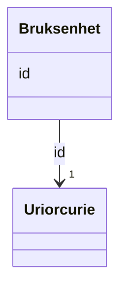

# Class: Bruksenhet 


_Referanse til ei brukseining (leilegheit/lokale) i Matrikkelen._


URI: [ngr:Bruksenhet](https://data.norge.no/vocabulary/ngr-adresse#Bruksenhet)





<!-- no inheritance hierarchy -->

## Class Properties

| Property | Value |
| --- | --- |
| Class URI | [ngr:Bruksenhet](https://data.norge.no/vocabulary/ngr-adresse#Bruksenhet) |


## Eigenskapar


  
  


  
  


  
  


  
  
  
  
    
  


### Andre

| Namn | Kardinalitet og domene | Beskriving |
| --- | --- | --- |
| [id](id.md) | 1 <br/> [xsd:anyURI](http://www.w3.org/2001/XMLSchema#anyURI) | URI-identifikator for ressursen |


## Usages

| used by | used in | type | used |
| ---  | --- | --- | --- |
| [AdresseContainer](adressecontainer.md) | [bruksenheter](bruksenheter.md) | range | [Bruksenhet](bruksenhet.md) |
| [OffisiellAdresse](offisielladresse.md) | [adresserer_bruksenhet](adresserer_bruksenhet.md) | range | [Bruksenhet](bruksenhet.md) |


## Identifier and Mapping Information


### Schema Source


* from schema: https://data.norge.no/linkml/ngr-adresse


## Mappings

| Mapping Type | Mapped Value |
| ---  | ---  |
| self | ngr:Bruksenhet |
| native | https://data.norge.no/linkml/ngr-adresse/Bruksenhet |


## LinkML Source

<!-- TODO: investigate https://stackoverflow.com/questions/37606292/how-to-create-tabbed-code-blocks-in-mkdocs-or-sphinx -->

### Direct

<details>
```yaml
name: Bruksenhet
description: Referanse til ei brukseining (leilegheit/lokale) i Matrikkelen.
from_schema: https://data.norge.no/linkml/ngr-adresse
rank: 1000
slots:
- id
class_uri: ngr:Bruksenhet

```
</details>

### Induced

<details>
```yaml
name: Bruksenhet
description: Referanse til ei brukseining (leilegheit/lokale) i Matrikkelen.
from_schema: https://data.norge.no/linkml/ngr-adresse
rank: 1000
attributes:
  id:
    name: id
    description: URI-identifikator for ressursen.
    from_schema: https://data.norge.no/linkml/ngr-adresse
    rank: 1000
    identifier: true
    alias: id
    owner: Bruksenhet
    domain_of:
    - GeografiskAdresse
    - Adressenavn
    - Adresseomrade
    - Adressekode
    - Husnummer
    - Bruksenhetsnummer
    - Representasjonspunkt
    - GeografiskOmrade
    - Postboks
    - Bygning
    - Bruksenhet
    range: uriorcurie
    required: true
class_uri: ngr:Bruksenhet

```
</details>