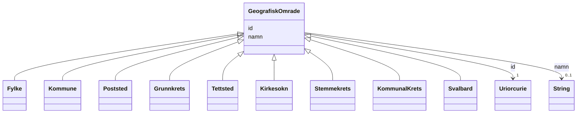

# Class: GeografiskOmrade 


_Abstrakt klasse for geografiske inndelingar som offisielle adressar refererer til._


* __NOTE__: this is an abstract class and should not be instantiated directly


URI: [ngr:GeografiskOmrade](https://data.norge.no/vocabulary/ngr-adresse#GeografiskOmrade)





## Inheritance
* **GeografiskOmrade**
    * [Fylke](fylke.md)
    * [Kommune](kommune.md)
    * [Poststed](poststed.md)
    * [Grunnkrets](grunnkrets.md)
    * [Tettsted](tettsted.md)
    * [Kirkesokn](kirkesokn.md)
    * [Stemmekrets](stemmekrets.md)
    * [KommunalKrets](kommunalkrets.md)
    * [Svalbard](svalbard.md)


## Class Properties

| Property | Value |
| --- | --- |
| Class URI | [ngr:GeografiskOmrade](https://data.norge.no/vocabulary/ngr-adresse#GeografiskOmrade) |


## Eigenskapar


  
  

  
  


  
  

  
  


  
  

  
  


  
  
  
  
    
  

  
  
  
  
    
  


### Andre

| Namn | Kardinalitet og domene | Beskriving |
| --- | --- | --- |
| [id](id.md) | 1 <br/> [xsd:anyURI](http://www.w3.org/2001/XMLSchema#anyURI) | URI-identifikator for ressursen |
| [namn](namn.md) | 0..1 <br/> [xsd:string](http://www.w3.org/2001/XMLSchema#string) | Namn på det geografiske området eller adressekomponenten |


## Usages

| used by | used in | type | used |
| ---  | --- | --- | --- |
| [OffisiellAdresse](offisielladresse.md) | [geografisk_omrade](geografisk_omrade.md) | range | [GeografiskOmrade](geografiskomrade.md) |


## Identifier and Mapping Information


### Schema Source


* from schema: https://data.norge.no/linkml/ngr-adresse


## Mappings

| Mapping Type | Mapped Value |
| ---  | ---  |
| self | ngr:GeografiskOmrade |
| native | https://data.norge.no/linkml/ngr-adresse/GeografiskOmrade |


## LinkML Source

<!-- TODO: investigate https://stackoverflow.com/questions/37606292/how-to-create-tabbed-code-blocks-in-mkdocs-or-sphinx -->

### Direct

<details>
```yaml
name: GeografiskOmrade
description: Abstrakt klasse for geografiske inndelingar som offisielle adressar refererer
  til.
from_schema: https://data.norge.no/linkml/ngr-adresse
rank: 1000
abstract: true
slots:
- id
- namn
class_uri: ngr:GeografiskOmrade

```
</details>

### Induced

<details>
```yaml
name: GeografiskOmrade
description: Abstrakt klasse for geografiske inndelingar som offisielle adressar refererer
  til.
from_schema: https://data.norge.no/linkml/ngr-adresse
rank: 1000
abstract: true
attributes:
  id:
    name: id
    description: URI-identifikator for ressursen.
    from_schema: https://data.norge.no/linkml/ngr-adresse
    rank: 1000
    identifier: true
    alias: id
    owner: GeografiskOmrade
    domain_of:
    - GeografiskAdresse
    - Adressenavn
    - Adresseomrade
    - Adressekode
    - Husnummer
    - Bruksenhetsnummer
    - Representasjonspunkt
    - GeografiskOmrade
    - Postboks
    - Bygning
    - Bruksenhet
    range: uriorcurie
    required: true
  namn:
    name: namn
    description: Namn på det geografiske området eller adressekomponenten.
    from_schema: https://data.norge.no/linkml/ngr-adresse
    rank: 1000
    slot_uri: ngr:namn
    alias: namn
    owner: GeografiskOmrade
    domain_of:
    - Adresseomrade
    - GeografiskOmrade
    range: string
class_uri: ngr:GeografiskOmrade

```
</details>