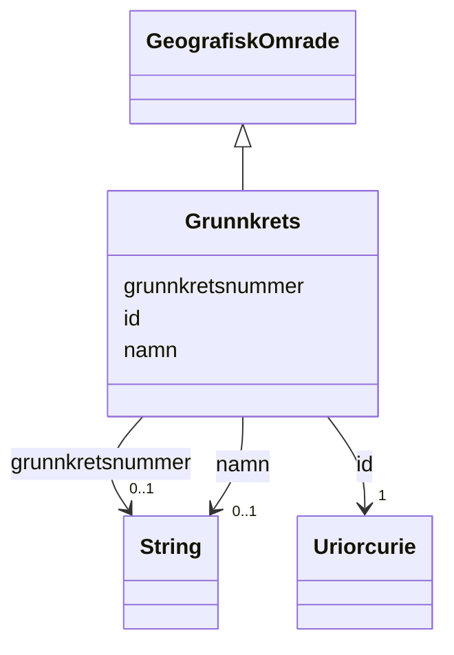

# Class: Grunnkrets 


_Ei grunnkrets – minste geografiske eining i statistisk inndeling._


URI: [ngr:Grunnkrets](https://data.norge.no/vocabulary/ngr-adresse#Grunnkrets)





## Inheritance
* [GeografiskOmrade](geografiskomrade.md)
    * **Grunnkrets**


## Class Properties

| Property | Value |
| --- | --- |
| Class URI | [ngr:Grunnkrets](https://data.norge.no/vocabulary/ngr-adresse#Grunnkrets) |


## Eigenskapar


  
  


  
  


  
  


  
  
  
  
    
  


### Andre

| Namn | Kardinalitet og domene | Beskriving |
| --- | --- | --- |
| [grunnkretsnummer](grunnkretsnummer.md) | 0..1 <br/> [xsd:string](http://www.w3.org/2001/XMLSchema#string) | Åttesifra grunnkretsnummer (kommunenummer + firesifra kretsnummer) |


### Arva

| Namn | Kardinalitet og domene | Beskriving | Frå |
| --- | --- | --- | --- || [id](id.md) | 1 <br/> [xsd:anyURI](http://www.w3.org/2001/XMLSchema#anyURI) | URI-identifikator for ressursen | [GeografiskOmrade](geografiskomrade.md) |
| [namn](namn.md) | 0..1 <br/> [xsd:string](http://www.w3.org/2001/XMLSchema#string) | Namn på det geografiske området eller adressekomponenten | [GeografiskOmrade](geografiskomrade.md) |


## Usages

| used by | used in | type | used |
| ---  | --- | --- | --- |
| [AdresseContainer](adressecontainer.md) | [grunnkretsar](grunnkretsar.md) | range | [Grunnkrets](grunnkrets.md) |


## Identifier and Mapping Information


### Schema Source


* from schema: https://data.norge.no/linkml/ngr-adresse


## Mappings

| Mapping Type | Mapped Value |
| ---  | ---  |
| self | ngr:Grunnkrets |
| native | https://data.norge.no/linkml/ngr-adresse/Grunnkrets |


## LinkML Source

<!-- TODO: investigate https://stackoverflow.com/questions/37606292/how-to-create-tabbed-code-blocks-in-mkdocs-or-sphinx -->

### Direct

<details>
```yaml
name: Grunnkrets
description: Ei grunnkrets – minste geografiske eining i statistisk inndeling.
from_schema: https://data.norge.no/linkml/ngr-adresse
rank: 1000
is_a: GeografiskOmrade
slots:
- grunnkretsnummer
class_uri: ngr:Grunnkrets

```
</details>

### Induced

<details>
```yaml
name: Grunnkrets
description: Ei grunnkrets – minste geografiske eining i statistisk inndeling.
from_schema: https://data.norge.no/linkml/ngr-adresse
rank: 1000
is_a: GeografiskOmrade
attributes:
  grunnkretsnummer:
    name: grunnkretsnummer
    description: Åttesifra grunnkretsnummer (kommunenummer + firesifra kretsnummer).
    from_schema: https://data.norge.no/linkml/ngr-adresse
    rank: 1000
    slot_uri: ngr:grunnkretsnummer
    alias: grunnkretsnummer
    owner: Grunnkrets
    domain_of:
    - Grunnkrets
    range: string
  id:
    name: id
    description: URI-identifikator for ressursen.
    from_schema: https://data.norge.no/linkml/ngr-adresse
    rank: 1000
    identifier: true
    alias: id
    owner: Grunnkrets
    domain_of:
    - GeografiskAdresse
    - Adressenavn
    - Adresseomrade
    - Adressekode
    - Husnummer
    - Bruksenhetsnummer
    - Representasjonspunkt
    - GeografiskOmrade
    - Postboks
    - Bygning
    - Bruksenhet
    range: uriorcurie
    required: true
  namn:
    name: namn
    description: Namn på det geografiske området eller adressekomponenten.
    from_schema: https://data.norge.no/linkml/ngr-adresse
    rank: 1000
    slot_uri: ngr:namn
    alias: namn
    owner: Grunnkrets
    domain_of:
    - Adresseomrade
    - GeografiskOmrade
    range: string
class_uri: ngr:Grunnkrets

```
</details>