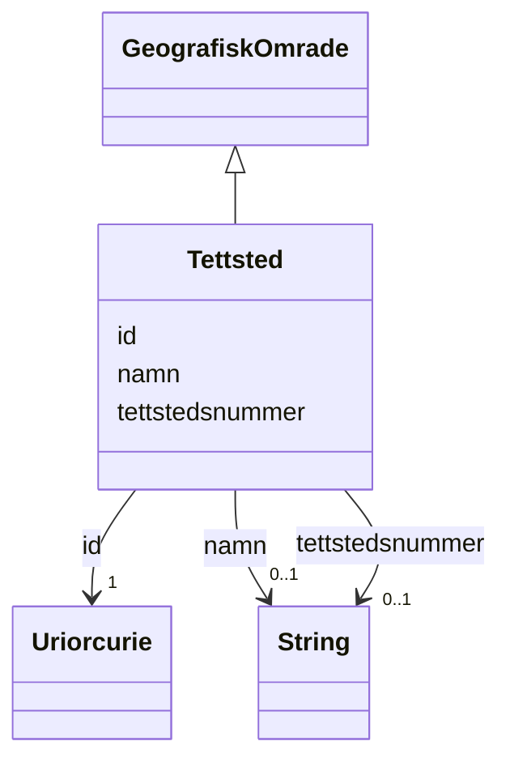

# Class: Tettsted 


_Eit tettbygd område definert av SSB._


URI: [ngr:Tettsted](https://data.norge.no/vocabulary/ngr-adresse#Tettsted)





## Inheritance
* [GeografiskOmrade](geografiskomrade.md)
    * **Tettsted**


## Class Properties

| Property | Value |
| --- | --- |
| Class URI | [ngr:Tettsted](https://data.norge.no/vocabulary/ngr-adresse#Tettsted) |


## Eigenskapar


  
  


  
  


  
  


  
  
  
  
    
  


### Andre

| Namn | Kardinalitet og domene | Beskriving |
| --- | --- | --- |
| [tettstedsnummer](tettstedsnummer.md) | 0..1 <br/> [xsd:string](http://www.w3.org/2001/XMLSchema#string) | SSB-tettstedsnummer |


### Arva

| Namn | Kardinalitet og domene | Beskriving | Frå |
| --- | --- | --- | --- || [id](id.md) | 1 <br/> [xsd:anyURI](http://www.w3.org/2001/XMLSchema#anyURI) | URI-identifikator for ressursen | [GeografiskOmrade](geografiskomrade.md) |
| [namn](namn.md) | 0..1 <br/> [xsd:string](http://www.w3.org/2001/XMLSchema#string) | Namn på det geografiske området eller adressekomponenten | [GeografiskOmrade](geografiskomrade.md) |


## Usages

| used by | used in | type | used |
| ---  | --- | --- | --- |
| [AdresseContainer](adressecontainer.md) | [tettstadar](tettstadar.md) | range | [Tettsted](tettsted.md) |


## Identifier and Mapping Information


### Schema Source


* from schema: https://data.norge.no/linkml/ngr-adresse


## Mappings

| Mapping Type | Mapped Value |
| ---  | ---  |
| self | ngr:Tettsted |
| native | https://data.norge.no/linkml/ngr-adresse/Tettsted |


## LinkML Source

<!-- TODO: investigate https://stackoverflow.com/questions/37606292/how-to-create-tabbed-code-blocks-in-mkdocs-or-sphinx -->

### Direct

<details>
```yaml
name: Tettsted
description: Eit tettbygd område definert av SSB.
from_schema: https://data.norge.no/linkml/ngr-adresse
rank: 1000
is_a: GeografiskOmrade
slots:
- tettstedsnummer
class_uri: ngr:Tettsted

```
</details>

### Induced

<details>
```yaml
name: Tettsted
description: Eit tettbygd område definert av SSB.
from_schema: https://data.norge.no/linkml/ngr-adresse
rank: 1000
is_a: GeografiskOmrade
attributes:
  tettstedsnummer:
    name: tettstedsnummer
    description: SSB-tettstedsnummer.
    from_schema: https://data.norge.no/linkml/ngr-adresse
    rank: 1000
    slot_uri: ngr:tettstedsnummer
    alias: tettstedsnummer
    owner: Tettsted
    domain_of:
    - Tettsted
    range: string
  id:
    name: id
    description: URI-identifikator for ressursen.
    from_schema: https://data.norge.no/linkml/ngr-adresse
    rank: 1000
    identifier: true
    alias: id
    owner: Tettsted
    domain_of:
    - GeografiskAdresse
    - Adressenavn
    - Adresseomrade
    - Adressekode
    - Husnummer
    - Bruksenhetsnummer
    - Representasjonspunkt
    - GeografiskOmrade
    - Postboks
    - Bygning
    - Bruksenhet
    range: uriorcurie
    required: true
  namn:
    name: namn
    description: Namn på det geografiske området eller adressekomponenten.
    from_schema: https://data.norge.no/linkml/ngr-adresse
    rank: 1000
    slot_uri: ngr:namn
    alias: namn
    owner: Tettsted
    domain_of:
    - Adresseomrade
    - GeografiskOmrade
    range: string
class_uri: ngr:Tettsted

```
</details>