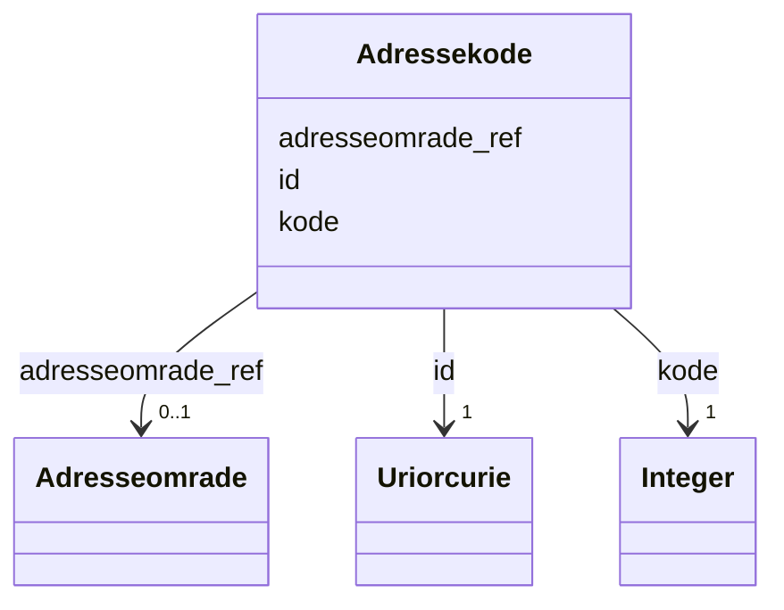

# Class: Adressekode 


_Firesifra kommunal kode som identifiserer eit adressenavn._


URI: [ngr:Adressekode](https://data.norge.no/vocabulary/ngr-adresse#Adressekode)





<!-- no inheritance hierarchy -->

## Class Properties

| Property | Value |
| --- | --- |
| Class URI | [ngr:Adressekode](https://data.norge.no/vocabulary/ngr-adresse#Adressekode) |


## Eigenskapar


  
  

  
  
    
  

  
  


### Obligatorisk

| Namn | Kardinalitet og domene | Beskriving |
| --- | --- | --- |
| [kode](kode.md) | 1 <br/> [xsd:integer](http://www.w3.org/2001/XMLSchema#integer) | Numerisk kode for adressekoden (kommunal firesifra kode) |


  
  

  
  

  
  


  
  

  
  

  
  


  
  
  
  
    
  

  
  
  
    
      
    
      
    
      
    
  
  

  
  
  
  
    
  


### Andre

| Namn | Kardinalitet og domene | Beskriving |
| --- | --- | --- |
| [id](id.md) | 1 <br/> [xsd:anyURI](http://www.w3.org/2001/XMLSchema#anyURI) | URI-identifikator for ressursen |
| [adresseomrade_ref](adresseomrade_ref.md) | 0..1 <br/> [Adresseomrade](adresseomrade.md) | Adresseområdet dette adressenamnet eller adressekoden høyrer til |


## Usages

| used by | used in | type | used |
| ---  | --- | --- | --- |
| [AdresseContainer](adressecontainer.md) | [adressekoder](adressekoder.md) | range | [Adressekode](adressekode.md) |
| [OffisiellAdresse](offisielladresse.md) | [adressekode_ref](adressekode_ref.md) | range | [Adressekode](adressekode.md) |
| [Adressenavn](adressenavn.md) | [har_adressekode](har_adressekode.md) | range | [Adressekode](adressekode.md) |


## Identifier and Mapping Information


### Schema Source


* from schema: https://data.norge.no/ngr/ngr-adresse


## Mappings

| Mapping Type | Mapped Value |
| ---  | ---  |
| self | ngr:Adressekode |
| native | https://data.norge.no/ngr/ngr-adresse/Adressekode |


## Examples
### Example: Adressekode-13019

```yaml
id: https://example.org/adressekode/13019
kode: 13019
adresseomrade_ref: https://example.org/adresseomrade/oslo-sentrum

```


## LinkML Source

<!-- TODO: investigate https://stackoverflow.com/questions/37606292/how-to-create-tabbed-code-blocks-in-mkdocs-or-sphinx -->

### Direct

<details>
```yaml
name: Adressekode
description: Firesifra kommunal kode som identifiserer eit adressenavn.
from_schema: https://data.norge.no/ngr/ngr-adresse
rank: 1000
slots:
- id
- kode
- adresseomrade_ref
slot_usage:
  kode:
    name: kode
    in_subset:
    - Obligatorisk
    required: true
class_uri: ngr:Adressekode

```
</details>

### Induced

<details>
```yaml
name: Adressekode
description: Firesifra kommunal kode som identifiserer eit adressenavn.
from_schema: https://data.norge.no/ngr/ngr-adresse
rank: 1000
slot_usage:
  kode:
    name: kode
    in_subset:
    - Obligatorisk
    required: true
attributes:
  id:
    name: id
    description: URI-identifikator for ressursen.
    from_schema: https://data.norge.no/ngr/ngr-adresse
    rank: 1000
    identifier: true
    owner: Adressekode
    domain_of:
    - GeografiskAdresse
    - Adressenavn
    - Adresseomrade
    - Adressekode
    - Husnummer
    - Bruksenhetsnummer
    - Representasjonspunkt
    - GeografiskOmrade
    - Postboks
    - Bygning
    - Bruksenhet
    range: uriorcurie
    required: true
  kode:
    name: kode
    description: Numerisk kode for adressekoden (kommunal firesifra kode).
    in_subset:
    - Obligatorisk
    from_schema: https://data.norge.no/ngr/ngr-adresse
    rank: 1000
    slot_uri: ngr:kode
    owner: Adressekode
    domain_of:
    - Adressekode
    range: integer
    required: true
  adresseomrade_ref:
    name: adresseomrade_ref
    description: Adresseområdet dette adressenamnet eller adressekoden høyrer til.
    from_schema: https://data.norge.no/ngr/ngr-adresse
    rank: 1000
    slot_uri: ngr:harAdresseomrade
    owner: Adressekode
    domain_of:
    - Adressenavn
    - Adressekode
    range: Adresseomrade
class_uri: ngr:Adressekode

```
</details>