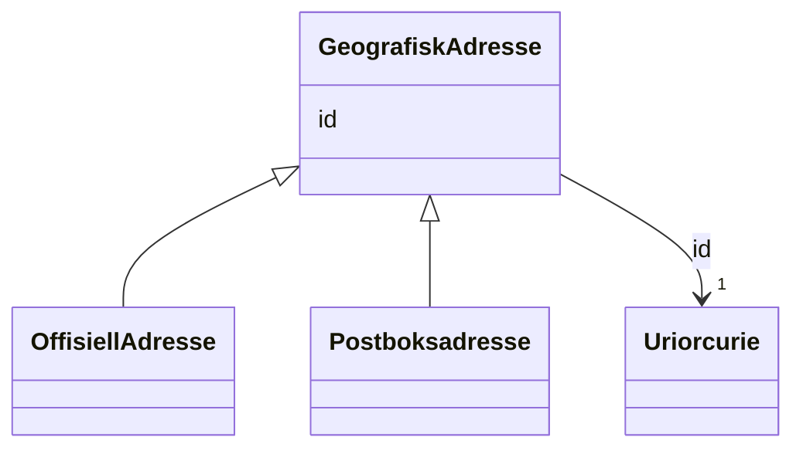

# Class: GeografiskAdresse 


_Abstrakt basisklasse for norske adressar. Konkrete subklassar er OffisiellAdresse og Postboksadresse._


* __NOTE__: this is an abstract class and should not be instantiated directly


URI: [locn:Address](http://www.w3.org/ns/locn#Address)





## Inheritance
* **GeografiskAdresse**
    * [OffisiellAdresse](offisielladresse.md)
    * [Postboksadresse](postboksadresse.md)


## Class Properties

| Property | Value |
| --- | --- |
| Class URI | [locn:Address](http://www.w3.org/ns/locn#Address) |


## Eigenskapar


  
  


  
  


  
  


  
  
  
  
    
  


### Andre

| Namn | Kardinalitet og domene | Beskriving |
| --- | --- | --- |
| [id](id.md) | 1 <br/> [xsd:anyURI](http://www.w3.org/2001/XMLSchema#anyURI) | URI-identifikator for ressursen |


## Identifier and Mapping Information


### Schema Source


* from schema: https://data.norge.no/ngr/ngr-adresse


## Mappings

| Mapping Type | Mapped Value |
| ---  | ---  |
| self | locn:Address |
| native | https://data.norge.no/ngr/ngr-adresse/GeografiskAdresse |


## LinkML Source

<!-- TODO: investigate https://stackoverflow.com/questions/37606292/how-to-create-tabbed-code-blocks-in-mkdocs-or-sphinx -->

### Direct

<details>
```yaml
name: GeografiskAdresse
description: Abstrakt basisklasse for norske adressar. Konkrete subklassar er OffisiellAdresse
  og Postboksadresse.
from_schema: https://data.norge.no/ngr/ngr-adresse
rank: 1000
abstract: true
slots:
- id
class_uri: locn:Address

```
</details>

### Induced

<details>
```yaml
name: GeografiskAdresse
description: Abstrakt basisklasse for norske adressar. Konkrete subklassar er OffisiellAdresse
  og Postboksadresse.
from_schema: https://data.norge.no/ngr/ngr-adresse
rank: 1000
abstract: true
attributes:
  id:
    name: id
    description: URI-identifikator for ressursen.
    from_schema: https://data.norge.no/ngr/ngr-adresse
    rank: 1000
    identifier: true
    owner: GeografiskAdresse
    domain_of:
    - GeografiskAdresse
    - Adressenavn
    - Adresseomrade
    - Adressekode
    - Husnummer
    - Bruksenhetsnummer
    - Representasjonspunkt
    - GeografiskOmrade
    - Postboks
    - Bygning
    - Bruksenhet
    range: uriorcurie
    required: true
class_uri: locn:Address

```
</details>