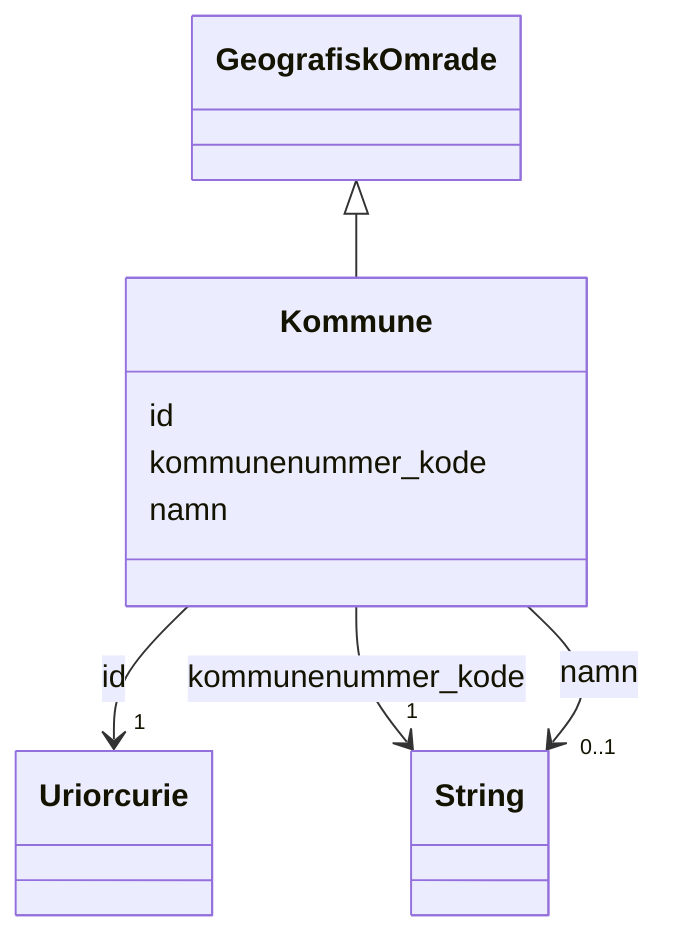

# Class: Kommune 


_Ein norsk kommune._


URI: [ngr:Kommune](https://data.norge.no/vocabulary/ngr-adresse#Kommune)





## Inheritance
* [GeografiskOmrade](geografiskomrade.md)
    * **Kommune**


## Class Properties

| Property | Value |
| --- | --- |
| Class URI | [ngr:Kommune](https://data.norge.no/vocabulary/ngr-adresse#Kommune) |


## Eigenskapar


  
  
    
  


### Obligatorisk

| Namn | Kardinalitet og domene | Beskriving |
| --- | --- | --- |
| [kommunenummer_kode](kommunenummer_kode.md) | 1 <br/> [xsd:string](http://www.w3.org/2001/XMLSchema#string) | Firesifra kommunenummer (t |


  
  


  
  


  
  
  
    
      
    
      
    
      
    
  
  


### Arva

| Namn | Kardinalitet og domene | Beskriving | Frå |
| --- | --- | --- | --- || [id](id.md) | 1 <br/> [xsd:anyURI](http://www.w3.org/2001/XMLSchema#anyURI) | URI-identifikator for ressursen | [GeografiskOmrade](geografiskomrade.md) |
| [namn](namn.md) | 0..1 <br/> [xsd:string](http://www.w3.org/2001/XMLSchema#string) | Namn på det geografiske området eller adressekomponenten | [GeografiskOmrade](geografiskomrade.md) |


## Usages

| used by | used in | type | used |
| ---  | --- | --- | --- |
| [AdresseContainer](adressecontainer.md) | [kommunar](kommunar.md) | range | [Kommune](kommune.md) |
| [OffisiellAdresse](offisielladresse.md) | [kommunenummer_ref](kommunenummer_ref.md) | range | [Kommune](kommune.md) |


## Identifier and Mapping Information


### Schema Source


* from schema: https://data.norge.no/ngr/ngr-adresse


## Mappings

| Mapping Type | Mapped Value |
| ---  | ---  |
| self | ngr:Kommune |
| native | https://data.norge.no/ngr/ngr-adresse/Kommune |


## Examples
### Example: Kommune-0301

```yaml
id: https://example.org/kommune/0301
namn: Oslo
kommunenummer_kode: '0301'

```


## LinkML Source

<!-- TODO: investigate https://stackoverflow.com/questions/37606292/how-to-create-tabbed-code-blocks-in-mkdocs-or-sphinx -->

### Direct

<details>
```yaml
name: Kommune
description: Ein norsk kommune.
from_schema: https://data.norge.no/ngr/ngr-adresse
rank: 1000
is_a: GeografiskOmrade
slots:
- kommunenummer_kode
slot_usage:
  kommunenummer_kode:
    name: kommunenummer_kode
    in_subset:
    - Obligatorisk
    required: true
class_uri: ngr:Kommune

```
</details>

### Induced

<details>
```yaml
name: Kommune
description: Ein norsk kommune.
from_schema: https://data.norge.no/ngr/ngr-adresse
rank: 1000
is_a: GeografiskOmrade
slot_usage:
  kommunenummer_kode:
    name: kommunenummer_kode
    in_subset:
    - Obligatorisk
    required: true
attributes:
  kommunenummer_kode:
    name: kommunenummer_kode
    description: Firesifra kommunenummer (t.d. 0301 for Oslo).
    in_subset:
    - Obligatorisk
    from_schema: https://data.norge.no/ngr/ngr-adresse
    rank: 1000
    slot_uri: ngr:kommunenummer
    owner: Kommune
    domain_of:
    - Kommune
    range: string
    required: true
  id:
    name: id
    description: URI-identifikator for ressursen.
    from_schema: https://data.norge.no/ngr/ngr-adresse
    rank: 1000
    identifier: true
    owner: Kommune
    domain_of:
    - GeografiskAdresse
    - Adressenavn
    - Adresseomrade
    - Adressekode
    - Husnummer
    - Bruksenhetsnummer
    - Representasjonspunkt
    - GeografiskOmrade
    - Postboks
    - Bygning
    - Bruksenhet
    range: uriorcurie
    required: true
  namn:
    name: namn
    description: Namn på det geografiske området eller adressekomponenten.
    from_schema: https://data.norge.no/ngr/ngr-adresse
    rank: 1000
    slot_uri: ngr:namn
    owner: Kommune
    domain_of:
    - Adresseomrade
    - GeografiskOmrade
    range: string
class_uri: ngr:Kommune

```
</details>