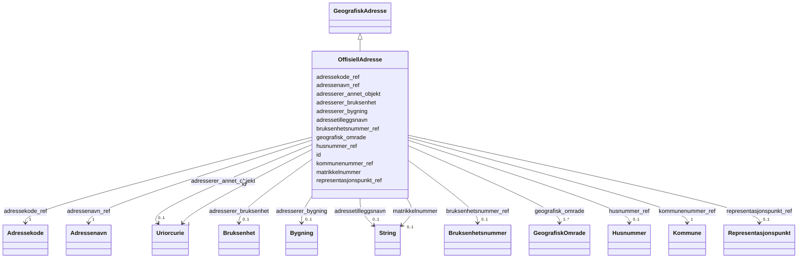

# Class: OffisiellAdresse 


_Ei offisiell adresse tildelt av kommunen, beståande av vegadresse (adressenavn + husnummer) eller matrikkelnummer. Forvaltas av Matrikkelen._


URI: [ngr:OffisiellAdresse](https://data.norge.no/vocabulary/ngr-adresse#OffisiellAdresse)





## Inheritance
* [GeografiskAdresse](geografiskadresse.md)
    * **OffisiellAdresse**


## Class Properties

| Property | Value |
| --- | --- |
| Class URI | [ngr:OffisiellAdresse](https://data.norge.no/vocabulary/ngr-adresse#OffisiellAdresse) |


## Eigenskapar


  
  
    
  

  
  
    
  

  
  
    
  

  
  

  
  

  
  

  
  

  
  

  
  

  
  

  
  

  
  
    
  


### Obligatorisk

| Namn | Kardinalitet og domene | Beskriving |
| --- | --- | --- |
| [kommunenummer_ref](kommunenummer_ref.md) | 1 <br/> [Kommune](kommune.md) | Kommunen denne adressa ligg i |
| [adressenavn_ref](adressenavn_ref.md) | 1 <br/> [Adressenavn](adressenavn.md) | Adressenavn (vegnamn o |
| [adressekode_ref](adressekode_ref.md) | 1 <br/> [Adressekode](adressekode.md) | Kommunal adressekode for adressa |
| [geografisk_omrade](geografisk_omrade.md) | 1..* <br/> [GeografiskOmrade](geografiskomrade.md) | Geografiske inndelingar (kommune, poststed, grunnkrets osv |


  
  

  
  

  
  

  
  
    
  

  
  

  
  
    
  

  
  

  
  

  
  

  
  

  
  

  
  


### Anbefalt

| Namn | Kardinalitet og domene | Beskriving |
| --- | --- | --- |
| [husnummer_ref](husnummer_ref.md) | 0..1 <br/> [Husnummer](husnummer.md) | Husnummer (nummer + bokstav) for adressa |
| [representasjonspunkt_ref](representasjonspunkt_ref.md) | 0..1 <br/> [Representasjonspunkt](representasjonspunkt.md) | Geografisk punkt som representerer adressas posisjon |


  
  

  
  

  
  

  
  

  
  
    
  

  
  

  
  
    
  

  
  
    
  

  
  
    
  

  
  
    
  

  
  
    
  

  
  


### Valgfri

| Namn | Kardinalitet og domene | Beskriving |
| --- | --- | --- |
| [bruksenhetsnummer_ref](bruksenhetsnummer_ref.md) | 0..1 <br/> [Bruksenhetsnummer](bruksenhetsnummer.md) | Bruksenhetsnummer for leilegheit eller lokale |
| [adressetilleggsnavn](adressetilleggsnavn.md) | 0..1 <br/> [xsd:string](http://www.w3.org/2001/XMLSchema#string) | Offisielt tilleggsnamn til vegadressa (t |
| [matrikkelnummer](matrikkelnummer.md) | 0..1 <br/> [xsd:string](http://www.w3.org/2001/XMLSchema#string) | Matrikkelnummer for adresser utan vegadresse (t |
| [adresserer_bygning](adresserer_bygning.md) | 0..1 <br/> [Bygning](bygning.md) | Bygning denne adressa er tildelt (forvaltar: Matrikkelen) |
| [adresserer_bruksenhet](adresserer_bruksenhet.md) | 0..1 <br/> [Bruksenhet](bruksenhet.md) | Brukseining denne adressa er tildelt (forvaltar: Matrikkelen) |
| [adresserer_annet_objekt](adresserer_annet_objekt.md) | 0..1 <br/> [xsd:anyURI](http://www.w3.org/2001/XMLSchema#anyURI) | Anna objekt (t |


  
  
  
    
      
    
      
    
      
    
  
  

  
  
  
    
      
    
      
    
      
    
  
  

  
  
  
    
      
    
      
    
      
    
  
  

  
  
  
    
      
    
      
    
      
    
  
  

  
  
  
    
      
    
      
    
      
    
  
  

  
  
  
    
      
    
      
    
      
    
  
  

  
  
  
    
      
    
      
    
      
    
  
  

  
  
  
    
      
    
      
    
      
    
  
  

  
  
  
    
      
    
      
    
      
    
  
  

  
  
  
    
      
    
      
    
      
    
  
  

  
  
  
    
      
    
      
    
      
    
  
  

  
  
  
    
      
    
      
    
      
    
  
  


### Arva

| Namn | Kardinalitet og domene | Beskriving | Frå |
| --- | --- | --- | --- || [id](id.md) | 1 <br/> [xsd:anyURI](http://www.w3.org/2001/XMLSchema#anyURI) | URI-identifikator for ressursen | [GeografiskAdresse](geografiskadresse.md) |


## Usages

| used by | used in | type | used |
| ---  | --- | --- | --- |
| [AdresseContainer](adressecontainer.md) | [offisielleAdresser](offisielleadresser.md) | range | [OffisiellAdresse](offisielladresse.md) |


## Identifier and Mapping Information


### Schema Source


* from schema: https://data.norge.no/ngr/ngr-adresse


## Mappings

| Mapping Type | Mapped Value |
| ---  | ---  |
| self | ngr:OffisiellAdresse |
| native | https://data.norge.no/ngr/ngr-adresse/OffisiellAdresse |


## Examples
### Example: OffisiellAdresse-1

```yaml
id: https://example.org/adresse/offisiell/1
kommunenummer_ref: https://example.org/kommune/0301
adressenavn_ref: https://example.org/adressenavn/13019
adressekode_ref: https://example.org/adressekode/13019
husnummer_ref: https://example.org/husnummer/1
representasjonspunkt_ref: https://example.org/punkt/1
geografisk_omrade:
- https://example.org/kommune/0301
- https://example.org/poststed/0150
- https://example.org/grunnkrets/03010101
adresserer_bygning: https://example.org/bygning/12345

```
### Example: OffisiellAdresse-2

```yaml
id: https://example.org/adresse/offisiell/2
kommunenummer_ref: https://example.org/kommune/0301
adressenavn_ref: https://example.org/adressenavn/13019
adressekode_ref: https://example.org/adressekode/13019
husnummer_ref: https://example.org/husnummer/2
bruksenhetsnummer_ref: https://example.org/bruksenhet-nr/1
representasjonspunkt_ref: https://example.org/punkt/1
geografisk_omrade:
- https://example.org/kommune/0301
- https://example.org/poststed/0150
adressetilleggsnavn: Storgarden
adresserer_bruksenhet: https://example.org/bruksenhet/1

```


## LinkML Source

<!-- TODO: investigate https://stackoverflow.com/questions/37606292/how-to-create-tabbed-code-blocks-in-mkdocs-or-sphinx -->

### Direct

<details>
```yaml
name: OffisiellAdresse
description: Ei offisiell adresse tildelt av kommunen, beståande av vegadresse (adressenavn
  + husnummer) eller matrikkelnummer. Forvaltas av Matrikkelen.
from_schema: https://data.norge.no/ngr/ngr-adresse
rank: 1000
is_a: GeografiskAdresse
slots:
- kommunenummer_ref
- adressenavn_ref
- adressekode_ref
- husnummer_ref
- bruksenhetsnummer_ref
- representasjonspunkt_ref
- adressetilleggsnavn
- matrikkelnummer
- adresserer_bygning
- adresserer_bruksenhet
- adresserer_annet_objekt
- geografisk_omrade
slot_usage:
  kommunenummer_ref:
    name: kommunenummer_ref
    in_subset:
    - Obligatorisk
    required: true
  adressenavn_ref:
    name: adressenavn_ref
    in_subset:
    - Obligatorisk
    required: true
  adressekode_ref:
    name: adressekode_ref
    in_subset:
    - Obligatorisk
    required: true
  husnummer_ref:
    name: husnummer_ref
    in_subset:
    - Anbefalt
  representasjonspunkt_ref:
    name: representasjonspunkt_ref
    in_subset:
    - Anbefalt
  geografisk_omrade:
    name: geografisk_omrade
    in_subset:
    - Obligatorisk
    required: true
  bruksenhetsnummer_ref:
    name: bruksenhetsnummer_ref
    in_subset:
    - Valgfri
  adressetilleggsnavn:
    name: adressetilleggsnavn
    in_subset:
    - Valgfri
  matrikkelnummer:
    name: matrikkelnummer
    in_subset:
    - Valgfri
  adresserer_bygning:
    name: adresserer_bygning
    in_subset:
    - Valgfri
  adresserer_bruksenhet:
    name: adresserer_bruksenhet
    in_subset:
    - Valgfri
  adresserer_annet_objekt:
    name: adresserer_annet_objekt
    in_subset:
    - Valgfri
class_uri: ngr:OffisiellAdresse

```
</details>

### Induced

<details>
```yaml
name: OffisiellAdresse
description: Ei offisiell adresse tildelt av kommunen, beståande av vegadresse (adressenavn
  + husnummer) eller matrikkelnummer. Forvaltas av Matrikkelen.
from_schema: https://data.norge.no/ngr/ngr-adresse
rank: 1000
is_a: GeografiskAdresse
slot_usage:
  kommunenummer_ref:
    name: kommunenummer_ref
    in_subset:
    - Obligatorisk
    required: true
  adressenavn_ref:
    name: adressenavn_ref
    in_subset:
    - Obligatorisk
    required: true
  adressekode_ref:
    name: adressekode_ref
    in_subset:
    - Obligatorisk
    required: true
  husnummer_ref:
    name: husnummer_ref
    in_subset:
    - Anbefalt
  representasjonspunkt_ref:
    name: representasjonspunkt_ref
    in_subset:
    - Anbefalt
  geografisk_omrade:
    name: geografisk_omrade
    in_subset:
    - Obligatorisk
    required: true
  bruksenhetsnummer_ref:
    name: bruksenhetsnummer_ref
    in_subset:
    - Valgfri
  adressetilleggsnavn:
    name: adressetilleggsnavn
    in_subset:
    - Valgfri
  matrikkelnummer:
    name: matrikkelnummer
    in_subset:
    - Valgfri
  adresserer_bygning:
    name: adresserer_bygning
    in_subset:
    - Valgfri
  adresserer_bruksenhet:
    name: adresserer_bruksenhet
    in_subset:
    - Valgfri
  adresserer_annet_objekt:
    name: adresserer_annet_objekt
    in_subset:
    - Valgfri
attributes:
  kommunenummer_ref:
    name: kommunenummer_ref
    description: Kommunen denne adressa ligg i.
    in_subset:
    - Obligatorisk
    from_schema: https://data.norge.no/ngr/ngr-adresse
    rank: 1000
    slot_uri: ngr:harKommunenummer
    owner: OffisiellAdresse
    domain_of:
    - OffisiellAdresse
    range: Kommune
    required: true
  adressenavn_ref:
    name: adressenavn_ref
    description: Adressenavn (vegnamn o.l.) for adressa.
    in_subset:
    - Obligatorisk
    from_schema: https://data.norge.no/ngr/ngr-adresse
    rank: 1000
    slot_uri: ngr:harAdressenavn
    owner: OffisiellAdresse
    domain_of:
    - OffisiellAdresse
    range: Adressenavn
    required: true
  adressekode_ref:
    name: adressekode_ref
    description: Kommunal adressekode for adressa.
    in_subset:
    - Obligatorisk
    from_schema: https://data.norge.no/ngr/ngr-adresse
    rank: 1000
    slot_uri: ngr:harAdressekode
    owner: OffisiellAdresse
    domain_of:
    - OffisiellAdresse
    range: Adressekode
    required: true
  husnummer_ref:
    name: husnummer_ref
    description: Husnummer (nummer + bokstav) for adressa.
    in_subset:
    - Anbefalt
    from_schema: https://data.norge.no/ngr/ngr-adresse
    rank: 1000
    slot_uri: ngr:harHusnummer
    owner: OffisiellAdresse
    domain_of:
    - OffisiellAdresse
    range: Husnummer
  bruksenhetsnummer_ref:
    name: bruksenhetsnummer_ref
    description: Bruksenhetsnummer for leilegheit eller lokale.
    in_subset:
    - Valgfri
    from_schema: https://data.norge.no/ngr/ngr-adresse
    rank: 1000
    slot_uri: ngr:harBruksenhetsnummer
    owner: OffisiellAdresse
    domain_of:
    - OffisiellAdresse
    range: Bruksenhetsnummer
  representasjonspunkt_ref:
    name: representasjonspunkt_ref
    description: Geografisk punkt som representerer adressas posisjon.
    in_subset:
    - Anbefalt
    from_schema: https://data.norge.no/ngr/ngr-adresse
    rank: 1000
    slot_uri: ngr:harRepresentasjonspunkt
    owner: OffisiellAdresse
    domain_of:
    - OffisiellAdresse
    range: Representasjonspunkt
  adressetilleggsnavn:
    name: adressetilleggsnavn
    description: Offisielt tilleggsnamn til vegadressa (t.d. gardsnamn, bruksnamn).
    in_subset:
    - Valgfri
    from_schema: https://data.norge.no/ngr/ngr-adresse
    rank: 1000
    slot_uri: ngr:adressetilleggsnavn
    owner: OffisiellAdresse
    domain_of:
    - OffisiellAdresse
    range: string
  matrikkelnummer:
    name: matrikkelnummer
    description: Matrikkelnummer for adresser utan vegadresse (t.d. 28/2-2).
    in_subset:
    - Valgfri
    from_schema: https://data.norge.no/ngr/ngr-adresse
    rank: 1000
    slot_uri: ngr:matrikkelnummer
    owner: OffisiellAdresse
    domain_of:
    - OffisiellAdresse
    range: string
  adresserer_bygning:
    name: adresserer_bygning
    description: 'Bygning denne adressa er tildelt (forvaltar: Matrikkelen).'
    in_subset:
    - Valgfri
    from_schema: https://data.norge.no/ngr/ngr-adresse
    rank: 1000
    slot_uri: ngr:adressererBygning
    owner: OffisiellAdresse
    domain_of:
    - OffisiellAdresse
    range: Bygning
  adresserer_bruksenhet:
    name: adresserer_bruksenhet
    description: 'Brukseining denne adressa er tildelt (forvaltar: Matrikkelen).'
    in_subset:
    - Valgfri
    from_schema: https://data.norge.no/ngr/ngr-adresse
    rank: 1000
    slot_uri: ngr:adressererBruksenhet
    owner: OffisiellAdresse
    domain_of:
    - OffisiellAdresse
    range: Bruksenhet
  adresserer_annet_objekt:
    name: adresserer_annet_objekt
    description: Anna objekt (t.d. badeplass, monument) denne adressa er tildelt.
    in_subset:
    - Valgfri
    from_schema: https://data.norge.no/ngr/ngr-adresse
    rank: 1000
    slot_uri: ngr:adressererAnnetObjekt
    owner: OffisiellAdresse
    domain_of:
    - OffisiellAdresse
    range: uriorcurie
  geografisk_omrade:
    name: geografisk_omrade
    description: Geografiske inndelingar (kommune, poststed, grunnkrets osv.) adressa
      ligg i.
    in_subset:
    - Obligatorisk
    from_schema: https://data.norge.no/ngr/ngr-adresse
    rank: 1000
    slot_uri: ngr:referererTilGeografiskOmrade
    owner: OffisiellAdresse
    domain_of:
    - OffisiellAdresse
    range: GeografiskOmrade
    required: true
    multivalued: true
  id:
    name: id
    description: URI-identifikator for ressursen.
    from_schema: https://data.norge.no/ngr/ngr-adresse
    rank: 1000
    identifier: true
    owner: OffisiellAdresse
    domain_of:
    - GeografiskAdresse
    - Adressenavn
    - Adresseomrade
    - Adressekode
    - Husnummer
    - Bruksenhetsnummer
    - Representasjonspunkt
    - GeografiskOmrade
    - Postboks
    - Bygning
    - Bruksenhet
    range: uriorcurie
    required: true
class_uri: ngr:OffisiellAdresse

```
</details>