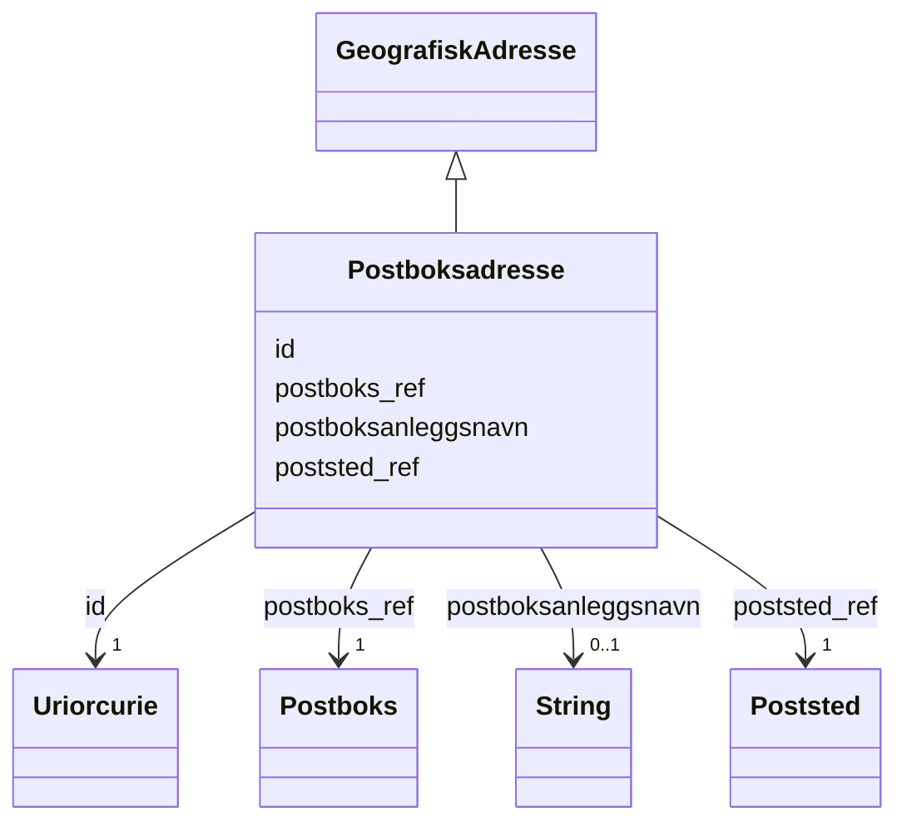

# Class: Postboksadresse 


_Ei postboksadresse registrert i Postboksregisteret (Posten Norge)._


URI: [ngr:Postboksadresse](https://data.norge.no/vocabulary/ngr-adresse#Postboksadresse)





## Inheritance
* [GeografiskAdresse](geografiskadresse.md)
    * **Postboksadresse**


## Class Properties

| Property | Value |
| --- | --- |
| Class URI | [ngr:Postboksadresse](https://data.norge.no/vocabulary/ngr-adresse#Postboksadresse) |


## Eigenskapar


  
  
    
  

  
  
    
  

  
  


### Obligatorisk

| Namn | Kardinalitet og domene | Beskriving |
| --- | --- | --- |
| [postboks_ref](postboks_ref.md) | 1 <br/> [Postboks](postboks.md) | Postboksen denne postboksadressa tilhøyrer |
| [poststed_ref](poststed_ref.md) | 1 <br/> [Poststed](poststed.md) | Poststedet (postnummer) denne adressa høyrer til |


  
  

  
  

  
  


  
  

  
  

  
  
    
  


### Valgfri

| Namn | Kardinalitet og domene | Beskriving |
| --- | --- | --- |
| [postboksanleggsnavn](postboksanleggsnavn.md) | 0..1 <br/> [xsd:string](http://www.w3.org/2001/XMLSchema#string) | Namn på postboksanlegget (t |


  
  
  
    
      
    
      
    
      
    
  
  

  
  
  
    
      
    
      
    
      
    
  
  

  
  
  
    
      
    
      
    
      
    
  
  


### Arva

| Namn | Kardinalitet og domene | Beskriving | Frå |
| --- | --- | --- | --- || [id](id.md) | 1 <br/> [xsd:anyURI](http://www.w3.org/2001/XMLSchema#anyURI) | URI-identifikator for ressursen | [GeografiskAdresse](geografiskadresse.md) |


## Usages

| used by | used in | type | used |
| ---  | --- | --- | --- |
| [AdresseContainer](adressecontainer.md) | [postboksadresser](postboksadresser.md) | range | [Postboksadresse](postboksadresse.md) |


## Identifier and Mapping Information


### Schema Source


* from schema: https://data.norge.no/ngr/ngr-adresse


## Mappings

| Mapping Type | Mapped Value |
| ---  | ---  |
| self | ngr:Postboksadresse |
| native | https://data.norge.no/ngr/ngr-adresse/Postboksadresse |


## Examples
### Example: Postboksadresse-1

```yaml
id: https://example.org/adresse/postboks/1
postboks_ref: https://example.org/postboks/1
poststed_ref: https://example.org/poststed/0101
postboksanleggsnavn: Digdir

```


## LinkML Source

<!-- TODO: investigate https://stackoverflow.com/questions/37606292/how-to-create-tabbed-code-blocks-in-mkdocs-or-sphinx -->

### Direct

<details>
```yaml
name: Postboksadresse
description: Ei postboksadresse registrert i Postboksregisteret (Posten Norge).
from_schema: https://data.norge.no/ngr/ngr-adresse
rank: 1000
is_a: GeografiskAdresse
slots:
- postboks_ref
- poststed_ref
- postboksanleggsnavn
slot_usage:
  postboks_ref:
    name: postboks_ref
    in_subset:
    - Obligatorisk
    required: true
  poststed_ref:
    name: poststed_ref
    in_subset:
    - Obligatorisk
    required: true
  postboksanleggsnavn:
    name: postboksanleggsnavn
    in_subset:
    - Valgfri
class_uri: ngr:Postboksadresse

```
</details>

### Induced

<details>
```yaml
name: Postboksadresse
description: Ei postboksadresse registrert i Postboksregisteret (Posten Norge).
from_schema: https://data.norge.no/ngr/ngr-adresse
rank: 1000
is_a: GeografiskAdresse
slot_usage:
  postboks_ref:
    name: postboks_ref
    in_subset:
    - Obligatorisk
    required: true
  poststed_ref:
    name: poststed_ref
    in_subset:
    - Obligatorisk
    required: true
  postboksanleggsnavn:
    name: postboksanleggsnavn
    in_subset:
    - Valgfri
attributes:
  postboks_ref:
    name: postboks_ref
    description: Postboksen denne postboksadressa tilhøyrer.
    in_subset:
    - Obligatorisk
    from_schema: https://data.norge.no/ngr/ngr-adresse
    rank: 1000
    slot_uri: ngr:harPostboks
    owner: Postboksadresse
    domain_of:
    - Postboksadresse
    range: Postboks
    required: true
  poststed_ref:
    name: poststed_ref
    description: Poststedet (postnummer) denne adressa høyrer til.
    in_subset:
    - Obligatorisk
    from_schema: https://data.norge.no/ngr/ngr-adresse
    rank: 1000
    slot_uri: ngr:referererTilPoststed
    owner: Postboksadresse
    domain_of:
    - Postboksadresse
    range: Poststed
    required: true
  postboksanleggsnavn:
    name: postboksanleggsnavn
    description: Namn på postboksanlegget (t.d. bedriftsnamn, institusjon).
    in_subset:
    - Valgfri
    from_schema: https://data.norge.no/ngr/ngr-adresse
    rank: 1000
    slot_uri: ngr:postboksanleggsnavn
    owner: Postboksadresse
    domain_of:
    - Postboksadresse
    range: string
  id:
    name: id
    description: URI-identifikator for ressursen.
    from_schema: https://data.norge.no/ngr/ngr-adresse
    rank: 1000
    identifier: true
    owner: Postboksadresse
    domain_of:
    - GeografiskAdresse
    - Adressenavn
    - Adresseomrade
    - Adressekode
    - Husnummer
    - Bruksenhetsnummer
    - Representasjonspunkt
    - GeografiskOmrade
    - Postboks
    - Bygning
    - Bruksenhet
    range: uriorcurie
    required: true
class_uri: ngr:Postboksadresse

```
</details>