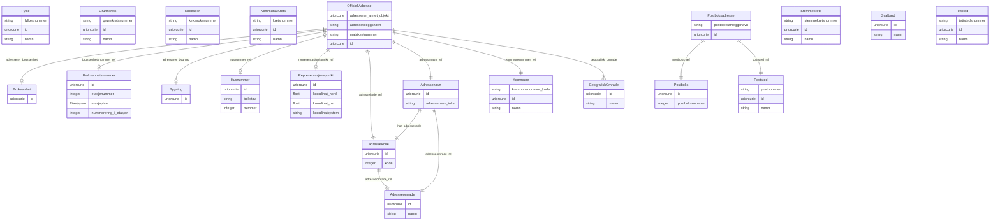

```mermaid
erDiagram
Adressekode {
    uriorcurie id  
    integer kode  
}
Adressenavn {
    uriorcurie id  
    string adressenavn_tekst  
}
Adresseomrade {
    uriorcurie id  
    string namn  
}
Bruksenhet {
    uriorcurie id  
}
Bruksenhetsnummer {
    uriorcurie id  
    integer etasjenummer  
    Etasjeplan etasjeplan  
    integer nummerering_i_etasjen  
}
Bygning {
    uriorcurie id  
}
Fylke {
    string fylkesnummer  
    uriorcurie id  
    string namn  
}
GeografiskOmrade {
    uriorcurie id  
    string namn  
}
Grunnkrets {
    string grunnkretsnummer  
    uriorcurie id  
    string namn  
}
Husnummer {
    uriorcurie id  
    string bokstav  
    integer nummer  
}
Kirkesokn {
    string kirkesoknnummer  
    uriorcurie id  
    string namn  
}
KommunalKrets {
    string kretsnummer  
    uriorcurie id  
    string namn  
}
Kommune {
    string kommunenummer_kode  
    uriorcurie id  
    string namn  
}
OffisiellAdresse {
    uriorcurie adresserer_annet_objekt  
    string adressetilleggsnavn  
    string matrikkelnummer  
    uriorcurie id  
}
Postboks {
    uriorcurie id  
    integer postboksnummer  
}
Postboksadresse {
    string postboksanleggsnavn  
    uriorcurie id  
}
Poststed {
    string postnummer  
    uriorcurie id  
    string namn  
}
Representasjonspunkt {
    uriorcurie id  
    float koordinat_nord  
    float koordinat_ost  
    string koordinatsystem  
}
Stemmekrets {
    string stemmekretsnummer  
    uriorcurie id  
    string namn  
}
Svalbard {
    uriorcurie id  
    string namn  
}
Tettsted {
    string tettstedsnummer  
    uriorcurie id  
    string namn  
}

Adressekode ||--|o Adresseomrade : "adresseomrade_ref"
Adressenavn ||--|| Adressekode : "har_adressekode"
Adressenavn ||--|| Adresseomrade : "adresseomrade_ref"
OffisiellAdresse ||--|o Bruksenhet : "adresserer_bruksenhet"
OffisiellAdresse ||--|o Bruksenhetsnummer : "bruksenhetsnummer_ref"
OffisiellAdresse ||--|o Bygning : "adresserer_bygning"
OffisiellAdresse ||--|o Husnummer : "husnummer_ref"
OffisiellAdresse ||--|o Representasjonspunkt : "representasjonspunkt_ref"
OffisiellAdresse ||--|| Adressekode : "adressekode_ref"
OffisiellAdresse ||--|| Adressenavn : "adressenavn_ref"
OffisiellAdresse ||--|| Kommune : "kommunenummer_ref"
OffisiellAdresse ||--}| GeografiskOmrade : "geografisk_omrade"
Postboksadresse ||--|| Postboks : "postboks_ref"
Postboksadresse ||--|| Poststed : "poststed_ref"

```

