# ngr-eiendom

```mermaid
erDiagram
Andel {
    uriorcurie id  
}
Anleggseiendom {
    uriorcurie id  
}
Anleggsprojeksjonsflate {
    uriorcurie id  
}
AnnenMatrikkelenhet {
    uriorcurie id  
}
Borettslag {
    uriorcurie id  
}
Borettslagsandel {
    uriorcurie id  
}
Bruksenhet {
    uriorcurie id  
}
Bruksenhetsnummer {
    uriorcurie id  
    integer etasjenummer  
    Etasjeplan etasjeplan  
    integer nummerering_i_etasjen  
}
Bruksnummer {
    uriorcurie id  
    integer bruksnummer_verdi  
}
Bygning {
    uriorcurie id  
}
Bygningsnummer {
    uriorcurie id  
    integer bygningsnummer_verdi  
}
Eierforhold {
    uriorcurie id  
}
Eierseksjon {
    uriorcurie id  
}
Etasje {
    uriorcurie id  
    integer etasjenummer  
}
FastEiendom {
    uriorcurie id  
}
Festegrunn {
    uriorcurie id  
}
Festenummer {
    uriorcurie id  
    integer festenummer_verdi  
}
Gaardsnummer {
    uriorcurie id  
    integer gaardsnummer_verdi  
}
Grunneiendom {
    uriorcurie id  
}
HjemmelTilEiendomsrett {
    uriorcurie id  
}
HjemmelTilFesterett {
    uriorcurie id  
}
HjemmelTilFramfesterett {
    uriorcurie id  
}
Hovedenhet {
    uriorcurie id  
}
IkkeTinglystEierforhold {
    uriorcurie id  
}
Jordsameie {
    uriorcurie id  
}
Kommune {
    uriorcurie id  
    string kommunenummer_verdi  
}
Kommunenummer {
    uriorcurie id  
    string kommunenummer_verdi  
}
Matrikkelenhet {
    uriorcurie id  
}
Matrikkelnummer {
    uriorcurie id  
}
OffisiellAdresse {
    uriorcurie id  
}
Person {
    uriorcurie id  
}
Representasjonspunkt {
    uriorcurie id  
    float koordinat_nord  
    float koordinat_ost  
    string koordinatsystem  
}
RettighetForAaBenytteEiendom {
    uriorcurie id  
}
Rettighetshaver {
    uriorcurie id  
}
SamletFastEiendom {
    uriorcurie id  
}
Seksjonsnummer {
    uriorcurie id  
    integer seksjonsnummer_verdi  
}
Teig {
    uriorcurie id  
}
TinglystEierforhold {
    uriorcurie id  
}
TinglystHeftelse {
    uriorcurie id  
}
YtreInngang {
    uriorcurie id  
}

Andel ||--}| Rettighetshaver : "har_rettighetshaver"
Anleggseiendom ||--|o Anleggsprojeksjonsflate : "har_anleggsprojeksjonsflate"
Anleggseiendom ||--|| Kommune : "ligger_innenfor_kommune"
Anleggseiendom ||--|| Matrikkelnummer : "identifiseres_med"
Anleggseiendom ||--}o Teig : "er_del_av_teig, har_teig"
AnnenMatrikkelenhet ||--|o Anleggsprojeksjonsflate : "har_anleggsprojeksjonsflate"
AnnenMatrikkelenhet ||--|| Kommune : "ligger_innenfor_kommune"
AnnenMatrikkelenhet ||--|| Matrikkelnummer : "identifiseres_med"
AnnenMatrikkelenhet ||--}o Teig : "er_del_av_teig, har_teig"
Borettslag ||--|| Hovedenhet : "er_av_type_hovedenhet"
Borettslagsandel ||--|| Borettslag : "tilhoerer_borettslag"
Borettslagsandel ||--}o Eierforhold : "har_eierforhold"
Borettslagsandel ||--}o TinglystHeftelse : "har_tinglyst_heftelse"
Bruksenhet ||--|o Matrikkelenhet : "er_tilknyttet_matrikkelenhet"
Bruksenhet ||--|o OffisiellAdresse : "har_offisiell_adresse"
Bruksenhet ||--|| Bruksenhetsnummer : "har_bruksenhetsnummer"
Bruksenhet ||--}| Etasje : "ligger_i_etasje"
Bygning ||--|| Bygningsnummer : "har_bygningsnummer"
Bygning ||--|| Matrikkelenhet : "er_knyttet_til_matrikkelenhet"
Bygning ||--|| Representasjonspunkt : "har_representasjonspunkt"
Bygning ||--}o Bruksenhet : "har_bruksenhet"
Bygning ||--}o Etasje : "har_etasje"
Bygning ||--}o YtreInngang : "har_ytre_inngang"
Eierforhold ||--|o Borettslagsandel : "kan_gjelde_borettslagsandel"
Eierforhold ||--|o HjemmelTilEiendomsrett : "gjelder_hjemmel_eiendomsrett"
Eierforhold ||--|o HjemmelTilFesterett : "gjelder_hjemmel_festerett"
Eierforhold ||--|o HjemmelTilFramfesterett : "gjelder_hjemmel_framfesterett"
Eierforhold ||--|| Matrikkelenhet : "gjelder_matrikkelenhet"
Eierseksjon ||--|o Anleggsprojeksjonsflate : "har_anleggsprojeksjonsflate"
Eierseksjon ||--|o Matrikkelenhet : "kan_vaere_pa"
Eierseksjon ||--|| Kommune : "ligger_innenfor_kommune"
Eierseksjon ||--|| Matrikkelnummer : "identifiseres_med"
Eierseksjon ||--}o Teig : "er_del_av_teig, har_teig"
FastEiendom ||--|| Matrikkelenhet : "bestar_av_matrikkelenhet, identifiseres_av"
FastEiendom ||--}o Bygning : "bestar_av_bygning"
FastEiendom ||--}o Eierforhold : "har_eierforhold"
FastEiendom ||--}o RettighetForAaBenytteEiendom : "bestar_av_rettighet"
FastEiendom ||--}o TinglystHeftelse : "har_tinglyst_heftelse"
Festegrunn ||--|o Anleggsprojeksjonsflate : "har_anleggsprojeksjonsflate"
Festegrunn ||--|o Matrikkelenhet : "kan_vaere_pa"
Festegrunn ||--|| Kommune : "ligger_innenfor_kommune"
Festegrunn ||--|| Matrikkelnummer : "identifiseres_med"
Festegrunn ||--}o Teig : "er_del_av_teig, har_teig"
Grunneiendom ||--|o Anleggsprojeksjonsflate : "har_anleggsprojeksjonsflate"
Grunneiendom ||--|o Matrikkelenhet : "kan_vaere_pa"
Grunneiendom ||--|| Kommune : "ligger_innenfor_kommune"
Grunneiendom ||--|| Matrikkelnummer : "identifiseres_med"
Grunneiendom ||--}o Teig : "er_del_av_teig, har_teig"
HjemmelTilEiendomsrett ||--}| Andel : "har_andel"
HjemmelTilFesterett ||--}| Andel : "har_andel"
HjemmelTilFramfesterett ||--}| Andel : "har_andel"
IkkeTinglystEierforhold ||--|o Borettslagsandel : "kan_gjelde_borettslagsandel"
IkkeTinglystEierforhold ||--|o HjemmelTilEiendomsrett : "gjelder_hjemmel_eiendomsrett"
IkkeTinglystEierforhold ||--|o HjemmelTilFesterett : "gjelder_hjemmel_festerett"
IkkeTinglystEierforhold ||--|o HjemmelTilFramfesterett : "gjelder_hjemmel_framfesterett"
IkkeTinglystEierforhold ||--|| Matrikkelenhet : "gjelder_matrikkelenhet"
Jordsameie ||--|o Anleggsprojeksjonsflate : "har_anleggsprojeksjonsflate"
Jordsameie ||--|o Matrikkelenhet : "kan_vaere_pa"
Jordsameie ||--|| Kommune : "ligger_innenfor_kommune"
Jordsameie ||--|| Matrikkelnummer : "identifiseres_med"
Jordsameie ||--}o Teig : "er_del_av_teig, har_teig"
Matrikkelenhet ||--|o Anleggsprojeksjonsflate : "har_anleggsprojeksjonsflate"
Matrikkelenhet ||--|| Kommune : "ligger_innenfor_kommune"
Matrikkelenhet ||--|| Matrikkelnummer : "identifiseres_med"
Matrikkelenhet ||--}o Teig : "er_del_av_teig, har_teig"
Matrikkelnummer ||--|o Festenummer : "bestar_av_festenummer"
Matrikkelnummer ||--|o Seksjonsnummer : "bestar_av_seksjonsnummer"
Matrikkelnummer ||--|| Bruksnummer : "bestar_av_bruksnummer"
Matrikkelnummer ||--|| Gaardsnummer : "bestar_av_gaardsnummer"
Matrikkelnummer ||--|| Kommunenummer : "bestar_av_kommunenummer"
Rettighetshaver ||--|o Hovedenhet : "er_av_type_hovedenhet"
Rettighetshaver ||--|o Person : "er_av_type_person"
SamletFastEiendom ||--}| FastEiendom : "bestar_av_fast_eiendom"
TinglystEierforhold ||--|o Borettslagsandel : "kan_gjelde_borettslagsandel"
TinglystEierforhold ||--|o HjemmelTilEiendomsrett : "gjelder_hjemmel_eiendomsrett"
TinglystEierforhold ||--|o HjemmelTilFesterett : "gjelder_hjemmel_festerett"
TinglystEierforhold ||--|o HjemmelTilFramfesterett : "gjelder_hjemmel_framfesterett"
TinglystEierforhold ||--|| Matrikkelenhet : "gjelder_matrikkelenhet"
YtreInngang ||--|o OffisiellAdresse : "har_offisiell_adresse"
YtreInngang ||--}| Bruksenhet : "gjelder_bruksenhet"


```

Domenemodell for norske eigedomsdata basert på Nasjonale grunndata (utkast). Modellerer Fast eiendom, Borettslagsandel, Matrikkelenhet, Bygning, Eierforhold og tilknytta klasser. Basert på https://informasjonsforvaltning.github.io/nasjonale-grunndata/

URI: https://data.norge.no/linkml/ngr-eiendom

Name: ngr-eiendom

## Classes

### Obligatorisk

| Class | Description |
| --- | --- |
| [Andel](klasser/andel.md) | Ein eigarandel i eit heimelsdokument (også kalt eierandel) |
| [Borettslag](klasser/borettslag.md) | Eit burettslag er ein type hovudeining (juridisk person) som eig burettslagsb... |
| [Borettslagsandel](klasser/borettslagsandel.md) | Ein andel i eit burettslag som gir eksklusiv bruksrett til ein bestemt bustad... |
| [Bruksenhet](klasser/bruksenhet.md) | Ei brukseining (leilegheit, kontor o |
| [Bruksenhetsnummer](klasser/bruksenhetsnummer.md) | Identifikator for ei brukseining innanfor ein bygning, t |
| [Bruksnummer](klasser/bruksnummer.md) | Bruksnummer innanfor gardsnamnet |
| [Bygning](klasser/bygning.md) | Ein bygning registrert i Matrikkelen |
| [Bygningsnummer](klasser/bygningsnummer.md) | Offisiell identifikator for ein bygning i Matrikkelen |
| [Eierforhold](klasser/eierforhold.md) | Abstrakt klasse for eigarforhold forvalta av Grunnboka |
| [Etasje](klasser/etasje.md) | Ei etasje i ein bygning |
| [FastEiendom](klasser/fasteiendom.md) | Fast eiendom er eit grunnomgrep i eigedomsdomenet |
| [Festenummer](klasser/festenummer.md) | Festenummer, aktuelt berre for festegrunn (0 |
| [Gaardsnummer](klasser/gaardsnummer.md) | Gårdsnummer innanfor kommunen |
| [Hjemmel](klasser/hjemmel.md) | Abstrakt klasse for heimelsdokument |
| [Kommune](klasser/kommune.md) | Norsk kommune |
| [Kommunenummer](klasser/kommunenummer.md) | Firesifra kommunenummer (t |
| [Matrikkelenhet](klasser/matrikkelenhet.md) | Abstrakt overklasse for alle typar matrikkeleiningar registrert i Matrikkelen |
| [Matrikkelnummer](klasser/matrikkelnummer.md) | Offisiell identifikator for ei matrikkelenheit, beståande av kommunenummer, g... |
| [Representasjonspunkt](klasser/representasjonspunkt.md) | Geografisk punkt (koordinatpar) som representerer posisjonen til bygningen |
| [SamletFastEiendom](klasser/samletfasteiendom.md) | Samling av to eller fleire faste eigedommar som er organiserte saman |
| [Seksjonsnummer](klasser/seksjonsnummer.md) | Seksjonsnummer, aktuelt berre for eigarseksjonar (0 |
| [YtreInngang](klasser/ytreinngang.md) | Ytre inngang til ein bygning |

### Anbefalt

| Class | Description |
| --- | --- |
| [Eierseksjon](klasser/eierseksjon.md) | Ein eigarseksjon er ein eigarandel i ein seksjonert eigedom |

### Valgfri

| Class | Description |
| --- | --- |
| [Festegrunn](klasser/festegrunn.md) | Ein del av ei grunneigendom eller eit jordsameige som nokon har festa til |
| [Grunneiendom](klasser/grunneiendom.md) | Den vanlegaste typen matrikkelenheit |
| [Jordsameie](klasser/jordsameie.md) | Eit fellesareal som vert eigd av fleire eigedommar |
| [Rettighetshaver](klasser/rettighetshaver.md) | Den som har ein rett knytt til ein eigedom |

### Andre

| Class | Description |
| --- | --- |
| [Anleggseiendom](klasser/anleggseiendom.md) | Eit volum – ein bygning eller konstruksjon – oppretta frå ei eller fleire gru... |
| [Anleggsprojeksjonsflate](klasser/anleggsprojeksjonsflate.md) | Fotavtrykk av 3D-eigedommar (anleggseigedommar) |
| [AnnenMatrikkelenhet](klasser/annenmatrikkelenhet.md) | Matrikkelenheit som ikkje fell inn under dei andre underklassane |
| [HjemmelTilEiendomsrett](klasser/hjemmeltileiendomsrett.md) | Heimelsdokument for eigedomsrett (full eigarrett) |
| [HjemmelTilFesterett](klasser/hjemmeltilfesterett.md) | Heimelsdokument for festerett (langvarig bruksrett til festegrunn) |
| [HjemmelTilFramfesterett](klasser/hjemmeltilframfesterett.md) | Heimelsdokument for framfesterett (vidarefestekontrakt) |
| [Hovedenhet](klasser/hovedenhet.md) | Ei hovudeining i Einingsregisteret |
| [IkkeTinglystEierforhold](klasser/ikketinglysteierforhold.md) | Eigarforhold som ikkje er registrert i Grunnboka |
| [OffisiellAdresse](klasser/offisielladresse.md) | Offisiell adresse tildelt av kommunen |
| [Person](klasser/person.md) | Ein fysisk person |
| [RettighetForAaBenytteEiendom](klasser/rettighetforaabenytteeiendom.md) | Rettar og avtalar som er nødvendige for å kunne benytte eigedommen |
| [Teig](klasser/teig.md) | Eit samanhengande areal med same type grenser |
| [TinglystEierforhold](klasser/tinglysteierforhold.md) | Eigarforhold registrert (tinglyst) i Grunnboka |
| [TinglystHeftelse](klasser/tinglystheftelse.md) | Heftelse tinglyst i Grunnboka mot ein eigedom eller burettslagsandel |

## Slots

| Slot | Description |
| --- | --- |
| [andeler](klasser/andeler.md) |  |
| [andreMatrikkelenheter](klasser/andrematrikkelenheter.md) |  |
| [anleggseiendommer](klasser/anleggseiendommer.md) |  |
| [bestar_av_bruksnummer](klasser/bestar_av_bruksnummer.md) | Bruksnummerdelen av matrikkelnummeret |
| [bestar_av_bygning](klasser/bestar_av_bygning.md) | Bygning(ar) som inngår i denne faste eigedommen |
| [bestar_av_fast_eiendom](klasser/bestar_av_fast_eiendom.md) | Faste eigedommar som inngår i samlinga (minimum 2) |
| [bestar_av_festenummer](klasser/bestar_av_festenummer.md) | Festenummerdelen av matrikkelnummeret (berre for festegrunn) |
| [bestar_av_gaardsnummer](klasser/bestar_av_gaardsnummer.md) | Gårdsnummerdelen av matrikkelnummeret |
| [bestar_av_kommunenummer](klasser/bestar_av_kommunenummer.md) | Kommunenummerdelen av matrikkelnummeret |
| [bestar_av_matrikkelenhet](klasser/bestar_av_matrikkelenhet.md) | Matrikkeleininga denne faste eigedommen fysisk består av |
| [bestar_av_rettighet](klasser/bestar_av_rettighet.md) | Rettar som er nødvendige for å benytte eigedommen |
| [bestar_av_seksjonsnummer](klasser/bestar_av_seksjonsnummer.md) | Seksjonsnummerdelen av matrikkelnummeret (berre for eigarseksjonar) |
| [borettslag](klasser/borettslag.md) |  |
| [borettslagsandeler](klasser/borettslagsandeler.md) |  |
| [bruksenheter](klasser/bruksenheter.md) |  |
| [bruksnummer_verdi](klasser/bruksnummer_verdi.md) | Bruksnummer innanfor gardsnamnet |
| [bygninger](klasser/bygninger.md) |  |
| [bygningsnummer_verdi](klasser/bygningsnummer_verdi.md) | Unikt bygningsnummer i Matrikkelen |
| [eierseksjoner](klasser/eierseksjoner.md) |  |
| [er_av_type_hovedenhet](klasser/er_av_type_hovedenhet.md) | Hovudeininga (juridisk person) som er rettigheitshavar |
| [er_av_type_person](klasser/er_av_type_person.md) | Personen som er rettigheitshavar (fysisk person) |
| [er_del_av_teig](klasser/er_del_av_teig.md) | Teigen(e) matrikkeleininga er del av |
| [er_knyttet_til_matrikkelenhet](klasser/er_knyttet_til_matrikkelenhet.md) | Matrikkeleininga bygningen er knytt til |
| [er_tilknyttet_matrikkelenhet](klasser/er_tilknyttet_matrikkelenhet.md) | Matrikkeleininga brukseininga er knytt til |
| [etasjenummer](klasser/etasjenummer.md) | Etasjenummer (t |
| [etasjeplan](klasser/etasjeplan.md) | Kode for kva del av bygningen brukseininga ligg i (H/U/K/L/M) |
| [etasjer](klasser/etasjer.md) |  |
| [fasteEiendommer](klasser/fasteeiendommer.md) |  |
| [festegrunn](klasser/festegrunn.md) |  |
| [festenummer_verdi](klasser/festenummer_verdi.md) | Festenummer (0 |
| [gaardsnummer_verdi](klasser/gaardsnummer_verdi.md) | Gårdsnummer innanfor kommunen |
| [gjelder_bruksenhet](klasser/gjelder_bruksenhet.md) | Brukseiningane den ytre inngangen gir tilgang til |
| [gjelder_hjemmel_eiendomsrett](klasser/gjelder_hjemmel_eiendomsrett.md) | Heimelsdokument for eigedomsrett knytt til dette eigarforholdet |
| [gjelder_hjemmel_festerett](klasser/gjelder_hjemmel_festerett.md) | Heimelsdokument for festerett knytt til dette eigarforholdet |
| [gjelder_hjemmel_framfesterett](klasser/gjelder_hjemmel_framfesterett.md) | Heimelsdokument for framfesterett knytt til dette eigarforholdet |
| [gjelder_matrikkelenhet](klasser/gjelder_matrikkelenhet.md) | Matrikkeleininga dette eigarforholdet gjeld |
| [grunneiendommer](klasser/grunneiendommer.md) |  |
| [har_andel](klasser/har_andel.md) | Andel(ar) i heimelsdokumentet |
| [har_anleggsprojeksjonsflate](klasser/har_anleggsprojeksjonsflate.md) | Anleggsprojeksjonsflata (fotavtrykket) for anleggseigedommen |
| [har_bruksenhet](klasser/har_bruksenhet.md) | Brukseining(ar) i bygningen |
| [har_bruksenhetsnummer](klasser/har_bruksenhetsnummer.md) | Bruksenheitsnummeret for brukseininga |
| [har_bygningsnummer](klasser/har_bygningsnummer.md) | Offisiell bygningsnummer for bygningen |
| [har_eierforhold](klasser/har_eierforhold.md) | Eigarforhold knytt til eigedommen eller burettslagsandelen |
| [har_etasje](klasser/har_etasje.md) | Etasjar i bygningen |
| [har_offisiell_adresse](klasser/har_offisiell_adresse.md) | Offisiell adresse for den ytre inngangen eller brukseininga |
| [har_representasjonspunkt](klasser/har_representasjonspunkt.md) | Geografisk representasjonspunkt for bygningen |
| [har_rettighetshaver](klasser/har_rettighetshaver.md) | Rettigheitshavar(ar) for andelen |
| [har_teig](klasser/har_teig.md) | Teigen(e) som tilhøyrer matrikkeleininga |
| [har_tinglyst_heftelse](klasser/har_tinglyst_heftelse.md) | Tinglyste heftingar knytt til eigedommen eller burettslagsandelen |
| [har_ytre_inngang](klasser/har_ytre_inngang.md) | Ytre inngang(ar) til bygningen |
| [hjemmelEiendomsrett](klasser/hjemmeleiendomsrett.md) |  |
| [hjemmelFesterett](klasser/hjemmelfesterett.md) |  |
| [hjemmelFramfesterett](klasser/hjemmelframfesterett.md) |  |
| [id](klasser/id.md) | URI-identifikator for ressursen |
| [identifiseres_av](klasser/identifiseres_av.md) | Matrikkeleininga som identifiserer denne faste eigedommen |
| [identifiseres_med](klasser/identifiseres_med.md) | Matrikkelnummeret som identifiserer matrikkeleininga |
| [ikkeTinglystEierforhold](klasser/ikketinglysteierforhold.md) |  |
| [jordsameier](klasser/jordsameier.md) |  |
| [kan_gjelde_borettslagsandel](klasser/kan_gjelde_borettslagsandel.md) | Burettslagsandelen dette eigarforholdet eventuelt gjeld |
| [kan_vaere_pa](klasser/kan_vaere_pa.md) | Matrikkeleininga denne eininga ligg på eller er knytt til |
| [kommunenummer_verdi](klasser/kommunenummer_verdi.md) | Firesifra kommunenummer (t |
| [koordinat_nord](klasser/koordinat_nord.md) | Nordleg koordinat (Y) i det angitte koordinatsystemet |
| [koordinat_ost](klasser/koordinat_ost.md) | Austleg koordinat (X) i det angitte koordinatsystemet |
| [koordinatsystem](klasser/koordinatsystem.md) | Koordinatsystem/projeksjon (t |
| [ligger_i_etasje](klasser/ligger_i_etasje.md) | Etasjen(e) brukseininga ligg i |
| [ligger_innenfor_kommune](klasser/ligger_innenfor_kommune.md) | Kommunen matrikkeleininga ligg innanfor |
| [matrikkelnumre](klasser/matrikkelnumre.md) |  |
| [nummerering_i_etasjen](klasser/nummerering_i_etasjen.md) | Løpenummer for brukseininga innanfor etasjen |
| [representasjonspunkt](klasser/representasjonspunkt.md) |  |
| [rettigheter](klasser/rettigheter.md) |  |
| [rettighetshavere](klasser/rettighetshavere.md) |  |
| [samlinger](klasser/samlinger.md) |  |
| [seksjonsnummer_verdi](klasser/seksjonsnummer_verdi.md) | Seksjonsnummer (0 |
| [teiger](klasser/teiger.md) |  |
| [tilhoerer_borettslag](klasser/tilhoerer_borettslag.md) | Burettslagsandelen tilhøyrer dette burettslaget |
| [tinglystEierforhold](klasser/tinglysteierforhold.md) |  |
| [tinglystHeftelser](klasser/tinglystheftelser.md) |  |
| [ytreInnganger](klasser/ytreinnganger.md) |  |

## Enumerations

| Enumeration | Description |
| --- | --- |
| [Etasjeplan](klasser/etasjeplan.md) | Kode for kva del av bygningen ei brukseining ligg i |

## Types

| Type | Description |
| --- | --- |

## Subsets

| Subset | Description |
| --- | --- |
| [Anbefalt](klasser/anbefalt.md) | Anbefalte eigenskapar i domenemodellen |
| [Obligatorisk](klasser/obligatorisk.md) | Obligatoriske eigenskapar i domenemodellen |
| [Valgfri](klasser/valgfri.md) | Valfrie eigenskapar i domenemodellen |

## Generated artifacts

| Artefakt | Fil |
|----------|-----|
| SHACL shapes | [ngr-eiendom-shapes.ttl](ngr-eiendom-shapes.ttl) |
| JSON-LD kontekst | [ngr-eiendom-context.jsonld](ngr-eiendom-context.jsonld) |
| JSON Schema | [ngr-eiendom-schema.json](ngr-eiendom-schema.json) |
| OWL ontologi | [ngr-eiendom-ontology.ttl](ngr-eiendom-ontology.ttl) |
| RDF/Turtle skjema | [ngr-eiendom-schema.ttl](ngr-eiendom-schema.ttl) |
| Python-klasser | [ngr-eiendom-model.py](ngr-eiendom-model.py) |
| ER-diagram (Mermaid) | [ngr-eiendom-erdiagram.md](ngr-eiendom-erdiagram.md) |
| Eksempeldata (Turtle) | [ngr-eiendom-eksempel.ttl](ngr-eiendom-eksempel.ttl) |
