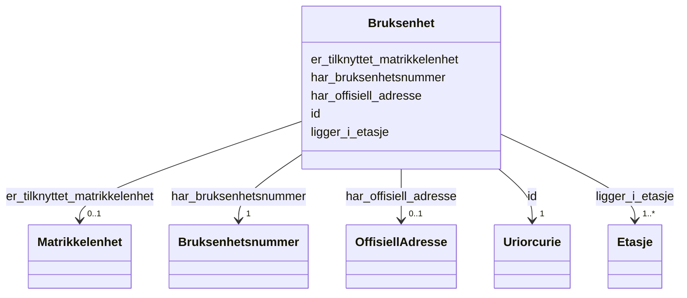

# Class: Bruksenhet 


_Ei brukseining (leilegheit, kontor o.l.) innanfor ein bygning. Har eit bruksenheitsnummer, ligg i minst éi etasje og kan vere knytt til ei matrikkelenheit._


URI: [ngre:Bruksenhet](https://data.norge.no/vocabulary/ngr-eiendom#Bruksenhet)





<!-- no inheritance hierarchy -->

## Class Properties

| Property | Value |
| --- | --- |
| Class URI | [ngre:Bruksenhet](https://data.norge.no/vocabulary/ngr-eiendom#Bruksenhet) |


## Eigenskapar


  
  

  
  
    
  

  
  

  
  

  
  
    
  


### Obligatorisk

| Namn | Kardinalitet og domene | Beskriving |
| --- | --- | --- |
| [har_bruksenhetsnummer](har_bruksenhetsnummer.md) | 1 <br/> [Bruksenhetsnummer](bruksenhetsnummer.md) | Bruksenheitsnummeret for brukseininga |
| [ligger_i_etasje](ligger_i_etasje.md) | 1..* <br/> [Etasje](etasje.md) | Etasjen(e) brukseininga ligg i |


  
  

  
  

  
  
    
  

  
  

  
  


### Anbefalt

| Namn | Kardinalitet og domene | Beskriving |
| --- | --- | --- |
| [er_tilknyttet_matrikkelenhet](er_tilknyttet_matrikkelenhet.md) | 0..1 <br/> [Matrikkelenhet](matrikkelenhet.md) | Matrikkeleininga brukseininga er knytt til |


  
  

  
  

  
  

  
  
    
  

  
  


### Valgfri

| Namn | Kardinalitet og domene | Beskriving |
| --- | --- | --- |
| [har_offisiell_adresse](har_offisiell_adresse.md) | 0..1 <br/> [OffisiellAdresse](offisielladresse.md) | Offisiell adresse for den ytre inngangen eller brukseininga |


  
  
  
  
    
  

  
  
  
    
      
    
      
    
      
    
  
  

  
  
  
    
      
    
      
    
      
    
  
  

  
  
  
    
      
    
      
    
      
    
  
  

  
  
  
    
      
    
      
    
      
    
  
  


### Andre

| Namn | Kardinalitet og domene | Beskriving |
| --- | --- | --- |
| [id](id.md) | 1 <br/> [xsd:anyURI](http://www.w3.org/2001/XMLSchema#anyURI) | URI-identifikator for ressursen |


## Usages

| used by | used in | type | used |
| ---  | --- | --- | --- |
| [EiendomContainer](eiendomcontainer.md) | [bruksenheter](bruksenheter.md) | range | [Bruksenhet](bruksenhet.md) |
| [Bygning](bygning.md) | [har_bruksenhet](har_bruksenhet.md) | range | [Bruksenhet](bruksenhet.md) |
| [YtreInngang](ytreinngang.md) | [gjelder_bruksenhet](gjelder_bruksenhet.md) | range | [Bruksenhet](bruksenhet.md) |


## Identifier and Mapping Information


### Schema Source


* from schema: https://data.norge.no/linkml/ngr-eiendom


## Mappings

| Mapping Type | Mapped Value |
| ---  | ---  |
| self | ngre:Bruksenhet |
| native | https://data.norge.no/linkml/ngr-eiendom/Bruksenhet |


## LinkML Source

<!-- TODO: investigate https://stackoverflow.com/questions/37606292/how-to-create-tabbed-code-blocks-in-mkdocs-or-sphinx -->

### Direct

<details>
```yaml
name: Bruksenhet
description: Ei brukseining (leilegheit, kontor o.l.) innanfor ein bygning. Har eit
  bruksenheitsnummer, ligg i minst éi etasje og kan vere knytt til ei matrikkelenheit.
from_schema: https://data.norge.no/linkml/ngr-eiendom
rank: 1000
slots:
- id
- har_bruksenhetsnummer
- er_tilknyttet_matrikkelenhet
- har_offisiell_adresse
- ligger_i_etasje
slot_usage:
  har_bruksenhetsnummer:
    name: har_bruksenhetsnummer
    in_subset:
    - Obligatorisk
    required: true
  ligger_i_etasje:
    name: ligger_i_etasje
    in_subset:
    - Obligatorisk
    required: true
    minimum_cardinality: 1
  er_tilknyttet_matrikkelenhet:
    name: er_tilknyttet_matrikkelenhet
    in_subset:
    - Anbefalt
  har_offisiell_adresse:
    name: har_offisiell_adresse
    in_subset:
    - Valgfri
class_uri: ngre:Bruksenhet

```
</details>

### Induced

<details>
```yaml
name: Bruksenhet
description: Ei brukseining (leilegheit, kontor o.l.) innanfor ein bygning. Har eit
  bruksenheitsnummer, ligg i minst éi etasje og kan vere knytt til ei matrikkelenheit.
from_schema: https://data.norge.no/linkml/ngr-eiendom
rank: 1000
slot_usage:
  har_bruksenhetsnummer:
    name: har_bruksenhetsnummer
    in_subset:
    - Obligatorisk
    required: true
  ligger_i_etasje:
    name: ligger_i_etasje
    in_subset:
    - Obligatorisk
    required: true
    minimum_cardinality: 1
  er_tilknyttet_matrikkelenhet:
    name: er_tilknyttet_matrikkelenhet
    in_subset:
    - Anbefalt
  har_offisiell_adresse:
    name: har_offisiell_adresse
    in_subset:
    - Valgfri
attributes:
  id:
    name: id
    description: URI-identifikator for ressursen.
    from_schema: https://data.norge.no/linkml/ngr-eiendom
    rank: 1000
    identifier: true
    alias: id
    owner: Bruksenhet
    domain_of:
    - FastEiendom
    - SamletFastEiendom
    - Borettslagsandel
    - Matrikkelenhet
    - Matrikkelnummer
    - Kommunenummer
    - Gaardsnummer
    - Bruksnummer
    - Festenummer
    - Seksjonsnummer
    - Bygning
    - Bygningsnummer
    - Representasjonspunkt
    - YtreInngang
    - Bruksenhet
    - Bruksenhetsnummer
    - Etasje
    - Teig
    - Anleggsprojeksjonsflate
    - Eierforhold
    - Hjemmel
    - Andel
    - Rettighetshaver
    - TinglystHeftelse
    - RettighetForAaBenytteEiendom
    - Borettslag
    - OffisiellAdresse
    - Person
    - Hovedenhet
    - Kommune
    range: uriorcurie
    required: true
  har_bruksenhetsnummer:
    name: har_bruksenhetsnummer
    description: Bruksenheitsnummeret for brukseininga.
    in_subset:
    - Obligatorisk
    from_schema: https://data.norge.no/linkml/ngr-eiendom
    rank: 1000
    slot_uri: ngre:harBruksenhetsnummer
    alias: har_bruksenhetsnummer
    owner: Bruksenhet
    domain_of:
    - Bruksenhet
    range: Bruksenhetsnummer
    required: true
  er_tilknyttet_matrikkelenhet:
    name: er_tilknyttet_matrikkelenhet
    description: Matrikkeleininga brukseininga er knytt til.
    in_subset:
    - Anbefalt
    from_schema: https://data.norge.no/linkml/ngr-eiendom
    rank: 1000
    slot_uri: ngre:erTilknyttetMatrikkelenhet
    alias: er_tilknyttet_matrikkelenhet
    owner: Bruksenhet
    domain_of:
    - Bruksenhet
    range: Matrikkelenhet
  har_offisiell_adresse:
    name: har_offisiell_adresse
    description: Offisiell adresse for den ytre inngangen eller brukseininga.
    in_subset:
    - Valgfri
    from_schema: https://data.norge.no/linkml/ngr-eiendom
    rank: 1000
    slot_uri: ngre:harOffisiellAdresse
    alias: har_offisiell_adresse
    owner: Bruksenhet
    domain_of:
    - YtreInngang
    - Bruksenhet
    range: OffisiellAdresse
  ligger_i_etasje:
    name: ligger_i_etasje
    description: Etasjen(e) brukseininga ligg i.
    in_subset:
    - Obligatorisk
    from_schema: https://data.norge.no/linkml/ngr-eiendom
    rank: 1000
    slot_uri: ngre:liggerIEtasje
    alias: ligger_i_etasje
    owner: Bruksenhet
    domain_of:
    - Bruksenhet
    range: Etasje
    required: true
    multivalued: true
    minimum_cardinality: 1
class_uri: ngre:Bruksenhet

```
</details>