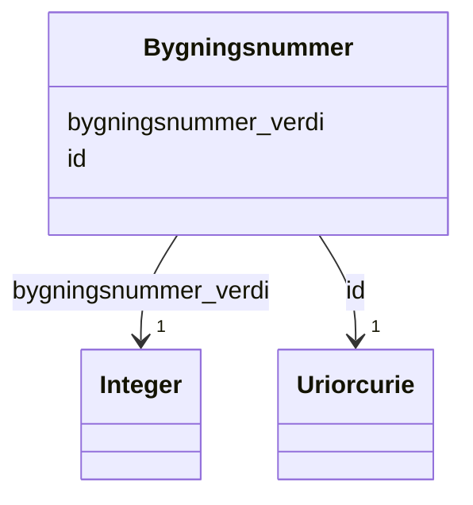

# Class: Bygningsnummer 


_Offisiell identifikator for ein bygning i Matrikkelen._


URI: [ngre:Bygningsnummer](https://data.norge.no/vocabulary/ngr-eiendom#Bygningsnummer)





<!-- no inheritance hierarchy -->

## Class Properties

| Property | Value |
| --- | --- |
| Class URI | [ngre:Bygningsnummer](https://data.norge.no/vocabulary/ngr-eiendom#Bygningsnummer) |


## Eigenskapar


  
  

  
  
    
  


### Obligatorisk

| Namn | Kardinalitet og domene | Beskriving |
| --- | --- | --- |
| [bygningsnummer_verdi](bygningsnummer_verdi.md) | 1 <br/> [xsd:integer](http://www.w3.org/2001/XMLSchema#integer) | Unikt bygningsnummer i Matrikkelen |


  
  

  
  


  
  

  
  


  
  
  
  
    
  

  
  
  
    
      
    
      
    
      
    
  
  


### Andre

| Namn | Kardinalitet og domene | Beskriving |
| --- | --- | --- |
| [id](id.md) | 1 <br/> [xsd:anyURI](http://www.w3.org/2001/XMLSchema#anyURI) | URI-identifikator for ressursen |


## Usages

| used by | used in | type | used |
| ---  | --- | --- | --- |
| [Bygning](bygning.md) | [har_bygningsnummer](har_bygningsnummer.md) | range | [Bygningsnummer](bygningsnummer.md) |


## Identifier and Mapping Information


### Schema Source


* from schema: https://data.norge.no/linkml/ngr-eiendom


## Mappings

| Mapping Type | Mapped Value |
| ---  | ---  |
| self | ngre:Bygningsnummer |
| native | https://data.norge.no/linkml/ngr-eiendom/Bygningsnummer |


## LinkML Source

<!-- TODO: investigate https://stackoverflow.com/questions/37606292/how-to-create-tabbed-code-blocks-in-mkdocs-or-sphinx -->

### Direct

<details>
```yaml
name: Bygningsnummer
description: Offisiell identifikator for ein bygning i Matrikkelen.
from_schema: https://data.norge.no/linkml/ngr-eiendom
rank: 1000
slots:
- id
- bygningsnummer_verdi
slot_usage:
  bygningsnummer_verdi:
    name: bygningsnummer_verdi
    in_subset:
    - Obligatorisk
    required: true
class_uri: ngre:Bygningsnummer

```
</details>

### Induced

<details>
```yaml
name: Bygningsnummer
description: Offisiell identifikator for ein bygning i Matrikkelen.
from_schema: https://data.norge.no/linkml/ngr-eiendom
rank: 1000
slot_usage:
  bygningsnummer_verdi:
    name: bygningsnummer_verdi
    in_subset:
    - Obligatorisk
    required: true
attributes:
  id:
    name: id
    description: URI-identifikator for ressursen.
    from_schema: https://data.norge.no/linkml/ngr-eiendom
    rank: 1000
    identifier: true
    alias: id
    owner: Bygningsnummer
    domain_of:
    - FastEiendom
    - SamletFastEiendom
    - Borettslagsandel
    - Matrikkelenhet
    - Matrikkelnummer
    - Kommunenummer
    - Gaardsnummer
    - Bruksnummer
    - Festenummer
    - Seksjonsnummer
    - Bygning
    - Bygningsnummer
    - Representasjonspunkt
    - YtreInngang
    - Bruksenhet
    - Bruksenhetsnummer
    - Etasje
    - Teig
    - Anleggsprojeksjonsflate
    - Eierforhold
    - Hjemmel
    - Andel
    - Rettighetshaver
    - TinglystHeftelse
    - RettighetForAaBenytteEiendom
    - Borettslag
    - OffisiellAdresse
    - Person
    - Hovedenhet
    - Kommune
    range: uriorcurie
    required: true
  bygningsnummer_verdi:
    name: bygningsnummer_verdi
    description: Unikt bygningsnummer i Matrikkelen.
    in_subset:
    - Obligatorisk
    from_schema: https://data.norge.no/linkml/ngr-eiendom
    rank: 1000
    slot_uri: ngre:bygningsnummer
    alias: bygningsnummer_verdi
    owner: Bygningsnummer
    domain_of:
    - Bygningsnummer
    range: integer
    required: true
class_uri: ngre:Bygningsnummer

```
</details>