# Class: EiendomContainer 


_Rotklasse for NGR-eiendom-datafiler. Held flate lister av alle instansierbare klassar; referansar mellom objekt brukar URI-lenking._


URI: [https://data.norge.no/linkml/ngr-eiendom/EiendomContainer](https://data.norge.no/linkml/ngr-eiendom/EiendomContainer)

```mermaid
 classDiagram
    class EiendomContainer
    click EiendomContainer href "../EiendomContainer/"
      EiendomContainer : andeler
        
          
    
        
        
        EiendomContainer --> "*" Andel : andeler
        click Andel href "../Andel/"
    

        
      EiendomContainer : andreMatrikkelenheter
        
          
    
        
        
        EiendomContainer --> "*" AnnenMatrikkelenhet : andreMatrikkelenheter
        click AnnenMatrikkelenhet href "../AnnenMatrikkelenhet/"
    

        
      EiendomContainer : anleggseiendommer
        
          
    
        
        
        EiendomContainer --> "*" Anleggseiendom : anleggseiendommer
        click Anleggseiendom href "../Anleggseiendom/"
    

        
      EiendomContainer : borettslag
        
          
    
        
        
        EiendomContainer --> "*" Borettslag : borettslag
        click Borettslag href "../Borettslag/"
    

        
      EiendomContainer : borettslagsandeler
        
          
    
        
        
        EiendomContainer --> "*" Borettslagsandel : borettslagsandeler
        click Borettslagsandel href "../Borettslagsandel/"
    

        
      EiendomContainer : bruksenheter
        
          
    
        
        
        EiendomContainer --> "*" Bruksenhet : bruksenheter
        click Bruksenhet href "../Bruksenhet/"
    

        
      EiendomContainer : bygninger
        
          
    
        
        
        EiendomContainer --> "*" Bygning : bygninger
        click Bygning href "../Bygning/"
    

        
      EiendomContainer : eierseksjoner
        
          
    
        
        
        EiendomContainer --> "*" Eierseksjon : eierseksjoner
        click Eierseksjon href "../Eierseksjon/"
    

        
      EiendomContainer : etasjer
        
          
    
        
        
        EiendomContainer --> "*" Etasje : etasjer
        click Etasje href "../Etasje/"
    

        
      EiendomContainer : fasteEiendommer
        
          
    
        
        
        EiendomContainer --> "*" FastEiendom : fasteEiendommer
        click FastEiendom href "../FastEiendom/"
    

        
      EiendomContainer : festegrunn
        
          
    
        
        
        EiendomContainer --> "*" Festegrunn : festegrunn
        click Festegrunn href "../Festegrunn/"
    

        
      EiendomContainer : grunneiendommer
        
          
    
        
        
        EiendomContainer --> "*" Grunneiendom : grunneiendommer
        click Grunneiendom href "../Grunneiendom/"
    

        
      EiendomContainer : hjemmelEiendomsrett
        
          
    
        
        
        EiendomContainer --> "*" HjemmelTilEiendomsrett : hjemmelEiendomsrett
        click HjemmelTilEiendomsrett href "../HjemmelTilEiendomsrett/"
    

        
      EiendomContainer : hjemmelFesterett
        
          
    
        
        
        EiendomContainer --> "*" HjemmelTilFesterett : hjemmelFesterett
        click HjemmelTilFesterett href "../HjemmelTilFesterett/"
    

        
      EiendomContainer : hjemmelFramfesterett
        
          
    
        
        
        EiendomContainer --> "*" HjemmelTilFramfesterett : hjemmelFramfesterett
        click HjemmelTilFramfesterett href "../HjemmelTilFramfesterett/"
    

        
      EiendomContainer : ikkeTinglystEierforhold
        
          
    
        
        
        EiendomContainer --> "*" IkkeTinglystEierforhold : ikkeTinglystEierforhold
        click IkkeTinglystEierforhold href "../IkkeTinglystEierforhold/"
    

        
      EiendomContainer : jordsameier
        
          
    
        
        
        EiendomContainer --> "*" Jordsameie : jordsameier
        click Jordsameie href "../Jordsameie/"
    

        
      EiendomContainer : matrikkelnumre
        
          
    
        
        
        EiendomContainer --> "*" Matrikkelnummer : matrikkelnumre
        click Matrikkelnummer href "../Matrikkelnummer/"
    

        
      EiendomContainer : representasjonspunkt
        
          
    
        
        
        EiendomContainer --> "*" Representasjonspunkt : representasjonspunkt
        click Representasjonspunkt href "../Representasjonspunkt/"
    

        
      EiendomContainer : rettigheter
        
          
    
        
        
        EiendomContainer --> "*" RettighetForAaBenytteEiendom : rettigheter
        click RettighetForAaBenytteEiendom href "../RettighetForAaBenytteEiendom/"
    

        
      EiendomContainer : rettighetshavere
        
          
    
        
        
        EiendomContainer --> "*" Rettighetshaver : rettighetshavere
        click Rettighetshaver href "../Rettighetshaver/"
    

        
      EiendomContainer : samlinger
        
          
    
        
        
        EiendomContainer --> "*" SamletFastEiendom : samlinger
        click SamletFastEiendom href "../SamletFastEiendom/"
    

        
      EiendomContainer : teiger
        
          
    
        
        
        EiendomContainer --> "*" Teig : teiger
        click Teig href "../Teig/"
    

        
      EiendomContainer : tinglystEierforhold
        
          
    
        
        
        EiendomContainer --> "*" TinglystEierforhold : tinglystEierforhold
        click TinglystEierforhold href "../TinglystEierforhold/"
    

        
      EiendomContainer : tinglystHeftelser
        
          
    
        
        
        EiendomContainer --> "*" TinglystHeftelse : tinglystHeftelser
        click TinglystHeftelse href "../TinglystHeftelse/"
    

        
      EiendomContainer : ytreInnganger
        
          
    
        
        
        EiendomContainer --> "*" YtreInngang : ytreInnganger
        click YtreInngang href "../YtreInngang/"
    

        
      
```





<!-- no inheritance hierarchy -->

## Class Properties

| Property | Value |
| --- | --- |
| Tree Root | Yes |


## Eigenskapar


  
  

  
  

  
  

  
  

  
  

  
  

  
  

  
  

  
  

  
  

  
  

  
  

  
  

  
  

  
  

  
  

  
  

  
  

  
  

  
  

  
  

  
  

  
  

  
  

  
  

  
  


  
  

  
  

  
  

  
  

  
  

  
  

  
  

  
  

  
  

  
  

  
  

  
  

  
  

  
  

  
  

  
  

  
  

  
  

  
  

  
  

  
  

  
  

  
  

  
  

  
  

  
  


  
  

  
  

  
  

  
  

  
  

  
  

  
  

  
  

  
  

  
  

  
  

  
  

  
  

  
  

  
  

  
  

  
  

  
  

  
  

  
  

  
  

  
  

  
  

  
  

  
  

  
  


  
  
  
  
    
  

  
  
  
  
    
  

  
  
  
  
    
  

  
  
  
  
    
  

  
  
  
  
    
  

  
  
  
  
    
  

  
  
  
  
    
  

  
  
  
  
    
  

  
  
  
  
    
  

  
  
  
  
    
  

  
  
  
  
    
  

  
  
  
  
    
  

  
  
  
  
    
  

  
  
  
  
    
  

  
  
  
  
    
  

  
  
  
  
    
  

  
  
  
  
    
  

  
  
  
  
    
  

  
  
  
  
    
  

  
  
  
  
    
  

  
  
  
  
    
  

  
  
  
  
    
  

  
  
  
  
    
  

  
  
  
  
    
  

  
  
  
  
    
  

  
  
  
  
    
  


### Andre

| Namn | Kardinalitet og domene | Beskriving |
| --- | --- | --- |
| [fasteEiendommer](fasteeiendommer.md) | * <br/> [FastEiendom](fasteiendom.md) |  |
| [samlinger](samlinger.md) | * <br/> [SamletFastEiendom](samletfasteiendom.md) |  |
| [borettslagsandeler](borettslagsandeler.md) | * <br/> [Borettslagsandel](borettslagsandel.md) |  |
| [grunneiendommer](grunneiendommer.md) | * <br/> [Grunneiendom](grunneiendom.md) |  |
| [festegrunn](festegrunn.md) | * <br/> [Festegrunn](festegrunn.md) |  |
| [jordsameier](jordsameier.md) | * <br/> [Jordsameie](jordsameie.md) |  |
| [eierseksjoner](eierseksjoner.md) | * <br/> [Eierseksjon](eierseksjon.md) |  |
| [anleggseiendommer](anleggseiendommer.md) | * <br/> [Anleggseiendom](anleggseiendom.md) |  |
| [andreMatrikkelenheter](andrematrikkelenheter.md) | * <br/> [AnnenMatrikkelenhet](annenmatrikkelenhet.md) |  |
| [matrikkelnumre](matrikkelnumre.md) | * <br/> [Matrikkelnummer](matrikkelnummer.md) |  |
| [bygninger](bygninger.md) | * <br/> [Bygning](bygning.md) |  |
| [ytreInnganger](ytreinnganger.md) | * <br/> [YtreInngang](ytreinngang.md) |  |
| [bruksenheter](bruksenheter.md) | * <br/> [Bruksenhet](bruksenhet.md) |  |
| [etasjer](etasjer.md) | * <br/> [Etasje](etasje.md) |  |
| [teiger](teiger.md) | * <br/> [Teig](teig.md) |  |
| [tinglystEierforhold](tinglysteierforhold.md) | * <br/> [TinglystEierforhold](tinglysteierforhold.md) |  |
| [ikkeTinglystEierforhold](ikketinglysteierforhold.md) | * <br/> [IkkeTinglystEierforhold](ikketinglysteierforhold.md) |  |
| [hjemmelEiendomsrett](hjemmeleiendomsrett.md) | * <br/> [HjemmelTilEiendomsrett](hjemmeltileiendomsrett.md) |  |
| [hjemmelFesterett](hjemmelfesterett.md) | * <br/> [HjemmelTilFesterett](hjemmeltilfesterett.md) |  |
| [hjemmelFramfesterett](hjemmelframfesterett.md) | * <br/> [HjemmelTilFramfesterett](hjemmeltilframfesterett.md) |  |
| [andeler](andeler.md) | * <br/> [Andel](andel.md) |  |
| [rettighetshavere](rettighetshavere.md) | * <br/> [Rettighetshaver](rettighetshaver.md) |  |
| [tinglystHeftelser](tinglystheftelser.md) | * <br/> [TinglystHeftelse](tinglystheftelse.md) |  |
| [rettigheter](rettigheter.md) | * <br/> [RettighetForAaBenytteEiendom](rettighetforaabenytteeiendom.md) |  |
| [borettslag](borettslag.md) | * <br/> [Borettslag](borettslag.md) |  |
| [representasjonspunkt](representasjonspunkt.md) | * <br/> [Representasjonspunkt](representasjonspunkt.md) |  |


## Identifier and Mapping Information


### Schema Source


* from schema: https://data.norge.no/linkml/ngr-eiendom


## Mappings

| Mapping Type | Mapped Value |
| ---  | ---  |
| self | https://data.norge.no/linkml/ngr-eiendom/EiendomContainer |
| native | https://data.norge.no/linkml/ngr-eiendom/EiendomContainer |


## LinkML Source

<!-- TODO: investigate https://stackoverflow.com/questions/37606292/how-to-create-tabbed-code-blocks-in-mkdocs-or-sphinx -->

### Direct

<details>
```yaml
name: EiendomContainer
description: Rotklasse for NGR-eiendom-datafiler. Held flate lister av alle instansierbare
  klassar; referansar mellom objekt brukar URI-lenking.
from_schema: https://data.norge.no/linkml/ngr-eiendom
rank: 1000
attributes:
  fasteEiendommer:
    name: fasteEiendommer
    from_schema: https://data.norge.no/linkml/ngr-eiendom
    rank: 1000
    domain_of:
    - EiendomContainer
    range: FastEiendom
    multivalued: true
    inlined: true
    inlined_as_list: true
  samlinger:
    name: samlinger
    from_schema: https://data.norge.no/linkml/ngr-eiendom
    rank: 1000
    domain_of:
    - EiendomContainer
    range: SamletFastEiendom
    multivalued: true
    inlined: true
    inlined_as_list: true
  borettslagsandeler:
    name: borettslagsandeler
    from_schema: https://data.norge.no/linkml/ngr-eiendom
    rank: 1000
    domain_of:
    - EiendomContainer
    range: Borettslagsandel
    multivalued: true
    inlined: true
    inlined_as_list: true
  grunneiendommer:
    name: grunneiendommer
    from_schema: https://data.norge.no/linkml/ngr-eiendom
    rank: 1000
    domain_of:
    - EiendomContainer
    range: Grunneiendom
    multivalued: true
    inlined: true
    inlined_as_list: true
  festegrunn:
    name: festegrunn
    from_schema: https://data.norge.no/linkml/ngr-eiendom
    rank: 1000
    domain_of:
    - EiendomContainer
    range: Festegrunn
    multivalued: true
    inlined: true
    inlined_as_list: true
  jordsameier:
    name: jordsameier
    from_schema: https://data.norge.no/linkml/ngr-eiendom
    rank: 1000
    domain_of:
    - EiendomContainer
    range: Jordsameie
    multivalued: true
    inlined: true
    inlined_as_list: true
  eierseksjoner:
    name: eierseksjoner
    from_schema: https://data.norge.no/linkml/ngr-eiendom
    rank: 1000
    domain_of:
    - EiendomContainer
    range: Eierseksjon
    multivalued: true
    inlined: true
    inlined_as_list: true
  anleggseiendommer:
    name: anleggseiendommer
    from_schema: https://data.norge.no/linkml/ngr-eiendom
    rank: 1000
    domain_of:
    - EiendomContainer
    range: Anleggseiendom
    multivalued: true
    inlined: true
    inlined_as_list: true
  andreMatrikkelenheter:
    name: andreMatrikkelenheter
    from_schema: https://data.norge.no/linkml/ngr-eiendom
    rank: 1000
    domain_of:
    - EiendomContainer
    range: AnnenMatrikkelenhet
    multivalued: true
    inlined: true
    inlined_as_list: true
  matrikkelnumre:
    name: matrikkelnumre
    from_schema: https://data.norge.no/linkml/ngr-eiendom
    rank: 1000
    domain_of:
    - EiendomContainer
    range: Matrikkelnummer
    multivalued: true
    inlined: true
    inlined_as_list: true
  bygninger:
    name: bygninger
    from_schema: https://data.norge.no/linkml/ngr-eiendom
    rank: 1000
    domain_of:
    - EiendomContainer
    range: Bygning
    multivalued: true
    inlined: true
    inlined_as_list: true
  ytreInnganger:
    name: ytreInnganger
    from_schema: https://data.norge.no/linkml/ngr-eiendom
    rank: 1000
    domain_of:
    - EiendomContainer
    range: YtreInngang
    multivalued: true
    inlined: true
    inlined_as_list: true
  bruksenheter:
    name: bruksenheter
    from_schema: https://data.norge.no/linkml/ngr-eiendom
    rank: 1000
    domain_of:
    - EiendomContainer
    range: Bruksenhet
    multivalued: true
    inlined: true
    inlined_as_list: true
  etasjer:
    name: etasjer
    from_schema: https://data.norge.no/linkml/ngr-eiendom
    rank: 1000
    domain_of:
    - EiendomContainer
    range: Etasje
    multivalued: true
    inlined: true
    inlined_as_list: true
  teiger:
    name: teiger
    from_schema: https://data.norge.no/linkml/ngr-eiendom
    rank: 1000
    domain_of:
    - EiendomContainer
    range: Teig
    multivalued: true
    inlined: true
    inlined_as_list: true
  tinglystEierforhold:
    name: tinglystEierforhold
    from_schema: https://data.norge.no/linkml/ngr-eiendom
    rank: 1000
    domain_of:
    - EiendomContainer
    range: TinglystEierforhold
    multivalued: true
    inlined: true
    inlined_as_list: true
  ikkeTinglystEierforhold:
    name: ikkeTinglystEierforhold
    from_schema: https://data.norge.no/linkml/ngr-eiendom
    rank: 1000
    domain_of:
    - EiendomContainer
    range: IkkeTinglystEierforhold
    multivalued: true
    inlined: true
    inlined_as_list: true
  hjemmelEiendomsrett:
    name: hjemmelEiendomsrett
    from_schema: https://data.norge.no/linkml/ngr-eiendom
    rank: 1000
    domain_of:
    - EiendomContainer
    range: HjemmelTilEiendomsrett
    multivalued: true
    inlined: true
    inlined_as_list: true
  hjemmelFesterett:
    name: hjemmelFesterett
    from_schema: https://data.norge.no/linkml/ngr-eiendom
    rank: 1000
    domain_of:
    - EiendomContainer
    range: HjemmelTilFesterett
    multivalued: true
    inlined: true
    inlined_as_list: true
  hjemmelFramfesterett:
    name: hjemmelFramfesterett
    from_schema: https://data.norge.no/linkml/ngr-eiendom
    rank: 1000
    domain_of:
    - EiendomContainer
    range: HjemmelTilFramfesterett
    multivalued: true
    inlined: true
    inlined_as_list: true
  andeler:
    name: andeler
    from_schema: https://data.norge.no/linkml/ngr-eiendom
    rank: 1000
    domain_of:
    - EiendomContainer
    range: Andel
    multivalued: true
    inlined: true
    inlined_as_list: true
  rettighetshavere:
    name: rettighetshavere
    from_schema: https://data.norge.no/linkml/ngr-eiendom
    rank: 1000
    domain_of:
    - EiendomContainer
    range: Rettighetshaver
    multivalued: true
    inlined: true
    inlined_as_list: true
  tinglystHeftelser:
    name: tinglystHeftelser
    from_schema: https://data.norge.no/linkml/ngr-eiendom
    rank: 1000
    domain_of:
    - EiendomContainer
    range: TinglystHeftelse
    multivalued: true
    inlined: true
    inlined_as_list: true
  rettigheter:
    name: rettigheter
    from_schema: https://data.norge.no/linkml/ngr-eiendom
    rank: 1000
    domain_of:
    - EiendomContainer
    range: RettighetForAaBenytteEiendom
    multivalued: true
    inlined: true
    inlined_as_list: true
  borettslag:
    name: borettslag
    from_schema: https://data.norge.no/linkml/ngr-eiendom
    rank: 1000
    domain_of:
    - EiendomContainer
    range: Borettslag
    multivalued: true
    inlined: true
    inlined_as_list: true
  representasjonspunkt:
    name: representasjonspunkt
    from_schema: https://data.norge.no/linkml/ngr-eiendom
    rank: 1000
    domain_of:
    - EiendomContainer
    range: Representasjonspunkt
    multivalued: true
    inlined: true
    inlined_as_list: true
tree_root: true

```
</details>

### Induced

<details>
```yaml
name: EiendomContainer
description: Rotklasse for NGR-eiendom-datafiler. Held flate lister av alle instansierbare
  klassar; referansar mellom objekt brukar URI-lenking.
from_schema: https://data.norge.no/linkml/ngr-eiendom
rank: 1000
attributes:
  fasteEiendommer:
    name: fasteEiendommer
    from_schema: https://data.norge.no/linkml/ngr-eiendom
    rank: 1000
    alias: fasteEiendommer
    owner: EiendomContainer
    domain_of:
    - EiendomContainer
    range: FastEiendom
    multivalued: true
    inlined_as_list: true
  samlinger:
    name: samlinger
    from_schema: https://data.norge.no/linkml/ngr-eiendom
    rank: 1000
    alias: samlinger
    owner: EiendomContainer
    domain_of:
    - EiendomContainer
    range: SamletFastEiendom
    multivalued: true
    inlined_as_list: true
  borettslagsandeler:
    name: borettslagsandeler
    from_schema: https://data.norge.no/linkml/ngr-eiendom
    rank: 1000
    alias: borettslagsandeler
    owner: EiendomContainer
    domain_of:
    - EiendomContainer
    range: Borettslagsandel
    multivalued: true
    inlined_as_list: true
  grunneiendommer:
    name: grunneiendommer
    from_schema: https://data.norge.no/linkml/ngr-eiendom
    rank: 1000
    alias: grunneiendommer
    owner: EiendomContainer
    domain_of:
    - EiendomContainer
    range: Grunneiendom
    multivalued: true
    inlined_as_list: true
  festegrunn:
    name: festegrunn
    from_schema: https://data.norge.no/linkml/ngr-eiendom
    rank: 1000
    alias: festegrunn
    owner: EiendomContainer
    domain_of:
    - EiendomContainer
    range: Festegrunn
    multivalued: true
    inlined_as_list: true
  jordsameier:
    name: jordsameier
    from_schema: https://data.norge.no/linkml/ngr-eiendom
    rank: 1000
    alias: jordsameier
    owner: EiendomContainer
    domain_of:
    - EiendomContainer
    range: Jordsameie
    multivalued: true
    inlined_as_list: true
  eierseksjoner:
    name: eierseksjoner
    from_schema: https://data.norge.no/linkml/ngr-eiendom
    rank: 1000
    alias: eierseksjoner
    owner: EiendomContainer
    domain_of:
    - EiendomContainer
    range: Eierseksjon
    multivalued: true
    inlined_as_list: true
  anleggseiendommer:
    name: anleggseiendommer
    from_schema: https://data.norge.no/linkml/ngr-eiendom
    rank: 1000
    alias: anleggseiendommer
    owner: EiendomContainer
    domain_of:
    - EiendomContainer
    range: Anleggseiendom
    multivalued: true
    inlined_as_list: true
  andreMatrikkelenheter:
    name: andreMatrikkelenheter
    from_schema: https://data.norge.no/linkml/ngr-eiendom
    rank: 1000
    alias: andreMatrikkelenheter
    owner: EiendomContainer
    domain_of:
    - EiendomContainer
    range: AnnenMatrikkelenhet
    multivalued: true
    inlined_as_list: true
  matrikkelnumre:
    name: matrikkelnumre
    from_schema: https://data.norge.no/linkml/ngr-eiendom
    rank: 1000
    alias: matrikkelnumre
    owner: EiendomContainer
    domain_of:
    - EiendomContainer
    range: Matrikkelnummer
    multivalued: true
    inlined_as_list: true
  bygninger:
    name: bygninger
    from_schema: https://data.norge.no/linkml/ngr-eiendom
    rank: 1000
    alias: bygninger
    owner: EiendomContainer
    domain_of:
    - EiendomContainer
    range: Bygning
    multivalued: true
    inlined_as_list: true
  ytreInnganger:
    name: ytreInnganger
    from_schema: https://data.norge.no/linkml/ngr-eiendom
    rank: 1000
    alias: ytreInnganger
    owner: EiendomContainer
    domain_of:
    - EiendomContainer
    range: YtreInngang
    multivalued: true
    inlined_as_list: true
  bruksenheter:
    name: bruksenheter
    from_schema: https://data.norge.no/linkml/ngr-eiendom
    rank: 1000
    alias: bruksenheter
    owner: EiendomContainer
    domain_of:
    - EiendomContainer
    range: Bruksenhet
    multivalued: true
    inlined_as_list: true
  etasjer:
    name: etasjer
    from_schema: https://data.norge.no/linkml/ngr-eiendom
    rank: 1000
    alias: etasjer
    owner: EiendomContainer
    domain_of:
    - EiendomContainer
    range: Etasje
    multivalued: true
    inlined_as_list: true
  teiger:
    name: teiger
    from_schema: https://data.norge.no/linkml/ngr-eiendom
    rank: 1000
    alias: teiger
    owner: EiendomContainer
    domain_of:
    - EiendomContainer
    range: Teig
    multivalued: true
    inlined_as_list: true
  tinglystEierforhold:
    name: tinglystEierforhold
    from_schema: https://data.norge.no/linkml/ngr-eiendom
    rank: 1000
    alias: tinglystEierforhold
    owner: EiendomContainer
    domain_of:
    - EiendomContainer
    range: TinglystEierforhold
    multivalued: true
    inlined_as_list: true
  ikkeTinglystEierforhold:
    name: ikkeTinglystEierforhold
    from_schema: https://data.norge.no/linkml/ngr-eiendom
    rank: 1000
    alias: ikkeTinglystEierforhold
    owner: EiendomContainer
    domain_of:
    - EiendomContainer
    range: IkkeTinglystEierforhold
    multivalued: true
    inlined_as_list: true
  hjemmelEiendomsrett:
    name: hjemmelEiendomsrett
    from_schema: https://data.norge.no/linkml/ngr-eiendom
    rank: 1000
    alias: hjemmelEiendomsrett
    owner: EiendomContainer
    domain_of:
    - EiendomContainer
    range: HjemmelTilEiendomsrett
    multivalued: true
    inlined_as_list: true
  hjemmelFesterett:
    name: hjemmelFesterett
    from_schema: https://data.norge.no/linkml/ngr-eiendom
    rank: 1000
    alias: hjemmelFesterett
    owner: EiendomContainer
    domain_of:
    - EiendomContainer
    range: HjemmelTilFesterett
    multivalued: true
    inlined_as_list: true
  hjemmelFramfesterett:
    name: hjemmelFramfesterett
    from_schema: https://data.norge.no/linkml/ngr-eiendom
    rank: 1000
    alias: hjemmelFramfesterett
    owner: EiendomContainer
    domain_of:
    - EiendomContainer
    range: HjemmelTilFramfesterett
    multivalued: true
    inlined_as_list: true
  andeler:
    name: andeler
    from_schema: https://data.norge.no/linkml/ngr-eiendom
    rank: 1000
    alias: andeler
    owner: EiendomContainer
    domain_of:
    - EiendomContainer
    range: Andel
    multivalued: true
    inlined_as_list: true
  rettighetshavere:
    name: rettighetshavere
    from_schema: https://data.norge.no/linkml/ngr-eiendom
    rank: 1000
    alias: rettighetshavere
    owner: EiendomContainer
    domain_of:
    - EiendomContainer
    range: Rettighetshaver
    multivalued: true
    inlined_as_list: true
  tinglystHeftelser:
    name: tinglystHeftelser
    from_schema: https://data.norge.no/linkml/ngr-eiendom
    rank: 1000
    alias: tinglystHeftelser
    owner: EiendomContainer
    domain_of:
    - EiendomContainer
    range: TinglystHeftelse
    multivalued: true
    inlined_as_list: true
  rettigheter:
    name: rettigheter
    from_schema: https://data.norge.no/linkml/ngr-eiendom
    rank: 1000
    alias: rettigheter
    owner: EiendomContainer
    domain_of:
    - EiendomContainer
    range: RettighetForAaBenytteEiendom
    multivalued: true
    inlined_as_list: true
  borettslag:
    name: borettslag
    from_schema: https://data.norge.no/linkml/ngr-eiendom
    rank: 1000
    alias: borettslag
    owner: EiendomContainer
    domain_of:
    - EiendomContainer
    range: Borettslag
    multivalued: true
    inlined_as_list: true
  representasjonspunkt:
    name: representasjonspunkt
    from_schema: https://data.norge.no/linkml/ngr-eiendom
    rank: 1000
    alias: representasjonspunkt
    owner: EiendomContainer
    domain_of:
    - EiendomContainer
    range: Representasjonspunkt
    multivalued: true
    inlined_as_list: true
tree_root: true

```
</details>