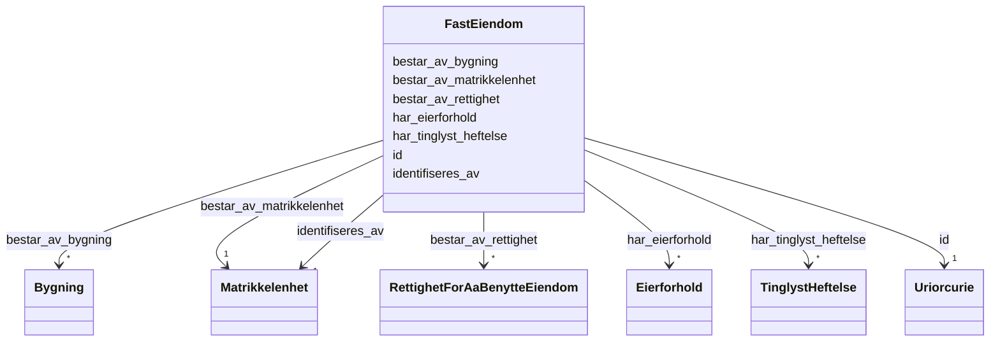

# Class: FastEiendom 


_Fast eiendom er eit grunnomgrep i eigedomsdomenet. Identifiserast av og består av éi matrikkelenheit, og kan innehalde bygningar og rettar som er nødvendige for å benytte eigedommen._


URI: [ngre:FastEiendom](https://data.norge.no/vocabulary/ngr-eiendom#FastEiendom)





<!-- no inheritance hierarchy -->

## Class Properties

| Property | Value |
| --- | --- |
| Class URI | [ngre:FastEiendom](https://data.norge.no/vocabulary/ngr-eiendom#FastEiendom) |


## Eigenskapar


  
  

  
  
    
  

  
  
    
  

  
  

  
  

  
  

  
  


### Obligatorisk

| Namn | Kardinalitet og domene | Beskriving |
| --- | --- | --- |
| [identifiseres_av](identifiseres_av.md) | 1 <br/> [Matrikkelenhet](matrikkelenhet.md) | Matrikkeleininga som identifiserer denne faste eigedommen |
| [bestar_av_matrikkelenhet](bestar_av_matrikkelenhet.md) | 1 <br/> [Matrikkelenhet](matrikkelenhet.md) | Matrikkeleininga denne faste eigedommen fysisk består av |


  
  

  
  

  
  

  
  

  
  

  
  
    
  

  
  


### Anbefalt

| Namn | Kardinalitet og domene | Beskriving |
| --- | --- | --- |
| [har_eierforhold](har_eierforhold.md) | * <br/> [Eierforhold](eierforhold.md) | Eigarforhold knytt til eigedommen eller burettslagsandelen |


  
  

  
  

  
  

  
  
    
  

  
  
    
  

  
  

  
  
    
  


### Valgfri

| Namn | Kardinalitet og domene | Beskriving |
| --- | --- | --- |
| [bestar_av_bygning](bestar_av_bygning.md) | * <br/> [Bygning](bygning.md) | Bygning(ar) som inngår i denne faste eigedommen |
| [bestar_av_rettighet](bestar_av_rettighet.md) | * <br/> [RettighetForAaBenytteEiendom](rettighetforaabenytteeiendom.md) | Rettar som er nødvendige for å benytte eigedommen |
| [har_tinglyst_heftelse](har_tinglyst_heftelse.md) | * <br/> [TinglystHeftelse](tinglystheftelse.md) | Tinglyste heftingar knytt til eigedommen eller burettslagsandelen |


  
  
  
  
    
  

  
  
  
    
      
    
      
    
      
    
  
  

  
  
  
    
      
    
      
    
      
    
  
  

  
  
  
    
      
    
      
    
      
    
  
  

  
  
  
    
      
    
      
    
      
    
  
  

  
  
  
    
      
    
      
    
      
    
  
  

  
  
  
    
      
    
      
    
      
    
  
  


### Andre

| Namn | Kardinalitet og domene | Beskriving |
| --- | --- | --- |
| [id](id.md) | 1 <br/> [xsd:anyURI](http://www.w3.org/2001/XMLSchema#anyURI) | URI-identifikator for ressursen |


## Usages

| used by | used in | type | used |
| ---  | --- | --- | --- |
| [EiendomContainer](eiendomcontainer.md) | [fasteEiendommer](fasteeiendommer.md) | range | [FastEiendom](fasteiendom.md) |
| [SamletFastEiendom](samletfasteiendom.md) | [bestar_av_fast_eiendom](bestar_av_fast_eiendom.md) | range | [FastEiendom](fasteiendom.md) |


## Identifier and Mapping Information


### Schema Source


* from schema: https://data.norge.no/linkml/ngr-eiendom


## Mappings

| Mapping Type | Mapped Value |
| ---  | ---  |
| self | ngre:FastEiendom |
| native | https://data.norge.no/linkml/ngr-eiendom/FastEiendom |


## LinkML Source

<!-- TODO: investigate https://stackoverflow.com/questions/37606292/how-to-create-tabbed-code-blocks-in-mkdocs-or-sphinx -->

### Direct

<details>
```yaml
name: FastEiendom
description: Fast eiendom er eit grunnomgrep i eigedomsdomenet. Identifiserast av
  og består av éi matrikkelenheit, og kan innehalde bygningar og rettar som er nødvendige
  for å benytte eigedommen.
from_schema: https://data.norge.no/linkml/ngr-eiendom
rank: 1000
slots:
- id
- identifiseres_av
- bestar_av_matrikkelenhet
- bestar_av_bygning
- bestar_av_rettighet
- har_eierforhold
- har_tinglyst_heftelse
slot_usage:
  identifiseres_av:
    name: identifiseres_av
    in_subset:
    - Obligatorisk
    required: true
  bestar_av_matrikkelenhet:
    name: bestar_av_matrikkelenhet
    in_subset:
    - Obligatorisk
    required: true
  bestar_av_bygning:
    name: bestar_av_bygning
    in_subset:
    - Valgfri
  bestar_av_rettighet:
    name: bestar_av_rettighet
    in_subset:
    - Valgfri
  har_eierforhold:
    name: har_eierforhold
    in_subset:
    - Anbefalt
  har_tinglyst_heftelse:
    name: har_tinglyst_heftelse
    in_subset:
    - Valgfri
class_uri: ngre:FastEiendom

```
</details>

### Induced

<details>
```yaml
name: FastEiendom
description: Fast eiendom er eit grunnomgrep i eigedomsdomenet. Identifiserast av
  og består av éi matrikkelenheit, og kan innehalde bygningar og rettar som er nødvendige
  for å benytte eigedommen.
from_schema: https://data.norge.no/linkml/ngr-eiendom
rank: 1000
slot_usage:
  identifiseres_av:
    name: identifiseres_av
    in_subset:
    - Obligatorisk
    required: true
  bestar_av_matrikkelenhet:
    name: bestar_av_matrikkelenhet
    in_subset:
    - Obligatorisk
    required: true
  bestar_av_bygning:
    name: bestar_av_bygning
    in_subset:
    - Valgfri
  bestar_av_rettighet:
    name: bestar_av_rettighet
    in_subset:
    - Valgfri
  har_eierforhold:
    name: har_eierforhold
    in_subset:
    - Anbefalt
  har_tinglyst_heftelse:
    name: har_tinglyst_heftelse
    in_subset:
    - Valgfri
attributes:
  id:
    name: id
    description: URI-identifikator for ressursen.
    from_schema: https://data.norge.no/linkml/ngr-eiendom
    rank: 1000
    identifier: true
    alias: id
    owner: FastEiendom
    domain_of:
    - FastEiendom
    - SamletFastEiendom
    - Borettslagsandel
    - Matrikkelenhet
    - Matrikkelnummer
    - Kommunenummer
    - Gaardsnummer
    - Bruksnummer
    - Festenummer
    - Seksjonsnummer
    - Bygning
    - Bygningsnummer
    - Representasjonspunkt
    - YtreInngang
    - Bruksenhet
    - Bruksenhetsnummer
    - Etasje
    - Teig
    - Anleggsprojeksjonsflate
    - Eierforhold
    - Hjemmel
    - Andel
    - Rettighetshaver
    - TinglystHeftelse
    - RettighetForAaBenytteEiendom
    - Borettslag
    - OffisiellAdresse
    - Person
    - Hovedenhet
    - Kommune
    range: uriorcurie
    required: true
  identifiseres_av:
    name: identifiseres_av
    description: Matrikkeleininga som identifiserer denne faste eigedommen.
    in_subset:
    - Obligatorisk
    from_schema: https://data.norge.no/linkml/ngr-eiendom
    rank: 1000
    slot_uri: ngre:identifiseresAv
    alias: identifiseres_av
    owner: FastEiendom
    domain_of:
    - FastEiendom
    range: Matrikkelenhet
    required: true
  bestar_av_matrikkelenhet:
    name: bestar_av_matrikkelenhet
    description: Matrikkeleininga denne faste eigedommen fysisk består av.
    in_subset:
    - Obligatorisk
    from_schema: https://data.norge.no/linkml/ngr-eiendom
    rank: 1000
    slot_uri: ngre:bestarAvMatrikkelenhet
    alias: bestar_av_matrikkelenhet
    owner: FastEiendom
    domain_of:
    - FastEiendom
    range: Matrikkelenhet
    required: true
  bestar_av_bygning:
    name: bestar_av_bygning
    description: Bygning(ar) som inngår i denne faste eigedommen.
    in_subset:
    - Valgfri
    from_schema: https://data.norge.no/linkml/ngr-eiendom
    rank: 1000
    slot_uri: ngre:bestarAvBygning
    alias: bestar_av_bygning
    owner: FastEiendom
    domain_of:
    - FastEiendom
    range: Bygning
    multivalued: true
  bestar_av_rettighet:
    name: bestar_av_rettighet
    description: Rettar som er nødvendige for å benytte eigedommen.
    in_subset:
    - Valgfri
    from_schema: https://data.norge.no/linkml/ngr-eiendom
    rank: 1000
    slot_uri: ngre:bestarAvRettighet
    alias: bestar_av_rettighet
    owner: FastEiendom
    domain_of:
    - FastEiendom
    range: RettighetForAaBenytteEiendom
    multivalued: true
  har_eierforhold:
    name: har_eierforhold
    description: Eigarforhold knytt til eigedommen eller burettslagsandelen.
    in_subset:
    - Anbefalt
    from_schema: https://data.norge.no/linkml/ngr-eiendom
    rank: 1000
    slot_uri: ngre:harEierforhold
    alias: har_eierforhold
    owner: FastEiendom
    domain_of:
    - FastEiendom
    - Borettslagsandel
    range: Eierforhold
    multivalued: true
  har_tinglyst_heftelse:
    name: har_tinglyst_heftelse
    description: Tinglyste heftingar knytt til eigedommen eller burettslagsandelen.
    in_subset:
    - Valgfri
    from_schema: https://data.norge.no/linkml/ngr-eiendom
    rank: 1000
    slot_uri: ngre:harTinglystHeftelse
    alias: har_tinglyst_heftelse
    owner: FastEiendom
    domain_of:
    - FastEiendom
    - Borettslagsandel
    range: TinglystHeftelse
    multivalued: true
class_uri: ngre:FastEiendom

```
</details>