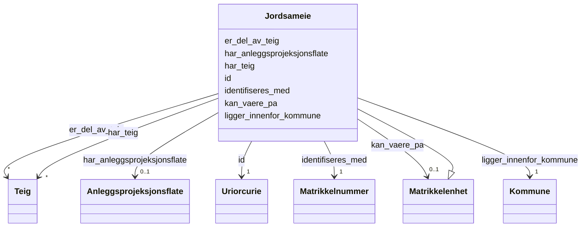

# Class: Jordsameie 


_Eit fellesareal som vert eigd av fleire eigedommar. Jordsameige er ein type realsameige. Eit umatrikulert jordsameige er eit eksisterande sameige som ikkje er registrert som eigen matrikkelenheit._


URI: [ngre:Jordsameie](https://data.norge.no/vocabulary/ngr-eiendom#Jordsameie)





## Inheritance
* [Matrikkelenhet](matrikkelenhet.md)
    * **Jordsameie**


## Class Properties

| Property | Value |
| --- | --- |
| Class URI | [ngre:Jordsameie](https://data.norge.no/vocabulary/ngr-eiendom#Jordsameie) |


## Eigenskapar


  
  


  
  


  
  
    
  


### Valgfri

| Namn | Kardinalitet og domene | Beskriving |
| --- | --- | --- |
| [kan_vaere_pa](kan_vaere_pa.md) | 0..1 <br/> [Matrikkelenhet](matrikkelenhet.md) | Matrikkeleininga denne eininga ligg på eller er knytt til |


  
  
  
    
      
    
      
    
      
    
  
  


### Arva

| Namn | Kardinalitet og domene | Beskriving | Frå |
| --- | --- | --- | --- || [id](id.md) | 1 <br/> [xsd:anyURI](http://www.w3.org/2001/XMLSchema#anyURI) | URI-identifikator for ressursen | [Matrikkelenhet](matrikkelenhet.md) |
| [identifiseres_med](identifiseres_med.md) | 1 <br/> [Matrikkelnummer](matrikkelnummer.md) | Matrikkelnummeret som identifiserer matrikkeleininga | [Matrikkelenhet](matrikkelenhet.md) |
| [ligger_innenfor_kommune](ligger_innenfor_kommune.md) | 1 <br/> [Kommune](kommune.md) | Kommunen matrikkeleininga ligg innanfor | [Matrikkelenhet](matrikkelenhet.md) |
| [er_del_av_teig](er_del_av_teig.md) | * <br/> [Teig](teig.md) | Teigen(e) matrikkeleininga er del av | [Matrikkelenhet](matrikkelenhet.md) |
| [har_teig](har_teig.md) | * <br/> [Teig](teig.md) | Teigen(e) som tilhøyrer matrikkeleininga | [Matrikkelenhet](matrikkelenhet.md) |
| [har_anleggsprojeksjonsflate](har_anleggsprojeksjonsflate.md) | 0..1 <br/> [Anleggsprojeksjonsflate](anleggsprojeksjonsflate.md) | Anleggsprojeksjonsflata (fotavtrykket) for anleggseigedommen | [Matrikkelenhet](matrikkelenhet.md) |


## Usages

| used by | used in | type | used |
| ---  | --- | --- | --- |
| [EiendomContainer](eiendomcontainer.md) | [jordsameier](jordsameier.md) | range | [Jordsameie](jordsameie.md) |


## Identifier and Mapping Information


### Schema Source


* from schema: https://data.norge.no/linkml/ngr-eiendom


## Mappings

| Mapping Type | Mapped Value |
| ---  | ---  |
| self | ngre:Jordsameie |
| native | https://data.norge.no/linkml/ngr-eiendom/Jordsameie |


## LinkML Source

<!-- TODO: investigate https://stackoverflow.com/questions/37606292/how-to-create-tabbed-code-blocks-in-mkdocs-or-sphinx -->

### Direct

<details>
```yaml
name: Jordsameie
description: Eit fellesareal som vert eigd av fleire eigedommar. Jordsameige er ein
  type realsameige. Eit umatrikulert jordsameige er eit eksisterande sameige som ikkje
  er registrert som eigen matrikkelenheit.
from_schema: https://data.norge.no/linkml/ngr-eiendom
rank: 1000
is_a: Matrikkelenhet
slots:
- kan_vaere_pa
slot_usage:
  kan_vaere_pa:
    name: kan_vaere_pa
    in_subset:
    - Valgfri
class_uri: ngre:Jordsameie

```
</details>

### Induced

<details>
```yaml
name: Jordsameie
description: Eit fellesareal som vert eigd av fleire eigedommar. Jordsameige er ein
  type realsameige. Eit umatrikulert jordsameige er eit eksisterande sameige som ikkje
  er registrert som eigen matrikkelenheit.
from_schema: https://data.norge.no/linkml/ngr-eiendom
rank: 1000
is_a: Matrikkelenhet
slot_usage:
  kan_vaere_pa:
    name: kan_vaere_pa
    in_subset:
    - Valgfri
attributes:
  kan_vaere_pa:
    name: kan_vaere_pa
    description: Matrikkeleininga denne eininga ligg på eller er knytt til. Festegrunn
      kan liggje på grunneigendom eller jordsameige; eigarseksjon kan liggje på grunneigendom,
      festegrunn eller anleggseigendom.
    in_subset:
    - Valgfri
    from_schema: https://data.norge.no/linkml/ngr-eiendom
    rank: 1000
    slot_uri: ngre:kanVaerePa
    alias: kan_vaere_pa
    owner: Jordsameie
    domain_of:
    - Grunneiendom
    - Festegrunn
    - Jordsameie
    - Eierseksjon
    range: Matrikkelenhet
  id:
    name: id
    description: URI-identifikator for ressursen.
    from_schema: https://data.norge.no/linkml/ngr-eiendom
    rank: 1000
    identifier: true
    alias: id
    owner: Jordsameie
    domain_of:
    - FastEiendom
    - SamletFastEiendom
    - Borettslagsandel
    - Matrikkelenhet
    - Matrikkelnummer
    - Kommunenummer
    - Gaardsnummer
    - Bruksnummer
    - Festenummer
    - Seksjonsnummer
    - Bygning
    - Bygningsnummer
    - Representasjonspunkt
    - YtreInngang
    - Bruksenhet
    - Bruksenhetsnummer
    - Etasje
    - Teig
    - Anleggsprojeksjonsflate
    - Eierforhold
    - Hjemmel
    - Andel
    - Rettighetshaver
    - TinglystHeftelse
    - RettighetForAaBenytteEiendom
    - Borettslag
    - OffisiellAdresse
    - Person
    - Hovedenhet
    - Kommune
    range: uriorcurie
    required: true
  identifiseres_med:
    name: identifiseres_med
    description: Matrikkelnummeret som identifiserer matrikkeleininga.
    in_subset:
    - Obligatorisk
    from_schema: https://data.norge.no/linkml/ngr-eiendom
    rank: 1000
    slot_uri: ngre:identifiseresMed
    alias: identifiseres_med
    owner: Jordsameie
    domain_of:
    - Matrikkelenhet
    range: Matrikkelnummer
    required: true
  ligger_innenfor_kommune:
    name: ligger_innenfor_kommune
    description: Kommunen matrikkeleininga ligg innanfor.
    in_subset:
    - Obligatorisk
    from_schema: https://data.norge.no/linkml/ngr-eiendom
    rank: 1000
    slot_uri: ngre:liggerInnenforKommune
    alias: ligger_innenfor_kommune
    owner: Jordsameie
    domain_of:
    - Matrikkelenhet
    range: Kommune
    required: true
  er_del_av_teig:
    name: er_del_av_teig
    description: Teigen(e) matrikkeleininga er del av.
    in_subset:
    - Anbefalt
    from_schema: https://data.norge.no/linkml/ngr-eiendom
    rank: 1000
    slot_uri: ngre:erDelAvTeig
    alias: er_del_av_teig
    owner: Jordsameie
    domain_of:
    - Matrikkelenhet
    range: Teig
    multivalued: true
  har_teig:
    name: har_teig
    description: Teigen(e) som tilhøyrer matrikkeleininga.
    in_subset:
    - Valgfri
    from_schema: https://data.norge.no/linkml/ngr-eiendom
    rank: 1000
    slot_uri: ngre:harTeig
    alias: har_teig
    owner: Jordsameie
    domain_of:
    - Matrikkelenhet
    range: Teig
    multivalued: true
  har_anleggsprojeksjonsflate:
    name: har_anleggsprojeksjonsflate
    description: Anleggsprojeksjonsflata (fotavtrykket) for anleggseigedommen.
    in_subset:
    - Valgfri
    from_schema: https://data.norge.no/linkml/ngr-eiendom
    rank: 1000
    slot_uri: ngre:harAnleggsprojeksjonsflate
    alias: har_anleggsprojeksjonsflate
    owner: Jordsameie
    domain_of:
    - Matrikkelenhet
    range: Anleggsprojeksjonsflate
class_uri: ngre:Jordsameie

```
</details>