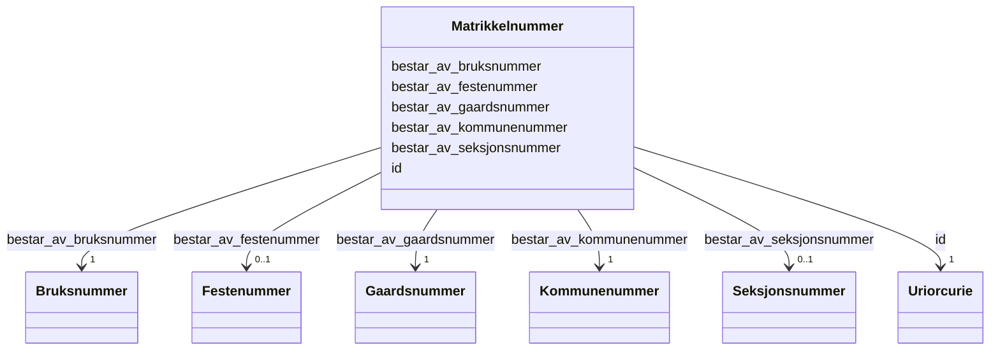

# Class: Matrikkelnummer 


_Offisiell identifikator for ei matrikkelenheit, beståande av kommunenummer, gards-, bruks- og eventuelt feste- og seksjonsnummer._


URI: [ngre:Matrikkelnummer](https://data.norge.no/vocabulary/ngr-eiendom#Matrikkelnummer)





<!-- no inheritance hierarchy -->

## Class Properties

| Property | Value |
| --- | --- |
| Class URI | [ngre:Matrikkelnummer](https://data.norge.no/vocabulary/ngr-eiendom#Matrikkelnummer) |


## Eigenskapar


  
  

  
  
    
  

  
  
    
  

  
  
    
  

  
  

  
  


### Obligatorisk

| Namn | Kardinalitet og domene | Beskriving |
| --- | --- | --- |
| [bestar_av_kommunenummer](bestar_av_kommunenummer.md) | 1 <br/> [Kommunenummer](kommunenummer.md) | Kommunenummerdelen av matrikkelnummeret |
| [bestar_av_gaardsnummer](bestar_av_gaardsnummer.md) | 1 <br/> [Gaardsnummer](gaardsnummer.md) | Gårdsnummerdelen av matrikkelnummeret |
| [bestar_av_bruksnummer](bestar_av_bruksnummer.md) | 1 <br/> [Bruksnummer](bruksnummer.md) | Bruksnummerdelen av matrikkelnummeret |


  
  

  
  

  
  

  
  

  
  

  
  


  
  

  
  

  
  

  
  

  
  
    
  

  
  
    
  


### Valgfri

| Namn | Kardinalitet og domene | Beskriving |
| --- | --- | --- |
| [bestar_av_festenummer](bestar_av_festenummer.md) | 0..1 <br/> [Festenummer](festenummer.md) | Festenummerdelen av matrikkelnummeret (berre for festegrunn) |
| [bestar_av_seksjonsnummer](bestar_av_seksjonsnummer.md) | 0..1 <br/> [Seksjonsnummer](seksjonsnummer.md) | Seksjonsnummerdelen av matrikkelnummeret (berre for eigarseksjonar) |


  
  
  
  
    
  

  
  
  
    
      
    
      
    
      
    
  
  

  
  
  
    
      
    
      
    
      
    
  
  

  
  
  
    
      
    
      
    
      
    
  
  

  
  
  
    
      
    
      
    
      
    
  
  

  
  
  
    
      
    
      
    
      
    
  
  


### Andre

| Namn | Kardinalitet og domene | Beskriving |
| --- | --- | --- |
| [id](id.md) | 1 <br/> [xsd:anyURI](http://www.w3.org/2001/XMLSchema#anyURI) | URI-identifikator for ressursen |


## Usages

| used by | used in | type | used |
| ---  | --- | --- | --- |
| [EiendomContainer](eiendomcontainer.md) | [matrikkelnumre](matrikkelnumre.md) | range | [Matrikkelnummer](matrikkelnummer.md) |
| [Matrikkelenhet](matrikkelenhet.md) | [identifiseres_med](identifiseres_med.md) | range | [Matrikkelnummer](matrikkelnummer.md) |
| [Grunneiendom](grunneiendom.md) | [identifiseres_med](identifiseres_med.md) | range | [Matrikkelnummer](matrikkelnummer.md) |
| [Festegrunn](festegrunn.md) | [identifiseres_med](identifiseres_med.md) | range | [Matrikkelnummer](matrikkelnummer.md) |
| [Jordsameie](jordsameie.md) | [identifiseres_med](identifiseres_med.md) | range | [Matrikkelnummer](matrikkelnummer.md) |
| [Eierseksjon](eierseksjon.md) | [identifiseres_med](identifiseres_med.md) | range | [Matrikkelnummer](matrikkelnummer.md) |
| [Anleggseiendom](anleggseiendom.md) | [identifiseres_med](identifiseres_med.md) | range | [Matrikkelnummer](matrikkelnummer.md) |
| [AnnenMatrikkelenhet](annenmatrikkelenhet.md) | [identifiseres_med](identifiseres_med.md) | range | [Matrikkelnummer](matrikkelnummer.md) |


## Identifier and Mapping Information


### Schema Source


* from schema: https://data.norge.no/linkml/ngr-eiendom


## Mappings

| Mapping Type | Mapped Value |
| ---  | ---  |
| self | ngre:Matrikkelnummer |
| native | https://data.norge.no/linkml/ngr-eiendom/Matrikkelnummer |


## LinkML Source

<!-- TODO: investigate https://stackoverflow.com/questions/37606292/how-to-create-tabbed-code-blocks-in-mkdocs-or-sphinx -->

### Direct

<details>
```yaml
name: Matrikkelnummer
description: Offisiell identifikator for ei matrikkelenheit, beståande av kommunenummer,
  gards-, bruks- og eventuelt feste- og seksjonsnummer.
from_schema: https://data.norge.no/linkml/ngr-eiendom
rank: 1000
slots:
- id
- bestar_av_kommunenummer
- bestar_av_gaardsnummer
- bestar_av_bruksnummer
- bestar_av_festenummer
- bestar_av_seksjonsnummer
slot_usage:
  bestar_av_kommunenummer:
    name: bestar_av_kommunenummer
    in_subset:
    - Obligatorisk
    required: true
  bestar_av_gaardsnummer:
    name: bestar_av_gaardsnummer
    in_subset:
    - Obligatorisk
    required: true
  bestar_av_bruksnummer:
    name: bestar_av_bruksnummer
    in_subset:
    - Obligatorisk
    required: true
  bestar_av_festenummer:
    name: bestar_av_festenummer
    in_subset:
    - Valgfri
  bestar_av_seksjonsnummer:
    name: bestar_av_seksjonsnummer
    in_subset:
    - Valgfri
class_uri: ngre:Matrikkelnummer

```
</details>

### Induced

<details>
```yaml
name: Matrikkelnummer
description: Offisiell identifikator for ei matrikkelenheit, beståande av kommunenummer,
  gards-, bruks- og eventuelt feste- og seksjonsnummer.
from_schema: https://data.norge.no/linkml/ngr-eiendom
rank: 1000
slot_usage:
  bestar_av_kommunenummer:
    name: bestar_av_kommunenummer
    in_subset:
    - Obligatorisk
    required: true
  bestar_av_gaardsnummer:
    name: bestar_av_gaardsnummer
    in_subset:
    - Obligatorisk
    required: true
  bestar_av_bruksnummer:
    name: bestar_av_bruksnummer
    in_subset:
    - Obligatorisk
    required: true
  bestar_av_festenummer:
    name: bestar_av_festenummer
    in_subset:
    - Valgfri
  bestar_av_seksjonsnummer:
    name: bestar_av_seksjonsnummer
    in_subset:
    - Valgfri
attributes:
  id:
    name: id
    description: URI-identifikator for ressursen.
    from_schema: https://data.norge.no/linkml/ngr-eiendom
    rank: 1000
    identifier: true
    alias: id
    owner: Matrikkelnummer
    domain_of:
    - FastEiendom
    - SamletFastEiendom
    - Borettslagsandel
    - Matrikkelenhet
    - Matrikkelnummer
    - Kommunenummer
    - Gaardsnummer
    - Bruksnummer
    - Festenummer
    - Seksjonsnummer
    - Bygning
    - Bygningsnummer
    - Representasjonspunkt
    - YtreInngang
    - Bruksenhet
    - Bruksenhetsnummer
    - Etasje
    - Teig
    - Anleggsprojeksjonsflate
    - Eierforhold
    - Hjemmel
    - Andel
    - Rettighetshaver
    - TinglystHeftelse
    - RettighetForAaBenytteEiendom
    - Borettslag
    - OffisiellAdresse
    - Person
    - Hovedenhet
    - Kommune
    range: uriorcurie
    required: true
  bestar_av_kommunenummer:
    name: bestar_av_kommunenummer
    description: Kommunenummerdelen av matrikkelnummeret.
    in_subset:
    - Obligatorisk
    from_schema: https://data.norge.no/linkml/ngr-eiendom
    rank: 1000
    slot_uri: ngre:bestarAvKommunenummer
    alias: bestar_av_kommunenummer
    owner: Matrikkelnummer
    domain_of:
    - Matrikkelnummer
    range: Kommunenummer
    required: true
  bestar_av_gaardsnummer:
    name: bestar_av_gaardsnummer
    description: Gårdsnummerdelen av matrikkelnummeret.
    in_subset:
    - Obligatorisk
    from_schema: https://data.norge.no/linkml/ngr-eiendom
    rank: 1000
    slot_uri: ngre:bestarAvGaardsnummer
    alias: bestar_av_gaardsnummer
    owner: Matrikkelnummer
    domain_of:
    - Matrikkelnummer
    range: Gaardsnummer
    required: true
  bestar_av_bruksnummer:
    name: bestar_av_bruksnummer
    description: Bruksnummerdelen av matrikkelnummeret.
    in_subset:
    - Obligatorisk
    from_schema: https://data.norge.no/linkml/ngr-eiendom
    rank: 1000
    slot_uri: ngre:bestarAvBruksnummer
    alias: bestar_av_bruksnummer
    owner: Matrikkelnummer
    domain_of:
    - Matrikkelnummer
    range: Bruksnummer
    required: true
  bestar_av_festenummer:
    name: bestar_av_festenummer
    description: Festenummerdelen av matrikkelnummeret (berre for festegrunn).
    in_subset:
    - Valgfri
    from_schema: https://data.norge.no/linkml/ngr-eiendom
    rank: 1000
    slot_uri: ngre:bestarAvFestenummer
    alias: bestar_av_festenummer
    owner: Matrikkelnummer
    domain_of:
    - Matrikkelnummer
    range: Festenummer
  bestar_av_seksjonsnummer:
    name: bestar_av_seksjonsnummer
    description: Seksjonsnummerdelen av matrikkelnummeret (berre for eigarseksjonar).
    in_subset:
    - Valgfri
    from_schema: https://data.norge.no/linkml/ngr-eiendom
    rank: 1000
    slot_uri: ngre:bestarAvSeksjonsnummer
    alias: bestar_av_seksjonsnummer
    owner: Matrikkelnummer
    domain_of:
    - Matrikkelnummer
    range: Seksjonsnummer
class_uri: ngre:Matrikkelnummer

```
</details>