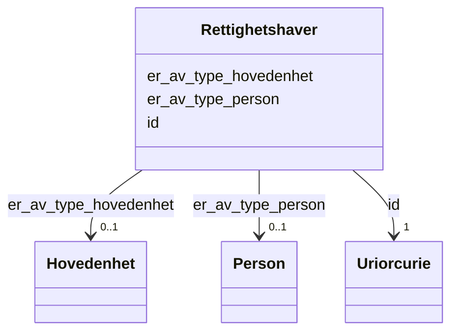

# Class: Rettighetshaver 


_Den som har ein rett knytt til ein eigedom. Kan vere ein fysisk person eller ei hovudeining (juridisk person)._


URI: [ngre:Rettighetshaver](https://data.norge.no/vocabulary/ngr-eiendom#Rettighetshaver)





<!-- no inheritance hierarchy -->

## Class Properties

| Property | Value |
| --- | --- |
| Class URI | [ngre:Rettighetshaver](https://data.norge.no/vocabulary/ngr-eiendom#Rettighetshaver) |


## Eigenskapar


  
  

  
  

  
  


  
  

  
  

  
  


  
  

  
  
    
  

  
  
    
  


### Valgfri

| Namn | Kardinalitet og domene | Beskriving |
| --- | --- | --- |
| [er_av_type_person](er_av_type_person.md) | 0..1 <br/> [Person](person.md) | Personen som er rettigheitshavar (fysisk person) |
| [er_av_type_hovedenhet](er_av_type_hovedenhet.md) | 0..1 <br/> [Hovedenhet](hovedenhet.md) | Hovudeininga (juridisk person) som er rettigheitshavar |


  
  
  
  
    
  

  
  
  
    
      
    
      
    
      
    
  
  

  
  
  
    
      
    
      
    
      
    
  
  


### Andre

| Namn | Kardinalitet og domene | Beskriving |
| --- | --- | --- |
| [id](id.md) | 1 <br/> [xsd:anyURI](http://www.w3.org/2001/XMLSchema#anyURI) | URI-identifikator for ressursen |


## Usages

| used by | used in | type | used |
| ---  | --- | --- | --- |
| [EiendomContainer](eiendomcontainer.md) | [rettighetshavere](rettighetshavere.md) | range | [Rettighetshaver](rettighetshaver.md) |
| [Andel](andel.md) | [har_rettighetshaver](har_rettighetshaver.md) | range | [Rettighetshaver](rettighetshaver.md) |


## Identifier and Mapping Information


### Schema Source


* from schema: https://data.norge.no/linkml/ngr-eiendom


## Mappings

| Mapping Type | Mapped Value |
| ---  | ---  |
| self | ngre:Rettighetshaver |
| native | https://data.norge.no/linkml/ngr-eiendom/Rettighetshaver |


## LinkML Source

<!-- TODO: investigate https://stackoverflow.com/questions/37606292/how-to-create-tabbed-code-blocks-in-mkdocs-or-sphinx -->

### Direct

<details>
```yaml
name: Rettighetshaver
description: Den som har ein rett knytt til ein eigedom. Kan vere ein fysisk person
  eller ei hovudeining (juridisk person).
from_schema: https://data.norge.no/linkml/ngr-eiendom
rank: 1000
slots:
- id
- er_av_type_person
- er_av_type_hovedenhet
slot_usage:
  er_av_type_person:
    name: er_av_type_person
    in_subset:
    - Valgfri
  er_av_type_hovedenhet:
    name: er_av_type_hovedenhet
    in_subset:
    - Valgfri
class_uri: ngre:Rettighetshaver

```
</details>

### Induced

<details>
```yaml
name: Rettighetshaver
description: Den som har ein rett knytt til ein eigedom. Kan vere ein fysisk person
  eller ei hovudeining (juridisk person).
from_schema: https://data.norge.no/linkml/ngr-eiendom
rank: 1000
slot_usage:
  er_av_type_person:
    name: er_av_type_person
    in_subset:
    - Valgfri
  er_av_type_hovedenhet:
    name: er_av_type_hovedenhet
    in_subset:
    - Valgfri
attributes:
  id:
    name: id
    description: URI-identifikator for ressursen.
    from_schema: https://data.norge.no/linkml/ngr-eiendom
    rank: 1000
    identifier: true
    alias: id
    owner: Rettighetshaver
    domain_of:
    - FastEiendom
    - SamletFastEiendom
    - Borettslagsandel
    - Matrikkelenhet
    - Matrikkelnummer
    - Kommunenummer
    - Gaardsnummer
    - Bruksnummer
    - Festenummer
    - Seksjonsnummer
    - Bygning
    - Bygningsnummer
    - Representasjonspunkt
    - YtreInngang
    - Bruksenhet
    - Bruksenhetsnummer
    - Etasje
    - Teig
    - Anleggsprojeksjonsflate
    - Eierforhold
    - Hjemmel
    - Andel
    - Rettighetshaver
    - TinglystHeftelse
    - RettighetForAaBenytteEiendom
    - Borettslag
    - OffisiellAdresse
    - Person
    - Hovedenhet
    - Kommune
    range: uriorcurie
    required: true
  er_av_type_person:
    name: er_av_type_person
    description: Personen som er rettigheitshavar (fysisk person).
    in_subset:
    - Valgfri
    from_schema: https://data.norge.no/linkml/ngr-eiendom
    rank: 1000
    slot_uri: ngre:erAvTypePerson
    alias: er_av_type_person
    owner: Rettighetshaver
    domain_of:
    - Rettighetshaver
    range: Person
  er_av_type_hovedenhet:
    name: er_av_type_hovedenhet
    description: Hovudeininga (juridisk person) som er rettigheitshavar.
    in_subset:
    - Valgfri
    from_schema: https://data.norge.no/linkml/ngr-eiendom
    rank: 1000
    slot_uri: ngre:erAvTypeHovedenhet
    alias: er_av_type_hovedenhet
    owner: Rettighetshaver
    domain_of:
    - Rettighetshaver
    - Borettslag
    range: Hovedenhet
class_uri: ngre:Rettighetshaver

```
</details>