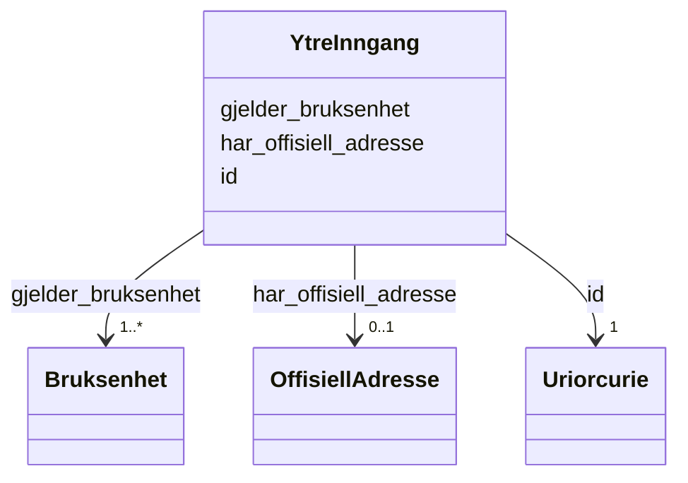

# Class: YtreInngang 


_Ytre inngang til ein bygning. Registrerast ikkje som eige objekt i Matrikkelen, men adressepunktet refererer til ytre inngang. Gir tilgang til éi eller fleire brukseiningar._


URI: [ngre:YtreInngang](https://data.norge.no/vocabulary/ngr-eiendom#YtreInngang)





<!-- no inheritance hierarchy -->

## Class Properties

| Property | Value |
| --- | --- |
| Class URI | [ngre:YtreInngang](https://data.norge.no/vocabulary/ngr-eiendom#YtreInngang) |


## Eigenskapar


  
  

  
  
    
  

  
  


### Obligatorisk

| Namn | Kardinalitet og domene | Beskriving |
| --- | --- | --- |
| [gjelder_bruksenhet](gjelder_bruksenhet.md) | 1..* <br/> [Bruksenhet](bruksenhet.md) | Brukseiningane den ytre inngangen gir tilgang til |


  
  

  
  

  
  
    
  


### Anbefalt

| Namn | Kardinalitet og domene | Beskriving |
| --- | --- | --- |
| [har_offisiell_adresse](har_offisiell_adresse.md) | 0..1 <br/> [OffisiellAdresse](offisielladresse.md) | Offisiell adresse for den ytre inngangen eller brukseininga |


  
  

  
  

  
  


  
  
  
  
    
  

  
  
  
    
      
    
      
    
      
    
  
  

  
  
  
    
      
    
      
    
      
    
  
  


### Andre

| Namn | Kardinalitet og domene | Beskriving |
| --- | --- | --- |
| [id](id.md) | 1 <br/> [xsd:anyURI](http://www.w3.org/2001/XMLSchema#anyURI) | URI-identifikator for ressursen |


## Usages

| used by | used in | type | used |
| ---  | --- | --- | --- |
| [EiendomContainer](eiendomcontainer.md) | [ytreInnganger](ytreinnganger.md) | range | [YtreInngang](ytreinngang.md) |
| [Bygning](bygning.md) | [har_ytre_inngang](har_ytre_inngang.md) | range | [YtreInngang](ytreinngang.md) |


## Identifier and Mapping Information


### Schema Source


* from schema: https://data.norge.no/linkml/ngr-eiendom


## Mappings

| Mapping Type | Mapped Value |
| ---  | ---  |
| self | ngre:YtreInngang |
| native | https://data.norge.no/linkml/ngr-eiendom/YtreInngang |


## LinkML Source

<!-- TODO: investigate https://stackoverflow.com/questions/37606292/how-to-create-tabbed-code-blocks-in-mkdocs-or-sphinx -->

### Direct

<details>
```yaml
name: YtreInngang
description: Ytre inngang til ein bygning. Registrerast ikkje som eige objekt i Matrikkelen,
  men adressepunktet refererer til ytre inngang. Gir tilgang til éi eller fleire brukseiningar.
from_schema: https://data.norge.no/linkml/ngr-eiendom
rank: 1000
slots:
- id
- gjelder_bruksenhet
- har_offisiell_adresse
slot_usage:
  gjelder_bruksenhet:
    name: gjelder_bruksenhet
    in_subset:
    - Obligatorisk
    required: true
    minimum_cardinality: 1
  har_offisiell_adresse:
    name: har_offisiell_adresse
    in_subset:
    - Anbefalt
class_uri: ngre:YtreInngang

```
</details>

### Induced

<details>
```yaml
name: YtreInngang
description: Ytre inngang til ein bygning. Registrerast ikkje som eige objekt i Matrikkelen,
  men adressepunktet refererer til ytre inngang. Gir tilgang til éi eller fleire brukseiningar.
from_schema: https://data.norge.no/linkml/ngr-eiendom
rank: 1000
slot_usage:
  gjelder_bruksenhet:
    name: gjelder_bruksenhet
    in_subset:
    - Obligatorisk
    required: true
    minimum_cardinality: 1
  har_offisiell_adresse:
    name: har_offisiell_adresse
    in_subset:
    - Anbefalt
attributes:
  id:
    name: id
    description: URI-identifikator for ressursen.
    from_schema: https://data.norge.no/linkml/ngr-eiendom
    rank: 1000
    identifier: true
    alias: id
    owner: YtreInngang
    domain_of:
    - FastEiendom
    - SamletFastEiendom
    - Borettslagsandel
    - Matrikkelenhet
    - Matrikkelnummer
    - Kommunenummer
    - Gaardsnummer
    - Bruksnummer
    - Festenummer
    - Seksjonsnummer
    - Bygning
    - Bygningsnummer
    - Representasjonspunkt
    - YtreInngang
    - Bruksenhet
    - Bruksenhetsnummer
    - Etasje
    - Teig
    - Anleggsprojeksjonsflate
    - Eierforhold
    - Hjemmel
    - Andel
    - Rettighetshaver
    - TinglystHeftelse
    - RettighetForAaBenytteEiendom
    - Borettslag
    - OffisiellAdresse
    - Person
    - Hovedenhet
    - Kommune
    range: uriorcurie
    required: true
  gjelder_bruksenhet:
    name: gjelder_bruksenhet
    description: Brukseiningane den ytre inngangen gir tilgang til.
    in_subset:
    - Obligatorisk
    from_schema: https://data.norge.no/linkml/ngr-eiendom
    rank: 1000
    slot_uri: ngre:gjelderBruksenhet
    alias: gjelder_bruksenhet
    owner: YtreInngang
    domain_of:
    - YtreInngang
    range: Bruksenhet
    required: true
    multivalued: true
    minimum_cardinality: 1
  har_offisiell_adresse:
    name: har_offisiell_adresse
    description: Offisiell adresse for den ytre inngangen eller brukseininga.
    in_subset:
    - Anbefalt
    from_schema: https://data.norge.no/linkml/ngr-eiendom
    rank: 1000
    slot_uri: ngre:harOffisiellAdresse
    alias: har_offisiell_adresse
    owner: YtreInngang
    domain_of:
    - YtreInngang
    - Bruksenhet
    range: OffisiellAdresse
class_uri: ngre:YtreInngang

```
</details>