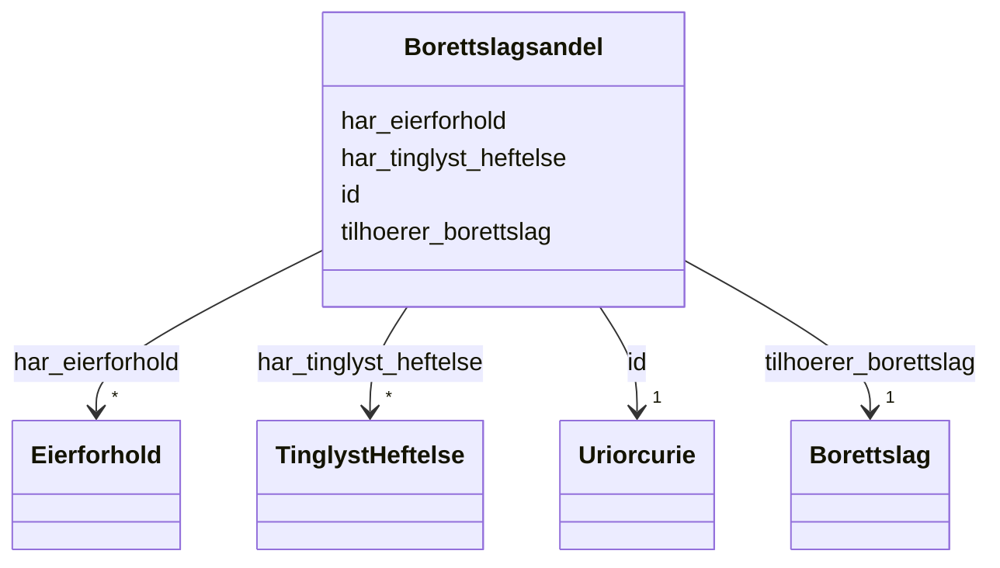

# Class: Borettslagsandel 


_Ein andel i eit burettslag som gir eksklusiv bruksrett til ein bestemt bustad i burettslagsbygningen._


URI: [ngre:Borettslagsandel](https://data.norge.no/vocabulary/ngr-eiendom#Borettslagsandel)





<!-- no inheritance hierarchy -->

## Class Properties

| Property | Value |
| --- | --- |
| Class URI | [ngre:Borettslagsandel](https://data.norge.no/vocabulary/ngr-eiendom#Borettslagsandel) |


## Eigenskapar


  
  

  
  
    
  

  
  

  
  


### Obligatorisk

| Namn | Kardinalitet og domene | Beskriving |
| --- | --- | --- |
| [tilhoerer_borettslag](tilhoerer_borettslag.md) | 1 <br/> [Borettslag](borettslag.md) | Burettslagsandelen tilhøyrer dette burettslaget |


  
  

  
  

  
  
    
  

  
  


### Anbefalt

| Namn | Kardinalitet og domene | Beskriving |
| --- | --- | --- |
| [har_eierforhold](har_eierforhold.md) | * <br/> [Eierforhold](eierforhold.md) | Eigarforhold knytt til eigedommen eller burettslagsandelen |


  
  

  
  

  
  

  
  
    
  


### Valgfri

| Namn | Kardinalitet og domene | Beskriving |
| --- | --- | --- |
| [har_tinglyst_heftelse](har_tinglyst_heftelse.md) | * <br/> [TinglystHeftelse](tinglystheftelse.md) | Tinglyste heftingar knytt til eigedommen eller burettslagsandelen |


  
  
  
  
    
  

  
  
  
    
      
    
      
    
      
    
  
  

  
  
  
    
      
    
      
    
      
    
  
  

  
  
  
    
      
    
      
    
      
    
  
  


### Andre

| Namn | Kardinalitet og domene | Beskriving |
| --- | --- | --- |
| [id](id.md) | 1 <br/> [xsd:anyURI](http://www.w3.org/2001/XMLSchema#anyURI) | URI-identifikator for ressursen |


## Usages

| used by | used in | type | used |
| ---  | --- | --- | --- |
| [EiendomContainer](eiendomcontainer.md) | [borettslagsandeler](borettslagsandeler.md) | range | [Borettslagsandel](borettslagsandel.md) |
| [Eierforhold](eierforhold.md) | [kan_gjelde_borettslagsandel](kan_gjelde_borettslagsandel.md) | range | [Borettslagsandel](borettslagsandel.md) |
| [TinglystEierforhold](tinglysteierforhold.md) | [kan_gjelde_borettslagsandel](kan_gjelde_borettslagsandel.md) | range | [Borettslagsandel](borettslagsandel.md) |
| [IkkeTinglystEierforhold](ikketinglysteierforhold.md) | [kan_gjelde_borettslagsandel](kan_gjelde_borettslagsandel.md) | range | [Borettslagsandel](borettslagsandel.md) |


## Identifier and Mapping Information


### Schema Source


* from schema: https://data.norge.no/ngr/ngr-eiendom


## Mappings

| Mapping Type | Mapped Value |
| ---  | ---  |
| self | ngre:Borettslagsandel |
| native | https://data.norge.no/ngr/ngr-eiendom/Borettslagsandel |


## LinkML Source

<!-- TODO: investigate https://stackoverflow.com/questions/37606292/how-to-create-tabbed-code-blocks-in-mkdocs-or-sphinx -->

### Direct

<details>
```yaml
name: Borettslagsandel
description: Ein andel i eit burettslag som gir eksklusiv bruksrett til ein bestemt
  bustad i burettslagsbygningen.
from_schema: https://data.norge.no/ngr/ngr-eiendom
rank: 1000
slots:
- id
- tilhoerer_borettslag
- har_eierforhold
- har_tinglyst_heftelse
slot_usage:
  tilhoerer_borettslag:
    name: tilhoerer_borettslag
    in_subset:
    - Obligatorisk
    required: true
  har_eierforhold:
    name: har_eierforhold
    in_subset:
    - Anbefalt
  har_tinglyst_heftelse:
    name: har_tinglyst_heftelse
    in_subset:
    - Valgfri
class_uri: ngre:Borettslagsandel

```
</details>

### Induced

<details>
```yaml
name: Borettslagsandel
description: Ein andel i eit burettslag som gir eksklusiv bruksrett til ein bestemt
  bustad i burettslagsbygningen.
from_schema: https://data.norge.no/ngr/ngr-eiendom
rank: 1000
slot_usage:
  tilhoerer_borettslag:
    name: tilhoerer_borettslag
    in_subset:
    - Obligatorisk
    required: true
  har_eierforhold:
    name: har_eierforhold
    in_subset:
    - Anbefalt
  har_tinglyst_heftelse:
    name: har_tinglyst_heftelse
    in_subset:
    - Valgfri
attributes:
  id:
    name: id
    description: URI-identifikator for ressursen.
    from_schema: https://data.norge.no/ngr/ngr-eiendom
    rank: 1000
    identifier: true
    owner: Borettslagsandel
    domain_of:
    - FastEiendom
    - SamletFastEiendom
    - Borettslagsandel
    - Matrikkelenhet
    - Matrikkelnummer
    - Kommunenummer
    - Gaardsnummer
    - Bruksnummer
    - Festenummer
    - Seksjonsnummer
    - Bygning
    - Bygningsnummer
    - Representasjonspunkt
    - YtreInngang
    - Bruksenhet
    - Bruksenhetsnummer
    - Etasje
    - Teig
    - Anleggsprojeksjonsflate
    - Eierforhold
    - Hjemmel
    - Andel
    - Rettighetshaver
    - TinglystHeftelse
    - RettighetForAaBenytteEiendom
    - Borettslag
    - OffisiellAdresse
    - Person
    - Hovedenhet
    - Kommune
    range: uriorcurie
    required: true
  tilhoerer_borettslag:
    name: tilhoerer_borettslag
    description: Burettslagsandelen tilhøyrer dette burettslaget.
    in_subset:
    - Obligatorisk
    from_schema: https://data.norge.no/ngr/ngr-eiendom
    rank: 1000
    slot_uri: ngre:tilhoererBorettslag
    owner: Borettslagsandel
    domain_of:
    - Borettslagsandel
    range: Borettslag
    required: true
  har_eierforhold:
    name: har_eierforhold
    description: Eigarforhold knytt til eigedommen eller burettslagsandelen.
    in_subset:
    - Anbefalt
    from_schema: https://data.norge.no/ngr/ngr-eiendom
    rank: 1000
    slot_uri: ngre:harEierforhold
    owner: Borettslagsandel
    domain_of:
    - FastEiendom
    - Borettslagsandel
    range: Eierforhold
    multivalued: true
  har_tinglyst_heftelse:
    name: har_tinglyst_heftelse
    description: Tinglyste heftingar knytt til eigedommen eller burettslagsandelen.
    in_subset:
    - Valgfri
    from_schema: https://data.norge.no/ngr/ngr-eiendom
    rank: 1000
    slot_uri: ngre:harTinglystHeftelse
    owner: Borettslagsandel
    domain_of:
    - FastEiendom
    - Borettslagsandel
    range: TinglystHeftelse
    multivalued: true
class_uri: ngre:Borettslagsandel

```
</details>