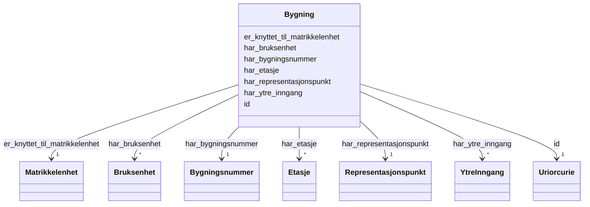

# Class: Bygning 


_Ein bygning registrert i Matrikkelen. Knytt til éi matrikkelenheit og kan ha fleire ytre innganger, brukseiningar og etasjar. Bygningsinformasjon er i dag spreidd i fleire databasar._


URI: [ngre:Bygning](https://data.norge.no/vocabulary/ngr-eiendom#Bygning)





<!-- no inheritance hierarchy -->

## Class Properties

| Property | Value |
| --- | --- |
| Class URI | [ngre:Bygning](https://data.norge.no/vocabulary/ngr-eiendom#Bygning) |


## Eigenskapar


  
  

  
  
    
  

  
  
    
  

  
  
    
  

  
  

  
  

  
  


### Obligatorisk

| Namn | Kardinalitet og domene | Beskriving |
| --- | --- | --- |
| [har_bygningsnummer](har_bygningsnummer.md) | 1 <br/> [Bygningsnummer](bygningsnummer.md) | Offisiell bygningsnummer for bygningen |
| [har_representasjonspunkt](har_representasjonspunkt.md) | 1 <br/> [Representasjonspunkt](representasjonspunkt.md) | Geografisk representasjonspunkt for bygningen |
| [er_knyttet_til_matrikkelenhet](er_knyttet_til_matrikkelenhet.md) | 1 <br/> [Matrikkelenhet](matrikkelenhet.md) | Matrikkeleininga bygningen er knytt til |


  
  

  
  

  
  

  
  

  
  
    
  

  
  
    
  

  
  


### Anbefalt

| Namn | Kardinalitet og domene | Beskriving |
| --- | --- | --- |
| [har_ytre_inngang](har_ytre_inngang.md) | * <br/> [YtreInngang](ytreinngang.md) | Ytre inngang(ar) til bygningen |
| [har_bruksenhet](har_bruksenhet.md) | * <br/> [Bruksenhet](bruksenhet.md) | Brukseining(ar) i bygningen |


  
  

  
  

  
  

  
  

  
  

  
  

  
  
    
  


### Valgfri

| Namn | Kardinalitet og domene | Beskriving |
| --- | --- | --- |
| [har_etasje](har_etasje.md) | * <br/> [Etasje](etasje.md) | Etasjar i bygningen |


  
  
  
  
    
  

  
  
  
    
      
    
      
    
      
    
  
  

  
  
  
    
      
    
      
    
      
    
  
  

  
  
  
    
      
    
      
    
      
    
  
  

  
  
  
    
      
    
      
    
      
    
  
  

  
  
  
    
      
    
      
    
      
    
  
  

  
  
  
    
      
    
      
    
      
    
  
  


### Andre

| Namn | Kardinalitet og domene | Beskriving |
| --- | --- | --- |
| [id](id.md) | 1 <br/> [xsd:anyURI](http://www.w3.org/2001/XMLSchema#anyURI) | URI-identifikator for ressursen |


## Usages

| used by | used in | type | used |
| ---  | --- | --- | --- |
| [EiendomContainer](eiendomcontainer.md) | [bygninger](bygninger.md) | range | [Bygning](bygning.md) |
| [FastEiendom](fasteiendom.md) | [bestar_av_bygning](bestar_av_bygning.md) | range | [Bygning](bygning.md) |


## Identifier and Mapping Information


### Schema Source


* from schema: https://data.norge.no/ngr/ngr-eiendom


## Mappings

| Mapping Type | Mapped Value |
| ---  | ---  |
| self | ngre:Bygning |
| native | https://data.norge.no/ngr/ngr-eiendom/Bygning |


## Examples
### Example: Bygning-bygning-1

```yaml
id: ngre:eksempel/bygning-1
har_bygningsnummer: ngre:eksempel/bygningsnummer-12345678
har_representasjonspunkt: ngre:eksempel/punkt-1
er_knyttet_til_matrikkelenhet: ngre:eksempel/matrikkelenhet-1
har_ytre_inngang:
- ngre:eksempel/inngang-1
har_bruksenhet:
- ngre:eksempel/bruksenhet-1
har_etasje:
- ngre:eksempel/etasje-1
- ngre:eksempel/etasje-2

```


## LinkML Source

<!-- TODO: investigate https://stackoverflow.com/questions/37606292/how-to-create-tabbed-code-blocks-in-mkdocs-or-sphinx -->

### Direct

<details>
```yaml
name: Bygning
description: Ein bygning registrert i Matrikkelen. Knytt til éi matrikkelenheit og
  kan ha fleire ytre innganger, brukseiningar og etasjar. Bygningsinformasjon er i
  dag spreidd i fleire databasar.
from_schema: https://data.norge.no/ngr/ngr-eiendom
rank: 1000
slots:
- id
- har_bygningsnummer
- har_representasjonspunkt
- er_knyttet_til_matrikkelenhet
- har_ytre_inngang
- har_bruksenhet
- har_etasje
slot_usage:
  har_bygningsnummer:
    name: har_bygningsnummer
    in_subset:
    - Obligatorisk
    required: true
  har_representasjonspunkt:
    name: har_representasjonspunkt
    in_subset:
    - Obligatorisk
    required: true
  er_knyttet_til_matrikkelenhet:
    name: er_knyttet_til_matrikkelenhet
    in_subset:
    - Obligatorisk
    required: true
  har_ytre_inngang:
    name: har_ytre_inngang
    in_subset:
    - Anbefalt
  har_bruksenhet:
    name: har_bruksenhet
    in_subset:
    - Anbefalt
  har_etasje:
    name: har_etasje
    in_subset:
    - Valgfri
class_uri: ngre:Bygning

```
</details>

### Induced

<details>
```yaml
name: Bygning
description: Ein bygning registrert i Matrikkelen. Knytt til éi matrikkelenheit og
  kan ha fleire ytre innganger, brukseiningar og etasjar. Bygningsinformasjon er i
  dag spreidd i fleire databasar.
from_schema: https://data.norge.no/ngr/ngr-eiendom
rank: 1000
slot_usage:
  har_bygningsnummer:
    name: har_bygningsnummer
    in_subset:
    - Obligatorisk
    required: true
  har_representasjonspunkt:
    name: har_representasjonspunkt
    in_subset:
    - Obligatorisk
    required: true
  er_knyttet_til_matrikkelenhet:
    name: er_knyttet_til_matrikkelenhet
    in_subset:
    - Obligatorisk
    required: true
  har_ytre_inngang:
    name: har_ytre_inngang
    in_subset:
    - Anbefalt
  har_bruksenhet:
    name: har_bruksenhet
    in_subset:
    - Anbefalt
  har_etasje:
    name: har_etasje
    in_subset:
    - Valgfri
attributes:
  id:
    name: id
    description: URI-identifikator for ressursen.
    from_schema: https://data.norge.no/ngr/ngr-eiendom
    rank: 1000
    identifier: true
    owner: Bygning
    domain_of:
    - FastEiendom
    - SamletFastEiendom
    - Borettslagsandel
    - Matrikkelenhet
    - Matrikkelnummer
    - Kommunenummer
    - Gaardsnummer
    - Bruksnummer
    - Festenummer
    - Seksjonsnummer
    - Bygning
    - Bygningsnummer
    - Representasjonspunkt
    - YtreInngang
    - Bruksenhet
    - Bruksenhetsnummer
    - Etasje
    - Teig
    - Anleggsprojeksjonsflate
    - Eierforhold
    - Hjemmel
    - Andel
    - Rettighetshaver
    - TinglystHeftelse
    - RettighetForAaBenytteEiendom
    - Borettslag
    - OffisiellAdresse
    - Person
    - Hovedenhet
    - Kommune
    range: uriorcurie
    required: true
  har_bygningsnummer:
    name: har_bygningsnummer
    description: Offisiell bygningsnummer for bygningen.
    in_subset:
    - Obligatorisk
    from_schema: https://data.norge.no/ngr/ngr-eiendom
    rank: 1000
    slot_uri: ngre:harBygningsnummer
    owner: Bygning
    domain_of:
    - Bygning
    range: Bygningsnummer
    required: true
  har_representasjonspunkt:
    name: har_representasjonspunkt
    description: Geografisk representasjonspunkt for bygningen.
    in_subset:
    - Obligatorisk
    from_schema: https://data.norge.no/ngr/ngr-eiendom
    rank: 1000
    slot_uri: ngre:harRepresentasjonspunkt
    owner: Bygning
    domain_of:
    - Bygning
    range: Representasjonspunkt
    required: true
  er_knyttet_til_matrikkelenhet:
    name: er_knyttet_til_matrikkelenhet
    description: Matrikkeleininga bygningen er knytt til.
    in_subset:
    - Obligatorisk
    from_schema: https://data.norge.no/ngr/ngr-eiendom
    rank: 1000
    slot_uri: ngre:erKnyttetTilMatrikkelenhet
    owner: Bygning
    domain_of:
    - Bygning
    range: Matrikkelenhet
    required: true
  har_ytre_inngang:
    name: har_ytre_inngang
    description: Ytre inngang(ar) til bygningen.
    in_subset:
    - Anbefalt
    from_schema: https://data.norge.no/ngr/ngr-eiendom
    rank: 1000
    slot_uri: ngre:harYtreInngang
    owner: Bygning
    domain_of:
    - Bygning
    range: YtreInngang
    multivalued: true
  har_bruksenhet:
    name: har_bruksenhet
    description: Brukseining(ar) i bygningen.
    in_subset:
    - Anbefalt
    from_schema: https://data.norge.no/ngr/ngr-eiendom
    rank: 1000
    slot_uri: ngre:harBruksenhet
    owner: Bygning
    domain_of:
    - Bygning
    range: Bruksenhet
    multivalued: true
  har_etasje:
    name: har_etasje
    description: Etasjar i bygningen.
    in_subset:
    - Valgfri
    from_schema: https://data.norge.no/ngr/ngr-eiendom
    rank: 1000
    slot_uri: ngre:harEtasje
    owner: Bygning
    domain_of:
    - Bygning
    range: Etasje
    multivalued: true
class_uri: ngre:Bygning

```
</details>