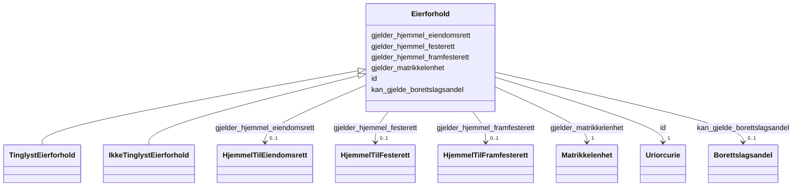

# Class: Eierforhold 


_Abstrakt klasse for eigarforhold forvalta av Grunnboka. Eit eigarforhold gjeld éi matrikkelenheit og kan eventuelt gjelde ein burettslagsandel. Inneheld heimelsdokument som fastset kven som er eigar og på kva vilkår._


* __NOTE__: this is an abstract class and should not be instantiated directly


URI: [ngre:Eierforhold](https://data.norge.no/vocabulary/ngr-eiendom#Eierforhold)





## Inheritance
* **Eierforhold**
    * [TinglystEierforhold](tinglysteierforhold.md)
    * [IkkeTinglystEierforhold](ikketinglysteierforhold.md)


## Class Properties

| Property | Value |
| --- | --- |
| Class URI | [ngre:Eierforhold](https://data.norge.no/vocabulary/ngr-eiendom#Eierforhold) |


## Eigenskapar


  
  

  
  
    
  

  
  

  
  

  
  

  
  


### Obligatorisk

| Namn | Kardinalitet og domene | Beskriving |
| --- | --- | --- |
| [gjelder_matrikkelenhet](gjelder_matrikkelenhet.md) | 1 <br/> [Matrikkelenhet](matrikkelenhet.md) | Matrikkeleininga dette eigarforholdet gjeld |


  
  

  
  

  
  

  
  

  
  

  
  


  
  

  
  

  
  
    
  

  
  
    
  

  
  
    
  

  
  
    
  


### Valgfri

| Namn | Kardinalitet og domene | Beskriving |
| --- | --- | --- |
| [kan_gjelde_borettslagsandel](kan_gjelde_borettslagsandel.md) | 0..1 <br/> [Borettslagsandel](borettslagsandel.md) | Burettslagsandelen dette eigarforholdet eventuelt gjeld |
| [gjelder_hjemmel_eiendomsrett](gjelder_hjemmel_eiendomsrett.md) | 0..1 <br/> [HjemmelTilEiendomsrett](hjemmeltileiendomsrett.md) | Heimelsdokument for eigedomsrett knytt til dette eigarforholdet |
| [gjelder_hjemmel_festerett](gjelder_hjemmel_festerett.md) | 0..1 <br/> [HjemmelTilFesterett](hjemmeltilfesterett.md) | Heimelsdokument for festerett knytt til dette eigarforholdet |
| [gjelder_hjemmel_framfesterett](gjelder_hjemmel_framfesterett.md) | 0..1 <br/> [HjemmelTilFramfesterett](hjemmeltilframfesterett.md) | Heimelsdokument for framfesterett knytt til dette eigarforholdet |


  
  
  
  
    
  

  
  
  
    
      
    
      
    
      
    
  
  

  
  
  
    
      
    
      
    
      
    
  
  

  
  
  
    
      
    
      
    
      
    
  
  

  
  
  
    
      
    
      
    
      
    
  
  

  
  
  
    
      
    
      
    
      
    
  
  


### Andre

| Namn | Kardinalitet og domene | Beskriving |
| --- | --- | --- |
| [id](id.md) | 1 <br/> [xsd:anyURI](http://www.w3.org/2001/XMLSchema#anyURI) | URI-identifikator for ressursen |


## Usages

| used by | used in | type | used |
| ---  | --- | --- | --- |
| [FastEiendom](fasteiendom.md) | [har_eierforhold](har_eierforhold.md) | range | [Eierforhold](eierforhold.md) |
| [Borettslagsandel](borettslagsandel.md) | [har_eierforhold](har_eierforhold.md) | range | [Eierforhold](eierforhold.md) |


## Identifier and Mapping Information


### Schema Source


* from schema: https://data.norge.no/ngr/ngr-eiendom


## Mappings

| Mapping Type | Mapped Value |
| ---  | ---  |
| self | ngre:Eierforhold |
| native | https://data.norge.no/ngr/ngr-eiendom/Eierforhold |


## LinkML Source

<!-- TODO: investigate https://stackoverflow.com/questions/37606292/how-to-create-tabbed-code-blocks-in-mkdocs-or-sphinx -->

### Direct

<details>
```yaml
name: Eierforhold
description: Abstrakt klasse for eigarforhold forvalta av Grunnboka. Eit eigarforhold
  gjeld éi matrikkelenheit og kan eventuelt gjelde ein burettslagsandel. Inneheld
  heimelsdokument som fastset kven som er eigar og på kva vilkår.
from_schema: https://data.norge.no/ngr/ngr-eiendom
rank: 1000
abstract: true
slots:
- id
- gjelder_matrikkelenhet
- kan_gjelde_borettslagsandel
- gjelder_hjemmel_eiendomsrett
- gjelder_hjemmel_festerett
- gjelder_hjemmel_framfesterett
slot_usage:
  gjelder_matrikkelenhet:
    name: gjelder_matrikkelenhet
    in_subset:
    - Obligatorisk
    required: true
  kan_gjelde_borettslagsandel:
    name: kan_gjelde_borettslagsandel
    in_subset:
    - Valgfri
  gjelder_hjemmel_eiendomsrett:
    name: gjelder_hjemmel_eiendomsrett
    in_subset:
    - Valgfri
  gjelder_hjemmel_festerett:
    name: gjelder_hjemmel_festerett
    in_subset:
    - Valgfri
  gjelder_hjemmel_framfesterett:
    name: gjelder_hjemmel_framfesterett
    in_subset:
    - Valgfri
class_uri: ngre:Eierforhold

```
</details>

### Induced

<details>
```yaml
name: Eierforhold
description: Abstrakt klasse for eigarforhold forvalta av Grunnboka. Eit eigarforhold
  gjeld éi matrikkelenheit og kan eventuelt gjelde ein burettslagsandel. Inneheld
  heimelsdokument som fastset kven som er eigar og på kva vilkår.
from_schema: https://data.norge.no/ngr/ngr-eiendom
rank: 1000
abstract: true
slot_usage:
  gjelder_matrikkelenhet:
    name: gjelder_matrikkelenhet
    in_subset:
    - Obligatorisk
    required: true
  kan_gjelde_borettslagsandel:
    name: kan_gjelde_borettslagsandel
    in_subset:
    - Valgfri
  gjelder_hjemmel_eiendomsrett:
    name: gjelder_hjemmel_eiendomsrett
    in_subset:
    - Valgfri
  gjelder_hjemmel_festerett:
    name: gjelder_hjemmel_festerett
    in_subset:
    - Valgfri
  gjelder_hjemmel_framfesterett:
    name: gjelder_hjemmel_framfesterett
    in_subset:
    - Valgfri
attributes:
  id:
    name: id
    description: URI-identifikator for ressursen.
    from_schema: https://data.norge.no/ngr/ngr-eiendom
    rank: 1000
    identifier: true
    owner: Eierforhold
    domain_of:
    - FastEiendom
    - SamletFastEiendom
    - Borettslagsandel
    - Matrikkelenhet
    - Matrikkelnummer
    - Kommunenummer
    - Gaardsnummer
    - Bruksnummer
    - Festenummer
    - Seksjonsnummer
    - Bygning
    - Bygningsnummer
    - Representasjonspunkt
    - YtreInngang
    - Bruksenhet
    - Bruksenhetsnummer
    - Etasje
    - Teig
    - Anleggsprojeksjonsflate
    - Eierforhold
    - Hjemmel
    - Andel
    - Rettighetshaver
    - TinglystHeftelse
    - RettighetForAaBenytteEiendom
    - Borettslag
    - OffisiellAdresse
    - Person
    - Hovedenhet
    - Kommune
    range: uriorcurie
    required: true
  gjelder_matrikkelenhet:
    name: gjelder_matrikkelenhet
    description: Matrikkeleininga dette eigarforholdet gjeld.
    in_subset:
    - Obligatorisk
    from_schema: https://data.norge.no/ngr/ngr-eiendom
    rank: 1000
    slot_uri: ngre:gjelderMatrikkelenhet
    owner: Eierforhold
    domain_of:
    - Eierforhold
    range: Matrikkelenhet
    required: true
  kan_gjelde_borettslagsandel:
    name: kan_gjelde_borettslagsandel
    description: Burettslagsandelen dette eigarforholdet eventuelt gjeld.
    in_subset:
    - Valgfri
    from_schema: https://data.norge.no/ngr/ngr-eiendom
    rank: 1000
    slot_uri: ngre:kanGjeldeBorettslagsandel
    owner: Eierforhold
    domain_of:
    - Eierforhold
    range: Borettslagsandel
  gjelder_hjemmel_eiendomsrett:
    name: gjelder_hjemmel_eiendomsrett
    description: Heimelsdokument for eigedomsrett knytt til dette eigarforholdet.
    in_subset:
    - Valgfri
    from_schema: https://data.norge.no/ngr/ngr-eiendom
    rank: 1000
    slot_uri: ngre:gjelderHjemmelEiendomsrett
    owner: Eierforhold
    domain_of:
    - Eierforhold
    range: HjemmelTilEiendomsrett
  gjelder_hjemmel_festerett:
    name: gjelder_hjemmel_festerett
    description: Heimelsdokument for festerett knytt til dette eigarforholdet.
    in_subset:
    - Valgfri
    from_schema: https://data.norge.no/ngr/ngr-eiendom
    rank: 1000
    slot_uri: ngre:gjelderHjemmelFesterett
    owner: Eierforhold
    domain_of:
    - Eierforhold
    range: HjemmelTilFesterett
  gjelder_hjemmel_framfesterett:
    name: gjelder_hjemmel_framfesterett
    description: Heimelsdokument for framfesterett knytt til dette eigarforholdet.
    in_subset:
    - Valgfri
    from_schema: https://data.norge.no/ngr/ngr-eiendom
    rank: 1000
    slot_uri: ngre:gjelderHjemmelFramfesterett
    owner: Eierforhold
    domain_of:
    - Eierforhold
    range: HjemmelTilFramfesterett
class_uri: ngre:Eierforhold

```
</details>