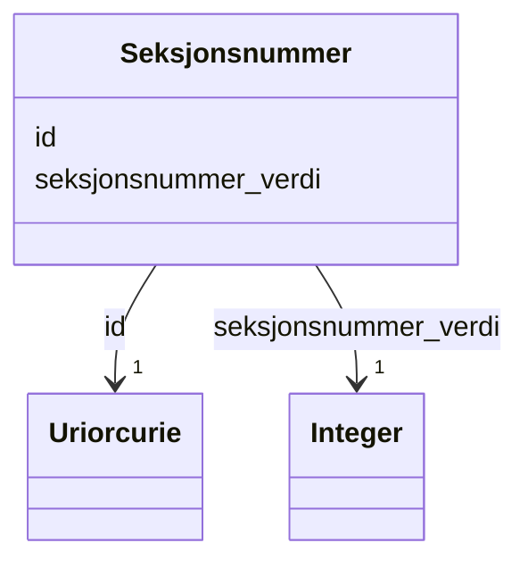

# Class: Seksjonsnummer 


_Seksjonsnummer, aktuelt berre for eigarseksjonar (0..1 i matrikkelnummeret)._


URI: [ngre:Seksjonsnummer](https://data.norge.no/vocabulary/ngr-eiendom#Seksjonsnummer)





<!-- no inheritance hierarchy -->

## Class Properties

| Property | Value |
| --- | --- |
| Class URI | [ngre:Seksjonsnummer](https://data.norge.no/vocabulary/ngr-eiendom#Seksjonsnummer) |


## Eigenskapar


  
  

  
  
    
  


### Obligatorisk

| Namn | Kardinalitet og domene | Beskriving |
| --- | --- | --- |
| [seksjonsnummer_verdi](seksjonsnummer_verdi.md) | 1 <br/> [xsd:integer](http://www.w3.org/2001/XMLSchema#integer) | Seksjonsnummer (0 |


  
  

  
  


  
  

  
  


  
  
  
  
    
  

  
  
  
    
      
    
      
    
      
    
  
  


### Andre

| Namn | Kardinalitet og domene | Beskriving |
| --- | --- | --- |
| [id](id.md) | 1 <br/> [xsd:anyURI](http://www.w3.org/2001/XMLSchema#anyURI) | URI-identifikator for ressursen |


## Usages

| used by | used in | type | used |
| ---  | --- | --- | --- |
| [Matrikkelnummer](matrikkelnummer.md) | [bestar_av_seksjonsnummer](bestar_av_seksjonsnummer.md) | range | [Seksjonsnummer](seksjonsnummer.md) |


## Identifier and Mapping Information


### Schema Source


* from schema: https://data.norge.no/ngr/ngr-eiendom


## Mappings

| Mapping Type | Mapped Value |
| ---  | ---  |
| self | ngre:Seksjonsnummer |
| native | https://data.norge.no/ngr/ngr-eiendom/Seksjonsnummer |


## LinkML Source

<!-- TODO: investigate https://stackoverflow.com/questions/37606292/how-to-create-tabbed-code-blocks-in-mkdocs-or-sphinx -->

### Direct

<details>
```yaml
name: Seksjonsnummer
description: Seksjonsnummer, aktuelt berre for eigarseksjonar (0..1 i matrikkelnummeret).
from_schema: https://data.norge.no/ngr/ngr-eiendom
rank: 1000
slots:
- id
- seksjonsnummer_verdi
slot_usage:
  seksjonsnummer_verdi:
    name: seksjonsnummer_verdi
    in_subset:
    - Obligatorisk
    required: true
class_uri: ngre:Seksjonsnummer

```
</details>

### Induced

<details>
```yaml
name: Seksjonsnummer
description: Seksjonsnummer, aktuelt berre for eigarseksjonar (0..1 i matrikkelnummeret).
from_schema: https://data.norge.no/ngr/ngr-eiendom
rank: 1000
slot_usage:
  seksjonsnummer_verdi:
    name: seksjonsnummer_verdi
    in_subset:
    - Obligatorisk
    required: true
attributes:
  id:
    name: id
    description: URI-identifikator for ressursen.
    from_schema: https://data.norge.no/ngr/ngr-eiendom
    rank: 1000
    identifier: true
    owner: Seksjonsnummer
    domain_of:
    - FastEiendom
    - SamletFastEiendom
    - Borettslagsandel
    - Matrikkelenhet
    - Matrikkelnummer
    - Kommunenummer
    - Gaardsnummer
    - Bruksnummer
    - Festenummer
    - Seksjonsnummer
    - Bygning
    - Bygningsnummer
    - Representasjonspunkt
    - YtreInngang
    - Bruksenhet
    - Bruksenhetsnummer
    - Etasje
    - Teig
    - Anleggsprojeksjonsflate
    - Eierforhold
    - Hjemmel
    - Andel
    - Rettighetshaver
    - TinglystHeftelse
    - RettighetForAaBenytteEiendom
    - Borettslag
    - OffisiellAdresse
    - Person
    - Hovedenhet
    - Kommune
    range: uriorcurie
    required: true
  seksjonsnummer_verdi:
    name: seksjonsnummer_verdi
    description: Seksjonsnummer (0..1 – berre for eigarseksjonar).
    in_subset:
    - Obligatorisk
    from_schema: https://data.norge.no/ngr/ngr-eiendom
    rank: 1000
    slot_uri: ngre:seksjonsnummer
    owner: Seksjonsnummer
    domain_of:
    - Seksjonsnummer
    range: integer
    required: true
class_uri: ngre:Seksjonsnummer

```
</details>