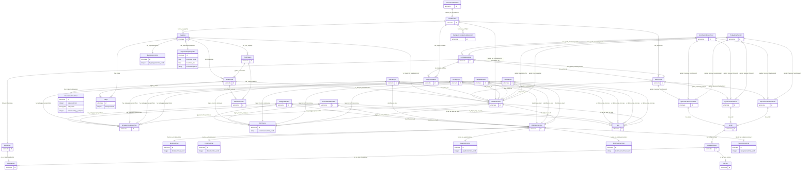

```mermaid
erDiagram
Andel {
    uriorcurie id  
}
Anleggseiendom {
    uriorcurie id  
}
Anleggsprojeksjonsflate {
    uriorcurie id  
}
AnnenMatrikkelenhet {
    uriorcurie id  
}
Borettslag {
    uriorcurie id  
}
Borettslagsandel {
    uriorcurie id  
}
Bruksenhet {
    uriorcurie id  
}
Bruksenhetsnummer {
    uriorcurie id  
    integer etasjenummer  
    Etasjeplan etasjeplan  
    integer nummerering_i_etasjen  
}
Bruksnummer {
    uriorcurie id  
    integer bruksnummer_verdi  
}
Bygning {
    uriorcurie id  
}
Bygningsnummer {
    uriorcurie id  
    integer bygningsnummer_verdi  
}
Eierforhold {
    uriorcurie id  
}
Eierseksjon {
    uriorcurie id  
}
Etasje {
    uriorcurie id  
    integer etasjenummer  
}
FastEiendom {
    uriorcurie id  
}
Festegrunn {
    uriorcurie id  
}
Festenummer {
    uriorcurie id  
    integer festenummer_verdi  
}
Gaardsnummer {
    uriorcurie id  
    integer gaardsnummer_verdi  
}
Grunneiendom {
    uriorcurie id  
}
HjemmelTilEiendomsrett {
    uriorcurie id  
}
HjemmelTilFesterett {
    uriorcurie id  
}
HjemmelTilFramfesterett {
    uriorcurie id  
}
Hovedenhet {
    uriorcurie id  
}
IkkeTinglystEierforhold {
    uriorcurie id  
}
Jordsameie {
    uriorcurie id  
}
Kommune {
    uriorcurie id  
    string kommunenummer_verdi  
}
Kommunenummer {
    uriorcurie id  
    string kommunenummer_verdi  
}
Matrikkelenhet {
    uriorcurie id  
}
Matrikkelnummer {
    uriorcurie id  
}
OffisiellAdresse {
    uriorcurie id  
}
Person {
    uriorcurie id  
}
Representasjonspunkt {
    uriorcurie id  
    float koordinat_nord  
    float koordinat_ost  
    string koordinatsystem  
}
RettighetForAaBenytteEiendom {
    uriorcurie id  
}
Rettighetshaver {
    uriorcurie id  
}
SamletFastEiendom {
    uriorcurie id  
}
Seksjonsnummer {
    uriorcurie id  
    integer seksjonsnummer_verdi  
}
Teig {
    uriorcurie id  
}
TinglystEierforhold {
    uriorcurie id  
}
TinglystHeftelse {
    uriorcurie id  
}
YtreInngang {
    uriorcurie id  
}

Andel ||--}| Rettighetshaver : "har_rettighetshaver"
Anleggseiendom ||--|o Anleggsprojeksjonsflate : "har_anleggsprojeksjonsflate"
Anleggseiendom ||--|| Kommune : "ligger_innenfor_kommune"
Anleggseiendom ||--|| Matrikkelnummer : "identifiseres_med"
Anleggseiendom ||--}o Teig : "er_del_av_teig, har_teig"
AnnenMatrikkelenhet ||--|o Anleggsprojeksjonsflate : "har_anleggsprojeksjonsflate"
AnnenMatrikkelenhet ||--|| Kommune : "ligger_innenfor_kommune"
AnnenMatrikkelenhet ||--|| Matrikkelnummer : "identifiseres_med"
AnnenMatrikkelenhet ||--}o Teig : "er_del_av_teig, har_teig"
Borettslag ||--|| Hovedenhet : "er_av_type_hovedenhet"
Borettslagsandel ||--|| Borettslag : "tilhoerer_borettslag"
Borettslagsandel ||--}o Eierforhold : "har_eierforhold"
Borettslagsandel ||--}o TinglystHeftelse : "har_tinglyst_heftelse"
Bruksenhet ||--|o Matrikkelenhet : "er_tilknyttet_matrikkelenhet"
Bruksenhet ||--|o OffisiellAdresse : "har_offisiell_adresse"
Bruksenhet ||--|| Bruksenhetsnummer : "har_bruksenhetsnummer"
Bruksenhet ||--}| Etasje : "ligger_i_etasje"
Bygning ||--|| Bygningsnummer : "har_bygningsnummer"
Bygning ||--|| Matrikkelenhet : "er_knyttet_til_matrikkelenhet"
Bygning ||--|| Representasjonspunkt : "har_representasjonspunkt"
Bygning ||--}o Bruksenhet : "har_bruksenhet"
Bygning ||--}o Etasje : "har_etasje"
Bygning ||--}o YtreInngang : "har_ytre_inngang"
Eierforhold ||--|o Borettslagsandel : "kan_gjelde_borettslagsandel"
Eierforhold ||--|o HjemmelTilEiendomsrett : "gjelder_hjemmel_eiendomsrett"
Eierforhold ||--|o HjemmelTilFesterett : "gjelder_hjemmel_festerett"
Eierforhold ||--|o HjemmelTilFramfesterett : "gjelder_hjemmel_framfesterett"
Eierforhold ||--|| Matrikkelenhet : "gjelder_matrikkelenhet"
Eierseksjon ||--|o Anleggsprojeksjonsflate : "har_anleggsprojeksjonsflate"
Eierseksjon ||--|o Matrikkelenhet : "kan_vaere_pa"
Eierseksjon ||--|| Kommune : "ligger_innenfor_kommune"
Eierseksjon ||--|| Matrikkelnummer : "identifiseres_med"
Eierseksjon ||--}o Teig : "er_del_av_teig, har_teig"
FastEiendom ||--|| Matrikkelenhet : "bestar_av_matrikkelenhet, identifiseres_av"
FastEiendom ||--}o Bygning : "bestar_av_bygning"
FastEiendom ||--}o Eierforhold : "har_eierforhold"
FastEiendom ||--}o RettighetForAaBenytteEiendom : "bestar_av_rettighet"
FastEiendom ||--}o TinglystHeftelse : "har_tinglyst_heftelse"
Festegrunn ||--|o Anleggsprojeksjonsflate : "har_anleggsprojeksjonsflate"
Festegrunn ||--|o Matrikkelenhet : "kan_vaere_pa"
Festegrunn ||--|| Kommune : "ligger_innenfor_kommune"
Festegrunn ||--|| Matrikkelnummer : "identifiseres_med"
Festegrunn ||--}o Teig : "er_del_av_teig, har_teig"
Grunneiendom ||--|o Anleggsprojeksjonsflate : "har_anleggsprojeksjonsflate"
Grunneiendom ||--|o Matrikkelenhet : "kan_vaere_pa"
Grunneiendom ||--|| Kommune : "ligger_innenfor_kommune"
Grunneiendom ||--|| Matrikkelnummer : "identifiseres_med"
Grunneiendom ||--}o Teig : "er_del_av_teig, har_teig"
HjemmelTilEiendomsrett ||--}| Andel : "har_andel"
HjemmelTilFesterett ||--}| Andel : "har_andel"
HjemmelTilFramfesterett ||--}| Andel : "har_andel"
IkkeTinglystEierforhold ||--|o Borettslagsandel : "kan_gjelde_borettslagsandel"
IkkeTinglystEierforhold ||--|o HjemmelTilEiendomsrett : "gjelder_hjemmel_eiendomsrett"
IkkeTinglystEierforhold ||--|o HjemmelTilFesterett : "gjelder_hjemmel_festerett"
IkkeTinglystEierforhold ||--|o HjemmelTilFramfesterett : "gjelder_hjemmel_framfesterett"
IkkeTinglystEierforhold ||--|| Matrikkelenhet : "gjelder_matrikkelenhet"
Jordsameie ||--|o Anleggsprojeksjonsflate : "har_anleggsprojeksjonsflate"
Jordsameie ||--|o Matrikkelenhet : "kan_vaere_pa"
Jordsameie ||--|| Kommune : "ligger_innenfor_kommune"
Jordsameie ||--|| Matrikkelnummer : "identifiseres_med"
Jordsameie ||--}o Teig : "er_del_av_teig, har_teig"
Matrikkelenhet ||--|o Anleggsprojeksjonsflate : "har_anleggsprojeksjonsflate"
Matrikkelenhet ||--|| Kommune : "ligger_innenfor_kommune"
Matrikkelenhet ||--|| Matrikkelnummer : "identifiseres_med"
Matrikkelenhet ||--}o Teig : "er_del_av_teig, har_teig"
Matrikkelnummer ||--|o Festenummer : "bestar_av_festenummer"
Matrikkelnummer ||--|o Seksjonsnummer : "bestar_av_seksjonsnummer"
Matrikkelnummer ||--|| Bruksnummer : "bestar_av_bruksnummer"
Matrikkelnummer ||--|| Gaardsnummer : "bestar_av_gaardsnummer"
Matrikkelnummer ||--|| Kommunenummer : "bestar_av_kommunenummer"
Rettighetshaver ||--|o Hovedenhet : "er_av_type_hovedenhet"
Rettighetshaver ||--|o Person : "er_av_type_person"
SamletFastEiendom ||--}| FastEiendom : "bestar_av_fast_eiendom"
TinglystEierforhold ||--|o Borettslagsandel : "kan_gjelde_borettslagsandel"
TinglystEierforhold ||--|o HjemmelTilEiendomsrett : "gjelder_hjemmel_eiendomsrett"
TinglystEierforhold ||--|o HjemmelTilFesterett : "gjelder_hjemmel_festerett"
TinglystEierforhold ||--|o HjemmelTilFramfesterett : "gjelder_hjemmel_framfesterett"
TinglystEierforhold ||--|| Matrikkelenhet : "gjelder_matrikkelenhet"
YtreInngang ||--|o OffisiellAdresse : "har_offisiell_adresse"
YtreInngang ||--}| Bruksenhet : "gjelder_bruksenhet"


```
