# ngr-person

```mermaid
erDiagram
Adressebeskyttelse {
    uriorcurie id  
    AdressebeskyttelseGradering adressebeskyttelse_gradering  
}
Bostedsadresse {
    date gyldig_fra_og_med  
    date gyldig_til_og_med  
    uriorcurie id  
}
DNummer {
    string identifikatornummer  
    uriorcurie id  
}
Dodsfall {
    uriorcurie id  
    date doedsdato  
    string doedssted  
}
FalskIdentitet {
    uriorcurie id  
    boolean er_falsk  
    boolean rett_identitet_er_ukjent  
}
FamilierelasjonBarn {
    uriorcurie id  
}
FamilierelasjonEktefelle {
    uriorcurie id  
}
FamilierelasjonForelder {
    uriorcurie id  
    string foreldrerelasjon_type  
}
Foedsel {
    uriorcurie id  
    string foedested  
    integer foedselsaar  
    date foedselsdato  
}
Foedselsnummer {
    string identifikatornummer  
    uriorcurie id  
}
Folkeregisteridentifikator {
    uriorcurie id  
    string identifikatornummer  
}
ForeldreansvarBarn {
    uriorcurie id  
}
ForeldreansvarForelder {
    uriorcurie id  
    string ansvarsstatus  
}
Identifikasjonsdokument {
    uriorcurie id  
    string dokumentnummer  
    IdentifikasjonsdokumentType dokumenttype  
    date utloepsdato  
    string utstederland  
    date utstedtdato  
}
Identitetsgrunnlag {
    uriorcurie id  
    string identitetsgrunnlag_kilde  
    string identitetsgrunnlag_status  
}
InnflyttingTilNorge {
    uriorcurie id  
    string fraflyttingsland  
    string fraflyttingssted_i_utlandet  
    date innflyttingsdato  
}
Kjoenn {
    uriorcurie id  
    date gyldig_fra_og_med  
    KjoennKode kjoenn_kode  
}
KontaktinformasjonDoedsbo {
    uriorcurie id  
    string epostadresse_verdi  
    string navn  
    string telefonnummer  
}
Kontaktopplysninger {
    uriorcurie id  
    string epostadresse_verdi  
    string mobiltelefonnummer  
    date sist_oppdatert  
}
Opphold {
    uriorcurie id  
    date gyldig_fra_og_med  
    date gyldig_til_og_med  
    OppholdstypeKode oppholds_type  
}
Oppholdsadresse {
    date gyldig_fra_og_med  
    date gyldig_til_og_med  
    uriorcurie id  
}
Person {
    uriorcurie id  
}
Personidentifikasjon {
    uriorcurie id  
    string identifikasjonstype  
    string identifikatornummer  
}
Personnavn {
    uriorcurie id  
    string etternavn  
    string forkortet_navn  
    string fornavn  
    string mellomnavn  
}
Personstatus {
    uriorcurie id  
    date gyldig_fra_og_med  
    PersonstatusType personstatus_type  
}
Postadresse {
    date gyldig_fra_og_med  
    date gyldig_til_og_med  
    uriorcurie id  
}
ReservasjonMotKommunikasjonPaaNett {
    uriorcurie id  
    boolean er_reservert  
    date gyldig_fra_og_med  
}
RettsligHandleevne {
    uriorcurie id  
    string omfang  
    RettsligHandleevneType rettslig_handleevne_type  
}
Sivilstand {
    uriorcurie id  
    date gyldig_fra_og_med  
    SivilstandType sivilstand_type  
}
SpraakForElektroniskKommunikasjon {
    uriorcurie id  
    string spraakkode  
}
Statsborgerskap {
    uriorcurie id  
    date gyldig_fra_og_med  
    date gyldig_til_og_med  
    string landkode  
}
UtflyttingFraNorge {
    uriorcurie id  
    string tilflyttingsland  
    string tilflyttingssted_i_utlandet  
    date utflyttingsdato  
}
Verge {
    uriorcurie id  
    string embete  
    VergetypeKode vergetype  
}

FalskIdentitet ||--|o Person : "rett_identitet"
FamilierelasjonBarn ||--|| Person : "er_av_type_person"
FamilierelasjonEktefelle ||--|| Person : "er_av_type_person"
FamilierelasjonForelder ||--|| Person : "er_av_type_person"
ForeldreansvarBarn ||--|| Person : "er_av_type_person"
ForeldreansvarForelder ||--|| Person : "er_av_type_person"
Person ||--|o Adressebeskyttelse : "har_adressebeskyttelse"
Person ||--|o Bostedsadresse : "har_bosted_paa"
Person ||--|o Dodsfall : "har_dodsfall"
Person ||--|o FalskIdentitet : "har_falsk_identitet"
Person ||--|o FamilierelasjonEktefelle : "har_familierelasjon_ektefelle"
Person ||--|o Identitetsgrunnlag : "har_identitetsgrunnlag"
Person ||--|o InnflyttingTilNorge : "har_innflytting_til_norge"
Person ||--|o KontaktinformasjonDoedsbo : "har_kontaktinformasjon_doedsbo"
Person ||--|o Kontaktopplysninger : "har_kontaktopplysninger"
Person ||--|o Opphold : "har_lovlig_opphold"
Person ||--|o Oppholdsadresse : "oppholder_seg_paa"
Person ||--|o Postadresse : "mottar_post_paa"
Person ||--|o ReservasjonMotKommunikasjonPaaNett : "har_reservasjon_mot_kommunikasjon"
Person ||--|o RettsligHandleevne : "har_rettslig_handleevne"
Person ||--|o UtflyttingFraNorge : "har_utflytting_fra_norge"
Person ||--|| Foedsel : "har_foedsel"
Person ||--|| Folkeregisteridentifikator : "har_folkeregisteridentifikator"
Person ||--|| Kjoenn : "har_kjoenn"
Person ||--|| Personnavn : "har_personnavn"
Person ||--|| Personstatus : "har_personstatus"
Person ||--|| Sivilstand : "har_sivilstand"
Person ||--|| SpraakForElektroniskKommunikasjon : "har_valgt_spraak"
Person ||--}o FamilierelasjonBarn : "har_familierelasjon_barn"
Person ||--}o FamilierelasjonForelder : "har_familierelasjon_forelder"
Person ||--}o ForeldreansvarBarn : "har_foreldreansvar_barn"
Person ||--}o ForeldreansvarForelder : "har_foreldreansvar_forelder"
Person ||--}o Identifikasjonsdokument : "har_utenlandsk_identifikasjonsdokument"
Person ||--}o Personidentifikasjon : "har_personidentifikasjon"
Person ||--}o Verge : "har_verge"
Person ||--}| Statsborgerskap : "har_statsborgerskap"
Sivilstand ||--|o Person : "relatert_ved_sivilstand"
Verge ||--|| Person : "er_av_type_person"


```

Domenemodell for persondata basert på Nasjonale grunndata (utkast). Modellerer Person med identifikasjon, familierelasjonar, adresser, eigarrettar og kontaktopplysningar frå Folkeregisteret og KRR. Basert på https://informasjonsforvaltning.github.io/nasjonale-grunndata/

URI: https://data.norge.no/ngr/ngr-person

Name: ngr-person

## Classes

### Obligatorisk

| Class | Description |
| --- | --- |
| [Adressebeskyttelse](klasser/adressebeskyttelse.md) | Gradering av adressebeskyttelse for innflyttede personar til Noreg |
| [DNummer](klasser/dnummer.md) | Elleve-sifra D-nummer tildelt utanlandske personar med mellombels opphald i N... |
| [Dodsfall](klasser/dodsfall.md) | Dødsfallsinformasjon om ein person registrert i Folkeregisteret |
| [FalskIdentitet](klasser/falskidentitet.md) | Registrering av at ein person har opptrådt med falsk identitet |
| [FamilierelasjonBarn](klasser/familierelasjonbarn.md) | Familierelasjon der den relaterte personen er barn |
| [FamilierelasjonEktefelle](klasser/familierelasjonektefelle.md) | Familierelasjon der den relaterte personen er ektefelle eller registrert part... |
| [FamilierelasjonForelder](klasser/familierelasjonforelder.md) | Familierelasjon der den relaterte personen er forelder |
| [Foedsel](klasser/foedsel.md) | Fødselsinformasjon om ein person registrert i Folkeregisteret |
| [Foedselsnummer](klasser/foedselsnummer.md) | Elleve-sifra fødselsnummer tildelt norske statsborgarar og personar med fast ... |
| [ForeldreansvarBarn](klasser/foreldreansvarbarn.md) | Relasjonsklasse som registrerer at eit barn er under foreldreansvaret til ein... |
| [ForeldreansvarForelder](klasser/foreldreansvarforelder.md) | Relasjonsklasse som registrerer kven som har det juridiske foreldreansvaret f... |
| [Identifikasjonsdokument](klasser/identifikasjonsdokument.md) | Utanlandsk identifikasjonsdokument som pass, førekort eller nasjonalt ID-kort... |
| [Identitetsgrunnlag](klasser/identitetsgrunnlag.md) | Grunnlaget som er brukt for å fastsetje identiteten til ein person ved regist... |
| [InnflyttingTilNorge](klasser/innflyttingtilnorge.md) | Registrering av innflytting til Noreg i Folkeregisteret |
| [Kjoenn](klasser/kjoenn.md) | Kjønn registrert på ein person i Folkeregisteret |
| [KontaktinformasjonDoedsbo](klasser/kontaktinformasjondoedsbo.md) | Kontaktinformasjon for eit dødsbu |
| [Opphold](klasser/opphold.md) | Lovleg opphaldsgrunnlag for utanlandske statsborgarar registrert i Folkeregis... |
| [Person](klasser/person.md) | Ein fysisk person registrert i Folkeregisteret |
| [Personidentifikasjon](klasser/personidentifikasjon.md) | Utanlandsk eller alternativ identifikasjon av ein person, t |
| [Personnavn](klasser/personnavn.md) | Offisielt registrert namn på ein person i Folkeregisteret |
| [Personstatus](klasser/personstatus.md) | Status for ein person i Folkeregisteret (t |
| [ReservasjonMotKommunikasjonPaaNett](klasser/reservasjonmotkommunikasjonpaanett.md) | Registrering av at ein person har reservert seg mot digital kommunikasjon frå... |
| [RettsligHandleevne](klasser/rettslighandleevne.md) | Registrering av avgrensing i rettsleg handleevne for ein person, t |
| [Sivilstand](klasser/sivilstand.md) | Sivilstand registrert på ein person i Folkeregisteret |
| [SpraakForElektroniskKommunikasjon](klasser/spraakforelektroniskkommunikasjon.md) | Føretrekt språk for elektronisk kommunikasjon med offentlege styresmakter, va... |
| [Statsborgerskap](klasser/statsborgerskap.md) | Statsborgerskap registrert på ein person i Folkeregisteret |
| [UtflyttingFraNorge](klasser/utflyttingfranorge.md) | Registrering av utflytting frå Noreg i Folkeregisteret |
| [Verge](klasser/verge.md) | Ein verje (anten person eller institusjon) som er oppnemnd for å ivareta inte... |

### Anbefalt

| Class | Description |
| --- | --- |
| [Bostedsadresse](klasser/bostedsadresse.md) | Adressa personen er registrert busett på i Folkeregisteret |
| [Kontaktopplysninger](klasser/kontaktopplysninger.md) | Kontaktopplysningar (e-post og mobilnummer) for digital kommunikasjon med det... |
| [Oppholdsadresse](klasser/oppholdsadresse.md) | Adressa der personen faktisk oppheld seg (ikkje nødvendigvis bustadsadressa) |
| [Postadresse](klasser/postadresse.md) | Adressa der personen mottar post |

### Andre

| Class | Description |
| --- | --- |
| [Folkeregisteridentifikator](klasser/folkeregisteridentifikator.md) | Abstrakt overklasse for unik identifikator i Folkeregisteret |
| [GeografiskAdresse](klasser/geografiskadresse.md) | Abstrakt klasse for geografiske adresser |

## Slots

| Slot | Description |
| --- | --- |
| [adressebeskyttelse_gradering](klasser/adressebeskyttelse_gradering.md) | Graderinga av adressebeskyttelsen (STRENGT_FORTROLIG, FORTROLIG o |
| [ansvarsstatus](klasser/ansvarsstatus.md) | Status for foreldreansvaret (t |
| [doedsdato](klasser/doedsdato.md) | Dato for dødsfallet |
| [doedssted](klasser/doedssted.md) | Stad for dødsfallet |
| [dokumentnummer](klasser/dokumentnummer.md) | Nummeret på identifikasjonsdokumentet |
| [dokumenttype](klasser/dokumenttype.md) | Type identifikasjonsdokument (pass, førekort, nasjonalt ID-kort o |
| [embete](klasser/embete.md) | Statsforvaltarembetet som oppnemnde vergjet |
| [epostadresse_verdi](klasser/epostadresse_verdi.md) | E-postadresse |
| [er_av_type_person](klasser/er_av_type_person.md) | Personen som denne relasjonen peikar til |
| [er_falsk](klasser/er_falsk.md) | Om denne identiteten er registrert som falsk |
| [er_reservert](klasser/er_reservert.md) | Om personen er reservert mot digital kommunikasjon frå det offentlege |
| [etternavn](klasser/etternavn.md) | Etternamn til personen |
| [foedested](klasser/foedested.md) | Fødested (kommune eller land) |
| [foedselsaar](klasser/foedselsaar.md) | Fødselsår (alltid tilgjengeleg, sjølv om fullstendig dato manglar) |
| [foedselsdato](klasser/foedselsdato.md) | Fødselsdato (kan vere ukjent for eldre registreringar) |
| [foreldrerelasjon_type](klasser/foreldrerelasjon_type.md) | Type foreldrerelasjon (MOR, FAR, MEDMOR o |
| [forkortet_navn](klasser/forkortet_navn.md) | Forkorta versjon av fullt namn |
| [fornavn](klasser/fornavn.md) | Fornamn(et/a) til personen |
| [fraflyttingsland](klasser/fraflyttingsland.md) | ISO 3166-1 landkode for landet personen flytta frå |
| [fraflyttingssted_i_utlandet](klasser/fraflyttingssted_i_utlandet.md) | Stad i utlandet personen flytta frå |
| [gyldig_fra_og_med](klasser/gyldig_fra_og_med.md) | Dato opplysinga er gyldig frå og med |
| [gyldig_til_og_med](klasser/gyldig_til_og_med.md) | Dato opplysinga er gyldig til og med |
| [har_adressebeskyttelse](klasser/har_adressebeskyttelse.md) | Adressebeskyttelse registrert på personen |
| [har_bosted_paa](klasser/har_bosted_paa.md) | Adressa personen er registrert busett på |
| [har_dodsfall](klasser/har_dodsfall.md) | Dødsfallsinformasjon om personen |
| [har_falsk_identitet](klasser/har_falsk_identitet.md) | Registrering av at personen har opptrådt med falsk identitet |
| [har_familierelasjon_barn](klasser/har_familierelasjon_barn.md) | Familierelasjonar der den relaterte personen er barn |
| [har_familierelasjon_ektefelle](klasser/har_familierelasjon_ektefelle.md) | Familierelasjon til ektefelle eller registrert partnar |
| [har_familierelasjon_forelder](klasser/har_familierelasjon_forelder.md) | Familierelasjonar der den relaterte personen er forelder (maks 2) |
| [har_foedsel](klasser/har_foedsel.md) | Fødselsinformasjon om personen |
| [har_folkeregisteridentifikator](klasser/har_folkeregisteridentifikator.md) | Unik identifikator i Folkeregisteret (fødselsnummer eller D-nummer) |
| [har_foreldreansvar_barn](klasser/har_foreldreansvar_barn.md) | Barn som denne personen har juridisk foreldreansvar for |
| [har_foreldreansvar_forelder](klasser/har_foreldreansvar_forelder.md) | Personar med juridisk foreldreansvar for denne personen (maks 2) |
| [har_identitetsgrunnlag](klasser/har_identitetsgrunnlag.md) | Grunnlaget for personens identitetsfastsetjing |
| [har_innflytting_til_norge](klasser/har_innflytting_til_norge.md) | Siste innflyttingsregistrering til Noreg |
| [har_kjoenn](klasser/har_kjoenn.md) | Kjønn registrert på personen |
| [har_kontaktinformasjon_doedsbo](klasser/har_kontaktinformasjon_doedsbo.md) | Kontaktinformasjon for personens dødsbu |
| [har_kontaktopplysninger](klasser/har_kontaktopplysninger.md) | Kontaktopplysningar registrert i KRR |
| [har_lovlig_opphold](klasser/har_lovlig_opphold.md) | Lovleg opphaldsgrunnlag for utanlandske statsborgarar |
| [har_personidentifikasjon](klasser/har_personidentifikasjon.md) | Utanlandsk eller alternativ identifikasjon av personen |
| [har_personnavn](klasser/har_personnavn.md) | Offisielt registrert namn på personen |
| [har_personstatus](klasser/har_personstatus.md) | Status for personen i Folkeregisteret |
| [har_reservasjon_mot_kommunikasjon](klasser/har_reservasjon_mot_kommunikasjon.md) | Reservasjon mot digital kommunikasjon frå det offentlege |
| [har_rettslig_handleevne](klasser/har_rettslig_handleevne.md) | Avgrensing i rettsleg handleevne registrert for personen |
| [har_sivilstand](klasser/har_sivilstand.md) | Sivilstand registrert på personen |
| [har_statsborgerskap](klasser/har_statsborgerskap.md) | Statsborgerskap registrert på personen (minimum 1) |
| [har_utenlandsk_identifikasjonsdokument](klasser/har_utenlandsk_identifikasjonsdokument.md) | Utanlandske identifikasjonsdokument knytt til personen |
| [har_utflytting_fra_norge](klasser/har_utflytting_fra_norge.md) | Siste utflyttingsregistrering frå Noreg |
| [har_valgt_spraak](klasser/har_valgt_spraak.md) | Føretrekt språk for elektronisk kommunikasjon valt av personen |
| [har_verge](klasser/har_verge.md) | Verje(r) oppnemnd for personen |
| [id](klasser/id.md) | URI-identifikator for ressursen |
| [identifikasjonstype](klasser/identifikasjonstype.md) | Type utanlandsk identifikasjon (t |
| [identifikatornummer](klasser/identifikatornummer.md) | Sjølve identifikatoren som tekststreng (11 siffer for fødselsnummer/D-nummer) |
| [identitetsgrunnlag_kilde](klasser/identitetsgrunnlag_kilde.md) | Kjelde for identitetsgrunnlaget |
| [identitetsgrunnlag_status](klasser/identitetsgrunnlag_status.md) | Status/type for identitetsgrunnlaget (t |
| [innflyttingsdato](klasser/innflyttingsdato.md) | Dato personen vart registrert innflytta til Noreg |
| [kjoenn_kode](klasser/kjoenn_kode.md) | Kjønnskode (MANN, KVINNE, UKJENT) |
| [landkode](klasser/landkode.md) | ISO 3166-1 alfa-2 landkode (t |
| [mellomnavn](klasser/mellomnavn.md) | Mellomnamn til personen |
| [mobiltelefonnummer](klasser/mobiltelefonnummer.md) | Mobiltelefonnummer registrert i KRR |
| [mottar_post_paa](klasser/mottar_post_paa.md) | Adressa personen mottar post på |
| [navn](klasser/navn.md) | Namn på person eller institusjon |
| [omfang](klasser/omfang.md) | Omfanget av vergemålet eller avgrensinga i rettsleg handleevne |
| [oppholder_seg_paa](klasser/oppholder_seg_paa.md) | Adressa personen faktisk oppheld seg på |
| [oppholds_type](klasser/oppholds_type.md) | Type opphald (MIDLERTIDIG, PERMANENT, OPPLYSNING_MANGLER) |
| [personstatus_type](klasser/personstatus_type.md) | Personstatustype (BOSATT, UTFLYTTET, DOED o |
| [relatert_ved_sivilstand](klasser/relatert_ved_sivilstand.md) | Person ein er gift/partnar med (utfyller sivilstand GIFT, REGISTRERT_PARTNER ... |
| [rett_identitet](klasser/rett_identitet.md) | Den rette identiteten til ein person som har opptrådt med falsk identitet |
| [rett_identitet_er_ukjent](klasser/rett_identitet_er_ukjent.md) | Om den rette identiteten er ukjent (når falsk identitet er registrert) |
| [rettslig_handleevne_type](klasser/rettslig_handleevne_type.md) | Type avgrensing i rettsleg handleevne |
| [sist_oppdatert](klasser/sist_oppdatert.md) | Dato kontaktopplysningane sist vart oppdatert |
| [sivilstand_type](klasser/sivilstand_type.md) | Sivilstandstype (UGIFT, GIFT, SKILT o |
| [spraakkode](klasser/spraakkode.md) | BCP 47 språkkode for føretrekt kommunikasjonsspråk (t |
| [telefonnummer](klasser/telefonnummer.md) | Telefonnummer |
| [tilflyttingsland](klasser/tilflyttingsland.md) | ISO 3166-1 landkode for landet personen flytta til |
| [tilflyttingssted_i_utlandet](klasser/tilflyttingssted_i_utlandet.md) | Stad i utlandet personen flytta til |
| [utflyttingsdato](klasser/utflyttingsdato.md) | Dato personen vart registrert utflytta frå Noreg |
| [utloepsdato](klasser/utloepsdato.md) | Datoen dokumentet går ut på dato |
| [utstederland](klasser/utstederland.md) | ISO 3166-1 landkode for landet som utsteda dokumentet |
| [utstedtdato](klasser/utstedtdato.md) | Datoen dokumentet vart utstedt |
| [vergetype](klasser/vergetype.md) | Type vergemål (mindreårig, vaksen o |

## Enumerations

| Enumeration | Description |
| --- | --- |
| [AdressebeskyttelseGradering](klasser/adressebeskyttelsegradering.md) | Gradering av adressebeskyttelse (tidlegare kode 6/7) |
| [IdentifikasjonsdokumentType](klasser/identifikasjonsdokumenttype.md) | Type utanlandsk identifikasjonsdokument |
| [KjoennKode](klasser/kjoennkode.md) | Kjønn registrert i Folkeregisteret |
| [OppholdstypeKode](klasser/oppholdstypekode.md) | Type opphaldstillatelse registrert i Folkeregisteret |
| [PersonstatusType](klasser/personstatustype.md) | Personens status i Folkeregisteret |
| [RettsligHandleevneType](klasser/rettslighandleevnetype.md) | Type avgrensing av rettsleg handleevne |
| [SivilstandType](klasser/sivilstandtype.md) | Sivilstandskode frå Folkeregisteret |
| [VergetypeKode](klasser/vergetypekode.md) | Type vergemål |

## Types

| Type | Description |
| --- | --- |

## Subsets

| Subset | Description |
| --- | --- |
| [Anbefalt](klasser/anbefalt.md) | Anbefalte eigenskapar i domenemodellen |
| [Obligatorisk](klasser/obligatorisk.md) | Obligatoriske eigenskapar i domenemodellen |
| [Valgfri](klasser/valgfri.md) | Valfrie eigenskapar i domenemodellen |

## Generated artifacts

| Artefakt | Fil |
|----------|-----|
| SHACL shapes | [ngr-person-shapes.ttl](ngr-person-shapes.ttl) |
| JSON-LD kontekst | [ngr-person-context.jsonld](ngr-person-context.jsonld) |
| JSON Schema | [ngr-person-schema.json](ngr-person-schema.json) |
| OWL ontologi | [ngr-person-ontology.ttl](ngr-person-ontology.ttl) |
| RDF/Turtle skjema | [ngr-person-schema.ttl](ngr-person-schema.ttl) |
| Python-klasser | [ngr-person-model.py](ngr-person-model.py) |
| Protobuf-skjema | [ngr-person-schema.proto](ngr-person-schema.proto) |
| ER-diagram (Mermaid) | [ngr-person-erdiagram.md](ngr-person-erdiagram.md) |
| Eksempeldata (Turtle) | [ngr-person-eksempel.ttl](ngr-person-eksempel.ttl) |
| PlantUML-diagram | [ngr-person.svg](diagrams/ngr-person.svg) · [ngr-person.puml](diagrams/ngr-person.puml) |
