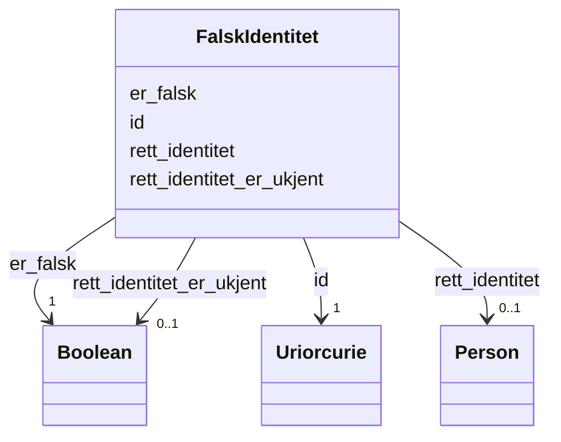

# Class: FalskIdentitet 


_Registrering av at ein person har opptrådt med falsk identitet. Kan peke på den rette identiteten om denne er kjent._


URI: [ngrp:FalskIdentitet](https://data.norge.no/vocabulary/ngr-person#FalskIdentitet)





<!-- no inheritance hierarchy -->

## Class Properties

| Property | Value |
| --- | --- |
| Class URI | [ngrp:FalskIdentitet](https://data.norge.no/vocabulary/ngr-person#FalskIdentitet) |


## Eigenskapar


  
  

  
  
    
  

  
  

  
  


### Obligatorisk

| Namn | Kardinalitet og domene | Beskriving |
| --- | --- | --- |
| [er_falsk](er_falsk.md) | 1 <br/> [xsd:boolean](http://www.w3.org/2001/XMLSchema#boolean) | Om denne identiteten er registrert som falsk |


  
  

  
  

  
  

  
  


  
  

  
  

  
  
    
  

  
  
    
  


### Valgfri

| Namn | Kardinalitet og domene | Beskriving |
| --- | --- | --- |
| [rett_identitet_er_ukjent](rett_identitet_er_ukjent.md) | 0..1 <br/> [xsd:boolean](http://www.w3.org/2001/XMLSchema#boolean) | Om den rette identiteten er ukjent (når falsk identitet er registrert) |
| [rett_identitet](rett_identitet.md) | 0..1 <br/> [Person](person.md) | Den rette identiteten til ein person som har opptrådt med falsk identitet |


  
  
  
  
    
  

  
  
  
    
      
    
      
    
      
    
  
  

  
  
  
    
      
    
      
    
      
    
  
  

  
  
  
    
      
    
      
    
      
    
  
  


### Andre

| Namn | Kardinalitet og domene | Beskriving |
| --- | --- | --- |
| [id](id.md) | 1 <br/> [xsd:anyURI](http://www.w3.org/2001/XMLSchema#anyURI) | URI-identifikator for ressursen |


## Usages

| used by | used in | type | used |
| ---  | --- | --- | --- |
| [PersonContainer](personcontainer.md) | [falskIdentitetar](falskidentitetar.md) | range | [FalskIdentitet](falskidentitet.md) |
| [Person](person.md) | [har_falsk_identitet](har_falsk_identitet.md) | range | [FalskIdentitet](falskidentitet.md) |


## Identifier and Mapping Information


### Schema Source


* from schema: https://data.norge.no/linkml/ngr-person


## Mappings

| Mapping Type | Mapped Value |
| ---  | ---  |
| self | ngrp:FalskIdentitet |
| native | https://data.norge.no/linkml/ngr-person/FalskIdentitet |


## LinkML Source

<!-- TODO: investigate https://stackoverflow.com/questions/37606292/how-to-create-tabbed-code-blocks-in-mkdocs-or-sphinx -->

### Direct

<details>
```yaml
name: FalskIdentitet
description: Registrering av at ein person har opptrådt med falsk identitet. Kan peke
  på den rette identiteten om denne er kjent.
from_schema: https://data.norge.no/linkml/ngr-person
rank: 1000
slots:
- id
- er_falsk
- rett_identitet_er_ukjent
- rett_identitet
slot_usage:
  er_falsk:
    name: er_falsk
    in_subset:
    - Obligatorisk
    required: true
  rett_identitet_er_ukjent:
    name: rett_identitet_er_ukjent
    in_subset:
    - Valgfri
  rett_identitet:
    name: rett_identitet
    in_subset:
    - Valgfri
class_uri: ngrp:FalskIdentitet

```
</details>

### Induced

<details>
```yaml
name: FalskIdentitet
description: Registrering av at ein person har opptrådt med falsk identitet. Kan peke
  på den rette identiteten om denne er kjent.
from_schema: https://data.norge.no/linkml/ngr-person
rank: 1000
slot_usage:
  er_falsk:
    name: er_falsk
    in_subset:
    - Obligatorisk
    required: true
  rett_identitet_er_ukjent:
    name: rett_identitet_er_ukjent
    in_subset:
    - Valgfri
  rett_identitet:
    name: rett_identitet
    in_subset:
    - Valgfri
attributes:
  id:
    name: id
    description: URI-identifikator for ressursen.
    from_schema: https://data.norge.no/linkml/ngr-person
    rank: 1000
    identifier: true
    alias: id
    owner: FalskIdentitet
    domain_of:
    - Person
    - Personnavn
    - Folkeregisteridentifikator
    - Personidentifikasjon
    - FalskIdentitet
    - Identifikasjonsdokument
    - Identitetsgrunnlag
    - Kjoenn
    - Sivilstand
    - Personstatus
    - Statsborgerskap
    - Opphold
    - Foedsel
    - Dodsfall
    - KontaktinformasjonDoedsbo
    - ForeldreansvarForelder
    - ForeldreansvarBarn
    - FamilierelasjonForelder
    - FamilierelasjonBarn
    - FamilierelasjonEktefelle
    - InnflyttingTilNorge
    - UtflyttingFraNorge
    - GeografiskAdresse
    - Adressebeskyttelse
    - Verge
    - RettsligHandleevne
    - ReservasjonMotKommunikasjonPaaNett
    - Kontaktopplysninger
    - SpraakForElektroniskKommunikasjon
    range: uriorcurie
    required: true
  er_falsk:
    name: er_falsk
    description: Om denne identiteten er registrert som falsk.
    in_subset:
    - Obligatorisk
    from_schema: https://data.norge.no/linkml/ngr-person
    rank: 1000
    slot_uri: ngrp:erFalsk
    alias: er_falsk
    owner: FalskIdentitet
    domain_of:
    - FalskIdentitet
    range: boolean
    required: true
  rett_identitet_er_ukjent:
    name: rett_identitet_er_ukjent
    description: Om den rette identiteten er ukjent (når falsk identitet er registrert).
    in_subset:
    - Valgfri
    from_schema: https://data.norge.no/linkml/ngr-person
    rank: 1000
    slot_uri: ngrp:rettIdentitetErUkjent
    alias: rett_identitet_er_ukjent
    owner: FalskIdentitet
    domain_of:
    - FalskIdentitet
    range: boolean
  rett_identitet:
    name: rett_identitet
    description: Den rette identiteten til ein person som har opptrådt med falsk identitet.
    in_subset:
    - Valgfri
    from_schema: https://data.norge.no/linkml/ngr-person
    rank: 1000
    slot_uri: ngrp:rettIdentitet
    alias: rett_identitet
    owner: FalskIdentitet
    domain_of:
    - FalskIdentitet
    range: Person
class_uri: ngrp:FalskIdentitet

```
</details>