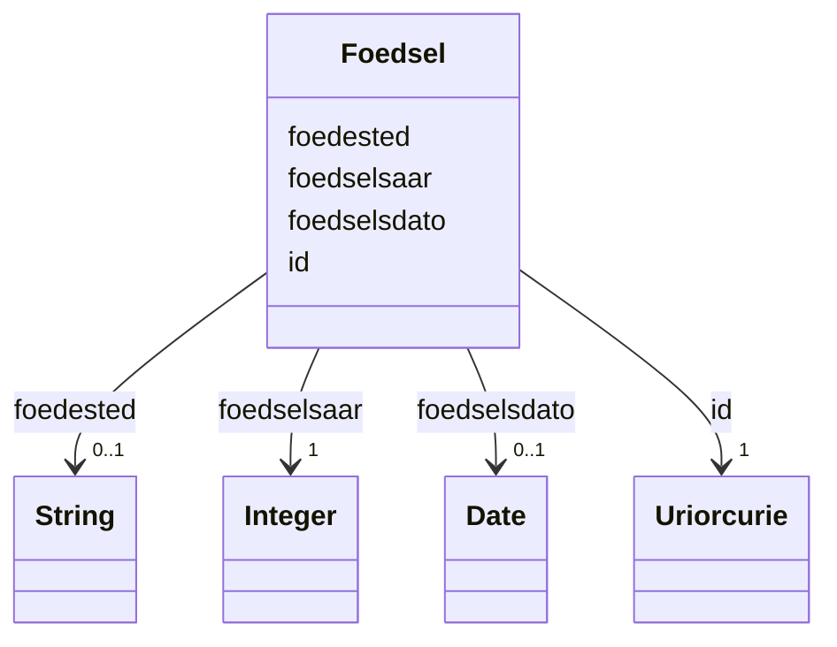

# Class: Foedsel 


_Fødselsinformasjon om ein person registrert i Folkeregisteret._


URI: [ngrp:Foedsel](https://data.norge.no/vocabulary/ngr-person#Foedsel)





<!-- no inheritance hierarchy -->

## Class Properties

| Property | Value |
| --- | --- |
| Class URI | [ngrp:Foedsel](https://data.norge.no/vocabulary/ngr-person#Foedsel) |


## Eigenskapar


  
  

  
  

  
  

  
  
    
  


### Obligatorisk

| Namn | Kardinalitet og domene | Beskriving |
| --- | --- | --- |
| [foedselsaar](foedselsaar.md) | 1 <br/> [xsd:integer](http://www.w3.org/2001/XMLSchema#integer) | Fødselsår (alltid tilgjengeleg, sjølv om fullstendig dato manglar) |


  
  

  
  
    
  

  
  

  
  


### Anbefalt

| Namn | Kardinalitet og domene | Beskriving |
| --- | --- | --- |
| [foedselsdato](foedselsdato.md) | 0..1 <br/> [xsd:date](http://www.w3.org/2001/XMLSchema#date) | Fødselsdato (kan vere ukjent for eldre registreringar) |


  
  

  
  

  
  
    
  

  
  


### Valgfri

| Namn | Kardinalitet og domene | Beskriving |
| --- | --- | --- |
| [foedested](foedested.md) | 0..1 <br/> [xsd:string](http://www.w3.org/2001/XMLSchema#string) | Fødested (kommune eller land) |


  
  
  
  
    
  

  
  
  
    
      
    
      
    
      
    
  
  

  
  
  
    
      
    
      
    
      
    
  
  

  
  
  
    
      
    
      
    
      
    
  
  


### Andre

| Namn | Kardinalitet og domene | Beskriving |
| --- | --- | --- |
| [id](id.md) | 1 <br/> [xsd:anyURI](http://www.w3.org/2001/XMLSchema#anyURI) | URI-identifikator for ressursen |


## Usages

| used by | used in | type | used |
| ---  | --- | --- | --- |
| [PersonContainer](personcontainer.md) | [foedslar](foedslar.md) | range | [Foedsel](foedsel.md) |
| [Person](person.md) | [har_foedsel](har_foedsel.md) | range | [Foedsel](foedsel.md) |


## Identifier and Mapping Information


### Schema Source


* from schema: https://data.norge.no/linkml/ngr-person


## Mappings

| Mapping Type | Mapped Value |
| ---  | ---  |
| self | ngrp:Foedsel |
| native | https://data.norge.no/linkml/ngr-person/Foedsel |


## LinkML Source

<!-- TODO: investigate https://stackoverflow.com/questions/37606292/how-to-create-tabbed-code-blocks-in-mkdocs-or-sphinx -->

### Direct

<details>
```yaml
name: Foedsel
description: Fødselsinformasjon om ein person registrert i Folkeregisteret.
from_schema: https://data.norge.no/linkml/ngr-person
rank: 1000
slots:
- id
- foedselsdato
- foedested
- foedselsaar
slot_usage:
  foedselsdato:
    name: foedselsdato
    in_subset:
    - Anbefalt
  foedselsaar:
    name: foedselsaar
    in_subset:
    - Obligatorisk
    required: true
  foedested:
    name: foedested
    in_subset:
    - Valgfri
class_uri: ngrp:Foedsel

```
</details>

### Induced

<details>
```yaml
name: Foedsel
description: Fødselsinformasjon om ein person registrert i Folkeregisteret.
from_schema: https://data.norge.no/linkml/ngr-person
rank: 1000
slot_usage:
  foedselsdato:
    name: foedselsdato
    in_subset:
    - Anbefalt
  foedselsaar:
    name: foedselsaar
    in_subset:
    - Obligatorisk
    required: true
  foedested:
    name: foedested
    in_subset:
    - Valgfri
attributes:
  id:
    name: id
    description: URI-identifikator for ressursen.
    from_schema: https://data.norge.no/linkml/ngr-person
    rank: 1000
    identifier: true
    alias: id
    owner: Foedsel
    domain_of:
    - Person
    - Personnavn
    - Folkeregisteridentifikator
    - Personidentifikasjon
    - FalskIdentitet
    - Identifikasjonsdokument
    - Identitetsgrunnlag
    - Kjoenn
    - Sivilstand
    - Personstatus
    - Statsborgerskap
    - Opphold
    - Foedsel
    - Dodsfall
    - KontaktinformasjonDoedsbo
    - ForeldreansvarForelder
    - ForeldreansvarBarn
    - FamilierelasjonForelder
    - FamilierelasjonBarn
    - FamilierelasjonEktefelle
    - InnflyttingTilNorge
    - UtflyttingFraNorge
    - GeografiskAdresse
    - Adressebeskyttelse
    - Verge
    - RettsligHandleevne
    - ReservasjonMotKommunikasjonPaaNett
    - Kontaktopplysninger
    - SpraakForElektroniskKommunikasjon
    range: uriorcurie
    required: true
  foedselsdato:
    name: foedselsdato
    description: Fødselsdato (kan vere ukjent for eldre registreringar).
    in_subset:
    - Anbefalt
    from_schema: https://data.norge.no/linkml/ngr-person
    rank: 1000
    slot_uri: ngrp:foedselsdato
    alias: foedselsdato
    owner: Foedsel
    domain_of:
    - Foedsel
    range: date
  foedested:
    name: foedested
    description: Fødested (kommune eller land).
    in_subset:
    - Valgfri
    from_schema: https://data.norge.no/linkml/ngr-person
    rank: 1000
    slot_uri: ngrp:foedested
    alias: foedested
    owner: Foedsel
    domain_of:
    - Foedsel
    range: string
  foedselsaar:
    name: foedselsaar
    description: Fødselsår (alltid tilgjengeleg, sjølv om fullstendig dato manglar).
    in_subset:
    - Obligatorisk
    from_schema: https://data.norge.no/linkml/ngr-person
    rank: 1000
    slot_uri: ngrp:foedselsaar
    alias: foedselsaar
    owner: Foedsel
    domain_of:
    - Foedsel
    range: integer
    required: true
class_uri: ngrp:Foedsel

```
</details>