# Class: Person 


_Ein fysisk person registrert i Folkeregisteret. Hovudbegrepet i domene person._


URI: [ngrp:Person](https://data.norge.no/vocabulary/ngr-person#Person)

```mermaid
 classDiagram
    class Person
    click Person href "../Person/"
      Person : har_adressebeskyttelse
        
          
    
        
        
        Person --> "0..1" Adressebeskyttelse : har_adressebeskyttelse
        click Adressebeskyttelse href "../Adressebeskyttelse/"
    

        
      Person : har_bosted_paa
        
          
    
        
        
        Person --> "0..1" Bostedsadresse : har_bosted_paa
        click Bostedsadresse href "../Bostedsadresse/"
    

        
      Person : har_dodsfall
        
          
    
        
        
        Person --> "0..1" Dodsfall : har_dodsfall
        click Dodsfall href "../Dodsfall/"
    

        
      Person : har_falsk_identitet
        
          
    
        
        
        Person --> "0..1" FalskIdentitet : har_falsk_identitet
        click FalskIdentitet href "../FalskIdentitet/"
    

        
      Person : har_familierelasjon_barn
        
          
    
        
        
        Person --> "*" FamilierelasjonBarn : har_familierelasjon_barn
        click FamilierelasjonBarn href "../FamilierelasjonBarn/"
    

        
      Person : har_familierelasjon_ektefelle
        
          
    
        
        
        Person --> "0..1" FamilierelasjonEktefelle : har_familierelasjon_ektefelle
        click FamilierelasjonEktefelle href "../FamilierelasjonEktefelle/"
    

        
      Person : har_familierelasjon_forelder
        
          
    
        
        
        Person --> "*" FamilierelasjonForelder : har_familierelasjon_forelder
        click FamilierelasjonForelder href "../FamilierelasjonForelder/"
    

        
      Person : har_foedsel
        
          
    
        
        
        Person --> "1" Foedsel : har_foedsel
        click Foedsel href "../Foedsel/"
    

        
      Person : har_folkeregisteridentifikator
        
          
    
        
        
        Person --> "1" Folkeregisteridentifikator : har_folkeregisteridentifikator
        click Folkeregisteridentifikator href "../Folkeregisteridentifikator/"
    

        
      Person : har_foreldreansvar_barn
        
          
    
        
        
        Person --> "*" ForeldreansvarBarn : har_foreldreansvar_barn
        click ForeldreansvarBarn href "../ForeldreansvarBarn/"
    

        
      Person : har_foreldreansvar_forelder
        
          
    
        
        
        Person --> "*" ForeldreansvarForelder : har_foreldreansvar_forelder
        click ForeldreansvarForelder href "../ForeldreansvarForelder/"
    

        
      Person : har_identitetsgrunnlag
        
          
    
        
        
        Person --> "0..1" Identitetsgrunnlag : har_identitetsgrunnlag
        click Identitetsgrunnlag href "../Identitetsgrunnlag/"
    

        
      Person : har_innflytting_til_norge
        
          
    
        
        
        Person --> "0..1" InnflyttingTilNorge : har_innflytting_til_norge
        click InnflyttingTilNorge href "../InnflyttingTilNorge/"
    

        
      Person : har_kjoenn
        
          
    
        
        
        Person --> "1" Kjoenn : har_kjoenn
        click Kjoenn href "../Kjoenn/"
    

        
      Person : har_kontaktinformasjon_doedsbo
        
          
    
        
        
        Person --> "0..1" KontaktinformasjonDoedsbo : har_kontaktinformasjon_doedsbo
        click KontaktinformasjonDoedsbo href "../KontaktinformasjonDoedsbo/"
    

        
      Person : har_kontaktopplysninger
        
          
    
        
        
        Person --> "0..1" Kontaktopplysninger : har_kontaktopplysninger
        click Kontaktopplysninger href "../Kontaktopplysninger/"
    

        
      Person : har_lovlig_opphold
        
          
    
        
        
        Person --> "0..1" Opphold : har_lovlig_opphold
        click Opphold href "../Opphold/"
    

        
      Person : har_personidentifikasjon
        
          
    
        
        
        Person --> "*" Personidentifikasjon : har_personidentifikasjon
        click Personidentifikasjon href "../Personidentifikasjon/"
    

        
      Person : har_personnavn
        
          
    
        
        
        Person --> "1" Personnavn : har_personnavn
        click Personnavn href "../Personnavn/"
    

        
      Person : har_personstatus
        
          
    
        
        
        Person --> "1" Personstatus : har_personstatus
        click Personstatus href "../Personstatus/"
    

        
      Person : har_reservasjon_mot_kommunikasjon
        
          
    
        
        
        Person --> "0..1" ReservasjonMotKommunikasjonPaaNett : har_reservasjon_mot_kommunikasjon
        click ReservasjonMotKommunikasjonPaaNett href "../ReservasjonMotKommunikasjonPaaNett/"
    

        
      Person : har_rettslig_handleevne
        
          
    
        
        
        Person --> "0..1" RettsligHandleevne : har_rettslig_handleevne
        click RettsligHandleevne href "../RettsligHandleevne/"
    

        
      Person : har_sivilstand
        
          
    
        
        
        Person --> "1" Sivilstand : har_sivilstand
        click Sivilstand href "../Sivilstand/"
    

        
      Person : har_statsborgerskap
        
          
    
        
        
        Person --> "1..*" Statsborgerskap : har_statsborgerskap
        click Statsborgerskap href "../Statsborgerskap/"
    

        
      Person : har_utenlandsk_identifikasjonsdokument
        
          
    
        
        
        Person --> "*" Identifikasjonsdokument : har_utenlandsk_identifikasjonsdokument
        click Identifikasjonsdokument href "../Identifikasjonsdokument/"
    

        
      Person : har_utflytting_fra_norge
        
          
    
        
        
        Person --> "0..1" UtflyttingFraNorge : har_utflytting_fra_norge
        click UtflyttingFraNorge href "../UtflyttingFraNorge/"
    

        
      Person : har_valgt_spraak
        
          
    
        
        
        Person --> "1" SpraakForElektroniskKommunikasjon : har_valgt_spraak
        click SpraakForElektroniskKommunikasjon href "../SpraakForElektroniskKommunikasjon/"
    

        
      Person : har_verge
        
          
    
        
        
        Person --> "*" Verge : har_verge
        click Verge href "../Verge/"
    

        
      Person : id
        
          
    
        
        
        Person --> "1" Uriorcurie : id
        click Uriorcurie href "../http://www.w3.org/2001/XMLSchema#anyURI/"
    

        
      Person : mottar_post_paa
        
          
    
        
        
        Person --> "0..1" Postadresse : mottar_post_paa
        click Postadresse href "../Postadresse/"
    

        
      Person : oppholder_seg_paa
        
          
    
        
        
        Person --> "0..1" Oppholdsadresse : oppholder_seg_paa
        click Oppholdsadresse href "../Oppholdsadresse/"
    

        
      
```





<!-- no inheritance hierarchy -->

## Class Properties

| Property | Value |
| --- | --- |
| Class URI | [ngrp:Person](https://data.norge.no/vocabulary/ngr-person#Person) |


## Eigenskapar


  
  

  
  
    
  

  
  
    
  

  
  

  
  

  
  

  
  

  
  
    
  

  
  
    
  

  
  
    
  

  
  
    
  

  
  

  
  
    
  

  
  

  
  

  
  

  
  

  
  

  
  

  
  

  
  

  
  

  
  

  
  

  
  

  
  

  
  

  
  

  
  

  
  

  
  
    
  


### Obligatorisk

| Namn | Kardinalitet og domene | Beskriving |
| --- | --- | --- |
| [har_personnavn](har_personnavn.md) | 1 <br/> [Personnavn](personnavn.md) | Offisielt registrert namn på personen |
| [har_folkeregisteridentifikator](har_folkeregisteridentifikator.md) | 1 <br/> [Folkeregisteridentifikator](folkeregisteridentifikator.md) | Unik identifikator i Folkeregisteret (fødselsnummer eller D-nummer) |
| [har_kjoenn](har_kjoenn.md) | 1 <br/> [Kjoenn](kjoenn.md) | Kjønn registrert på personen |
| [har_sivilstand](har_sivilstand.md) | 1 <br/> [Sivilstand](sivilstand.md) | Sivilstand registrert på personen |
| [har_personstatus](har_personstatus.md) | 1 <br/> [Personstatus](personstatus.md) | Status for personen i Folkeregisteret |
| [har_statsborgerskap](har_statsborgerskap.md) | 1..* <br/> [Statsborgerskap](statsborgerskap.md) | Statsborgerskap registrert på personen (minimum 1) |
| [har_foedsel](har_foedsel.md) | 1 <br/> [Foedsel](foedsel.md) | Fødselsinformasjon om personen |
| [har_valgt_spraak](har_valgt_spraak.md) | 1 <br/> [SpraakForElektroniskKommunikasjon](spraakforelektroniskkommunikasjon.md) | Føretrekt språk for elektronisk kommunikasjon valt av personen |


  
  

  
  

  
  

  
  
    
  

  
  

  
  

  
  

  
  

  
  

  
  

  
  

  
  

  
  

  
  

  
  

  
  

  
  

  
  

  
  

  
  

  
  

  
  

  
  

  
  
    
  

  
  

  
  

  
  

  
  

  
  

  
  

  
  


### Anbefalt

| Namn | Kardinalitet og domene | Beskriving |
| --- | --- | --- |
| [har_personidentifikasjon](har_personidentifikasjon.md) | * <br/> [Personidentifikasjon](personidentifikasjon.md) | Utanlandsk eller alternativ identifikasjon av personen |
| [har_bosted_paa](har_bosted_paa.md) | 0..1 <br/> [Bostedsadresse](bostedsadresse.md) | Adressa personen er registrert busett på |


  
  

  
  

  
  

  
  

  
  
    
  

  
  
    
  

  
  
    
  

  
  

  
  

  
  

  
  

  
  
    
  

  
  

  
  
    
  

  
  
    
  

  
  
    
  

  
  
    
  

  
  
    
  

  
  
    
  

  
  
    
  

  
  
    
  

  
  
    
  

  
  
    
  

  
  

  
  
    
  

  
  
    
  

  
  
    
  

  
  
    
  

  
  
    
  

  
  
    
  

  
  


### Valgfri

| Namn | Kardinalitet og domene | Beskriving |
| --- | --- | --- |
| [har_falsk_identitet](har_falsk_identitet.md) | 0..1 <br/> [FalskIdentitet](falskidentitet.md) | Registrering av at personen har opptrådt med falsk identitet |
| [har_utenlandsk_identifikasjonsdokument](har_utenlandsk_identifikasjonsdokument.md) | * <br/> [Identifikasjonsdokument](identifikasjonsdokument.md) | Utanlandske identifikasjonsdokument knytt til personen |
| [har_identitetsgrunnlag](har_identitetsgrunnlag.md) | 0..1 <br/> [Identitetsgrunnlag](identitetsgrunnlag.md) | Grunnlaget for personens identitetsfastsetjing |
| [har_lovlig_opphold](har_lovlig_opphold.md) | 0..1 <br/> [Opphold](opphold.md) | Lovleg opphaldsgrunnlag for utanlandske statsborgarar |
| [har_foreldreansvar_forelder](har_foreldreansvar_forelder.md) | * <br/> [ForeldreansvarForelder](foreldreansvarforelder.md) | Personar med juridisk foreldreansvar for denne personen (maks 2) |
| [har_foreldreansvar_barn](har_foreldreansvar_barn.md) | * <br/> [ForeldreansvarBarn](foreldreansvarbarn.md) | Barn som denne personen har juridisk foreldreansvar for |
| [har_familierelasjon_forelder](har_familierelasjon_forelder.md) | * <br/> [FamilierelasjonForelder](familierelasjonforelder.md) | Familierelasjonar der den relaterte personen er forelder (maks 2) |
| [har_familierelasjon_barn](har_familierelasjon_barn.md) | * <br/> [FamilierelasjonBarn](familierelasjonbarn.md) | Familierelasjonar der den relaterte personen er barn |
| [har_familierelasjon_ektefelle](har_familierelasjon_ektefelle.md) | 0..1 <br/> [FamilierelasjonEktefelle](familierelasjonektefelle.md) | Familierelasjon til ektefelle eller registrert partnar |
| [har_dodsfall](har_dodsfall.md) | 0..1 <br/> [Dodsfall](dodsfall.md) | Dødsfallsinformasjon om personen |
| [har_kontaktinformasjon_doedsbo](har_kontaktinformasjon_doedsbo.md) | 0..1 <br/> [KontaktinformasjonDoedsbo](kontaktinformasjondoedsbo.md) | Kontaktinformasjon for personens dødsbu |
| [har_innflytting_til_norge](har_innflytting_til_norge.md) | 0..1 <br/> [InnflyttingTilNorge](innflyttingtilnorge.md) | Siste innflyttingsregistrering til Noreg |
| [har_utflytting_fra_norge](har_utflytting_fra_norge.md) | 0..1 <br/> [UtflyttingFraNorge](utflyttingfranorge.md) | Siste utflyttingsregistrering frå Noreg |
| [har_adressebeskyttelse](har_adressebeskyttelse.md) | 0..1 <br/> [Adressebeskyttelse](adressebeskyttelse.md) | Adressebeskyttelse registrert på personen |
| [mottar_post_paa](mottar_post_paa.md) | 0..1 <br/> [Postadresse](postadresse.md) | Adressa personen mottar post på |
| [oppholder_seg_paa](oppholder_seg_paa.md) | 0..1 <br/> [Oppholdsadresse](oppholdsadresse.md) | Adressa personen faktisk oppheld seg på |
| [har_verge](har_verge.md) | * <br/> [Verge](verge.md) | Verje(r) oppnemnd for personen |
| [har_rettslig_handleevne](har_rettslig_handleevne.md) | 0..1 <br/> [RettsligHandleevne](rettslighandleevne.md) | Avgrensing i rettsleg handleevne registrert for personen |
| [har_reservasjon_mot_kommunikasjon](har_reservasjon_mot_kommunikasjon.md) | 0..1 <br/> [ReservasjonMotKommunikasjonPaaNett](reservasjonmotkommunikasjonpaanett.md) | Reservasjon mot digital kommunikasjon frå det offentlege |
| [har_kontaktopplysninger](har_kontaktopplysninger.md) | 0..1 <br/> [Kontaktopplysninger](kontaktopplysninger.md) | Kontaktopplysningar registrert i KRR |


  
  
  
  
    
  

  
  
  
    
      
    
      
    
      
    
  
  

  
  
  
    
      
    
      
    
      
    
  
  

  
  
  
    
      
    
      
    
      
    
  
  

  
  
  
    
      
    
      
    
      
    
  
  

  
  
  
    
      
    
      
    
      
    
  
  

  
  
  
    
      
    
      
    
      
    
  
  

  
  
  
    
      
    
      
    
      
    
  
  

  
  
  
    
      
    
      
    
      
    
  
  

  
  
  
    
      
    
      
    
      
    
  
  

  
  
  
    
      
    
      
    
      
    
  
  

  
  
  
    
      
    
      
    
      
    
  
  

  
  
  
    
      
    
      
    
      
    
  
  

  
  
  
    
      
    
      
    
      
    
  
  

  
  
  
    
      
    
      
    
      
    
  
  

  
  
  
    
      
    
      
    
      
    
  
  

  
  
  
    
      
    
      
    
      
    
  
  

  
  
  
    
      
    
      
    
      
    
  
  

  
  
  
    
      
    
      
    
      
    
  
  

  
  
  
    
      
    
      
    
      
    
  
  

  
  
  
    
      
    
      
    
      
    
  
  

  
  
  
    
      
    
      
    
      
    
  
  

  
  
  
    
      
    
      
    
      
    
  
  

  
  
  
    
      
    
      
    
      
    
  
  

  
  
  
    
      
    
      
    
      
    
  
  

  
  
  
    
      
    
      
    
      
    
  
  

  
  
  
    
      
    
      
    
      
    
  
  

  
  
  
    
      
    
      
    
      
    
  
  

  
  
  
    
      
    
      
    
      
    
  
  

  
  
  
    
      
    
      
    
      
    
  
  

  
  
  
    
      
    
      
    
      
    
  
  


### Andre

| Namn | Kardinalitet og domene | Beskriving |
| --- | --- | --- |
| [id](id.md) | 1 <br/> [xsd:anyURI](http://www.w3.org/2001/XMLSchema#anyURI) | URI-identifikator for ressursen |


## Usages

| used by | used in | type | used |
| ---  | --- | --- | --- |
| [PersonContainer](personcontainer.md) | [personar](personar.md) | range | [Person](person.md) |
| [FalskIdentitet](falskidentitet.md) | [rett_identitet](rett_identitet.md) | range | [Person](person.md) |
| [Sivilstand](sivilstand.md) | [relatert_ved_sivilstand](relatert_ved_sivilstand.md) | range | [Person](person.md) |
| [ForeldreansvarForelder](foreldreansvarforelder.md) | [er_av_type_person](er_av_type_person.md) | range | [Person](person.md) |
| [ForeldreansvarBarn](foreldreansvarbarn.md) | [er_av_type_person](er_av_type_person.md) | range | [Person](person.md) |
| [FamilierelasjonForelder](familierelasjonforelder.md) | [er_av_type_person](er_av_type_person.md) | range | [Person](person.md) |
| [FamilierelasjonBarn](familierelasjonbarn.md) | [er_av_type_person](er_av_type_person.md) | range | [Person](person.md) |
| [FamilierelasjonEktefelle](familierelasjonektefelle.md) | [er_av_type_person](er_av_type_person.md) | range | [Person](person.md) |
| [Verge](verge.md) | [er_av_type_person](er_av_type_person.md) | range | [Person](person.md) |


## Identifier and Mapping Information


### Schema Source


* from schema: https://data.norge.no/linkml/ngr-person


## Mappings

| Mapping Type | Mapped Value |
| ---  | ---  |
| self | ngrp:Person |
| native | https://data.norge.no/linkml/ngr-person/Person |


## LinkML Source

<!-- TODO: investigate https://stackoverflow.com/questions/37606292/how-to-create-tabbed-code-blocks-in-mkdocs-or-sphinx -->

### Direct

<details>
```yaml
name: Person
description: Ein fysisk person registrert i Folkeregisteret. Hovudbegrepet i domene
  person.
from_schema: https://data.norge.no/linkml/ngr-person
rank: 1000
slots:
- id
- har_personnavn
- har_folkeregisteridentifikator
- har_personidentifikasjon
- har_falsk_identitet
- har_utenlandsk_identifikasjonsdokument
- har_identitetsgrunnlag
- har_kjoenn
- har_sivilstand
- har_personstatus
- har_statsborgerskap
- har_lovlig_opphold
- har_foedsel
- har_foreldreansvar_forelder
- har_foreldreansvar_barn
- har_familierelasjon_forelder
- har_familierelasjon_barn
- har_familierelasjon_ektefelle
- har_dodsfall
- har_kontaktinformasjon_doedsbo
- har_innflytting_til_norge
- har_utflytting_fra_norge
- har_adressebeskyttelse
- har_bosted_paa
- mottar_post_paa
- oppholder_seg_paa
- har_verge
- har_rettslig_handleevne
- har_reservasjon_mot_kommunikasjon
- har_kontaktopplysninger
- har_valgt_spraak
slot_usage:
  har_personnavn:
    name: har_personnavn
    in_subset:
    - Obligatorisk
    required: true
  har_folkeregisteridentifikator:
    name: har_folkeregisteridentifikator
    in_subset:
    - Obligatorisk
    required: true
  har_kjoenn:
    name: har_kjoenn
    in_subset:
    - Obligatorisk
    required: true
  har_sivilstand:
    name: har_sivilstand
    in_subset:
    - Obligatorisk
    required: true
  har_personstatus:
    name: har_personstatus
    in_subset:
    - Obligatorisk
    required: true
  har_statsborgerskap:
    name: har_statsborgerskap
    in_subset:
    - Obligatorisk
    required: true
    minimum_cardinality: 1
  har_foedsel:
    name: har_foedsel
    in_subset:
    - Obligatorisk
    required: true
  har_valgt_spraak:
    name: har_valgt_spraak
    in_subset:
    - Obligatorisk
    required: true
  har_personidentifikasjon:
    name: har_personidentifikasjon
    in_subset:
    - Anbefalt
  har_utenlandsk_identifikasjonsdokument:
    name: har_utenlandsk_identifikasjonsdokument
    in_subset:
    - Valgfri
  har_falsk_identitet:
    name: har_falsk_identitet
    in_subset:
    - Valgfri
  har_identitetsgrunnlag:
    name: har_identitetsgrunnlag
    in_subset:
    - Valgfri
  har_lovlig_opphold:
    name: har_lovlig_opphold
    in_subset:
    - Valgfri
  har_foreldreansvar_forelder:
    name: har_foreldreansvar_forelder
    in_subset:
    - Valgfri
  har_foreldreansvar_barn:
    name: har_foreldreansvar_barn
    in_subset:
    - Valgfri
  har_familierelasjon_forelder:
    name: har_familierelasjon_forelder
    in_subset:
    - Valgfri
  har_familierelasjon_barn:
    name: har_familierelasjon_barn
    in_subset:
    - Valgfri
  har_familierelasjon_ektefelle:
    name: har_familierelasjon_ektefelle
    in_subset:
    - Valgfri
  har_dodsfall:
    name: har_dodsfall
    in_subset:
    - Valgfri
  har_kontaktinformasjon_doedsbo:
    name: har_kontaktinformasjon_doedsbo
    in_subset:
    - Valgfri
  har_innflytting_til_norge:
    name: har_innflytting_til_norge
    in_subset:
    - Valgfri
  har_utflytting_fra_norge:
    name: har_utflytting_fra_norge
    in_subset:
    - Valgfri
  har_adressebeskyttelse:
    name: har_adressebeskyttelse
    in_subset:
    - Valgfri
  har_bosted_paa:
    name: har_bosted_paa
    in_subset:
    - Anbefalt
  mottar_post_paa:
    name: mottar_post_paa
    in_subset:
    - Valgfri
  oppholder_seg_paa:
    name: oppholder_seg_paa
    in_subset:
    - Valgfri
  har_verge:
    name: har_verge
    in_subset:
    - Valgfri
  har_rettslig_handleevne:
    name: har_rettslig_handleevne
    in_subset:
    - Valgfri
  har_reservasjon_mot_kommunikasjon:
    name: har_reservasjon_mot_kommunikasjon
    in_subset:
    - Valgfri
  har_kontaktopplysninger:
    name: har_kontaktopplysninger
    in_subset:
    - Valgfri
class_uri: ngrp:Person

```
</details>

### Induced

<details>
```yaml
name: Person
description: Ein fysisk person registrert i Folkeregisteret. Hovudbegrepet i domene
  person.
from_schema: https://data.norge.no/linkml/ngr-person
rank: 1000
slot_usage:
  har_personnavn:
    name: har_personnavn
    in_subset:
    - Obligatorisk
    required: true
  har_folkeregisteridentifikator:
    name: har_folkeregisteridentifikator
    in_subset:
    - Obligatorisk
    required: true
  har_kjoenn:
    name: har_kjoenn
    in_subset:
    - Obligatorisk
    required: true
  har_sivilstand:
    name: har_sivilstand
    in_subset:
    - Obligatorisk
    required: true
  har_personstatus:
    name: har_personstatus
    in_subset:
    - Obligatorisk
    required: true
  har_statsborgerskap:
    name: har_statsborgerskap
    in_subset:
    - Obligatorisk
    required: true
    minimum_cardinality: 1
  har_foedsel:
    name: har_foedsel
    in_subset:
    - Obligatorisk
    required: true
  har_valgt_spraak:
    name: har_valgt_spraak
    in_subset:
    - Obligatorisk
    required: true
  har_personidentifikasjon:
    name: har_personidentifikasjon
    in_subset:
    - Anbefalt
  har_utenlandsk_identifikasjonsdokument:
    name: har_utenlandsk_identifikasjonsdokument
    in_subset:
    - Valgfri
  har_falsk_identitet:
    name: har_falsk_identitet
    in_subset:
    - Valgfri
  har_identitetsgrunnlag:
    name: har_identitetsgrunnlag
    in_subset:
    - Valgfri
  har_lovlig_opphold:
    name: har_lovlig_opphold
    in_subset:
    - Valgfri
  har_foreldreansvar_forelder:
    name: har_foreldreansvar_forelder
    in_subset:
    - Valgfri
  har_foreldreansvar_barn:
    name: har_foreldreansvar_barn
    in_subset:
    - Valgfri
  har_familierelasjon_forelder:
    name: har_familierelasjon_forelder
    in_subset:
    - Valgfri
  har_familierelasjon_barn:
    name: har_familierelasjon_barn
    in_subset:
    - Valgfri
  har_familierelasjon_ektefelle:
    name: har_familierelasjon_ektefelle
    in_subset:
    - Valgfri
  har_dodsfall:
    name: har_dodsfall
    in_subset:
    - Valgfri
  har_kontaktinformasjon_doedsbo:
    name: har_kontaktinformasjon_doedsbo
    in_subset:
    - Valgfri
  har_innflytting_til_norge:
    name: har_innflytting_til_norge
    in_subset:
    - Valgfri
  har_utflytting_fra_norge:
    name: har_utflytting_fra_norge
    in_subset:
    - Valgfri
  har_adressebeskyttelse:
    name: har_adressebeskyttelse
    in_subset:
    - Valgfri
  har_bosted_paa:
    name: har_bosted_paa
    in_subset:
    - Anbefalt
  mottar_post_paa:
    name: mottar_post_paa
    in_subset:
    - Valgfri
  oppholder_seg_paa:
    name: oppholder_seg_paa
    in_subset:
    - Valgfri
  har_verge:
    name: har_verge
    in_subset:
    - Valgfri
  har_rettslig_handleevne:
    name: har_rettslig_handleevne
    in_subset:
    - Valgfri
  har_reservasjon_mot_kommunikasjon:
    name: har_reservasjon_mot_kommunikasjon
    in_subset:
    - Valgfri
  har_kontaktopplysninger:
    name: har_kontaktopplysninger
    in_subset:
    - Valgfri
attributes:
  id:
    name: id
    description: URI-identifikator for ressursen.
    from_schema: https://data.norge.no/linkml/ngr-person
    rank: 1000
    identifier: true
    alias: id
    owner: Person
    domain_of:
    - Person
    - Personnavn
    - Folkeregisteridentifikator
    - Personidentifikasjon
    - FalskIdentitet
    - Identifikasjonsdokument
    - Identitetsgrunnlag
    - Kjoenn
    - Sivilstand
    - Personstatus
    - Statsborgerskap
    - Opphold
    - Foedsel
    - Dodsfall
    - KontaktinformasjonDoedsbo
    - ForeldreansvarForelder
    - ForeldreansvarBarn
    - FamilierelasjonForelder
    - FamilierelasjonBarn
    - FamilierelasjonEktefelle
    - InnflyttingTilNorge
    - UtflyttingFraNorge
    - GeografiskAdresse
    - Adressebeskyttelse
    - Verge
    - RettsligHandleevne
    - ReservasjonMotKommunikasjonPaaNett
    - Kontaktopplysninger
    - SpraakForElektroniskKommunikasjon
    range: uriorcurie
    required: true
  har_personnavn:
    name: har_personnavn
    description: Offisielt registrert namn på personen.
    in_subset:
    - Obligatorisk
    from_schema: https://data.norge.no/linkml/ngr-person
    rank: 1000
    slot_uri: ngrp:harPersonnavn
    alias: har_personnavn
    owner: Person
    domain_of:
    - Person
    range: Personnavn
    required: true
  har_folkeregisteridentifikator:
    name: har_folkeregisteridentifikator
    description: Unik identifikator i Folkeregisteret (fødselsnummer eller D-nummer).
    in_subset:
    - Obligatorisk
    from_schema: https://data.norge.no/linkml/ngr-person
    rank: 1000
    slot_uri: ngrp:harFolkeregisteridentifikator
    alias: har_folkeregisteridentifikator
    owner: Person
    domain_of:
    - Person
    range: Folkeregisteridentifikator
    required: true
  har_personidentifikasjon:
    name: har_personidentifikasjon
    description: Utanlandsk eller alternativ identifikasjon av personen.
    in_subset:
    - Anbefalt
    from_schema: https://data.norge.no/linkml/ngr-person
    rank: 1000
    slot_uri: ngrp:harPersonidentifikasjon
    alias: har_personidentifikasjon
    owner: Person
    domain_of:
    - Person
    range: Personidentifikasjon
    multivalued: true
  har_falsk_identitet:
    name: har_falsk_identitet
    description: Registrering av at personen har opptrådt med falsk identitet.
    in_subset:
    - Valgfri
    from_schema: https://data.norge.no/linkml/ngr-person
    rank: 1000
    slot_uri: ngrp:harFalskIdentitet
    alias: har_falsk_identitet
    owner: Person
    domain_of:
    - Person
    range: FalskIdentitet
  har_utenlandsk_identifikasjonsdokument:
    name: har_utenlandsk_identifikasjonsdokument
    description: Utanlandske identifikasjonsdokument knytt til personen.
    in_subset:
    - Valgfri
    from_schema: https://data.norge.no/linkml/ngr-person
    rank: 1000
    slot_uri: ngrp:harUtenlandskIdentifikasjonsdokument
    alias: har_utenlandsk_identifikasjonsdokument
    owner: Person
    domain_of:
    - Person
    range: Identifikasjonsdokument
    multivalued: true
  har_identitetsgrunnlag:
    name: har_identitetsgrunnlag
    description: Grunnlaget for personens identitetsfastsetjing.
    in_subset:
    - Valgfri
    from_schema: https://data.norge.no/linkml/ngr-person
    rank: 1000
    slot_uri: ngrp:harIdentitetsgrunnlag
    alias: har_identitetsgrunnlag
    owner: Person
    domain_of:
    - Person
    range: Identitetsgrunnlag
  har_kjoenn:
    name: har_kjoenn
    description: Kjønn registrert på personen.
    in_subset:
    - Obligatorisk
    from_schema: https://data.norge.no/linkml/ngr-person
    rank: 1000
    slot_uri: ngrp:harKjoenn
    alias: har_kjoenn
    owner: Person
    domain_of:
    - Person
    range: Kjoenn
    required: true
  har_sivilstand:
    name: har_sivilstand
    description: Sivilstand registrert på personen.
    in_subset:
    - Obligatorisk
    from_schema: https://data.norge.no/linkml/ngr-person
    rank: 1000
    slot_uri: ngrp:harSivilstand
    alias: har_sivilstand
    owner: Person
    domain_of:
    - Person
    range: Sivilstand
    required: true
  har_personstatus:
    name: har_personstatus
    description: Status for personen i Folkeregisteret.
    in_subset:
    - Obligatorisk
    from_schema: https://data.norge.no/linkml/ngr-person
    rank: 1000
    slot_uri: ngrp:harPersonstatus
    alias: har_personstatus
    owner: Person
    domain_of:
    - Person
    range: Personstatus
    required: true
  har_statsborgerskap:
    name: har_statsborgerskap
    description: Statsborgerskap registrert på personen (minimum 1).
    in_subset:
    - Obligatorisk
    from_schema: https://data.norge.no/linkml/ngr-person
    rank: 1000
    slot_uri: ngrp:harStatsborgerskap
    alias: har_statsborgerskap
    owner: Person
    domain_of:
    - Person
    range: Statsborgerskap
    required: true
    multivalued: true
    minimum_cardinality: 1
  har_lovlig_opphold:
    name: har_lovlig_opphold
    description: Lovleg opphaldsgrunnlag for utanlandske statsborgarar.
    in_subset:
    - Valgfri
    from_schema: https://data.norge.no/linkml/ngr-person
    rank: 1000
    slot_uri: ngrp:harLovligOpphold
    alias: har_lovlig_opphold
    owner: Person
    domain_of:
    - Person
    range: Opphold
  har_foedsel:
    name: har_foedsel
    description: Fødselsinformasjon om personen.
    in_subset:
    - Obligatorisk
    from_schema: https://data.norge.no/linkml/ngr-person
    rank: 1000
    slot_uri: ngrp:harFoedsel
    alias: har_foedsel
    owner: Person
    domain_of:
    - Person
    range: Foedsel
    required: true
  har_foreldreansvar_forelder:
    name: har_foreldreansvar_forelder
    description: Personar med juridisk foreldreansvar for denne personen (maks 2).
    in_subset:
    - Valgfri
    from_schema: https://data.norge.no/linkml/ngr-person
    rank: 1000
    slot_uri: ngrp:harForeldreansvarForelder
    alias: har_foreldreansvar_forelder
    owner: Person
    domain_of:
    - Person
    range: ForeldreansvarForelder
    multivalued: true
  har_foreldreansvar_barn:
    name: har_foreldreansvar_barn
    description: Barn som denne personen har juridisk foreldreansvar for.
    in_subset:
    - Valgfri
    from_schema: https://data.norge.no/linkml/ngr-person
    rank: 1000
    slot_uri: ngrp:harForeldreansvarBarn
    alias: har_foreldreansvar_barn
    owner: Person
    domain_of:
    - Person
    range: ForeldreansvarBarn
    multivalued: true
  har_familierelasjon_forelder:
    name: har_familierelasjon_forelder
    description: Familierelasjonar der den relaterte personen er forelder (maks 2).
    in_subset:
    - Valgfri
    from_schema: https://data.norge.no/linkml/ngr-person
    rank: 1000
    slot_uri: ngrp:harFamilierelasjonForelder
    alias: har_familierelasjon_forelder
    owner: Person
    domain_of:
    - Person
    range: FamilierelasjonForelder
    multivalued: true
  har_familierelasjon_barn:
    name: har_familierelasjon_barn
    description: Familierelasjonar der den relaterte personen er barn.
    in_subset:
    - Valgfri
    from_schema: https://data.norge.no/linkml/ngr-person
    rank: 1000
    slot_uri: ngrp:harFamilierelasjonBarn
    alias: har_familierelasjon_barn
    owner: Person
    domain_of:
    - Person
    range: FamilierelasjonBarn
    multivalued: true
  har_familierelasjon_ektefelle:
    name: har_familierelasjon_ektefelle
    description: Familierelasjon til ektefelle eller registrert partnar.
    in_subset:
    - Valgfri
    from_schema: https://data.norge.no/linkml/ngr-person
    rank: 1000
    slot_uri: ngrp:harFamilierelasjonEktefelle
    alias: har_familierelasjon_ektefelle
    owner: Person
    domain_of:
    - Person
    range: FamilierelasjonEktefelle
  har_dodsfall:
    name: har_dodsfall
    description: Dødsfallsinformasjon om personen.
    in_subset:
    - Valgfri
    from_schema: https://data.norge.no/linkml/ngr-person
    rank: 1000
    slot_uri: ngrp:harDodsfall
    alias: har_dodsfall
    owner: Person
    domain_of:
    - Person
    range: Dodsfall
  har_kontaktinformasjon_doedsbo:
    name: har_kontaktinformasjon_doedsbo
    description: Kontaktinformasjon for personens dødsbu.
    in_subset:
    - Valgfri
    from_schema: https://data.norge.no/linkml/ngr-person
    rank: 1000
    slot_uri: ngrp:harKontaktinformasjonDoedsbo
    alias: har_kontaktinformasjon_doedsbo
    owner: Person
    domain_of:
    - Person
    range: KontaktinformasjonDoedsbo
  har_innflytting_til_norge:
    name: har_innflytting_til_norge
    description: Siste innflyttingsregistrering til Noreg.
    in_subset:
    - Valgfri
    from_schema: https://data.norge.no/linkml/ngr-person
    rank: 1000
    slot_uri: ngrp:harInnflyttingTilNorge
    alias: har_innflytting_til_norge
    owner: Person
    domain_of:
    - Person
    range: InnflyttingTilNorge
  har_utflytting_fra_norge:
    name: har_utflytting_fra_norge
    description: Siste utflyttingsregistrering frå Noreg.
    in_subset:
    - Valgfri
    from_schema: https://data.norge.no/linkml/ngr-person
    rank: 1000
    slot_uri: ngrp:harUtflyttingFraNorge
    alias: har_utflytting_fra_norge
    owner: Person
    domain_of:
    - Person
    range: UtflyttingFraNorge
  har_adressebeskyttelse:
    name: har_adressebeskyttelse
    description: Adressebeskyttelse registrert på personen.
    in_subset:
    - Valgfri
    from_schema: https://data.norge.no/linkml/ngr-person
    rank: 1000
    slot_uri: ngrp:harAdressebeskyttelse
    alias: har_adressebeskyttelse
    owner: Person
    domain_of:
    - Person
    range: Adressebeskyttelse
  har_bosted_paa:
    name: har_bosted_paa
    description: Adressa personen er registrert busett på.
    in_subset:
    - Anbefalt
    from_schema: https://data.norge.no/linkml/ngr-person
    rank: 1000
    slot_uri: ngrp:harBostedPaa
    alias: har_bosted_paa
    owner: Person
    domain_of:
    - Person
    range: Bostedsadresse
  mottar_post_paa:
    name: mottar_post_paa
    description: Adressa personen mottar post på.
    in_subset:
    - Valgfri
    from_schema: https://data.norge.no/linkml/ngr-person
    rank: 1000
    slot_uri: ngrp:mottarPostPaa
    alias: mottar_post_paa
    owner: Person
    domain_of:
    - Person
    range: Postadresse
  oppholder_seg_paa:
    name: oppholder_seg_paa
    description: Adressa personen faktisk oppheld seg på.
    in_subset:
    - Valgfri
    from_schema: https://data.norge.no/linkml/ngr-person
    rank: 1000
    slot_uri: ngrp:oppholderSegPaa
    alias: oppholder_seg_paa
    owner: Person
    domain_of:
    - Person
    range: Oppholdsadresse
  har_verge:
    name: har_verge
    description: Verje(r) oppnemnd for personen.
    in_subset:
    - Valgfri
    from_schema: https://data.norge.no/linkml/ngr-person
    rank: 1000
    slot_uri: ngrp:harVerge
    alias: har_verge
    owner: Person
    domain_of:
    - Person
    range: Verge
    multivalued: true
  har_rettslig_handleevne:
    name: har_rettslig_handleevne
    description: Avgrensing i rettsleg handleevne registrert for personen.
    in_subset:
    - Valgfri
    from_schema: https://data.norge.no/linkml/ngr-person
    rank: 1000
    slot_uri: ngrp:harRettsligHandleevne
    alias: har_rettslig_handleevne
    owner: Person
    domain_of:
    - Person
    range: RettsligHandleevne
  har_reservasjon_mot_kommunikasjon:
    name: har_reservasjon_mot_kommunikasjon
    description: Reservasjon mot digital kommunikasjon frå det offentlege.
    in_subset:
    - Valgfri
    from_schema: https://data.norge.no/linkml/ngr-person
    rank: 1000
    slot_uri: ngrp:harReservasjonMotKommunikasjon
    alias: har_reservasjon_mot_kommunikasjon
    owner: Person
    domain_of:
    - Person
    range: ReservasjonMotKommunikasjonPaaNett
  har_kontaktopplysninger:
    name: har_kontaktopplysninger
    description: Kontaktopplysningar registrert i KRR.
    in_subset:
    - Valgfri
    from_schema: https://data.norge.no/linkml/ngr-person
    rank: 1000
    slot_uri: ngrp:harKontaktopplysninger
    alias: har_kontaktopplysninger
    owner: Person
    domain_of:
    - Person
    range: Kontaktopplysninger
  har_valgt_spraak:
    name: har_valgt_spraak
    description: Føretrekt språk for elektronisk kommunikasjon valt av personen.
    in_subset:
    - Obligatorisk
    from_schema: https://data.norge.no/linkml/ngr-person
    rank: 1000
    slot_uri: ngrp:harValgtSpraak
    alias: har_valgt_spraak
    owner: Person
    domain_of:
    - Person
    range: SpraakForElektroniskKommunikasjon
    required: true
class_uri: ngrp:Person

```
</details>