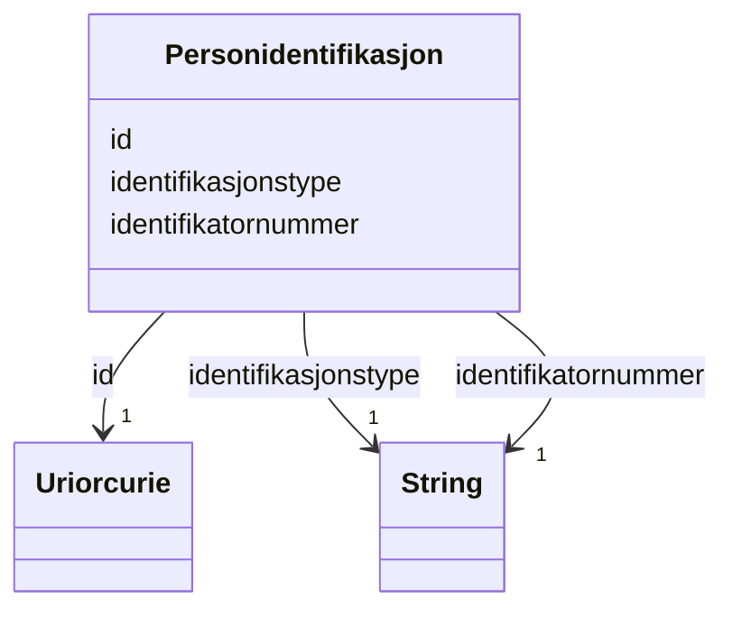

# Class: Personidentifikasjon 


_Utanlandsk eller alternativ identifikasjon av ein person, t.d. UDIs DUF-nummer, utanlandsk skatteidentifikasjon eller social security number._


URI: [ngrp:Personidentifikasjon](https://data.norge.no/vocabulary/ngr-person#Personidentifikasjon)





<!-- no inheritance hierarchy -->

## Class Properties

| Property | Value |
| --- | --- |
| Class URI | [ngrp:Personidentifikasjon](https://data.norge.no/vocabulary/ngr-person#Personidentifikasjon) |


## Eigenskapar


  
  

  
  
    
  

  
  
    
  


### Obligatorisk

| Namn | Kardinalitet og domene | Beskriving |
| --- | --- | --- |
| [identifikasjonstype](identifikasjonstype.md) | 1 <br/> [xsd:string](http://www.w3.org/2001/XMLSchema#string) | Type utanlandsk identifikasjon (t |
| [identifikatornummer](identifikatornummer.md) | 1 <br/> [xsd:string](http://www.w3.org/2001/XMLSchema#string) | Sjølve identifikatoren som tekststreng (11 siffer for fødselsnummer/D-nummer) |


  
  

  
  

  
  


  
  

  
  

  
  


  
  
  
  
    
  

  
  
  
    
      
    
      
    
      
    
  
  

  
  
  
    
      
    
      
    
      
    
  
  


### Andre

| Namn | Kardinalitet og domene | Beskriving |
| --- | --- | --- |
| [id](id.md) | 1 <br/> [xsd:anyURI](http://www.w3.org/2001/XMLSchema#anyURI) | URI-identifikator for ressursen |


## Usages

| used by | used in | type | used |
| ---  | --- | --- | --- |
| [PersonContainer](personcontainer.md) | [personidentifikasjonar](personidentifikasjonar.md) | range | [Personidentifikasjon](personidentifikasjon.md) |
| [Person](person.md) | [har_personidentifikasjon](har_personidentifikasjon.md) | range | [Personidentifikasjon](personidentifikasjon.md) |


## Identifier and Mapping Information


### Schema Source


* from schema: https://data.norge.no/linkml/ngr-person


## Mappings

| Mapping Type | Mapped Value |
| ---  | ---  |
| self | ngrp:Personidentifikasjon |
| native | https://data.norge.no/linkml/ngr-person/Personidentifikasjon |


## LinkML Source

<!-- TODO: investigate https://stackoverflow.com/questions/37606292/how-to-create-tabbed-code-blocks-in-mkdocs-or-sphinx -->

### Direct

<details>
```yaml
name: Personidentifikasjon
description: Utanlandsk eller alternativ identifikasjon av ein person, t.d. UDIs DUF-nummer,
  utanlandsk skatteidentifikasjon eller social security number.
from_schema: https://data.norge.no/linkml/ngr-person
rank: 1000
slots:
- id
- identifikasjonstype
- identifikatornummer
slot_usage:
  identifikasjonstype:
    name: identifikasjonstype
    in_subset:
    - Obligatorisk
    required: true
  identifikatornummer:
    name: identifikatornummer
    in_subset:
    - Obligatorisk
    required: true
class_uri: ngrp:Personidentifikasjon

```
</details>

### Induced

<details>
```yaml
name: Personidentifikasjon
description: Utanlandsk eller alternativ identifikasjon av ein person, t.d. UDIs DUF-nummer,
  utanlandsk skatteidentifikasjon eller social security number.
from_schema: https://data.norge.no/linkml/ngr-person
rank: 1000
slot_usage:
  identifikasjonstype:
    name: identifikasjonstype
    in_subset:
    - Obligatorisk
    required: true
  identifikatornummer:
    name: identifikatornummer
    in_subset:
    - Obligatorisk
    required: true
attributes:
  id:
    name: id
    description: URI-identifikator for ressursen.
    from_schema: https://data.norge.no/linkml/ngr-person
    rank: 1000
    identifier: true
    alias: id
    owner: Personidentifikasjon
    domain_of:
    - Person
    - Personnavn
    - Folkeregisteridentifikator
    - Personidentifikasjon
    - FalskIdentitet
    - Identifikasjonsdokument
    - Identitetsgrunnlag
    - Kjoenn
    - Sivilstand
    - Personstatus
    - Statsborgerskap
    - Opphold
    - Foedsel
    - Dodsfall
    - KontaktinformasjonDoedsbo
    - ForeldreansvarForelder
    - ForeldreansvarBarn
    - FamilierelasjonForelder
    - FamilierelasjonBarn
    - FamilierelasjonEktefelle
    - InnflyttingTilNorge
    - UtflyttingFraNorge
    - GeografiskAdresse
    - Adressebeskyttelse
    - Verge
    - RettsligHandleevne
    - ReservasjonMotKommunikasjonPaaNett
    - Kontaktopplysninger
    - SpraakForElektroniskKommunikasjon
    range: uriorcurie
    required: true
  identifikasjonstype:
    name: identifikasjonstype
    description: Type utanlandsk identifikasjon (t.d. DUF-nummer, tax identification).
    in_subset:
    - Obligatorisk
    from_schema: https://data.norge.no/linkml/ngr-person
    rank: 1000
    slot_uri: ngrp:identifikasjonstype
    alias: identifikasjonstype
    owner: Personidentifikasjon
    domain_of:
    - Personidentifikasjon
    range: string
    required: true
  identifikatornummer:
    name: identifikatornummer
    description: Sjølve identifikatoren som tekststreng (11 siffer for fødselsnummer/D-nummer).
    in_subset:
    - Obligatorisk
    from_schema: https://data.norge.no/linkml/ngr-person
    rank: 1000
    slot_uri: ngrp:identifikatornummer
    alias: identifikatornummer
    owner: Personidentifikasjon
    domain_of:
    - Folkeregisteridentifikator
    - Personidentifikasjon
    range: string
    required: true
class_uri: ngrp:Personidentifikasjon

```
</details>