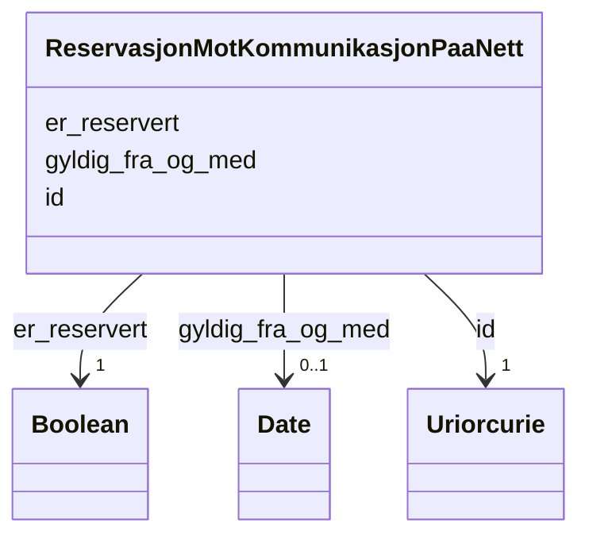

# Class: ReservasjonMotKommunikasjonPaaNett 


_Registrering av at ein person har reservert seg mot digital kommunikasjon frå det offentlege. Forvaltast av Kontakt- og reservasjonsregisteret (KRR)._


URI: [ngrp:ReservasjonMotKommunikasjonPaaNett](https://data.norge.no/vocabulary/ngr-person#ReservasjonMotKommunikasjonPaaNett)





<!-- no inheritance hierarchy -->

## Class Properties

| Property | Value |
| --- | --- |
| Class URI | [ngrp:ReservasjonMotKommunikasjonPaaNett](https://data.norge.no/vocabulary/ngr-person#ReservasjonMotKommunikasjonPaaNett) |


## Eigenskapar


  
  

  
  
    
  

  
  


### Obligatorisk

| Namn | Kardinalitet og domene | Beskriving |
| --- | --- | --- |
| [er_reservert](er_reservert.md) | 1 <br/> [xsd:boolean](http://www.w3.org/2001/XMLSchema#boolean) | Om personen er reservert mot digital kommunikasjon frå det offentlege |


  
  

  
  

  
  
    
  


### Anbefalt

| Namn | Kardinalitet og domene | Beskriving |
| --- | --- | --- |
| [gyldig_fra_og_med](gyldig_fra_og_med.md) | 0..1 <br/> [xsd:date](http://www.w3.org/2001/XMLSchema#date) | Dato opplysinga er gyldig frå og med |


  
  

  
  

  
  


  
  
  
  
    
  

  
  
  
    
      
    
      
    
      
    
  
  

  
  
  
    
      
    
      
    
      
    
  
  


### Andre

| Namn | Kardinalitet og domene | Beskriving |
| --- | --- | --- |
| [id](id.md) | 1 <br/> [xsd:anyURI](http://www.w3.org/2001/XMLSchema#anyURI) | URI-identifikator for ressursen |


## Usages

| used by | used in | type | used |
| ---  | --- | --- | --- |
| [PersonContainer](personcontainer.md) | [reservasjonar](reservasjonar.md) | range | [ReservasjonMotKommunikasjonPaaNett](reservasjonmotkommunikasjonpaanett.md) |
| [Person](person.md) | [har_reservasjon_mot_kommunikasjon](har_reservasjon_mot_kommunikasjon.md) | range | [ReservasjonMotKommunikasjonPaaNett](reservasjonmotkommunikasjonpaanett.md) |


## Identifier and Mapping Information


### Schema Source


* from schema: https://data.norge.no/linkml/ngr-person


## Mappings

| Mapping Type | Mapped Value |
| ---  | ---  |
| self | ngrp:ReservasjonMotKommunikasjonPaaNett |
| native | https://data.norge.no/linkml/ngr-person/ReservasjonMotKommunikasjonPaaNett |


## LinkML Source

<!-- TODO: investigate https://stackoverflow.com/questions/37606292/how-to-create-tabbed-code-blocks-in-mkdocs-or-sphinx -->

### Direct

<details>
```yaml
name: ReservasjonMotKommunikasjonPaaNett
description: Registrering av at ein person har reservert seg mot digital kommunikasjon
  frå det offentlege. Forvaltast av Kontakt- og reservasjonsregisteret (KRR).
from_schema: https://data.norge.no/linkml/ngr-person
rank: 1000
slots:
- id
- er_reservert
- gyldig_fra_og_med
slot_usage:
  er_reservert:
    name: er_reservert
    in_subset:
    - Obligatorisk
    required: true
  gyldig_fra_og_med:
    name: gyldig_fra_og_med
    in_subset:
    - Anbefalt
class_uri: ngrp:ReservasjonMotKommunikasjonPaaNett

```
</details>

### Induced

<details>
```yaml
name: ReservasjonMotKommunikasjonPaaNett
description: Registrering av at ein person har reservert seg mot digital kommunikasjon
  frå det offentlege. Forvaltast av Kontakt- og reservasjonsregisteret (KRR).
from_schema: https://data.norge.no/linkml/ngr-person
rank: 1000
slot_usage:
  er_reservert:
    name: er_reservert
    in_subset:
    - Obligatorisk
    required: true
  gyldig_fra_og_med:
    name: gyldig_fra_og_med
    in_subset:
    - Anbefalt
attributes:
  id:
    name: id
    description: URI-identifikator for ressursen.
    from_schema: https://data.norge.no/linkml/ngr-person
    rank: 1000
    identifier: true
    alias: id
    owner: ReservasjonMotKommunikasjonPaaNett
    domain_of:
    - Person
    - Personnavn
    - Folkeregisteridentifikator
    - Personidentifikasjon
    - FalskIdentitet
    - Identifikasjonsdokument
    - Identitetsgrunnlag
    - Kjoenn
    - Sivilstand
    - Personstatus
    - Statsborgerskap
    - Opphold
    - Foedsel
    - Dodsfall
    - KontaktinformasjonDoedsbo
    - ForeldreansvarForelder
    - ForeldreansvarBarn
    - FamilierelasjonForelder
    - FamilierelasjonBarn
    - FamilierelasjonEktefelle
    - InnflyttingTilNorge
    - UtflyttingFraNorge
    - GeografiskAdresse
    - Adressebeskyttelse
    - Verge
    - RettsligHandleevne
    - ReservasjonMotKommunikasjonPaaNett
    - Kontaktopplysninger
    - SpraakForElektroniskKommunikasjon
    range: uriorcurie
    required: true
  er_reservert:
    name: er_reservert
    description: Om personen er reservert mot digital kommunikasjon frå det offentlege.
    in_subset:
    - Obligatorisk
    from_schema: https://data.norge.no/linkml/ngr-person
    rank: 1000
    slot_uri: ngrp:erReservert
    alias: er_reservert
    owner: ReservasjonMotKommunikasjonPaaNett
    domain_of:
    - ReservasjonMotKommunikasjonPaaNett
    range: boolean
    required: true
  gyldig_fra_og_med:
    name: gyldig_fra_og_med
    description: Dato opplysinga er gyldig frå og med.
    in_subset:
    - Anbefalt
    from_schema: https://data.norge.no/linkml/ngr-person
    rank: 1000
    slot_uri: ngrp:gyldigFraOgMed
    alias: gyldig_fra_og_med
    owner: ReservasjonMotKommunikasjonPaaNett
    domain_of:
    - Kjoenn
    - Sivilstand
    - Personstatus
    - Statsborgerskap
    - Opphold
    - Bostedsadresse
    - Postadresse
    - Oppholdsadresse
    - ReservasjonMotKommunikasjonPaaNett
    range: date
class_uri: ngrp:ReservasjonMotKommunikasjonPaaNett

```
</details>