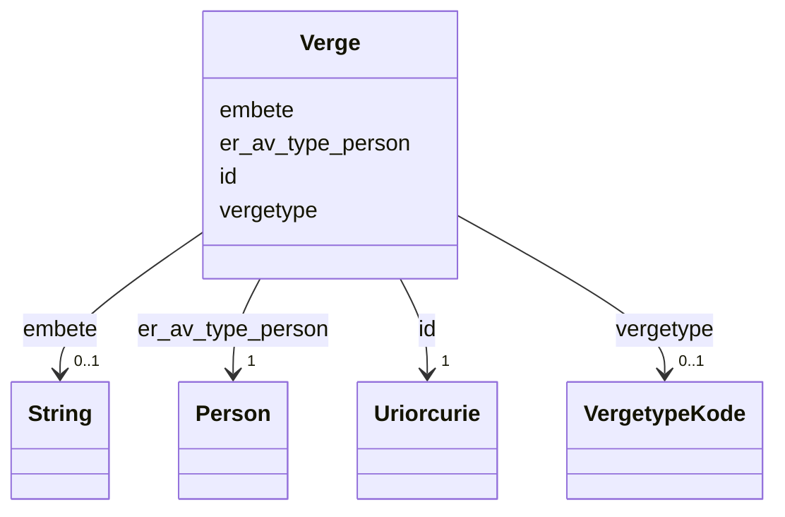

# Class: Verge 


_Ein verje (anten person eller institusjon) som er oppnemnd for å ivareta interessene til ein person. Er av type Person._


URI: [ngrp:Verge](https://data.norge.no/vocabulary/ngr-person#Verge)





<!-- no inheritance hierarchy -->

## Class Properties

| Property | Value |
| --- | --- |
| Class URI | [ngrp:Verge](https://data.norge.no/vocabulary/ngr-person#Verge) |


## Eigenskapar


  
  

  
  
    
  

  
  

  
  


### Obligatorisk

| Namn | Kardinalitet og domene | Beskriving |
| --- | --- | --- |
| [er_av_type_person](er_av_type_person.md) | 1 <br/> [Person](person.md) | Personen som denne relasjonen peikar til |


  
  

  
  

  
  
    
  

  
  


### Anbefalt

| Namn | Kardinalitet og domene | Beskriving |
| --- | --- | --- |
| [vergetype](vergetype.md) | 0..1 <br/> [VergetypeKode](vergetypekode.md) | Type vergemål (mindreårig, vaksen o |


  
  

  
  

  
  

  
  
    
  


### Valgfri

| Namn | Kardinalitet og domene | Beskriving |
| --- | --- | --- |
| [embete](embete.md) | 0..1 <br/> [xsd:string](http://www.w3.org/2001/XMLSchema#string) | Statsforvaltarembetet som oppnemnde vergjet |


  
  
  
  
    
  

  
  
  
    
      
    
      
    
      
    
  
  

  
  
  
    
      
    
      
    
      
    
  
  

  
  
  
    
      
    
      
    
      
    
  
  


### Andre

| Namn | Kardinalitet og domene | Beskriving |
| --- | --- | --- |
| [id](id.md) | 1 <br/> [xsd:anyURI](http://www.w3.org/2001/XMLSchema#anyURI) | URI-identifikator for ressursen |


## Usages

| used by | used in | type | used |
| ---  | --- | --- | --- |
| [PersonContainer](personcontainer.md) | [verger](verger.md) | range | [Verge](verge.md) |
| [Person](person.md) | [har_verge](har_verge.md) | range | [Verge](verge.md) |


## Identifier and Mapping Information


### Schema Source


* from schema: https://data.norge.no/linkml/ngr-person


## Mappings

| Mapping Type | Mapped Value |
| ---  | ---  |
| self | ngrp:Verge |
| native | https://data.norge.no/linkml/ngr-person/Verge |


## LinkML Source

<!-- TODO: investigate https://stackoverflow.com/questions/37606292/how-to-create-tabbed-code-blocks-in-mkdocs-or-sphinx -->

### Direct

<details>
```yaml
name: Verge
description: Ein verje (anten person eller institusjon) som er oppnemnd for å ivareta
  interessene til ein person. Er av type Person.
from_schema: https://data.norge.no/linkml/ngr-person
rank: 1000
slots:
- id
- er_av_type_person
- vergetype
- embete
slot_usage:
  er_av_type_person:
    name: er_av_type_person
    in_subset:
    - Obligatorisk
    required: true
  vergetype:
    name: vergetype
    in_subset:
    - Anbefalt
  embete:
    name: embete
    in_subset:
    - Valgfri
class_uri: ngrp:Verge

```
</details>

### Induced

<details>
```yaml
name: Verge
description: Ein verje (anten person eller institusjon) som er oppnemnd for å ivareta
  interessene til ein person. Er av type Person.
from_schema: https://data.norge.no/linkml/ngr-person
rank: 1000
slot_usage:
  er_av_type_person:
    name: er_av_type_person
    in_subset:
    - Obligatorisk
    required: true
  vergetype:
    name: vergetype
    in_subset:
    - Anbefalt
  embete:
    name: embete
    in_subset:
    - Valgfri
attributes:
  id:
    name: id
    description: URI-identifikator for ressursen.
    from_schema: https://data.norge.no/linkml/ngr-person
    rank: 1000
    identifier: true
    alias: id
    owner: Verge
    domain_of:
    - Person
    - Personnavn
    - Folkeregisteridentifikator
    - Personidentifikasjon
    - FalskIdentitet
    - Identifikasjonsdokument
    - Identitetsgrunnlag
    - Kjoenn
    - Sivilstand
    - Personstatus
    - Statsborgerskap
    - Opphold
    - Foedsel
    - Dodsfall
    - KontaktinformasjonDoedsbo
    - ForeldreansvarForelder
    - ForeldreansvarBarn
    - FamilierelasjonForelder
    - FamilierelasjonBarn
    - FamilierelasjonEktefelle
    - InnflyttingTilNorge
    - UtflyttingFraNorge
    - GeografiskAdresse
    - Adressebeskyttelse
    - Verge
    - RettsligHandleevne
    - ReservasjonMotKommunikasjonPaaNett
    - Kontaktopplysninger
    - SpraakForElektroniskKommunikasjon
    range: uriorcurie
    required: true
  er_av_type_person:
    name: er_av_type_person
    description: Personen som denne relasjonen peikar til.
    in_subset:
    - Obligatorisk
    from_schema: https://data.norge.no/linkml/ngr-person
    rank: 1000
    slot_uri: ngrp:erAvTypePerson
    alias: er_av_type_person
    owner: Verge
    domain_of:
    - ForeldreansvarForelder
    - ForeldreansvarBarn
    - FamilierelasjonForelder
    - FamilierelasjonBarn
    - FamilierelasjonEktefelle
    - Verge
    range: Person
    required: true
  vergetype:
    name: vergetype
    description: Type vergemål (mindreårig, vaksen o.l.).
    in_subset:
    - Anbefalt
    from_schema: https://data.norge.no/linkml/ngr-person
    rank: 1000
    slot_uri: ngrp:vergetype
    alias: vergetype
    owner: Verge
    domain_of:
    - Verge
    range: VergetypeKode
  embete:
    name: embete
    description: Statsforvaltarembetet som oppnemnde vergjet.
    in_subset:
    - Valgfri
    from_schema: https://data.norge.no/linkml/ngr-person
    rank: 1000
    slot_uri: ngrp:embete
    alias: embete
    owner: Verge
    domain_of:
    - Verge
    range: string
class_uri: ngrp:Verge

```
</details>